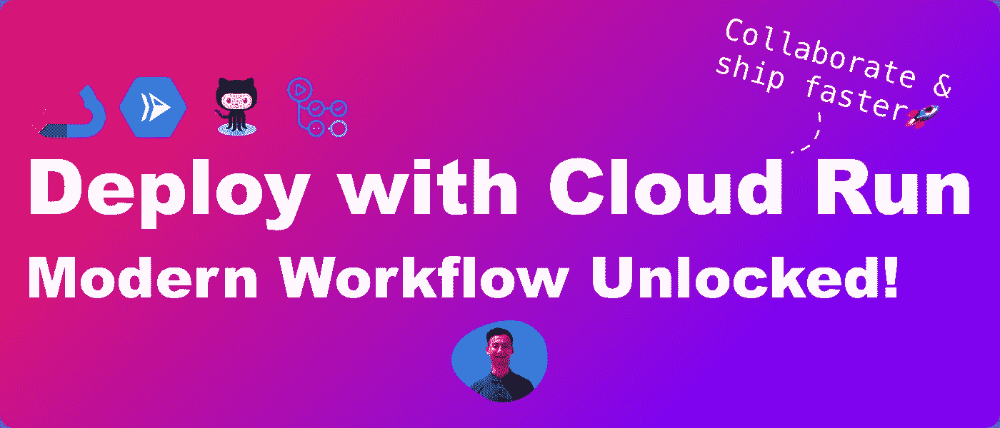
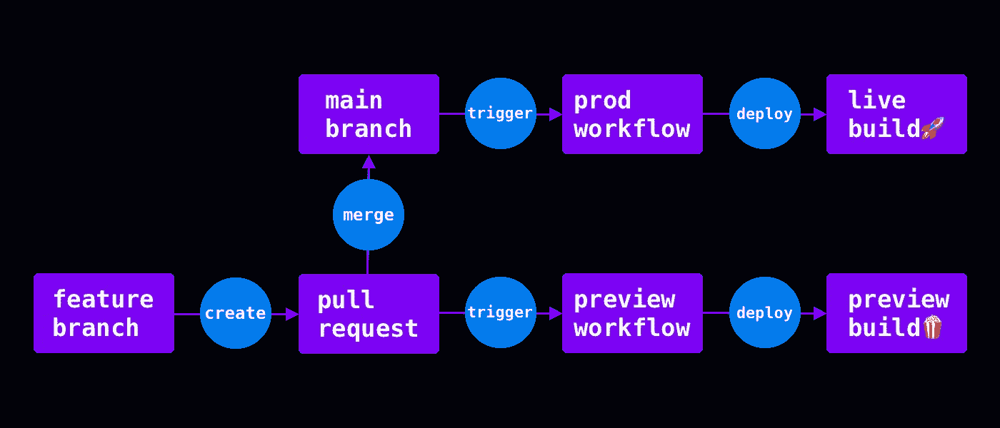
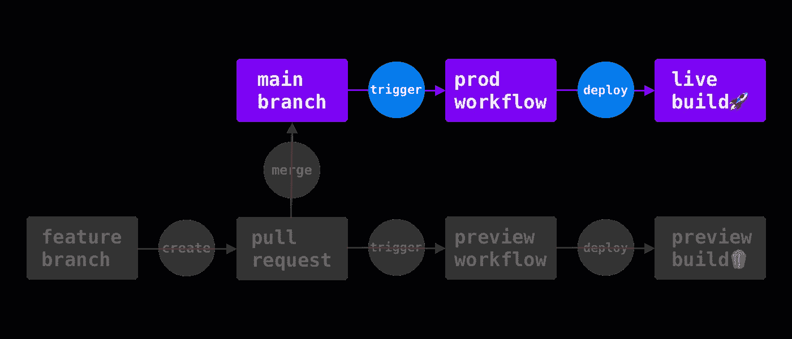
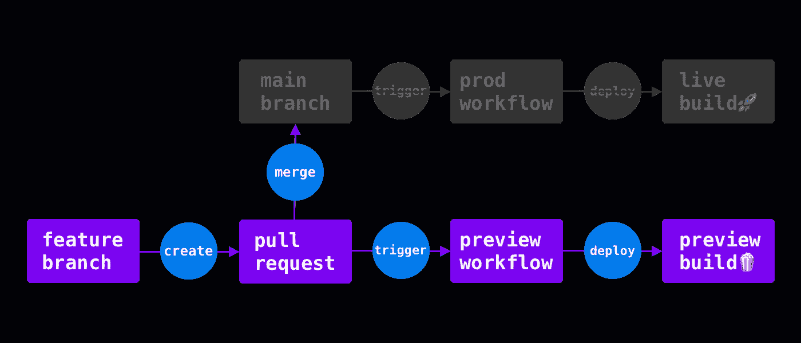

# 像 Vercel 和 Netlify 一样部署云运行:实时、预览和现代工作流

> 原文：<https://levelup.gitconnected.com/deploying-like-vercel-and-netlify-with-cloud-run-live-preview-and-modern-workflow-ea661e411136>

## 现代化的工作流程释放了您的团队更快发货的潜力。



# TL；速度三角形定位法(dead reckoning)

*   ☁️:我们将学习如何在谷歌云上部署
*   ✨:我们将学习如何用 GitHub Actions 设计和实现一个现代化的工作流程
*   🤿:我们将看到真实世界工作流程的代码片段

如果你想学习如何部署像 [Vercel](https://vercel.com/features/previews) 或 [Netlify](https://www.netlify.com/products/deploy-previews/) 与 [Google Cloud](https://cloud.google.com/) ，这是适合你的地方。

Vercel 和 Netlify 都提供了从开发到发布特性的无缝过渡，并且它们使得[连续交付](http://localhost:3000/articles/ex-principal-engineers-guide-to-design-thinking-and-continous-delivery#what-is-continuous-delivery)开箱即用。今天，我们将了解如何设计和重新创建带有[云运行](https://cloud.google.com/run)和 [GitHub 操作](https://github.com/features/actions)的实时部署和[部署预览](https://vercel.com/features/previews)。

我们走吧。

# 现代工作流设计

如果你熟悉 [Vercel](https://vercel.com/) 或 [Netlify](https://www.netlify.com/) ，你会注意到默认情况下[基于主干的开发](https://cloud.google.com/architecture/devops/devops-tech-trunk-based-development)原则。当向主*分支*推送提交或合并拉取请求时，您的代码会直接更改为 **live** 。

每当您处理一个拉式请求时，两个平台都会创建**部署预览**，这样您就可以在开发过程中从您的评审者和利益相关者那里收集反馈。这种类型的工作流使我们能够尽早协作，减少错误，快速发货。

为了设计工作流程，我们可以将其分为两条路径:

*   生产工作流程:由*主*分支的*推*事件触发。
*   预览工作流:由除*主*外的所有分支中的 *push* 和 *pull_request* 事件触发。



工作流程概述

让我们先来看看*生产流程*。

# 生产工作流程



生产工作流程概述

生产工作流只做一件事:实时部署。当一个 pull 请求合并到 *main* 中时，它触发工作流将您的生产构建部署到[云运行](https://cloud.google.com/run)。

工作流程如下所示:

设置谷歌云

*   向谷歌云认证
*   设置谷歌[云 SDK](https://cloud.google.com/sdk)
*   授权将 docker 容器推送到[工件注册表](https://cloud.google.com/artifact-registry)

将 Docker 图像推送到工件注册表

*   生成图像标签
*   构建 docker 容器
*   将 docker 容器推送到注册表

部署

*   部署到云运行

# 设置谷歌云

> *如果你还没有 Google Cloud 上的项目，请按照本指南* *创建一个。我将把我的项目命名为* awesome-project *。*

为了认证访问 Google Cloud 的工作流，我们可以使用 GitHub 的 [*auth*](https://github.com/google-github-actions/auth) 动作来创建一个访问令牌:

```
env:
  PROJECT_ID: 'awesome-project'
  SERVICE: 'homepage'
  REGION: 'us-west1' # ☘️Low CO2
  REGISTRY: '[YOUR_REGISTRY_ID]'
  IMAGE_NAME: 'live'
  WORKLOAD_IDENTITY_PROVIDER: '[YOUR_WORKLOAD_PROVIDER_ID]'
  SERVICE_ACCOUNT: '[YOUR_SERVICE_ACCOUNT_ID]'

jobs:
  deploy:
    runs-on: ubuntu-20.04
  steps:
      - name: Checkout
        uses: actions/checkout@v3

      - name: 'Authenticate to Google Cloud'
        uses: 'google-github-actions/auth@v0.4.0'
        id: 'auth'
        with:
          token_format: 'access_token'
          workload_identity_provider: ${{ env.WORKLOAD_IDENTITY_PROVIDER }}
          service_account: ${{ env.SERVICE_ACCOUNT }}
```

这里我们通过[工作负载身份联盟](https://cloud.google.com/iam/docs/workload-identity-federation)进行认证。为了让它工作，我们需要

*   [服务账户](https://cloud.google.com/iam/docs/creating-managing-service-account-keys)
*   [一个工作负载身份提供者](https://cloud.google.com/iam/docs/configuring-workforce-identity-federation)
*   [向工作负载身份提供者授予 IAM 角色](https://cloud.google.com/blog/products/identity-security/enabling-keyless-authentication-from-github-actions)。

恭喜你，你成功了！这是工作流程中最困难的部分。

现在，我们可以设置 Cloud SDK 并授权工作流能够将 Docker 容器推送到工件注册表:

```
steps:
  - name: Set up Cloud SDK
    uses: google-github-actions/setup-gcloud@v0
  - name: Authorize Docker push
    run: gcloud auth configure-docker ${{ env.REGISTRY }}
```

您可以按照本指南来设置工件注册表以存储 Docker 容器。

# 将 Docker 图像推送到工件注册表

我们现在能够推送容器，因此让我们对您的项目进行分类并标记您的图像:

```
steps:
  - name: Generate Image Tag
    id: image-tag
    run: |
      image_tag="$REGISTRY/$PROJECT_ID/$SERVICE/$IMAGE_NAME:${GITHUB_SHA::8}"
      echo "tag=$image_tag" >> $GITHUB_OUTPUT

  - name: Build Docker Container
    run: |
      docker build -t ${{ steps.image-tag.outputs.tag }}

  - name: Push Docker Container
    run: |
      docker push ${{ steps.image-tag.outputs.tag }}
```

# 部署

现在，您已经准备好使用 docker 容器部署到云运行了:

```
steps:
  - name: Deploy to Cloud Run
    run: |
      gcloud run deploy ${{ env.SERVICE }} \
        --platform "managed"
        --region ${{ env.REGION }} \
        --image ${{ steps.image-tag.outputs.tag }}
```

默认情况下，Cloud Run 会将 100%的流量分配给此部署，因此所有访问者都将被定向到此版本。

在云控制台中，您会找到一个指向您的云运行部署的 URL。大概是这样的:[*https://home page-12345 abcde-ez . a . run . app*](https://homepage-12345abcde-ez.a.run.app/)。我们稍后会在预览工作流中用到它。

# 完整的 GitHub Actions 制作工作流程:

```
# prod-ci.yaml

name: Production Workflow
on:
  push:
    branches:
      - main
env:
  PROJECT_ID: 'awesome-project'
  SERVICE: 'homepage'
  REGION: 'us-west1' # ☘️Low CO2
  REGISTRY: '[YOUR_REGISTRY_ID]'
  IMAGE_NAME: 'live'
  WORKLOAD_IDENTITY_PROVIDER: '[YOUR_WORKLOAD_PROVIDER_ID]'
  SERVICE_ACCOUNT: '[YOUR_SERVICE_ACCOUNT_ID]'
jobs:
  deploy:
    runs-on: ubuntu-20.04
    steps:
      - name: Checkout
        uses: actions/checkout@v3

      - name: 'Authenticate to Google Cloud'
        uses: 'google-github-actions/auth@v0.4.0'
        id: 'auth'
        with:
          token_format: 'access_token'
          workload_identity_provider: ${{ env.WORKLOAD_IDENTITY_PROVIDER }}
          service_account: ${{ env.SERVICE_ACCOUNT }}

      - name: Set up Cloud SDK
        uses: google-github-actions/setup-gcloud@v0

      - name: Authorize Docker push
        run: gcloud auth configure-docker ${{ env.REGISTRY }}

      - name: Generate Image Tag
        id: image-tag
        run: |
          image_tag="$REGISTRY/$PROJECT_ID/$SERVICE/$IMAGE_NAME:${GITHUB_SHA::8}"
          echo "tag=$image_tag" >> $GITHUB_OUTPUT

      - name: Build Docker Container
        run: |
          docker build -t ${{ steps.image-tag.outputs.tag }}

      - name: Push Docker Container
        run: |
          docker push ${{ steps.image-tag.outputs.tag }}

      - name: Deploy to Cloud Run
        run: |
          gcloud run deploy ${{ env.SERVICE }} \
            --platform "managed"
            --region ${{ env.REGION }} \
            --image ${{ steps.image-tag.outputs.tag }}
```

# 预览工作流



预览工作流概述

预览工作流类似于生产工作流，但有一些修改:

设置谷歌云

*   向谷歌云认证
*   设置谷歌[云 SDK](https://cloud.google.com/sdk)
*   授权将 docker 容器推送到[工件注册表](https://cloud.google.com/artifact-registry)

将 Docker 图像推送到工件注册表

*   **从引用中获取任务 Id**
*   生成图像标签
*   构建 docker 容器
*   将 docker 容器推送到注册表

部署

*   **部署标签为**的版本
*   **拉取请求中的注释预览 URL**

让我们来看看不同之处。

# 将 Docker 图像推送到工件注册表

第一个区别是标记 Docker 图像。在生产工作流程中，我们在环境变量中使用常量`$IMAGE_NAME`来标记生产图像。但是，对于预览，我们希望使用一个表示拉请求的标识符。我们使用分行名称的前 8 个字符作为标识符:

```
steps:
  - name: Get Task Id from Reference
  id: task
  run: |
    name="${{ github.ref_name }}"
    lowercase="${name,,}"
    echo "id=${lowercase:0:8}" >> $GITHUB_OUTPUT
```

作为一个例子，我将这个分支命名为*TASK-123-awesome-workflow*。*任务*步骤将从分支名称中提取任务 ID *task-123* 。

> *如果你对 shell 脚本语法很好奇，可以看看* [*Shell 参数扩展*](https://www.gnu.org/software/bash/manual/html_node/Shell-Parameter-Expansion.html) *。*

标识符设置为小写，因为我们稍后将使用它来标记云运行版本。[云运行标签](https://cloud.google.com/run/docs/rollouts-rollbacks-traffic-migration#tags)的命名约定如下:

*   它允许小写字符
*   它允许数字
*   它允许“-”
*   它的最大长度限制为 63 个字符

接下来，我们可以使用任务 id 来标记图像，构建一个容器，并将其推送到注册表:

```
steps:
  - name: Generate Image Tag
    id: image-tag
    run: |
      image_tag="$REGISTRY/$PROJECT_ID/$SERVICE/${{ steps.task.outputs.id }}:${GITHUB_SHA::8}"
      echo "tag=$image_tag" >> $GITHUB_OUTPUT

  - name: Build Docker Container
    run: |
      docker build -t ${{ steps.image-tag.outputs.tag }}

  - name: Push Docker Container
    run: |
      docker push ${{ steps.image-tag.outputs.tag }}
```

# 部署

现在我们已经准备好部署预览版了。该部署类似于实时部署，但有两个不同之处:

*   与实时部署不同，我们希望将 0%的流量分配给预览版。
*   我们希望为部署提供一个不同于实时 URL 的 URL。

我们可以使用 *—标签*和 *—无流量*参数来实现:

```
steps:
  - name: Deploy Revision with Tag
      run: |
        gcloud run deploy ${{ env.SERVICE }} \
          --platform "managed" \
          --region ${{ env.REGION }} \
          --image ${{ steps.image-tag.outputs.tag }} \
          --tag pr-${{ steps.task.outputs.id }} \
          --no-traffic
```

成功运行该步骤后，会得到这样的预览网址:[*https://pr-task-123-home page-12345 abcde-ez . a . run . app*](https://pr-task-123---homepage-12345abcde-ez.a.run.app/)。

最后，我们可以在 pull 请求上发布关于预览 URL 的注释:

```
steps:
  - name: Comment Preview URL in PR
    uses: mshick/add-pr-comment@v2
    env:
      GITHUB_TOKEN: ${{ secrets.GITHUB_TOKEN }}
    with:
      message: |
        🍿 Successfully deployed preview revision at https://pr-${{ steps.jira.outputs.id }}---homepage-12345abcde-ez.a.run.app
      allow-repeats: false
```

# 完整的 GitHub 动作预览工作流程

```
# preview.yaml

name: Preview Workflow
on:
  push:
    branches-ignore:
      - main
  pull_request:
    branches-ignore:
      - main
  workflow_run:
    workflows: ['Dev CI']
    types: [completed]
env:
  PROJECT_ID: 'awesome-project'
  SERVICE: 'homepage'
  REGION: 'us-west1'
  REGISTRY: '[YOUR_REGISTRY_ID]'
  WORKLOAD_IDENTITY_PROVIDER: '[YOUR_WORKLOAD_PROVIDER_ID]'
  SERVICE_ACCOUNT: '[YOUR_SERVICE_ACCOUNT_ID]'
jobs:
  preview:
    runs-on: ubuntu-20.04

    permissions:
      pull-requests: 'write'

    steps:
      - name: Checkout
        uses: actions/checkout@v3

      - name: 'Authenticate to Google Cloud'
        uses: 'google-github-actions/auth@v0.4.0'
        id: 'auth'
        with:
          token_format: 'access_token'
          workload_identity_provider: ${{ env.WORKLOAD_IDENTITY_PROVIDER }}
          service_account: ${{ env.SERVICE_ACCOUNT }}

      - name: Set up Cloud SDK
        uses: google-github-actions/setup-gcloud@v0

      - name: Authorize Docker push
        run: gcloud auth configure-docker ${{ env.REGISTRY }}

      # Get task id in lowercase from branch name for docker image naming convention
      # More detail on base parameter expansion: https://www.gnu.org/software/bash/manual/html_node/Shell-Parameter-Expansion.html
      - name: Get Task Id from Reference
        id: task
        run: |
          name="${{ github.ref_name }}"
          lowercase="${name,,}"
          echo "id=${lowercase:0:8}" >> $GITHUB_OUTPUT

      - name: Generate Image Tag
        id: image-tag
        run: |
          image_tag="$REGISTRY/$PROJECT_ID/$SERVICE/${{ steps.task.outputs.id }}:${GITHUB_SHA::8}"
          echo "tag=$image_tag" >> $GITHUB_OUTPUT

      - name: Build Docker Container
        run: |
          docker build -t ${{ steps.image-tag.outputs.tag }}

      - name: Push Docker Container
        run: |
          docker push ${{ steps.image-tag.outputs.tag }}

      - name: Deploy Revision with Tag
        run: |
          gcloud run deploy ${{ env.SERVICE }} \
            --platform "managed" \
            --region ${{ env.REGION }} \
            --image ${{ steps.image-tag.outputs.tag }} \
            --tag pr-${{ steps.jira.outputs.id }} \
            --no-traffic

      - name: Comment Preview URL in PR
        uses: mshick/add-pr-comment@v2
        env:
          GITHUB_TOKEN: ${{ secrets.GITHUB_TOKEN }}
        with:
          message: |
            🍿 Successfully deployed preview revision at https://pr-${{ steps.jira.outputs.id }}---homepage-12345abcde-ez.a.run.app
          allow-repeats: false
```

# 最后的想法

我们刚刚重新创建了 Vercel 和 Netlify 的现代工作流程！有一些改进使工作流更加健壮:

*   使用短哈希作为标识符来标记预览图像和云运行版本
*   用预览注释步骤中的步骤输出替换硬编码的实时 URL
*   添加清理未使用的云运行版本和 Docker 容器的工作流

# 参考

*   [GitHub: auth GitHub 动作](https://github.com/google-github-actions/auth)
*   [文章:从 GitHub Actions 启用无钥匙认证— Google Cloud](https://cloud.google.com/blog/products/identity-security/enabling-keyless-authentication-from-github-actions)
*   [网站:Vercel 预览](https://vercel.com/features/previews)
*   [网址:Netlify 部署预览](https://www.netlify.com/products/deploy-previews/)
*   [网址:Vercel](https://vercel.com/)
*   [网址:Netlify](https://www.netlify.com/)
*   [文档:Shell 参数扩展— GNU](https://www.gnu.org/software/bash/manual/html_node/Shell-Parameter-Expansion.html)
*   [谷歌云](https://cloud.google.com/)
*   [文章:前首席工程师的设计思维和持续交付指南——刘道智](http://localhost:3000/articles/ex-principal-engineers-guide-to-design-thinking-and-continous-delivery#what-is-continuous-delivery)
*   [文档:云运行—谷歌云](https://cloud.google.com/run)
*   [网站:GitHub Actions](https://github.com/features/actions)
*   [文档:DevOps tech:基于主干的开发— Google Cloud](https://cloud.google.com/architecture/devops/devops-tech-trunk-based-development)
*   [网站:神器注册表—谷歌云](https://cloud.google.com/artifact-registry)
*   [网址:Cloud SDK — Google Cloud](https://cloud.google.com/sdk)
*   [文档:工作负载身份联盟—谷歌云](https://cloud.google.com/iam/docs/workload-identity-federation)
*   [文档:创建和管理服务账号密钥-谷歌云](https://cloud.google.com/iam/docs/creating-managing-service-account-keys)
*   [文档:配置劳动力身份联盟—谷歌云](https://cloud.google.com/iam/docs/configuring-workforce-identity-federation)
*   [文档:将 Docker 容器图像存储在工件注册表中——Google Cloud](https://cloud.google.com/artifact-registry/docs/docker/store-docker-container-images)
*   [文档:创建和管理项目—谷歌云](https://cloud.google.com/resource-manager/docs/creating-managing-projects)
*   [文档:使用标签进行测试、流量迁移和回滚——Google Cloud](https://cloud.google.com/run/docs/rollouts-rollbacks-traffic-migration#tags)
*   [GitHub:添加公关评论](https://github.com/mshick/add-pr-comment)
*   [Github:设置-gcloud GitHub 动作](https://github.com/google-github-actions/setup-gcloud)

```
Want to Connect? This article was originally posted on [Daw-Chih’s website](https://dawchihliou.github.io/articles/deploying-with-cloud-run-like-vercel-and-netlify).
```