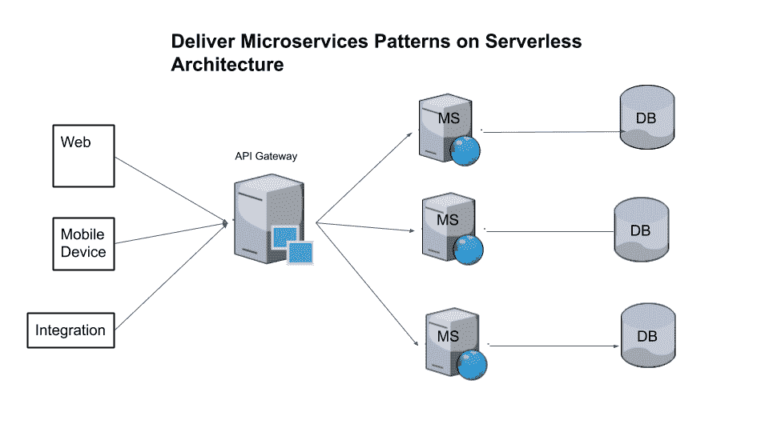
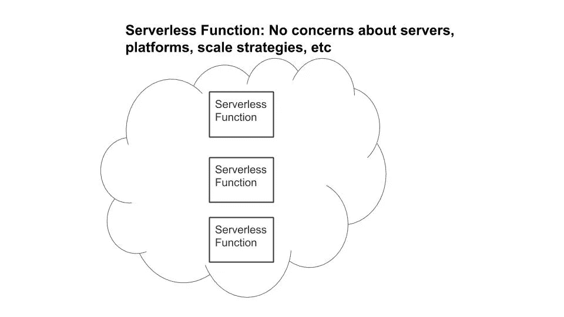
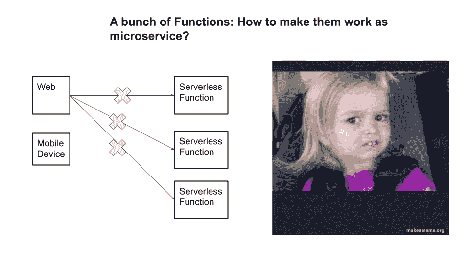
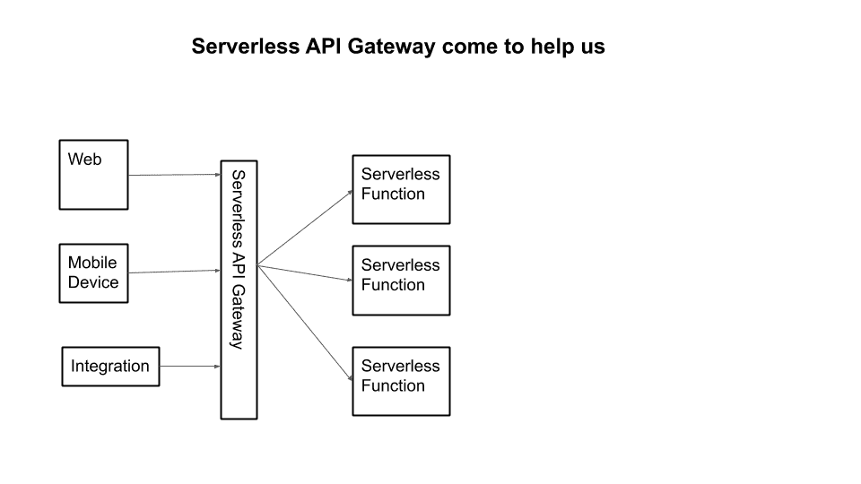
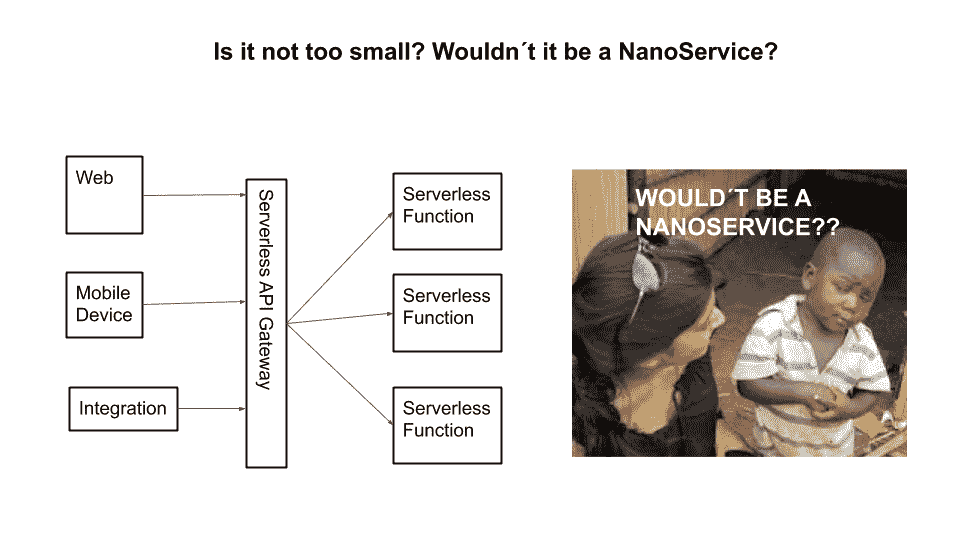
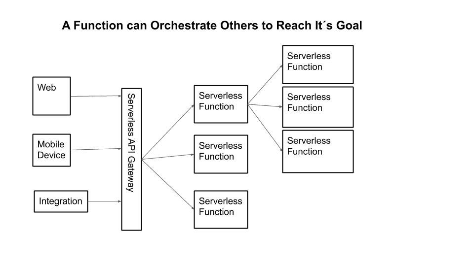
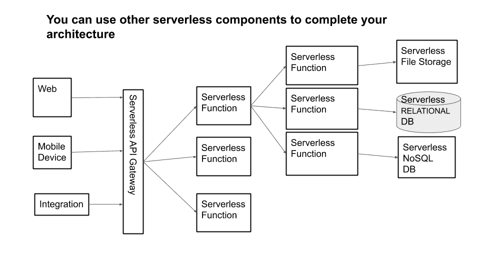
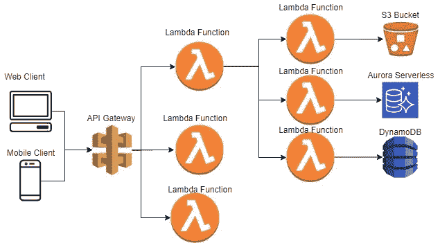

# 使用无服务器架构部署微服务

> 原文：<https://levelup.gitconnected.com/deploying-microservices-using-serverless-architecture-cf7d1570950>

无服务器架构(有时称为 FaaS——功能即服务)是一种执行模式，云提供商负责运行代码片段，动态分配资源，客户只需为执行时间付费。

代码通常在临时容器中执行，可以由几种类型的事件触发，包括 HTTP 请求、队列、数据库事件、监控警报、文件上传、cron 作业等。在这个模型中，客户端不需要关心服务器，因为它被提供者的架构抽象了。

让我们从分析图 1 中定义的架构开始，在这里我们可以看到微服务的常规部署。

**图 1:一个基本的微服务架构**

**Web** 可以是运行在 Web 服务器上的 SPA(单页应用程序)，比如 Tomcat。

**API**

**微服务**(图中 **MS** )，运行 rest 控制器、服务和存储库的 Spring boot

**数据库** (DB)，MySQL 数据库，它可以是每台机器有一个或多个实例的 DB 服务器，其中每个服务都有其 DB 实例。

现在，让我们看看如何使用无服务器架构部署微服务。

我们可以从将代码转换成无服务器功能(FaaS)开始，并将它们部署在云中。

**图 2:功能(FaaS):你在云中编码**

但这里似乎少了点什么。如何通过互联网从云外部访问功能？

**图 3:无服务器功能本身无法从互联网访问**

要在互联网上发布我们的功能，帮助我们的自然候选是 API 网关。它是访问云中大多数服务的大门。它是一种无服务器的云资源，用于向互联网公开服务。它提供了实现这一目标所需的最常见的特性，比如缓存、安全性、请求节流、cors 访问等等。

**图 4: API 网关是向互联网公开云资源的最常见方式**

一丝不苟的开发人员和架构师可以带着一定的批评来看待使用无服务器功能的微服务的实现。由于无服务器功能只是在云中执行的代码片段，它们太小而不能被视为微服务，它们看起来更像纳米服务——一种微服务反模式，其中服务变得太细粒度了。

图 5:无服务器功能是小段代码，难道它们不被认为是纳米服务吗？

单个功能可能太小，无法执行微服务的一些复杂任务。因此，大多数情况下，我们将使用一组协同工作的功能，还有 API Gateway 作为聚合器，这样我们就可以以正确的方式为我们的无服务器微服务建模。

**图 6:你可以聚合几个函数来完成更复杂的任务**

最后，为了完成我们的架构，我们的函数将存储我们的数据，一部分存储在 NoSQL 中，一部分存储在 SQL 无服务器数据库中，并且还从文件存储中检索数据。它们都是无服务器资源。

**图 7:无服务器功能可以从文件存储器中读取数据，并将数据记录在数据库、无服务器数据库或 NoSQL 数据库中**

现在，我们可以在云提供商(AWS)中实现我们的架构，该提供商提供我们实现这一目标所需的资源，如图 8 所示。

**图 8:在 AWS 上实现无服务器的资源(Lambda，DynamoDB，API Gateway，Aurora，S3)**

*   **Lambda 函数**执行计算任务，一些充当聚合器，另一些执行特定的任务。
*   **S3** 用作对象存储，在这里我们可以保存图片或接收待处理的文本数据，如导入数据库的 CSV 文件。
*   我们有 **AWS Aurora 无服务器**，这是一个高度可扩展的关系数据库，您只需为您执行的请求付费。它最适合与高度可伸缩的 Lambda 函数一起工作。
*   我们还有 **DynamoDB** ，这是一个高可伸缩的无服务器 NoSQL 数据库，我们可以访问延迟低至两位数毫秒的数据。

如您所见，将您的微服务部署为无服务器资源是可行的。正如您可能已经知道的，与任何其他技术一样，无服务器不会适合所有情况，也不是解决所有问题的最佳方案。但它在将项目投入生产所需的时间上提供了难以置信的优势，它降低了基础架构的成本，消除了对可伸缩性和可用性的担忧。另一方面，它是高度分布式的模型，因此除了一些关于超时、内存、存储等的限制之外，您还有与分布式系统相关的所有问题。

如果这篇文章有帮助，请点击拍手👏按钮几下，以示你对作者的支持