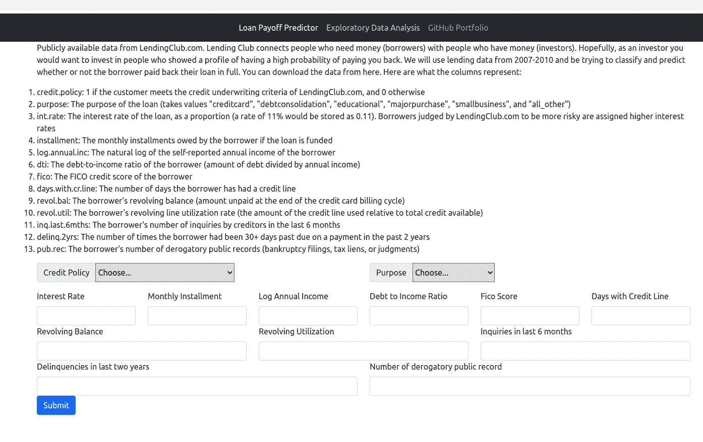

# 使用 Flask 部署 ML web 应用程序

> 原文：<https://levelup.gitconnected.com/deploying-ml-web-app-using-flask-334367735777>


## **简介**

这是我的项目分析贷款数据和使用 Flask 部署机器学习模型的继续。如果你对分析和建模部分感兴趣，请阅读[这篇](https://medium.com/@sumitkr_51302/loan-data-analysis-and-payoff-prediction-c77626697129)。Flask 提供了一个轻量级框架来开发和部署 web 应用程序。有许多扩展可以满足您的特定需求。我选择 Flask 是因为我发现它更容易学习，并在行动中展示我的机器学习模型。在这篇文章中，我将介绍使用 Flask 构建和部署我的机器学习模型的步骤。

**安装**:

您希望在您的虚拟环境中安装 Flask。我使用 Pycharm 和 pipenv 来管理我的项目。

`pipenv install flask`

**项目结构:**

下面是我的项目的目录结构:

```
.
├── app
│ ├── run.py
│ └── templates
│ ├── index.html
│ └── template.html
├── data
│ └── loan_data.csv
├── model
│ ├── classifier.py
│ └── loan_data.pkl
├── notebook
│ └── loan_data.ipynb
├── Pipfile
├── Pipfile.lock
├── README.md
├── static
│ ├── box_plot.png
│ ├── correlation.png
│ ├── credit_policy.png
│ ├── histogram.png
│ ├── installment.png
│ ├── int_rate.png
│ ├── purpose_paid_not_paid.png
│ ├── purpose.png
│ └── results.png
└── util
 └── custom_transformer.py
```

App 文件夹特定于 flask。让我们浏览一下每个文件，看看它们的内容和用途

**run.py**

```
import sys
import os
from pathlib import Path

**from flask import Flask, request, render_template**
from joblib import load
import pandas as pd

# Add util directory to path
curr_dir = sys.path[0]
parent_dir = Path(curr_dir).parents[0]
dir = os.path.join(parent_dir, 'util')
sys.path.append(dir)

from custom_transformer import NumericalFeatures, CategoricalFeatures

**app = Flask(__name__)**

**model = load('../model/loan_data.pkl')**

**@app.route('/')
@app.route('/index.html')**
def display():
    return render_template("index.html")

**@app.route('/predict', methods=['GET', 'POST'])**
def predict():
    test_data = list(request.form.values())
    test_data = [[convert_to_float(s) for s in test_data]]
    test_data = pd.DataFrame(test_data)
    result = model.predict(pd.DataFrame(test_data))
    if result == 1:
        string = "Loan is not expected to be paid in full"
    else:
        string = "Loan is expected to be paid off"

    # return render_template("index.html", tables=[test_data.to_html(classes='data')], titles=test_data.columns.values)
    return render_template("index.html", result= "Prediction: " + string)

def convert_to_float(s):
    try:
        return float(s)
    except ValueError:
        return s

**def main():
    app.run(port=3201, debug=True)**

if __name__ == '__main__':
    main()
```

run.py 是用来启动应用程序的主程序。

*   Flask 对象在 web 服务器和 python 应用程序之间创建一个接口
*   服务器一启动，模型的 pickled 文件就被加载到内存中
*   请求允许我们读取通过 GET/POST 请求传递的参数
*   render_template 是我们使用模板在 web 浏览器中渲染 HTML 的方式
*   decorator app.route 用于将特定的 url 与相关的函数进行映射。在我上面的代码中，当有对 index.html 的请求或者没有请求特定页面时，display()函数被调用。同样，当在服务器上请求/predict 时，会调用 predict()函数。

**template.html**

```
<!doctype html>
<html lang="en">
  <head>
    <meta charset="utf-8">
    <meta name="viewport" content="width=device-width, initial-scale=1">
    <meta name="description" content="">
    <meta name="author" content="Mark Otto, Jacob Thornton, and Bootstrap contributors">
    <meta name="generator" content="Hugo 0.84.0">
    <title> {{ title }} </title>

    <link href="https://cdn.jsdelivr.net/npm/bootstrap@5.0.2/dist/css/bootstrap.min.css" rel="stylesheet" integrity="sha384-EVSTQN3/azprG1Anm3QDgpJLIm9Nao0Yz1ztcQTwFspd3yD65VohhpuuCOmLASjC" crossorigin="anonymous">
    <link rel="canonical" href="https://getbootstrap.com/docs/5.0/examples/navbars/">

  </head>
  <body>
  <nav class="navbar navbar-expand-lg navbar-dark bg-dark" aria-label="Tenth navbar example">
    <div class="container-fluid">
      <button class="navbar-toggler" type="button" data-bs-toggle="collapse" data-bs-target="#navbarsExample08" aria-controls="navbarsExample08" aria-expanded="false" aria-label="Toggle navigation">
        <span class="navbar-toggler-icon"></span>
      </button>

      <div class="collapse navbar-collapse justify-content-md-center" id="navbarsExample08">
        <ul class="navbar-nav">
          <li class="nav-item">
            <a class="nav-link active" aria-current="page" href="/">Loan Payoff Predictor</a>
          </li>
          <li class="nav-item">
            <a class="nav-link" aria-current="page" target="_blank" href="https://github.com/sumitkumar-00/disaster-response/blob/master/notebook/process_data.ipynb">Exploratory Data Analysis</a>
          </li>
          <li class="nav-item">
            <a class="nav-link" target="_blank" href="https://github.com/sumitkumar-00">GitHub Portfolio</a>
          </li>
          <!--
          <li class="nav-item">
            <a class="nav-link disabled" href="#" tabindex="-1" aria-disabled="true">Disabled</a>
          </li>
          <li class="nav-item dropdown">
            <a class="nav-link dropdown-toggle" href="#" id="dropdown08" data-bs-toggle="dropdown" aria-expanded="false">Dropdown</a>
            <ul class="dropdown-menu" aria-labelledby="dropdown08">
              <li><a class="dropdown-item" href="#">Action</a></li>
              <li><a class="dropdown-item" href="#">Another action</a></li>
              <li><a class="dropdown-item" href="#">Something else here</a></li>
            </ul>
          </li>
          -->
        </ul>
      </div>
    </div>
  </nav>
</div>

 ** 
  **

 </body>
</html>
```

您使用模板来呈现网页的一部分，该部分在多个页面中是相同的，并带有动态内容的占位符。使用 template.html，我正在创建标题(导航，菜单等。)并有一个以粗体显示的动态内容占位符。我在 index.html 扩展了这个模板，并添加了一个带有提交按钮和结果占位符的表单。当提交表单时，请求被路由到预测函数，该函数读取输入参数，然后使用模型进行预测。使用相同的 index.html 模板渲染结果。

您只需要执行 app 文件夹中的一行代码来启动 web 应用程序

```
pipenv run python run.py* Serving Flask app 'run' (lazy loading)
* Environment: production
WARNING: This is a development server. Do not use it in a production deployment.
Use a production WSGI server instead.
* Debug mode: on
* Running on http://127.0.0.1:3201/ (Press CTRL+C to quit)* Restarting with stat
* Debugger is active!
* Debugger PIN: 117-271-466
127.0.0.1 - - [13/Sep/2021 21:18:02] "GET / HTTP/1.1" 200 -
```

在任意浏览器和 viola 中进入 [http://127.0.0.1:3201/](http://127.0.0.1:3201/) ！



如果你有兴趣看代码，请访问我的知识库[这里](https://github.com/sumitkumar-00/loan-payoff-predictor)。请随意提出任何改进意见。感谢您花时间阅读我的帖子。