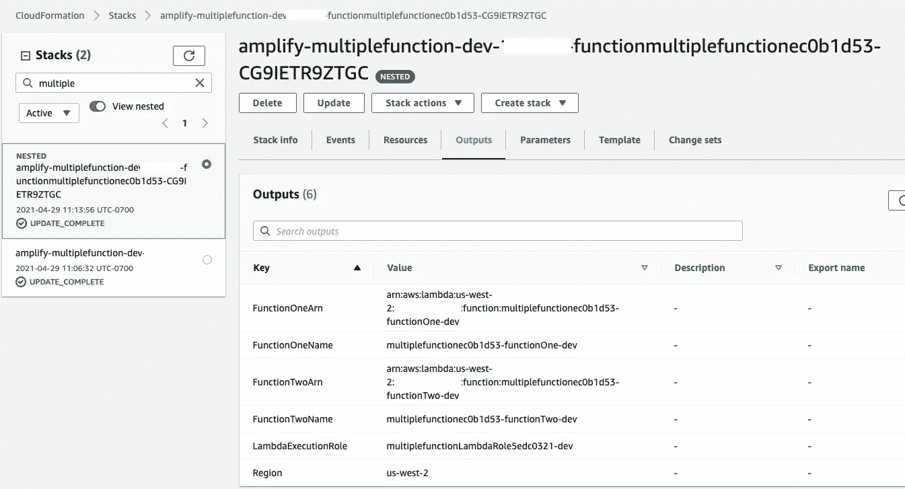
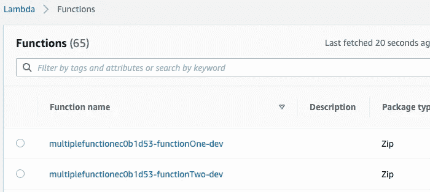

# 在一个 CloudFormation 堆栈中部署多个 Lambda 函数

> 原文：<https://levelup.gitconnected.com/deploying-multiple-lambda-functions-in-one-cloudformation-stack-c0f87718f701>

当用 Amplify 添加一个新函数时，它会在 CloudFormation 上创建一个新的栈。如果你的项目或团队变得更大，这可能会导致一个问题，因为 CloudFormation 允许你为每个 AWS 账户创建最多 [200 个栈。](https://docs.aws.amazon.com/AWSCloudFormation/latest/UserGuide/cloudformation-limits.html)

作为一种变通方法，我们可以从一个资源中部署多个功能。这种方法的另一个好处是，如果每个功能在同一个域中，我们可以共享相同的策略/执行角色。

下面的数字代表了产量。如你所见，一个单独的云生成堆栈(`amplify-multiplefunction-dev`)正在生成两个λ函数(`multiplefunction-functionOne`、`multiplefunction-functionTwo`)。



云形成堆栈



λ函数

让我们看看如何建造它。如果你想直接进入代码的最终输出，这里有链接。

[](https://github.com/tomoima525/amplify-multiple-lambdas-in-one-resource) [## GitHub-tomo IMA 525/amplify-multiple-lambdas-in-one-resource:一个 repo 展示了添加多个…

### 这个 repo 展示了使用 Amplify 在一个资源中添加多个 lambda 函数(team-provider-info.json 被屏蔽了…

github.com](https://github.com/tomoima525/amplify-multiple-lambdas-in-one-resource) 

# 项目架构

项目架构的最终输出如下所示。

```
├── function
│   └── multiplefunctionxxxx
│       ├── function-parameters.json
│       ├── multiplefunctionxxxx-cloudformation-template.json
│       └── src
│           ├── functionOne
│           │   ├── event.json
│           │   └── index.js
│           ├── functionTwo
│           │   ├── event.json
│           │   └── index.js
│           ├── package-lock.json
│           └── package.json
```

`package.json`位于`src`下而不是每个功能下的原因是当`package.json`不在该位置时`amplify push`命令失效。似乎 Amplify cli 在执行命令时找不到 npm 包。

# 更新模板

我们先用`amplify add function`命令创建一个 Lambda 函数，命名为`multiplefunction`。执行完成后，您将看到`multiplefunction{random_value}`项目被创建。

之后，让我们在`src`目录下创建目录`functionOne`和`functionTwo`，并将`index.js`和`src`下的其他文件复制到每个目录中。

然后打开`multiplefunction{random_value}-cloudformation-template.json`，为第二个 lambda 函数添加一个资源。

```
"Resource": {
    "LambdaFunction": {
      ...,
      "Properties": {
        "Handler": "functionOne/index.handler", // Change the directory path
        ...
      },
      ... }
    "LambdaFunctionTwo": {
      "Type": "AWS::Lambda::Function",
      "Metadata": {
        "aws:asset:path": "./src",
        "aws:asset:property": "Code"
      },
      "Properties": {
        "Code": {
          "S3Bucket": {
            "Ref": "deploymentBucketName"
          },
          "S3Key": {
            "Ref": "s3Key"
          }
        },
        "Handler": "functionTwo/index.handler",  // You must set the path to the actual function
        "FunctionName": {
          "Fn::If": [
            "ShouldNotCreateEnvResources",
            "multiplefunctionec0b1d53",
            {
              "Fn::Join": [
                "",
                [
                  "multiplefunctionec0b1d53",
                  "-",
                  "functionTwo-", // function name should be unique
                  {
                    "Ref": "env"
                  }
                ]
              ]
            }
          ]
        },
        "Environment": {
          "Variables": {
            "ENV": {
              "Ref": "env"
            },
            "REGION": {
              "Ref": "AWS::Region"
            }
          }
        },
        "Role": {
          "Fn::GetAtt": [
            "LambdaExecutionRole",
            "Arn"
          ]
        },
        "Runtime": "nodejs14.x",
        "Layers": [],
        "Timeout": "25"
      }
    }
}
```

这里重要的一点是，您需要唯一地命名`Function`资源和`FunctionName`(在上面的例子中，分别是`LambdaFunctionTwo`和`multiplefunctionxxxx-functiontwo-{env}`)。

您需要配置的下一步是日志资源。在`lambdaexecutionPolicy`下添加以下设置，并确保其目标为`LambdaFunctionTwo`

```
"lambdaexecutionpolicy": {
  "PolicyDocument": {
    "Resource": [
      {...},
      {
        "Fn::Sub": [
          "arn:aws:logs:${region}:${account}:log-group:/aws/lambda/${lambda}:log-stream:*",
          {
            "region": {
              "Ref": "AWS::Region"
            },
            "account": {
              "Ref": "AWS::AccountId"
            },
            "lambda": {
              "Ref": "LambdaFunctionTwo"  // reference to LambdaFunctionTwo
            }
          }
        ]
      }
    ]
```

最后一步实际上是可选的，添加`Outputs`，这样我们就可以引用新添加的函数

```
"Outputs": {
  ...,
  "FunctionTwoName": {
    "Value": {
      "Ref": "LambdaFunctionTwo"
    }
  },
  "FunctionTwoArn": {
    "Value": {
      "Fn::GetAtt": [
        "LambdaFunctionTwo",
        "Arn"
      ]
    }
  },
}
```

一旦一切都更新了，运行`amplify env checkout {your environment}`以便`amplify-meta.json`(一个写下你的环境的隐藏文件)得到更新。最后，运行`amplify push --y`，将你的云信息推送到云端。

就是这样！感谢您阅读这篇文章。有一点要注意，如果你想从这个堆栈中删除一个函数，只需从 cloudformation-template.json 中删除即可，不要试图从 Lambda UI 控制台或 CloudFormation UI 控制台中删除它，这将导致 Amplify 环境的严重故障。