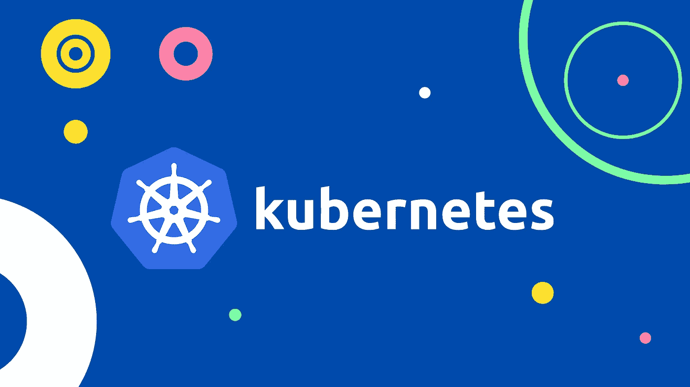
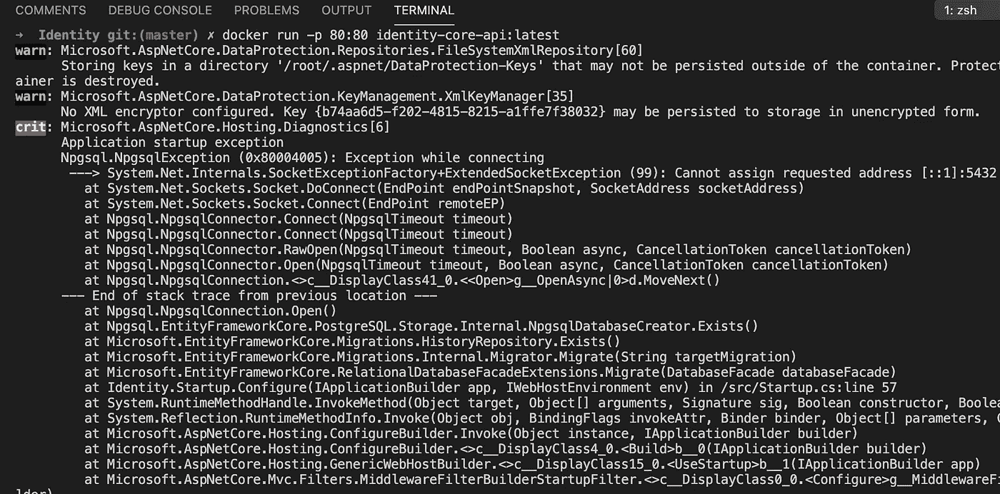
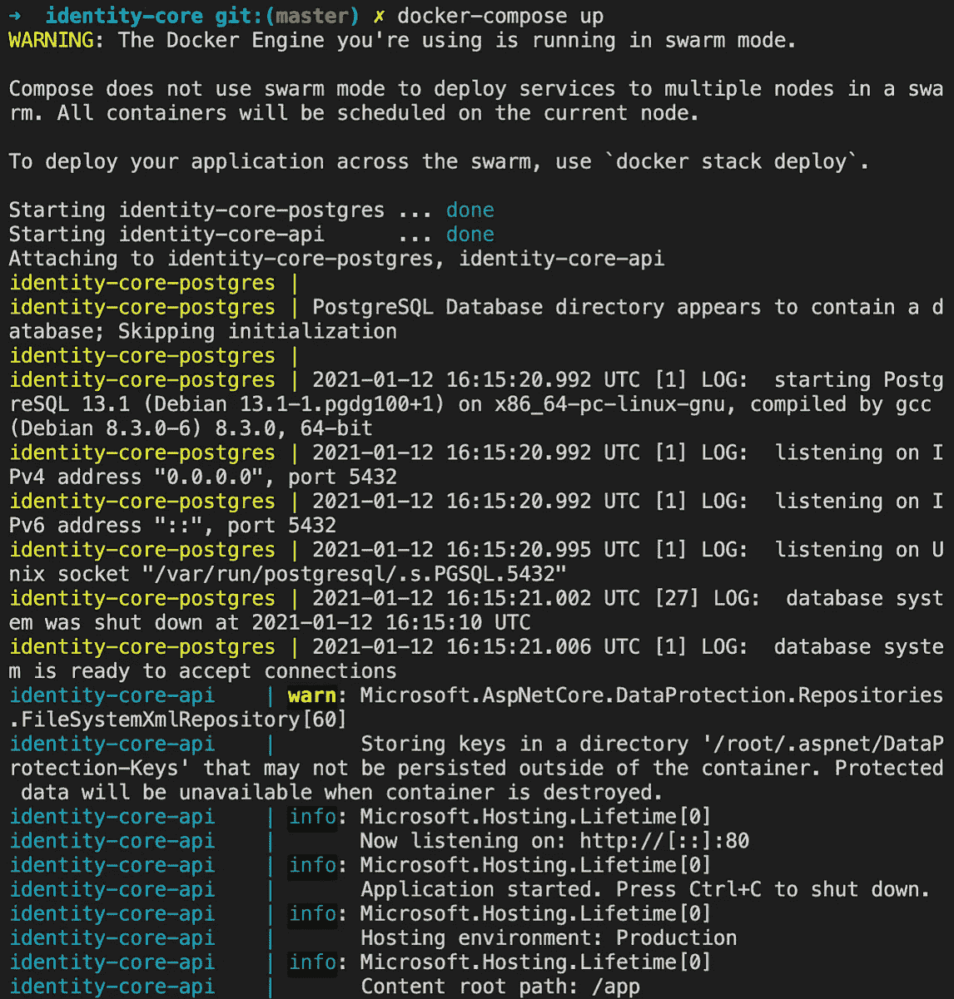

# 正在部署。NET Core 在本地 Kubernetes 集群上的应用

> 原文：<https://levelup.gitconnected.com/deploying-net-core-application-on-local-kubernetes-cluster-d4a0473d1543>

## 从 Docker -> Docker 撰写-> Kubernetes



ubernetes，也缩写为 K8s，是一个用于自动化部署、扩展和管理容器化应用程序的开源系统。在当今的容器化微服务应用世界中，K8s 有助于更轻松地跨各种 pod、节点和集群管理、部署和扩展我们的容器。Kubernetes 已被组织广泛采用来管理、部署和扩展容器。

[](https://kubernetes.io/) [## 生产级容器编排

### Kubernetes，也称为 K8s，是一个开源系统，用于自动部署、扩展和管理…

kubernetes.io](https://kubernetes.io/) 

几个月前，我正在开发一个 dotnet 核心应用程序，它带有几个带有 Swagger 集成的 API 端点。使用 API，我们可以注册一个用户，然后登录获得 JWT。我们还可以获得注册用户的列表。该项目使用实体框架核心作为数据库层，使用 [Npgsql。EntityFrameworkCore . PostgreSQL](https://www.nuget.org/packages/Npgsql.EntityFrameworkCore.PostgreSQL)作为数据库提供者。该项目的完整代码可在我的 GitHub 账户上获得。

[](https://github.com/Chandankkrr/identity-core) [## chandankkrr/身份-核心

### dot net core identity-core Permalink 无法加载最新提交信息。点网核心身份-核心你不能…

github.com](https://github.com/Chandankkrr/identity-core) 

# TLDR；🤷‍♂️

> 将带有 Postgres 数据库的 dotnet 核心应用程序部署到本地 K8s 集群。创建部署、服务、入口和卷。还使水平 pod 自动缩放器能够在负载增加和减少时分别查看正在创建和删除的 pod。

# 为什么部署到本地 K8s 集群？🤔

*   体验可用的 K8s 功能
*   运行 K8s 实验
*   在将 K8s 配置部署到云☁之前测试它们
*   它是免费的
*   如果你搞砸了也没关系

# 我们开始吧

下面是在端口`5001.`上本地运行的 [**Swagger UI**](https://swagger.io/tools/swagger-ui/) 该项目包含两个端点，`/account`用于注册用户，`/login`用于认证用户并获得一个 JSON Web 令牌(JWT)。用户详细信息保存在 Postgres 数据库中。


运行应用程序的 Swagger UI

# Dockerfile 文件

让我们快速浏览一下文档。它正在提取 dotnet 5 SDK 和运行时，使用 SDK 来恢复项目和运行时，以将应用程序及其依赖项发布到一个文件夹，以便部署到托管系统。最后，我们通过指定`Identity.dll`作为入口点来启动应用程序。

让我们从 Dockerfile 文件构建一个映像，最后使用以下命令将该映像作为容器运行

```
// build an image using Dockerfile
docker build -t identity-core-api .// run the image as a container
docker run -p 80:80 identity-core-api:latest
```

执行 docker 运行命令我们得到`Application startup exception.`🤦



应用程序启动异常


urlme.me

这是因为应用程序试图连接到本地主机端口`5432.`上的 Postgres DB。连接字符串存储在`appSettings.json.`中

```
"ConnectionStrings": {
  "IdentityCoreDBConnection":"Host=localhost;Port=5432;
     Database=identitycore;Username=postgres;Password=postgres"
},
```

让我们构建一个运行 Postgres docker 映像的容器。

```
docker run --env POSTGRES_USER=postgres --env POSTGRES_PASSWORD=postgres -p 5432:5432 postgres:latest
```

这次我将使用`dotnet run`命令直接运行应用程序，而不使用 docker。这是为了避免此时必须创建网络。我们将处理这个问题，并在 docker 容器上运行应用程序和数据库。我们可以成功启动应用程序并访问 swagger 端点。


注册用户并获取所有注册用户

让我们注册几个用户，然后通过调用`/account/getAllUsers`端点检索所有注册的用户。


注册、登录和`getAllUsers` API 响应的 Swagger UI

到目前为止，这种方法很有效，但是有一个问题。在我们停止 Postgres 容器后，我们将丢失所有的用户注册数据。这是因为 Docker 容器的设计是短暂的。

> 所谓“短暂的”，我们的意思是容器可以被停止和销毁，新的容器可以从相同的 Docker 映像构建，并以绝对最小的设置和配置放在适当的位置。

[](https://docs.docker.com/develop/develop-images/dockerfile_best-practices/#create-ephemeral-containers) [## 编写 docker 文件的最佳实践

### 本文档涵盖了构建高效映像的推荐最佳实践和方法。Docker 构建图像…

docs.docker.com](https://docs.docker.com/develop/develop-images/dockerfile_best-practices/#create-ephemeral-containers) 

我们可以利用体积来解决这个问题。卷是保存 Docker 容器生成和使用的数据的首选机制。卷存储在主机上，与容器生命周期无关。这允许用户轻松地备份数据和在容器之间共享文件系统。我将再次运行 Postgres 映像，为卷指定`-v`标志。

```
docker run --env POSTGRES_USER=postgres --env POSTGRES_PASSWORD=postgres -p 5432:5432 -v identitycore:/var/lib/postgresql/data postgres:latest postgres:latest
```

现在，每次我们启动 API 和 Postgres 容器时，我们以前注册的用户数据仍然可用。

# 码头工人🐳构成

到目前为止，我们已经使用`dotnet run`命令运行了我们的应用程序，并连接到本地运行的`postgres` docker 容器。到目前为止，这是可以的，但是我们必须每次使用单独的命令手动启动 API 和 Postgres DB 容器，并且必须确保 DB 容器在应用程序之前启动。我们可以解决这个问题，并使用`docker-compose.`启动应用程序运行所需的所有容器

> Docker Compose 是一个用于定义和运行多容器 Docker 应用程序的工具。通过 Compose，我们可以使用 YAML 文件来配置应用程序的服务。然后，只需一个命令，我们就可以从您的配置中创建和启动所有服务

[](https://docs.docker.com/compose/) [## Docker 编写概述

### 寻找撰写文件参考？在此处找到最新版本。Compose 是一个定义和运行…

docs.docker.com](https://docs.docker.com/compose/) 

下面是我们的`identity-core`应用程序的`docker-compose.yml`文件。

让我们稍微分解一下 docker-compose 文件。我们有`networks,`T3 和`volumes.`

## 网络🌐

默认情况下，Compose 为应用程序设置一个网络。服务的每个容器都加入默认网络，并且可以被该网络上的其他容器访问。在我们的 docker-compose 文件中，我们正在创建一个名为`identity-network.`的定制网络

## 服务📡

我们定义了两个服务，`identity-core-api`和`identity-core-db.`。`identity-core-api`服务使用从`Identity`目录中定义的`Dockerfile`构建的映像。它使用先前定义的`identity-network`。已经指定了一个端口映射，将容器和主机绑定到暴露的端口`80`。`depends_on`选项有助于控制服务启动的顺序。这确保了`identity-core-db`服务在`identity-core-api`启动之前启动并运行。

`identity-core-db`服务使用从 Docker Hub 注册中心提取的公共 [Postgres](https://hub.docker.com/_/postgres) 映像，该注册中心为代码构建映像并启动定义的服务。这个服务也使用`identity-network`，并且在主机和容器之间定义了一个端口映射`5432`。已经指定了使用 Postgres 映像所需的环境变量。`POSTGRES_DB`环境变量用于为镜像首次启动时创建的默认数据库定义一个自定义名称。

## 卷💽

卷提供了将容器的特定文件系统路径连接回主机的能力。如果装载了容器中的目录，主机上也会看到该目录中的更改。如果您在容器重启时挂载相同的目录，您会看到相同的文件。我创建了一个命名卷`identity-postgres-data.` Docker 维护磁盘上的物理位置，我们只需要记住卷的名称。每次我们使用该卷时，Docker 都会确保提供正确的数据。通过提供带有`/var/lib/postgres/data`的`-v`标志作为挂载路径来运行 Postgres 映像，我们每次启动一个新容器时，实际上都在使用同一个数据库。


使用卷运行 docker Postgres 映像

让我们使用`docker-compose build`命令构建 docker-compose 文件，并使用`docker-compose up.`运行我们的应用程序。这将把 Postgres 映像作为一个容器运行，并为我们启动 API。



docker-撰写构建和运行

# 库伯内特☸

我们已经通过`dock-compose.`成功运行了我们的应用程序，现在让我们尝试将它部署到本地 K8s 集群。Docker 桌面包括独立的 K8s 服务器和客户端，以及 Docker CLI 集成。K8s 服务器在 Docker 实例中本地运行，是一个单节点集群。K8s 服务器在本地系统上的 Docker 容器中运行，并且仅用于本地测试。我们可以通过 Docker 桌面设置启用 Kubernetes。


Docker 桌面设置

下面是 YAML 文件，它将用于为我们的`Identity Core API`和`Postgres DB`创建 K8s 资源。我们已经定义了`Deployment,` `Service`和`Ingress`，它们定义了我们想要创建什么样的资源。

对于我们的`identity-core-api`和`identity-core-posgres`部署，我们已经声明我们需要 pod 的一个副本，以便在任何给定的时间始终运行。如果由于任何原因，pod 出现故障，`ReplicaSet`将创建一个新的 pod 来替换故障的 pod。通过`spec`属性，我们声明了容器的名称和构建容器的图像。此外，指定要公开的端口和资源限制。

类似于我们的`docker-compose.yml`文件，我们将环境变量传递给 Postgres 映像，并通过`PersistentVolume`和`PersistenVolumeClaim.`设置`volumeMounts`

[](https://kubernetes.io/docs/tasks/configure-pod-container/configure-persistent-volume-storage/) [## 将 Pod 配置为使用持久卷进行存储

### 本页说明如何配置 Pod 以使用 PersistentVolumeClaim 进行存储。以下是对…的总结

kubernetes.io](https://kubernetes.io/docs/tasks/configure-pod-container/configure-persistent-volume-storage/) 

为 API 和 DB 都指定了`Service`,并且为 API 添加了一个`Ingress`,以便能够与集群中的服务进行通信。

# 库贝特尔

准备好文件后，让我们使用`kubectl`来创建我们想要的资源。kubectl 命令行工具让我们可以控制 Kubernetes 集群。我将首先在`postgres.yaml`文件中创建资源，以确保 DB 准备好接受连接，并且 Identity Core API 应用程序可以成功连接到它。

```
kubectl apply -f k8s/postgres.yamlkubectl apply -f k8s/api.yaml
```


kubectl 应用`postgres.yaml` & `api.yaml`文件的输出

我们可以使用以下后续命令检查资源是否已创建

```
kubectl get deploymentkubectl get pods
```


kubectl get 部署和 pods 的输出

```
kubectl get servicekubectl get ingress
```


kubectl get 服务和入口的输出

```
kubectl get pvkubectl get pvc
```


kubectl get 的输出`pv` & `pvc`

我们还可以通过 Docker 桌面仪表板看到我们的容器在运行。


docker 桌面运行容器

# 横向扩展⬆️ Scale-in⬇️

我们可以使用水平机架自动缩放器(HPA)横向扩展我们的`identity-core-api`机架。水平单元自动缩放器根据 CPU 利用率自动缩放单元的数量。

要创建 HPA，我们首先需要启用 K8s 指标服务器。HPA 根据从资源指标 API 检索的 pod 资源指标来扩展 pod。度量 API 由度量服务器提供。我们可以使用以下命令部署度量服务器。

```
kubectl apply -f [https://github.com/kubernetes-sigs/metrics-server/releases/download/v0.4.1/components.yaml](https://github.com/kubernetes-sigs/metrics-server/releases/download/v0.4.1/components.yaml)
```

为了让它在本地工作，我们还需要将`--kubelet-insecure-tls`添加到容器规范的`args`中。最后，让我们为`identity-core-api`部署创建一个 HPA 资源。

```
kubectl autoscale deployment identity-core-api 
--cpu-percent=10 --min=1 --max=10
```

上面的命令创建了一个自动缩放器，目标是部署 10%的 CPU 利用率，最少 1 个单元，最多 10 个单元。当平均 CPU 负载为`<10%,`时，自动缩放器会尝试将部署中的单元数量减少到最少 1 个。当负载为`>10%,`时，自动缩放器会尝试增加部署中的吊舱数量，最多可达 10 个吊舱。

下面是一个 HPA 运行的短片。当 API 上的负载增加时，HPA 旋转新的 pod。我通过使用 Chrome DevTools 中的一个`for`循环发出一堆请求，在 API 上创建了 load。

```
for(var i = 0; i < 1000; i++){
    fetch("[http://localhost/Account/getAllUsers](http://localhost/Account/getAllUsers)");
}
```

HPA 在运行

最终，HPA 达到最大 10 个吊舱，当负载不再存在时，最终下降到 1 个吊舱。


HPA 最大化了豆荚


HPA 返回到最小复制副本

我们还可以在 K8s dashboard 上看到一些使用指标。


K8s 豆荚详情


K8s 使用指标

# 结论📍


urlme.me

能够与本地 K8s 集群进行交互是很有帮助的，尤其是在了解 K8s 或者尝试创建各种资源的时候。🙏