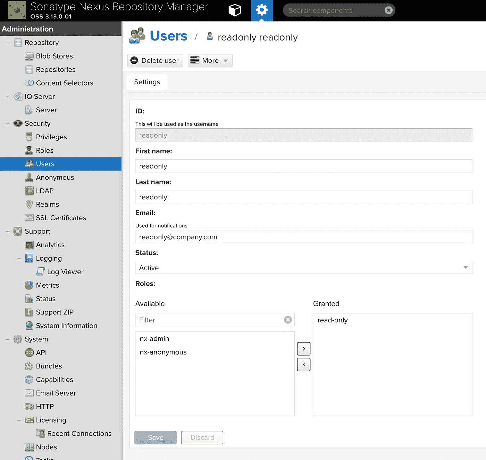
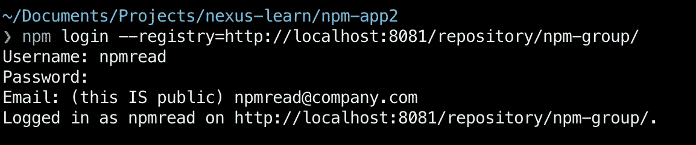

# 向 Nexus 发布私有 NPM 包

> 原文：<https://levelup.gitconnected.com/deploying-private-npm-packages-to-nexus-a16722cc8166>


我们都参与过一些项目，这些项目给了我们构建可重用组件的机会。大多数情况下，这些组件最终会出现在项目的`shared`文件夹中。然后，这个文件夹被复制粘贴到几个项目中，随着时间的推移，这变成了一个更新的噩梦，因为我们不容易拥有一个组件的多个版本，并且在多个分支上维护相同的代码版本是解决这个问题的一种方法。

在本文中，我们将了解 Nexus Repository Manager(又名 Nexus)，这是一个由 [Sonatype](https://www.sonatype.com/) 提供的开源存储库管理器。我们将讨论如何创建一个私有存储库(由亚马逊 S3 支持)并将其与公共的 NPM 注册中心相结合，以提供一个成熟的解决方案，可以保持我们的私有存储库的私有性，允许版本控制，以及缓存存储库。

最后，我们将创建两个应用程序，其中一个将被推送到 Nexus，另一个将从 Nexus 使用。在整篇文章中，我们将只讨论本地部署的 Nexus。

# 评估需求

在我们进入细节之前，有必要考虑一下像 Nexus vs npmjs 提供的私有存储库(收费)这样的东西。我个人认为，如果您的组织没有任何云基础设施，npmjs 上托管的存储库是一个更容易、更干净的解决方案。如果没有内置到您的云基础架构中，托管 Nexus、定期备份、健康检查都是一项开销。现在让我们假设所有这些都已就位并继续下去。

# 目录:

1.  在本地运行 Nexus 存储库管理器
2.  了解卷
3.  创建一个斑点
4.  创建托管存储库
5.  创建 NPM 代理和组
6.  将二进制文件推送到 Nexus
7.  从 Nexus 提取二进制文件
8.  结论

# 在本地运行 Nexus 存储库管理器

由于 docker 越来越受欢迎，现在运行任何软件都像找到正确的(Docker)映像一样容易。幸运的是，Sonatype 为 Nexus 提供了 docker 映像，可以使用下面的 pull 命令轻松地在本地提取。

```
docker pull sonatype/nexus
```

一旦图像被拉出。要运行，只需执行下面的命令:

```
docker run --rm -it -p 8081:8081/tcp sonatype/nexus3:latest
```

这将打开运行我们的 Nexus 实例的容器。要尝试一下，在浏览器中打开`http://localhost:8081`，默认凭证是`admin` / `admin123`


Nexus 提供了许多不同的功能。在这个时候，我们将只与那些需要为 NPM 建立我们的私人仓库，但概念可以很容易地应用于其他形式的项目(maven，NuGet，docker 等)。

## 基本概念

Nexus 向公共的 NPM 注册中心公开了一个`group`存储库，它是我们的`private`存储库(在 Nexus 术语中称为`hosted`存储库)和一个`proxy`存储库的内部组合。

公共注册中心的代理是必要的，因为我们仍然需要一种从 NPM 注册中心访问所有公共存储库的方法。每当我们使用这些公共包时，它们都被缓存在代理中，我们将在文章末尾看到这一点。

因此，当我们想要安装一个新的私有或公共 NPM 包时，我们将项目注册表指向`group`(使用`.npmrc`)，这样它就可以安装任何必要的包(使用`npm`或`yarn`)。并且，要创建或更新一个现有的存储库，将发布操作指向`hosted`存储库(使用`package.json`中的`publishConfig`选项)。

这就是为什么我们第一次加载 Nexus 时，会看到一组默认的组/托管/代理存储库组合。

> 组=托管+代理。从组中读取并写入托管存储库


## 用户管理

在引导 Nexus 时，会为我们(以及所有使用 Nexus 的人)创建一个默认用户。因此，世界上几乎每个 Nexus 用户都知道默认用户名和密码是什么。这就是为什么我们应该在创建新的管理员用户后删除/禁用默认用户。默认情况下，我们只有两个角色，但我们总是可以创建更多的角色(这是权限的组合)，并在我们认为合适的时候将它们添加到用户中。


尽管这不是强制性的，但强烈建议创建自定义角色，并仅根据用户的需求将其分配给用户。


接下来，让我们阻止未经授权的用户访问我们的服务器，单击`Security`下的`Anonymous`，取消选中允许访问服务器的选项:


现在我们已经创建了名为`npmuser`的新管理员，并阻止了匿名用户访问我们的存储库，我们准备进入下一步。

# 了解卷

每当我们将 docker 镜像作为容器运行时，包含的所有信息都是无状态的，也就是说，如果我们的容器因为任何原因重启，数据可能会丢失。例如，在我们的例子中，我们已经在 Nexus 中创建了一个 admin 用户，如果我们要重启容器，我们创建的用户在重启时将不可用，因为这是一个全新的从头开始的容器。

为了绕过这个问题(以及其他类似的问题)，Docker 允许我们将卷挂载到它可以持久存储数据的容器中。在重新启动的情况下，只要新容器重新装载到与以前相同的卷上，它就可以保留信息。

首先，让我们创建一个目录，我们将把这个例子中生成的所有 nexus 数据放在这个目录中。

```
mkdir nexus-data
```

这是我们将用作 Nexus 映像临时卷的文件夹。我们现在需要在为容器发出 run 命令时提供卷的路径:

```
docker run --rm -it -p 8081:8081 **-v** **/Users/../../nexus-data:/nexus-data** sonatype/nexus3
```

上面突出显示的部分非常重要，我们指定了到`nexus-data`目录的完整路径，并将其安装到 Nexus 容器中名为`nexus-data`的默认数据目录。此处列出了其他属性和配置[。](https://hub.docker.com/r/sonatype/nexus3/#notes)

一旦我们运行列出的命令，我们会看到在我们创建的`nexus-data`文件夹下创建了不同的文件夹。


我们现在在 Nexus 中所做的任何更改都会同步回这个文件夹。如果您很好奇，可以再次创建具有`admin`角色的`npmuser`，停止容器并重启它。新创建的用户将按预期被持久化。

# 创建一个斑点

我们现在准备创建一个 Blob 存储，这是一个逻辑分区，我们希望为我们的不同项目类型强制执行，即我们希望分离我们的 NPM 二进制文件和 maven 二进制文件，以避免任何冲突(名称或其他)。在内部，Nexus 只是为我们创建的每个 Blob 存储创建不同的文件夹。

要创建 blob，请转到“设置”页面>存储库> Blob 存储>创建 Blob 存储


这个斑点一旦被创建，就如预期那样出现在我们的体积中:


我们现在上传到该 blob 的任何包都将保存在与其关联的文件夹下的卷中。

我们还将使用基于 AWS S3 的 blob，这是 Nexus 提供的基于文件的 blob 的替代方案。要配置基于 S3 的 Blob，只需从`Type`下拉列表中选择 S3，并填写所需信息。相同的示例如下所示:


这最终会在您的 S3 存储桶中创建一些默认文件:


使用该 blob 推送到存储库的任何和所有内容将由 S3 更新和管理，但是，我们提供给 Nexus 的关于我们的 S3 存储桶的配置仍然保留在我们之前装载的卷上。这就是为什么确保我们定期备份该卷非常重要。

出于多种原因，我们希望减少对卷的依赖:

1.  在生产集群中，我们必须备份与灾难恢复(DR)容器关联的卷。虽然这无法完全避免(因为我们需要持久化用户、自定义角色和其他有状态的信息)，但我们可以将备份减少到无法与云同步的部分，如 S3。
2.  备份到 S3 允许我们在 AWS S3 存储桶上添加额外的规则，如果需要的话，可以将我们的旧包移动到冷库。

至此，我们已经准备好进入过程的下一个阶段，创建存储库。

# 创建托管存储库

如前所述，托管存储库是我们创建的私有存储库，用来保存我们的私有包。使这些存储库私有的原因是没有`authToken`就不能读取这些存储库的内容。我们将在文章末尾的一个例子中看到这一点。

要创建托管存储库，请转到“设置”页面>存储库>存储库>创建存储库。

当我们点击 Create Repository 时，Nexus 很友好地为我们提供了定义某种类型的存储库需要如何配置的方法，在我们的例子中，我们只关心与`npm`相关的方法。


让我们首先选择`npm(hosted)`选项，因为这是我们想要开始的。它向我们请求两件事，托管存储库的名称和存储库数据需要持久存储的 blob。单击“创建存储库”按钮，完成存储库的创建。


就是这样。我们已经为所有的`npm`项目创建了我们的私有(托管)存储库。

# 创建 NPM 代理和组

现在我们已经设置了私有存储库，我们准备创建 npm 代理，它代理我们对公共 NPM 注册中心的所有读取请求。我们可以通过将`hosted`和`proxy`库合并成一个`group`来完成我们的变更。

## 创建代理存储库

在创建存储库屏幕中，选择`npm (proxy)`，这将把我们带到配置页面，我们希望代理到位于 URL `[https://registry.npmjs.org](https://registry.npmjs.org.)` [的 NPM 公共注册中心。](https://registry.npmjs.org.)

我们仅在此输入 3 个必填字段:

1.  名称— `npm-proxy`
2.  代理位置— `[https://registry.npmjs.org](https://registry.npmjs.org.)`
3.  Blob 存储(用于缓存存储、配置等)— `NPM-S3`(之前创建)

这将按预期创建代理存储库。


## 创建组存储库

如前所述创建组存储库是为了将托管存储库和代理存储库结合起来，这使得读取更加容易。让我们创建类似于`hosted`和`proxy`存储库的`npm (group)`存储库。

它接受与以前类似的配置，如名称、blob 存储等。我们选择了`npm-private`和`npm-proxy`存储库，并使它们成为这个组的活跃成员。

将来，如果我们有更多兼容的存储库，它们会出现在`Available`列表下，可以选择并移动到`Members`部分。


# 将二进制文件推送到 Nexus

既然我们已经准备好了必要的存储库，我们现在可以根据需要在我们的项目中使用它们。让我们首先用一个空白的`index.js`文件创建一个样本 NodeJS 项目，并将它推送到我们托管的存储库:

```
mkdir npm-app1 && cd npm-app1npm init -ytouch index.js
```

为了发布这个项目，我们需要用指向我们新的托管存储库的`publishConfig`更新我们的`package.json`文件。

如果我们现在尝试用`npm publish`命令发布项目，我们会看到如下错误，说明我们需要认证:


让我们使用与 Nexus dashboard 相同的凭证来添加身份验证(如错误消息中所建议的):

> 注意:注意注册表 url 包含存储库名称


让我们再试一次！现在我们看到一个不同的错误，说它不能发出`Put`请求:


这是因为 Nexus 中的安全工作方式，`realms`的概念决定了任何用户如何与 Nexus 交互。应用的默认`realm`称为本地认证和本地授权`realm`,根据文档，其职责如下:

> 它们允许存储库管理器在没有额外外部系统的情况下管理安全性设置。

我们需要添加额外的`realms`来启用`npm publish`功能。要启用其他领域，请转到设置>安全>领域。

添加`npm Bearer Token Realm`并保存更改。关于服务器的更多信息可以在[这里](https://help.sonatype.com/repomanager3/security/realms)找到。


现在，我们准备好重试我们的发布命令，并按预期工作:


为了验证这一点，我们可以浏览我们的存储库并看到预期的包。从顶部导航栏>浏览> NPM-私有中选择浏览选项，查看如下所示的软件包:


我们还可以验证这是在 S3 上传到名为`content`的文件夹下，虽然我们看不清楚，因为它在存储时被转换成一个 blob。

# 从 Nexus 中提取二进制文件

现在我们已经将二进制文件发布到 Nexus，让我们创建另一个项目，我们将尝试从这个项目中使用`npm-app1`。

```
mkdir npm-app2 && cd npm-app2npm init -y
```

在我们尝试使用`npm install` 从我们的存储库中检索`npm-app1`之前，让我们删除之前使用`npm login`时添加的凭证。我们这样做是为了避免使用这些凭证来检索包。理想情况下，我们希望复制一个正在使用我们的应用程序的新开发人员的体验。

要删除这些凭据，只需运行以下命令:

```
npm logout --registry=[http://localhost:8081/repository/npm-private/](http://localhost:8081/repository/npm-private/)
```

现在，让我们试着安装新`npm-app2`项目中的`npm-app1`:

```
npm i -S npm-app1
```

正如所料，我们看到一个 404 错误，因为在默认情况下`npm`指向的公共注册表上没有找到`npm-app1`。


为了解决这个问题，我们需要在本地添加一个`.npmrc`文件到项目中。这个`.npmrc`文件包含`registry`，我们需要指向它来获取我们的包和任何需要的额外凭证。

```
touch .npmrc
```

我们首先添加我们需要指向的注册表，以便能够检索我们的包

```
registry=[http://localhost:8081/repository/npm-group](http://localhost:8081/repository/npm-group)/
```

注意，我们指向的是`npm-group`而不是`npm-private`库，因为我们想要访问私有和代理的`npm`公共包。我们可以看到项目已定位，但无法安装，因为我们没有获得授权。


最简单的解决方案是添加完成这项工作所需的`authToken`。

> 作为一个最佳实践，我建议创建一个对所有存储库都具有只读角色的新用户。我们这样做是因为我们不想将 Nexus 的 admin auth 令牌添加到源代码中。
> 
> 为此，创建具有与读取和浏览相关的所有权限的角色，最简单的方法是为角色提供`nx-repository-view-*-*-browse`和`nx-repository-view-*-*-read`权限


> 然后创建具有该角色的用户:



接下来，为了获得这个用户的 auth 令牌，执行一个指向我们的`npm-group`存储库的`npm login`:



执行登录会将凭据添加到您计算机根目录下的`.npmrc`文件中。打开全局`.npmrc`文件，找到类似如下的行:

```
//localhost:8081/repository/npm-group/:_authToken=NpmToken.bb495270–9831–3046–8c24-a2978853d3a1
```

`_authToken`是上面打印的最后一行。我们现在可以在`npm-app2`项目中将`_authToken`添加到我们的`.npmrc`文件中。我们这样做是为了避免在克隆该存储库的每台计算机上登录。

让我们先注销，然后再继续:

```
npm logout --registry=[http://localhost:8081/repository/npm-group/](http://localhost:8081/repository/npm-private/)
```

项目中`.npmrc`文件的最终形式如下:

有了它，我们现在应该能够安装和使用如下所示的任何和所有软件包:


当我们浏览存储库时，我们可以看到代理包(在本例中为 lodash)的缓存在起作用:


# 结论

本文仅介绍了如何将 Nexus 用作存储库管理器的一些基础知识。尽管我们运行容器并将卷装载到本地目录中，但强烈建议您在自己选择的云提供商上尝试上述方法。请记住，在云提供商(或自托管)的情况下，您需要备份卷以进行灾难恢复。

*如果你喜欢这个博客，一定要拍几下。* [*多看几遍*](https://medium.com/@kashyap.mukkamala) *或者跟我上*[*LinkedIn*](https://www.linkedin.com/in/kashyap-mukkamala/)*。*

[](https://levelup.gitconnected.com)[](https://gitconnected.com/learn/node-js) [## Learn Node.js - Best Node.js 教程(2019) | gitconnected

### 前 31 个 Node.js 教程。课程由开发人员提交和投票，让您能够找到最好的节点

gitconnected.com](https://gitconnected.com/learn/node-js)