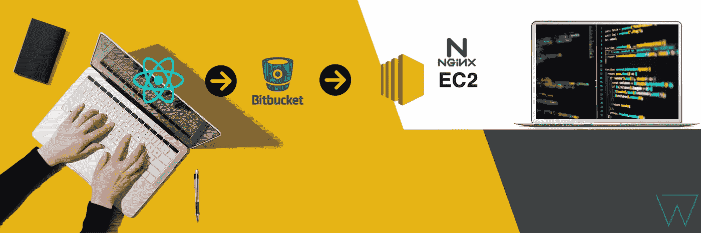
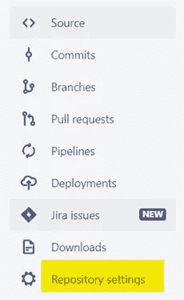
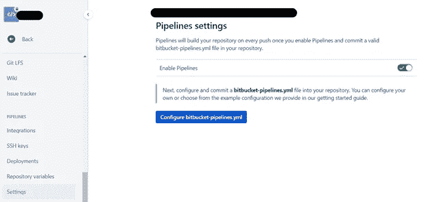
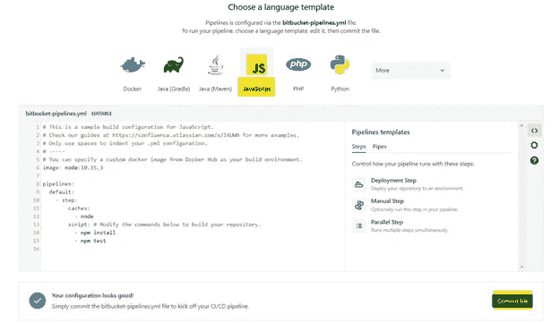
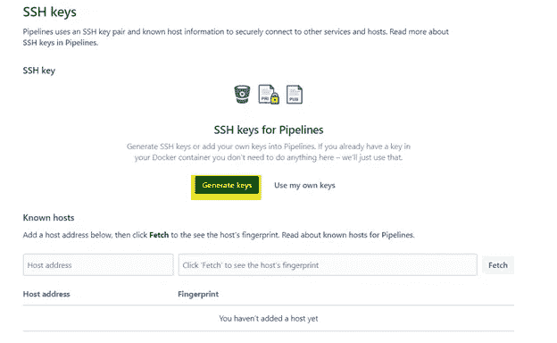
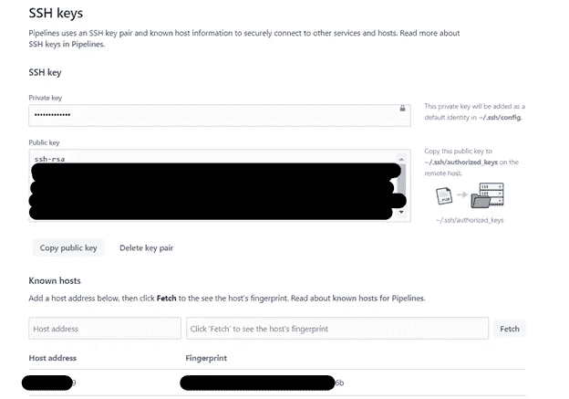
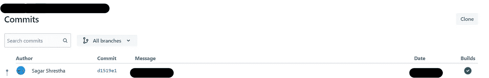
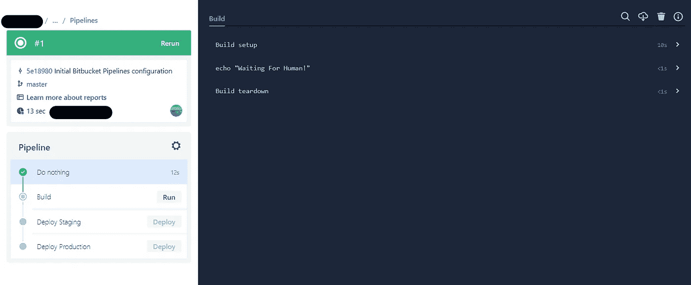

# 在 AWS EC2 的 Nginx 服务器中部署 React 应用程序

> 原文：<https://levelup.gitconnected.com/deploying-react-application-in-nginx-server-in-aws-ec2-6512ff71593b>

本教程将指导您使用 Bitbucket 管道在`AWS EC2`的`Nginx`服务器中部署一个 React web 应用程序。

# 要开始，你需要以下东西:

1.  Bitbucket 帐户(免费计划是可以的)
2.  AWS 帐户
3.  安装了`Nginx`的 AWS EC2 实例
4.  对 EC2 实例的 SSH 访问
5.  很明显，Git 的基础知识

# **我们开始吧。**

*   创建一个新的 React 应用程序，并通过创建一个新的存储库将代码推入 Bitbucket。(或者，您可以使用现有的 React 应用程序存储库)
*   转到存储库设置

比特桶菜单

*   向下滚动到**管道**然后点击`Settings`和**启用管道**

位桶管道设置

*   点击`Configure bitbucket-pipelines.yml`

位桶管道配置

选择`JavaScript`。您可以暂时保留默认配置，然后单击按钮**提交文件**。这将在项目根目录下创建`bitbucket-pipelines.yml`文件。

*   再次转到存储库设置，然后单击`SSH Keys`

位桶管道 SSH 密钥

点击**生成密钥。你将得到一个屏蔽的私钥和公钥。**

在**已知主机中，**添加主机地址(您托管 React 应用程序的 EC2 实例的 IP 地址)并点击**获取指纹。**获取指纹后点击**添加主机。您的最终设置应该是这样的:**

位桶管道 SSH 密钥

*   现在使用 SSH 连接到托管服务器并复制`~/.ssh/authorized_keys`中的 public above 密钥。如果该文件中有其他公钥，只需将公钥复制粘贴到底部并保存即可。
*   是时候写一些管道代码了。转到位于存储库根文件夹中的`bitbucket-pipelines.yml`文件。将该文件的内容更改为以下内容:

上述配置代码只能用于分支`master`和`staging`。如果您想让它对所有分支都可用，您可以简单地删除分支步骤。

有四个步骤:

1.  什么都不做->位桶管道要求第一步在提交后自动发生。由于我是手动触发每个步骤，这是必需的。如果您想在提交后自动执行所有操作，请移除该步骤，并从其他步骤中远程执行`trigger:manual`。
2.  构建 React 应用->这一步将运行所有必要的步骤来构建 React 应用。它还缓存节点模块以加快构建过程(如果没有添加新的依赖项)。为构建的每一步从互联网上重新下载依赖项会花费很多时间。所以，下载并存储在 Bitbucket 服务器中是很好的。这是在按位存储桶自动添加缓存步骤时完成的。
3.  在 Staging 中部署->这个步骤将复制在步骤 2 中生成的构建工件。到您在此步骤中指定的文件夹。确保更换`{{EC2-USER}}, {{EC2-IP}} and {{Build folder path}}`。
4.  在生产中部署->这个步骤将复制在步骤 2 中生成的构建工件。到您在此步骤中指定的文件夹。确保更换`{{EC2-USER}}, {{EC2-IP}} and {{Build folder path}}`。

第 3 步和第 4 步类似，如果您不需要在每次提交时都部署到两个服务器，那么您可以删除最后一步。

关于如何编写位桶管道配置的更多信息，你可以查看文档[这里](https://support.atlassian.com/bitbucket-cloud/docs/configure-bitbucket-pipelinesyml/)。您可以使用位存储库变量来存储服务器 IP、用户名和其他敏感信息。

*   运行管道

当您成功提交时，您可以在 UI 的右侧看到一个绿色勾号，在您单击它之后，它会将您带到部署屏幕。

Bitbucket 提交 UI

位桶管道 UI

现在可以手动点击`Run`和`Deploy`按钮。完成后，您可以检查您的 React web 应用程序是否更新。

如果你使用的是免费的 Bitbucket 账户，你可以在这里找到一些限制。您将每月获得 50 分钟的构建时间，这对于学习目的和不太频繁变化的应用程序来说已经足够了。

如果您想了解更多关于管道状态的信息，您可以在这里找到。

如果您有任何问题，请留下评论。