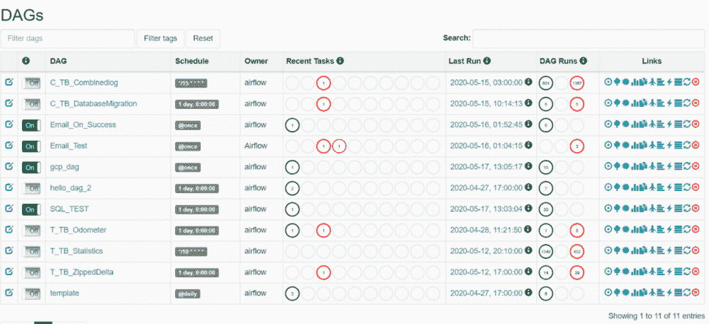

# 使用 Kubernetes，通过 10 个简单步骤部署可扩展的生产就绪型气流

> 原文：<https://levelup.gitconnected.com/deploying-scalable-production-ready-airflow-in-10-easy-steps-using-kubernetes-4f449d01f47a>


图片来自《Kubernetes 儿童图解指南》，点击[查看](https://www.cncf.io/the-childrens-illustrated-guide-to-kubernetes/)。

Airbnb 的创意产品 Airflow 是一款开源数据编排工具，允许您以编程方式安排作业，以便提取、转换或加载(ETL)数据。由于 Airflow 的工作流是以 Dag(有向无环图)的形式用 Python 编写的，因此它们允许复杂的计算、可伸缩性和可维护性，这与 cron 作业或其他调度工具不同。作为一名数据科学家和工程师，数据对我来说非常重要。我使用气流来确保我需要的所有数据都经过处理、清理并可用，这样我就可以轻松地运行我的模型。

当我一年前开始这段旅程时，我在网上搜寻资源，但是没有。我想要一个清晰的途径来部署可扩展版本的 Airflow，但是我发现的许多文章都不完整，或者创建了无法处理我想要处理的数据量的小版本。我的目标是每天高效、可靠地运行数十万个以上的任务，同时不影响我的钱包。当时，KubernetesExecutor 还没有向公众发布，但现在已经发布了。

我写这篇文章是希望防止你在许多不眠之夜思考气流的存在(以及我自己的),并对它产生不健康的痴迷。这就是我如何用 10 个简单的步骤用最新版本(1.10.10)创建一个可扩展的、生产就绪的气流。

# 先决条件:

*   码头工人。如果你有 Ubuntu 系统，你可以在这里[使用他们令人敬畏的指令](https://docs.docker.com/engine/install/ubuntu/)或者你可以参考我做的这个 [PDF](https://docs.google.com/document/d/e/2PACX-1vQjDiS49bEx4qhdsY7-YvuYAWo0F4_6FVlnKmnMplqvJ2jbkEONytEttu8anMUPEw/pub) :
*   名为“dags”的 Git 存储库，因此您可以存储您的工作流；这允许协作。
*   存储完整图像的容器存储库。
*   Kubernetes 集群(或 minikube ),如果您想在生产中部署气流。

# 第一步:Docker 图像

有很多选项，包括舵图(使用 puckel 图像)，但我发现 Dockerfile 是最直观、直接和可定制的版本。很少有好的图片——puck El 很棒，如果你刚开始使用它——但是如果你打算使用 KubernetesExecutor，我建议你使用 Dockerfile 创建自己的图片。你也可以用这个方法得到最新版本的 Airflow (1.10.10)。

在您的 linux 环境中，键入:

```
cd ~
git clone [https://github.com/spanneerselvam/airflow-image.git](https://github.com/spanneerselvam/airflow-image.git)
cd airflow-image
ls
```

您的 config 目录包含了您将从机器复制到 Airflow 的所有文件。打开 docker 文件。

您应该在这里看到以下代码(这只是一个代码片段):

```
FROM python:3.7
RUN apt-get update && apt-get install -y supervisor
USER root
RUN apt-get update && apt-get install — yes \
sudo \
git \
vim \
cron \
gcc
RUN pip install apache-airflow[1.10.10]
RUN cd /usr/local && mkdir airflow && chmod +x airflow && cd airflow
RUN useradd -ms /bin/bash airflow
RUN usermod -a -G sudo airflow
RUN chmod 666 -R /usr/local/airflow
ARG AIRFLOW_USER_HOME=/usr/local/airflow
ENV AIRFLOW_HOME=${AIRFLOW_USER_HOME}
COPY config/airflow.cfg ${AIRFLOW_USER_HOME}/airflow.cfg
EXPOSE 8080
#Python Package Dependencies for Airflow
RUN pip install pyodbc flask-bcrypt pymssql sqlalchemy psycopg2-binary pymysql
```

告诉你一个有趣的事实(你对有趣的定义可能与我的非常不同):Docker 的标志是这条非常可爱的鲸鱼——就像它是我见过的最可爱的标志(不相信我？去吧，去谷歌一下！)—因为它在一次 logo 大赛中以压倒性优势胜出，甚至打败了长颈鹿！Docker 甚至收养了一头名叫 Molly Dock 的鲸鱼。她正在浩瀚的太平洋中游走。我为什么知道这个？当你很晚才醒来部署气流时，你最终会谷歌一些奇怪的东西…

# 第二步:DAGs

使用 KubernetesExecutor 在气流中设置 DAGs 是很棘手的，这是我完成的最后一块拼图。有几个选项，如在 docker 映像中嵌入 DAG，但这种方法的问题是，每次更改 DAG 代码时，您都必须重建映像。

我发现协作的最佳解决方案是使用 GitHub(或 BitBucket)来存储您的 Dag。创建您自己的 repo(克隆我的——稍后会有更多介绍),然后您和您的团队可以将您的所有工作放入存储库中。一旦你做到了这一点，你需要通过使用 PV 和 PVC(持久卷和持久卷声明)和 Azure 文件共享(或 EKS 等同物)将 Dag 挂载到运行气流的 pod。

光伏和 PVC 是 Kubernetes 提供的服务。请将它们视为共享存储资源，可以连接到您部署的每个单元。为此，你需要创建一个 Azure 文件共享(这里的说明是)。确保你把文件共享挂载到你的电脑上(挂载说明可以在[这里](https://docs.microsoft.com/en-us/azure/storage/files/storage-how-to-use-files-linux)找到)，这样它就能从你的 git repo 中提取代码，并显示在 Azure 文件共享中。我使用了一个简单的 cron 作业，它每分钟运行一个名为 git_sync.sh 的 shell 脚本，从 GitHub 中提取代码。

crontab -e:

```
* * * * /home/git_sync.sh#Mandatory Blank Line
```

git_sync.sh(注意:我的远程名称是“DAGs”而不是 origin):

```
cd ~
git clone git@github.com:spanneerselvam/airflow-image.git
cd airflow-image
ls
```

一旦你做到了这一点(我建议为你的 Azure 文件共享使用至少 5 Gi 的存储)，你需要在 Kubernetes 中部署 Azure 文件共享。遵循以下步骤(它们也适用于 EKS):

1.  为你的 Azure 文件共享创建一个 Kubernetes 秘密。阅读本指南，在这里安全地创建您的秘密[。](https://docs.microsoft.com/en-us/azure/aks/azure-files-volume)
2.  部署一个 PVC(参见代码 airflow-pvc.yaml)。你只需要做一次。
3.  部署一个 PV(参见 repo 中的代码 airflow-pv.yaml 和 airflow-pv-k8s.yaml)。您必须对每个名称空间都这样做(在我的例子中是“default”和“k8s-tasks”)。

步骤 2–3:要部署 PV 和 PVC，需要运行以下代码行:

```
kubectl create -f airflow-pvc.yaml
kubectl get pvc
kubectl create -f airflow-pv.yaml
kubectl create -f airflow-pv-k8s.yaml
kubectl get pv
```

如果 PVs 和 PVC 的状态是“已绑定”，那么就可以开始了！

现在 Dag 出现在 Azure 文件共享中，您需要调整气流设置。我将我的 Dag 存储在名为*"/usr/local/air flow/DAGs "*的文件夹中的 pod 中。此文件夹从文件共享安装在主窗格中，但为了正常工作，它也必须安装在每个工作窗格中。如果您查看 airflow.cfg，请注意[kubernetes]部分下的这两个设置。

```
dags_in_image = False #The worker will get the mount location for the dags
#dags_volume_subpath = This line is commented out because the mount folder is the same as the dag folder
dags_volume_claim = airflow-dags #put your claim name here (this must match your airflow-pvc.yaml file)
```

**写达戈:**也可以看看我写给“写达戈的艺术[的这个便捷指南。您可以克隆这个 repo 并下载两个 dag，template_dag.py 和 gcp_dag.py](https://docs.google.com/document/d/e/2PACX-1vRm5AqQD4aZ7fhQY2rDlD_wDho9RX48dTVCa9QQK_RFkpXciCdsCQ-Voa0Rt1LZIA/pub) [在这里](https://github.com/spanneerselvam/dags.git)。

# 第三步:记录

对于每次任务运行，airflow 都会创建一个日志来帮助用户调试。在这里，我们将日志存储在*"/usr/local/air flow/logs "*文件夹中。这是如此重要的一块。我在日志记录方面遇到了太多的问题——可怕的“***日志文件不存在”浮现在脑海中——我发誓每次我得到这个错误，我都会有点(实际上是很多)内心死亡，并感到心悸。但别担心，我会支持你的！说到 Kubernetes 有两种选择。

1.  在 Kubernetes 集群上使用 PVC(永久卷声明)
2.  远程日志记录

由于我们已经经历了使用 PVC 的过程，我将向您展示如何使用 GCP(谷歌云平台)远程登录。使用 Google 控制台创建一个 bucket，然后创建一个名为*“logs”*的文件夹。确保您打开了存储桶的权限；你可以点击查看[。你还需要创建一个服务帐户，也可以在这里找到(感谢上帝，GCP 有惊人的说明！)下载 json 认证文件，并将内容复制到*“air flow-image/config/GCP . JSON”*文件中。](https://cloud.google.com/storage/docs/cloud-console)

您需要将 bucket 和文件夹的详细信息添加到 airflow.cfg 和 Dockerfile 的第 72 行。一旦你做到了这一点，你就成功了。我已经创建了一个名为“AirflowGCPKey”的日志连接 ID。这个 ID 与 GCP 连接的敏感细节相关联。您可以在 UI 中创建这个 ID，或者我个人喜欢做的是在 UI 中运行 gcp_dag.py 来自动创建这个连接(这里的代码是[这里是](https://github.com/spanneerselvam/dags/blob/master/gcp_dag.py))。

```
RUN pip install apache-airflow[gcp] apache-airflow[gcp-api]
RUN echo “deb [http://packages.cloud.google.com/apt](http://packages.cloud.google.com/apt) cloud-sdk main” | tee -a /etc/apt/sources.list.d/google-cloud-sdk.list
RUN apt-get install gnupg -y
RUN curl [https://packages.cloud.google.com/apt/doc/apt-key.gpg](https://packages.cloud.google.com/apt/doc/apt-key.gpg) | apt-key add -
RUN apt-get update && apt-get install google-cloud-sdk -y
RUN gcloud auth activate-service-account <insert your service account> — key-file=/usr/local/airflow/gcp.json — project=<your project name>
```

# 第四步:数据库

这是让气流工作的基本要素。Airflow 附带了一个默认的数据库(我不建议在生产中使用)。您可以创建一个 postgresql 数据库，并在 airflow.cfg 中添加以下格式的字符串:

```
sql_alchemy_conn = postgresql+psycopg2://<user>:<password>@<host>:5432/<db>
```

# 第五步:费尔内钥匙

您需要进入 Python shell(类型为“Python”)为您的数据库创建一个 fernet 键。然后在 shell 中，复制并粘贴以下代码行来生成您的密钥。确保复制 fernet 密钥并将其粘贴到 airflow.cfg 文件中(搜索“fernet_key”)。我还推荐使用旋转密钥来获得额外的安全性。

```
from cryptography.fernet import Fernet
fernet_key= Fernet.generate_key()
print(fernet_key.decode())
```

# 第六步:认证

我已经设置了 UI 来设置 RBAC(基于角色的访问控制)(参见 in airflow.cfg: *rbac = True* )。您可以像这样创建用户(在您的 docker 文件或 Airflow 的后端):

```
airflow create_user -r Admin -u sai -e saipanneerselvamcodes@gmail.com -f Sai -l Panneerselvam -p seahrsequeen
```

其中: *-r = roll，-u =用户名，-e =邮箱，-f =名字，-l =姓氏，-p =密码。*

是的，我是海马皇后。

注意:RBAC 有以下角色:管理员、公众、观众、用户和操作员。你可以在这里阅读更多关于他们的[。](https://airflow.apache.org/docs/stable/security.html?highlight=ldap)

# 步骤 7:Airflow web 服务器和调度程序

要在启动时运行 web 服务器(如果您想在 Kubernetes 上运行您的映像，这一点至关重要，否则映像将无法运行)，请使用 supervisord(参见*" air flow-image/config/super visor . conf "*)。这是运行长任务的一个很好的选择。

```
[supervisord]
nondaemon=true[program:server]
command=airflow webserver -p 8080
stdout_logfile=/var/log/supervisor/%(program_name)s.log
stderr_logfile=/var/log/supervisor/%(program_name)s.log
autostart=true
autorestart=true[program:scheduler]
command=airflow scheduler
stdout_logfile=/var/log/supervisor/%(program_name)s.log
stderr_logfile=/var/log/supervisor/%(program_name)s.log
autostart=true
autorestart=true
```

# 第八步:KubernetesExecutor

为了实现这一奇迹，请在[kubernetes]部分下的 airflow.cfg 中设置这些特性。您需要添加 worker_container_repository，以便从存储图像的位置提取数据，这样您就可以为每个任务启动多个 pod。

```
worker_container_repository = <your-docker-image-repository>
worker_container_tag = latest
worker_container_image_pull_policy = IfNotPresent
```

您还需要在 Kubernetes 中创建一个名为“airflow-secrets”的秘密，它包含提取 docker 图像的信息。您可以使用这个简单的命令来完成:

```
kubectl create secret docker-registry airflow-secrets — docker-server=<your-host> — docker-username=<your-username> — docker-password<your-pwd> — docker-email=<your-email>
```

Kubernetes API 有一个观察超时，它会干扰气流调度程序，因此要绕过这个超时，请在 docker 文件中添加这一行:

```
ENV AIRFLOW_KUBERNETES_ENVIRONMENT_VARIABLES_KUBE_CLIENT_REQUEST_TIMEOUT_SEC=50
```

**注意:**在 Dockerfile 中有一堆设置好的环境变量。这些对于 KubernetesExecutor 与气流调度程序和远程日志记录一起工作是至关重要的。

# 步骤 9:保存你的气流图像

一旦您修改了代码以适应您的需要，您就准备好构建您的映像了。从“airflow-image”文件夹向上移动一级，然后键入:

```
sudo docker build airflow-image
```

当你的形象建立起来的时候，拿些水，伸展一下，看着你所有的努力汇集在一起。构建完映像后，确保保存它，然后将映像放入容器注册表中。

```
docker tag <image-id> <docker-repo>
docker push <docker-repo>
```

# 步骤 10:在 Kubernetes 部署气流

在 Kubernetes 中扩展气流的最简单方法是通过部署。首先创建一个名为 k8s-tasks 的新命名空间(参见 in air flow . CFG:*namespace = k8s-tasks*)。这是运行每项任务的所有 pod 的创建位置。

```
kubectl create namespace k8s-tasks
kubectl create clusterrolebinding default-admin — clusterrole cluster-admin — serviceaccount=default:default — namespace k8s-tasks
```

使用以下命令部署映像并创建 NGINX 入口(查看 UI 的网关)后:

```
kubectl create -f airflow-deployment.yaml
kubectl create -f airflow-ingress.yaml
```

然后，您需要创建一个服务:

```
kubectl expose deployment/airflow-deploy
```

用下面一行找到您的集群的 IP 地址:

```
kubectl get service -l app=nginx-ingress — namespace ingress-basic
```

转到您的 IP 地址，瞧！



你已经部署了最新版本的气流。在版本 1.10.10 中，您可以设置时区，这样您就不会在心里将 UTC 时间转换为您的时区(这很困难)。我把我的时区设为美洲/洛杉矶，因为我在阳光明媚的加利福尼亚州，但是你可以在这篇文章[这里](https://airflow.apache.org/docs/stable/timezone.html)找到你的时区。

这就是你要的，伙计们！你刚刚在 10 个简单的步骤中创建了一个美丽的，工作的，可扩展的气流版本！触发您的模板 DAG，进入 k8s-tasks 名称空间，高兴地看着 pods 随着每个任务的启动而旋转。漫威在你的工作和放松。你应得的！也随时感谢我；)