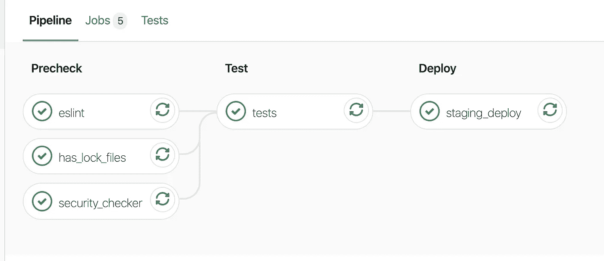
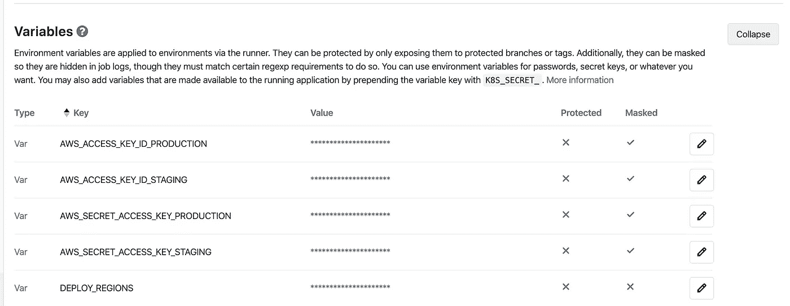

# 使用 Gitlab CI/CD 将无服务器后端部署到 AWS

> 原文：<https://levelup.gitconnected.com/deploying-serverless-backends-to-aws-with-gitlab-ci-cd-f81106b43709>



Gitlab CI/CD 管道

[无服务器框架](https://serverless.com/)是一个了不起的工具，我非常看好无服务器开发的未来。对于所有关于无服务器的精彩内容，没有太多关于如何为无服务器项目构建 CI/CD 管道的内容——所以我们开始吧。

在本教程中，我们将使用 Gitlab 管道，因为我是 Gitlab 的超级粉丝。同一个模板可以用于通过 Bitbucket、Azure 或任何其他提供者来引导管道。我将假设几乎没有关于设置 CI/CD 的知识，所以希望任何人都可以跟随。Gitlab 文档也是了解更多关于 CI/CD 的极好资源—【https://docs.gitlab.com/ee/ci/introduction/ 

# 构建基础 Docker 映像

您管道中的每个*作业*都在 docker 容器中运行。您可以使用一个通用的基础映像来支撑您的管道(例如 node12 ),然后在其上安装您的所有依赖项，或者您可以构建一个包含依赖项的定制映像。

我的偏好是构建一个自定义图像，并使用 Gitlab 容器注册表来存储这些图像。我构建无服务器应用程序的偏好是使用 node/typescript，所以我的基本映像看起来像这样

```
*FROM* node:12

*WORKDIR /*app

*# install JRE for dynamo-offline (required for tests)
RUN* apt-get update \
    *&&* apt-get install *-*y default-jre \
    *&&* apt-get clean \
    *&&* rm *-*rf */*var*/*lib*/*apt*/*lists*/*

# Install serverless globally
RUN* npm i *-*g serverless
```

**注意:** *我还将这些图像命名为 Dockerfile.pipeline，以避免与项目中的其他图像混淆。你可以把它命名为管道。在您的实例中，Dockerfile 或其他命名约定可能是首选。*

我们将在这里施展一些魔法，在我们的管道中重建我们的 docker 映像，**，但是只有当 docker 文件发生变化时**。我们能做到这一点要感谢一个叫做 *changes* 的小标签，它在文件中寻找变化。

下面是代码的输出示例。

```
image: docker:lateststages:
  - buildbuild-docker-image:
  stage: build
  image: docker:latest
  services:
    - docker:dind
  script:
    - docker login -u "$CI_REGISTRY_USER" -p "$CI_REGISTRY_PASSWORD" $CI_REGISTRY
    - docker build --pull -t "$CI_REGISTRY_IMAGE" -f Dockerfile.pipeline .
    - docker push "$CI_REGISTRY_IMAGE"
  only:
    changes:
      - Dockerfile.pipeline
```

服务——docker:dind 允许我们在 docker 中使用 docker，在运行脚本的基本 docker 映像中构建一个新的 docker 映像。然后，我们构建新的映像，并将其推送到项目的 Gitlab 中的容器注册表中。现在，在管道的后续步骤中，我们可以引用此图像

```
image: $CI_REGISTRY_IMAGE:latest
```

如果我们不接触 Dockerfile.pipeline，那么这个构建阶段就永远不会运行。

# 配置我们的管道阶段

您要在配置中做的下一件事是定义*阶段。*基本管道结构简单。您可以定义多个*阶段*，其中可以包含一个或多个*作业*。Stage 中的所有作业都是并行运行的，但每个阶段都是并发运行的，一个阶段仅在前一个阶段完成后运行。

一个常见的模式是有一个验证/测试阶段，然后是部署阶段。这种结构背后的理由是，您让尽可能多的任务并行运行，同时防止部署在您的测试和检查全部通过之前发生。

我的偏好是为无服务器添加一个额外的阶段。对于小项目来说，这稍微减慢了流水线的速度，但是对于大项目来说，这实际上会更有效。

我喜欢定义的阶段是:

```
stages:
  - build
  - precheck
  - test
  - deploy
```

我背后的理由是，如果我的任何 *precheck* 作业失败，管道可以退出，而不需要运行(可能很慢的)测试套件。

我们还可以通过添加以下 cache 关键字来缓存构建过程的各个部分，以便在后续步骤和管道中重用

```
cache:
  paths:
    - node_modules/
```

这里我们缓存 node_modules 目录，这样我们就不需要在每个作业中等待完整的节点安装。

## 预检阶段

```
has_lock_files:
  stage: precheck
  image: $CI_REGISTRY_IMAGE:latest
  script:
    - "if [[ -e 'package.json' &&  ! -e 'package-lock.json' ]]; then echo 'No lock file found. Please add a package-lock.json'; false; fi"

security_checker:
  stage: precheck
  image: $CI_REGISTRY_IMAGE:latest
  script:
    - npm audit --audit-level=moderate

eslint:
  stage: precheck
  image: $CI_REGISTRY_IMAGE:latest
  script:
    - npm i -D
    - eslint . --ext .js,.jsx,.ts,.tsx
    - tsc --noEmit
```

我们在这里做的是

1.  **has_lock_files:** 检查我们有 package.json 和 package-lock.json 来确保确定性的构建。如果这些文件中的任何一个丢失了，我们将立即退出。这运行得非常快，如果失败，就没有必要运行其他作业/阶段
2.  **security_checker:** 我们对依赖项运行 npm 审计，检查任何已知的漏洞。我们将拒绝任何中等或更高水平的产品。
3.  在项目中实施林挺规则。如果你不执行林挺规则，制定这些规则是没有用的。失败任何有林挺错误的构建，你的生活会好得多。我们在这里做的另一件事就是检查 typescript 是否可以编译而没有任何错误(仅限于 typescript 项目)。最好在这里找到，而不是等着在后面的阶段发现你的代码甚至不能编译

## 测试阶段

```
tests:
  stage: test
  image: $CI_REGISTRY_IMAGE:latest
  script:
    - npm i -D
    - NODE_ENV=test ./node_modules/.bin/jest --ci --verbose
```

这个很简单。我们运行我们的测试套件，如果有任何测试失败，就会使管道失败。

## 部署阶段

这就是神奇的地方，我们可以自动部署我们的代码😍

```
staging_deploy:
  stage: deploy
  image: $CI_REGISTRY_IMAGE:latest
  only:
    - develop
  script:
    - npm ci
    - cd / && serverless config credentials --provider aws --key $AWS_ACCESS_KEY_ID_STAGING --secret $AWS_SECRET_ACCESS_KEY_STAGING && cd -
    - SLS_DEBUG=* serverless --stage stage
    - for r in $DEPLOY_REGIONS; do SLS_DEBUG=* serverless deploy --verbose --force --stage stage --region $r; done

production_deploy:
  stage: deploy
  image: $CI_REGISTRY_IMAGE:latest
  only:
    - master
  script:
    - npm ci
    - cd / && serverless config credentials --provider aws --key $AWS_ACCESS_KEY_ID_PRODUCTION --secret $AWS_SECRET_ACCESS_KEY_PRODUCTION && cd -
    - SLS_DEBUG=* serverless --stage prod
    - for r in $DEPLOY_REGIONS; do SLS_DEBUG=* serverless deploy --verbose --force --stage prod --region $r; done
```

这里有一些操作，但本质上我们有相同的逻辑，只是设置了一个暂存环境和一个生产环境。为了简洁起见，我们将介绍一下试运行版本，但是要知道生产版本是完全一样的，它只是部署到不同的环境中，并且运行在 master 而不是 develop 上。如果你没有使用 Git Flow。如果你正在使用 [Gitlab Flow](https://about.gitlab.com/blog/2020/03/05/what-is-gitlab-flow/) (或者其他一些分支模型，比如主干流)，你将需要做一些小的调整(当我走出阶段的时候，希望这是显而易见的)。

```
only:
    - develop
```

这里要注意的第一件事是我们已经为我们的作业添加了一个新属性。这只是告诉 Gitlab 只在成功合并到 develop 分支时运行这个作业。参见[https://docs.gitlab.com/ee/ci/yaml/#onlyexcept-basic](https://docs.gitlab.com/ee/ci/yaml/#onlyexcept-basic)

你还会注意到我在这里选择使用 ***npm ci*** 而不是传统的 npm 安装。如果你不熟悉 npm ci，我建议你在这里[探索一下](https://docs.npmjs.com/cli/ci.html)。

接下来，我们需要**定义我们的凭证**，以便通过无服务器 CLI 进行部署。

```
- cd / && serverless config credentials --provider aws --key $AWS_ACCESS_KEY_ID_STAGING --secret $AWS_SECRET_ACCESS_KEY_STAGING && cd -
```

这将设置我们的 AWS 访问密钥和密码。我们需要在 Gitlab 帐户中将这些定义为全局变量，这样才能工作。这些都是在 gitlab.com/{group}/~/settings/ci-cd 配置的



Gitlab 全局环境变量

我更喜欢全局定义它们，因为它们将在我的所有服务中重用。让每个服务使用相同的部署密钥意味着我可以毫不费力地频繁轮换它们。

您可能会注意到这里有些独特之处，我有一个名为 **DEPLOYMENT_REGIONS** 的环境变量。关于无服务器，我最喜欢的一点是，您可以进行多区域复制和故障转移，基本上不需要额外的成本(按使用付费)。如果我们想要跨多个区域部署我们的所有服务，我们可以在这里定义多个 AWS 区域(用空格分隔的字符串),我们的管道将部署到所有这些区域。对此负责的管道配置部分是

```
for r in $DEPLOY_REGIONS; do SLS_DEBUG=* serverless deploy --verbose --force --stage prod --region $r; done
```

这只是对这些部署区域的一个简单循环，运行无服务器框架部署实用程序来打包和部署代码。显然，如果你不使用 AWS 而选择 Azure/GCP，这就不适用，但我相信他们有类似的概念。

# 完整代码示例

Dockerfile 文件

。gitlab-ci.yml