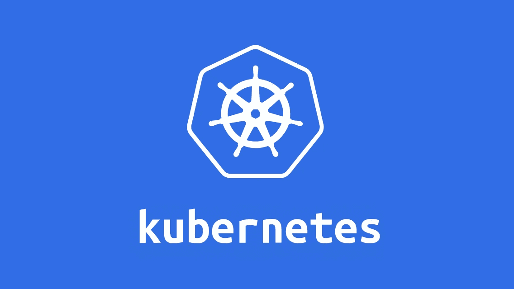

# 将一个简单的 Golang Web 应用程序部署到 Kubernetes

> 原文：<https://levelup.gitconnected.com/deploying-simple-golang-webapp-to-kubernetes-25dc1736dcc4>

## 第二部分:使用 YAML 配置进行部署



[之前](https://medium.com/@almas.hilman/simple-kubernetes-deployment-using-kops-273fc7990006)我们使用 kops 部署了一个 Kubernetes 集群。这次我将向您展示如何在 kubernetes 中部署一个非常简单的 web 应用程序。你可以在这里查看我用 Go [写的简单应用程序，或者你也可以使用你自己的应用程序图片。](https://github.com/lmnzr/simpleapp/tree/master/simpleapp)

基本上，我们在这里所做的只是为我们的集群制作一个 yaml 配置文件。还有另一种方法将应用程序部署到 Kubernetes 集群。例如，您可以使用 kubectl 命令。但是我个人推荐你使用 YAML 或者 JSON 格式的配置文件。我喜欢 YAML，因为我觉得它更容易阅读。您可以使用[这种](https://onlineyamltools.com/convert-yaml-to-json)工具将其中一种转换成另一种。

通过使用配置文件，您可以更好地维护您的基础设施。由于它是一个文件，您可以很容易地改进和修复您的配置。结合版本控制，您还可以轻松地检查配置中的更改。这也比在 kubectl 中添加许多命令行更方便。因此，您可以通过使用配置文件来构建更复杂的基础设施。

# 手在上面

我们开始吧。

## 命名空间

平时想有几个开发的环境。通常，我需要一个开发环境来托管开发代码，准备好发布代码并准备好进行内部测试，最后是生产环境来托管为公众/用户发布的代码。为了节省成本，我通常在同一个集群中创建开发和试运行环境，在另一个环境中创建生产环境。我发现在一个集群中分离开发和登台的最方便的方法是使用名称空间。名称空间用于分隔 Kubernetes 集群中的资源。

这是我用来在 Kubernetes 中定义名称空间的配置文件。

```
#namespaces.yamlapiVersion: v1
kind: Namespace
metadata:
  name: development
  labels:
    stage: development---apiVersion: v1
kind: Namespace
metadata:
  name: staging
  labels:
    stage: staging
```

## 部署(Pod 和副本集)

在 kubernetes 中，最小的可展开单元被称为 pod。我们的豆荚会消耗我们节点的资源。因此，每个节点只能托管它所能提供的资源。每个 pod 可以托管一个或多个应用程序容器，它们共享公共卷和网络。Docker 是应用程序容器的流行选择，我在这个例子中使用了它。

我们不能在同一个名称空间中部署完全相同的 pod。但是我们可以使用副本集来创建 pod 的副本。使用副本集，我们可以在集群中维护一个稳定的 pod 集。这有助于水平扩展我们的应用程序。我发现使用部署配置来管理 pod 和副本集很方便。下面是我的后端和前端应用程序的部署配置示例。

```
#backend-deployment.yamlapiVersion: apps/v1
kind: Deployment
metadata:
  name: backend-dpl
spec:
  replicas: 1
  selector:
    matchLabels:
      app: backend
  template:
    metadata:
      labels:
        app: backend
    spec:
      containers:
        - name: backend-container
          image: lmnzr/simplebackend:latest
          resources:
            limits:
              memory: "128Mi"
              cpu: "500m"
          ports:
            - containerPort: 8080---#frontend-deployment.yamlapiVersion: apps/v1
kind: Deployment
metadata:
  name: frontend-dpl
spec:
  replicas: 1
  selector:
    matchLabels:
      app: frontend
  template:
    metadata:
      labels:
        app: frontend
    spec:
      containers:
        - name: frontend-container
          image: lmnzr/simplefrontend:latest
          env:
            - name: BACKEND_URL
              value: "http://backend-svc:8080"
          resources:
            limits:
              memory: "128Mi"
              cpu: "500m"
          ports:
            - containerPort: 80
```

在上面的配置中，我设置了`spec-replicas : 1`这是我声明副本集的最大 pod 数量的方式。定义了`spec-template-spec-containers`部分来通知集群我们的 pod 的规范。在这里，我为每个 pod 使用一个容器，该容器使用 simplefrontend 或 simplebackend 映像。每个集装箱也有指定的港口和资源限制。

使用 kubectl 应用配置，

```
kubectl create -f backend-deployment.yaml --namespace development
kubectl create -f frontend-deployment.yaml --namespace development
```

检查是否一切正常，

```
kubectl get deployment --namespace development
kubectl get pods --namespace development
kubectl get rs --namespace development
```

您应该看到 pod 运行的副本数量与定义的一样多。

## 服务

我们已经在 pods 中启动并运行了我们的应用程序。现在你可能会问我们如何从互联网访问 pod 内部的应用程序，或者如何连接两个或更多的 pod。这就是服务的来源。Kubernetes 服务有四种类型:集群 IP、节点端口、负载平衡器和外部。默认服务类型是 ClusterIP，使用这种类型，您可以通过集群内部 IP 访问应用程序。NodePort 通过使用节点的 Ip 和发布应用程序的端口来提供对应用程序的访问。LoadBalancer 允许您使用云提供商的负载平衡器访问应用程序。External 允许您将服务映射到外部名称。

下面是一个关于我如何设置后端和前端服务的例子。

```
#backend-service.yamlapiVersion: v1
kind: Service
metadata:
  name: backend-svc
spec:
  ports:
    - port: 8080
      protocol: TCPselector:
    app: backend---
#frontend-service.yamlapiVersion: v1
kind: Service
metadata:
  name: frontend-svc
spec:
  type: NodePort
  ports:
    - port: 80
      protocol: TCP
  selector:
    app: frontend
```

对于后端服务，我使用默认类型 ClusterIP。如果您查看 frontend-deployment.yaml，您会发现我定义了一个名为 BACKEND_URL 的环境变量，它的值是指后端服务的名称。这要感谢 kubernetes 内部 DNS 服务。群集可以在服务器名称和它的群集 ip 之间进行映射。这样，我们的前端可以通过内部网络访问后端，后端不发布到互联网上。对于前端，因为我想从互联网上访问它，所以我使用 NodePort 类型。

使用 kubectl 应用配置，

```
kubectl create -f backend-service.yaml --namespace development
kubectl create -f frontend-service.yaml --namespace development
```

检查是否一切正常，

```
kubectl get svc --namespace development
```

检查节点端口和端口 ip 并尝试访问它，

```
kubectl describe service/frontend-svc --namespace developmentcurl $NODE_PORT:$NODE_IP
```

您应该看到应用程序已经启动并运行。


在这一部分中，我向您展示了在 kubernetes 集群中运行一个简单应用程序的基本步骤。[下一个](https://medium.com/@almas.hilman/make-your-own-helm-chart-590622a50c14)，我将向你展示如何使用舵图来部署相同的应用程序。有了 helm，将应用程序部署到 Kubernetes 集群变得更加容易，并且您可以为多个应用程序部署创建一个可重用的模板。

感谢您的阅读👋。