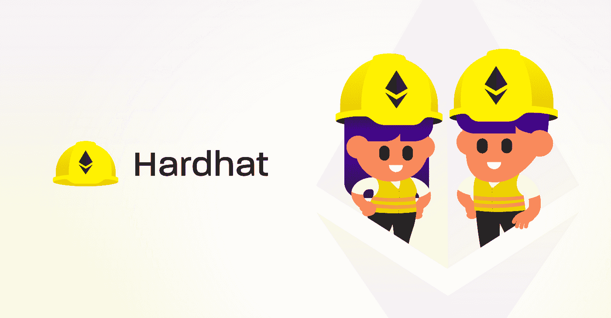
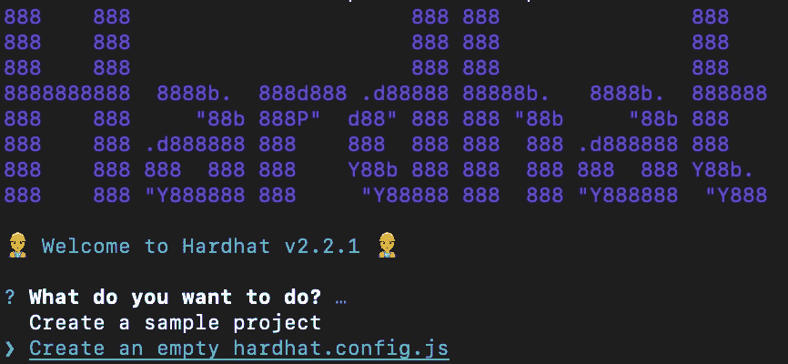

# 使用 Hardhat 部署智能合同

> 原文：<https://levelup.gitconnected.com/deploying-smart-contracts-with-hardhat-e1a76212df94>

## 循序渐进的指南。

我用[松露](https://www.trufflesuite.com/)建造了我的第一个以太坊(原型)dapp。它过去是，现在仍然是以太坊开发者的瑞士军刀。然而，最近，我尝试了 [Hardhat](https://hardhat.org/) 作为替代产品，并被其便利性所折服。



Hardhat 和 Truffle 都提供了编译、测试和部署 Solidity 智能合同的环境。哈德哈特在几个方面对松露进行了创新:

*   它依赖于“第二代”以太坊 JavaScript API 库 [ethers.js](https://docs.ethers.io/v5/) 。
*   它与 TypeScript(第二代 JavaScript)集成得很好？
*   它通过 Solidity 代码中的 *console.log* 功能提供了更好的调试体验。

您可以观看此[视频](https://www.youtube.com/watch?v=eR_9XSfF9p8)以获得更详细的概述。在本帖中，我们将重点介绍与哈德哈特签订的 ERC-20 合同。

# 设置

初始化你的项目并安装 Hardhat 作为一个依赖项。

```
$ npm init --yes
$ npm install --save-dev hardhat
```

运行`npx hardhat`，选择“创建一个空的 hardhat.config.js”。



将您的项目配置为准备好键入脚本。

```
$ npm install --save-dev ts-node typescript
$ npm install --save-dev chai @types/node @types/mocha @types/chai
$ mv hardhat.config.js hardhat.config.ts
```

安装一些节点包。

```
$ npm install --save-dev @nomiclabs/hardhat-waffle ethereum-waffle chai @nomiclabs/hardhat-ethers ethers @openzeppelin/contracts dotenv hardhat-deploy
```

> [Waffle](https://getwaffle.io/) 是一个测试智能合约的框架。OpenZeppelin 为我们的 ERC-20 合同提供了一个可靠的模板。`hardhat-deploy`是用于部署的插件。

# 配置

配置文件(`hardhat.config.ts`)是项目的核心。

您可以使用`npx hardhat deploy --network <name>`部署到在`networks`键下配置的任何网络。

每个网络取一个`url`对应一个区块链节点。在上面的例子中，我们依靠 [Infura](https://infura.io/) 与以太坊区块链互动，这需要你注册并获得一个`INFURA_PROJECT_ID`。

`chainId`是一个额外的安全措施，确保交易只在预定的网络上有效。你可以在这里找到 EVM 兼容区块链[的完整链 id 列表。](https://chainid.network/)

最后，您需要定义将签署您的部署交易并支付汽油费的帐户。这是在`accounts`数组中配置的，在这里放置您的私钥。

如果您使用元掩码，您可以按照这些[步骤](https://metamask.zendesk.com/hc/en-us/articles/360015289632-How-to-Export-an-Account-Private-Key)导出您的私钥。如果您在 testnet 上部署，您可以使用水龙头向您的 testnet ETH 帐户提供资金。关于 Kovan 测试网，请参见此处的[和](https://faucet.kovan.network/)。

# 合同

为了简单起见，我们将从 Open Zeppelin 导入一个 Solidity 契约。在新文件夹`contracts`下创建一个名为`ERC20.sol`的文件。ERC20 合同在部署时将接受两个参数:`name`和`symbol`。

# 部署脚本

为了部署我们的合同，我们将利用`hardhat-deploy`插件。它允许我们执行和跟踪部署，以及一系列[功能](https://github.com/wighawag/hardhat-deploy)。

我们的第一个部署脚本放在`deploy`文件夹中，如下所示:

`deployer`常量是运行中的`namedAccounts`特性。它允许您根据在`hardhat.config.js`中给定网络的`accounts`数组中的索引，将自定义名称与地址相关联

因此，在我们的例子中，将`deployer`设置为零允许我们使用`const { deployer } = await getNamedAccounts()`访问私有密钥。

否则，`args`必须按照智能合同期望的顺序，并且`tags`可以用于[识别或分组合同](https://github.com/wighawag/hardhat-deploy#deploy-scripts-tags-and-dependencies)进行部署。

# 部署🚀

现在，我们可以用下面的命令来编译我们的契约:

```
$ npx hardhat deploy --network kovan --tags ERC20
```

部署将被记录在给定网络下的`deployments`文件夹中——在本例中为`deployments/kovan`。这个记录将包含合同的*地址*，以及其 EVM 字节码。

好了，我们已经完成了安全帽的部署。

作为最后一个亮点，你可以使用任何 EVM 兼容链的安全帽。例如，要在币安智能链上部署，只需在您的配置文件中添加它，如下所示:

我希望这个指南对你有用——你可以在这里找到完整的回购协议。

快乐编码🚀 🚀 🚀