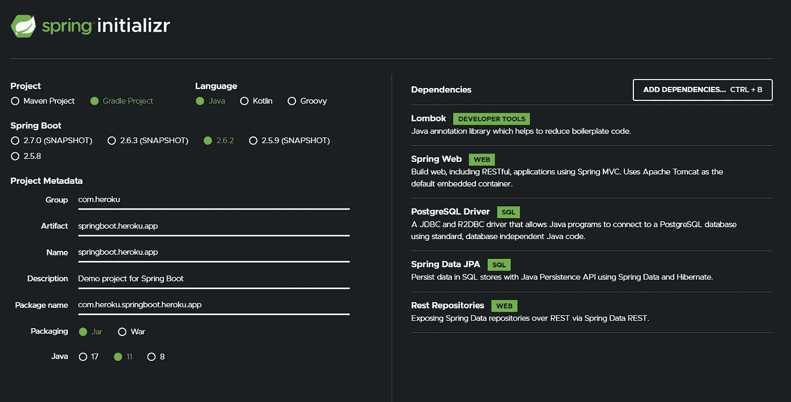
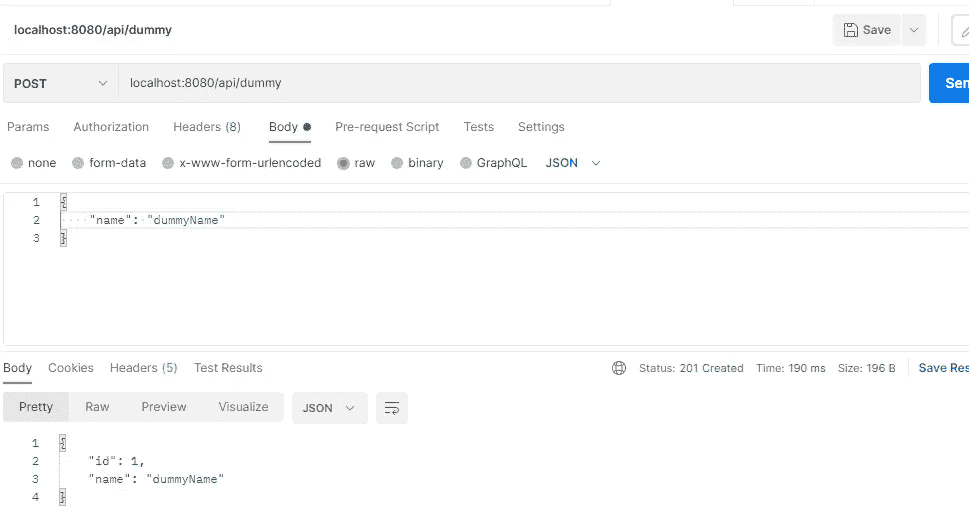
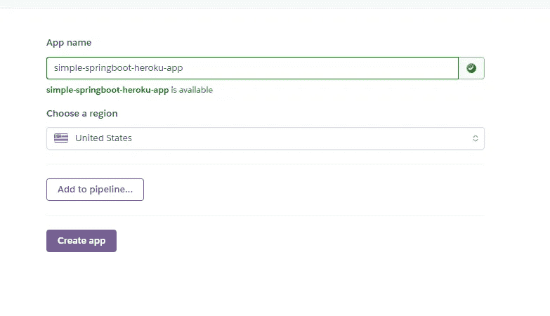
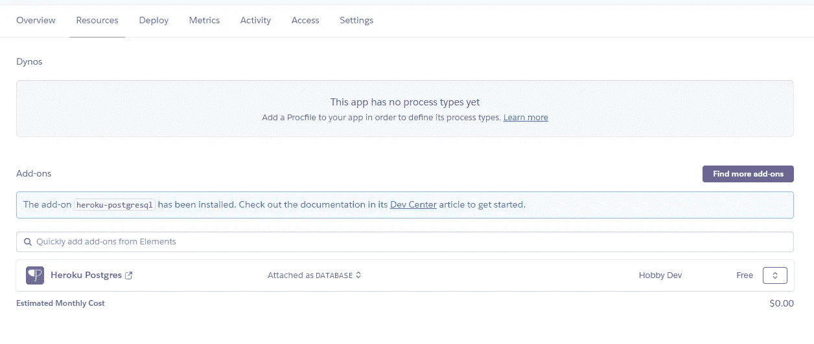
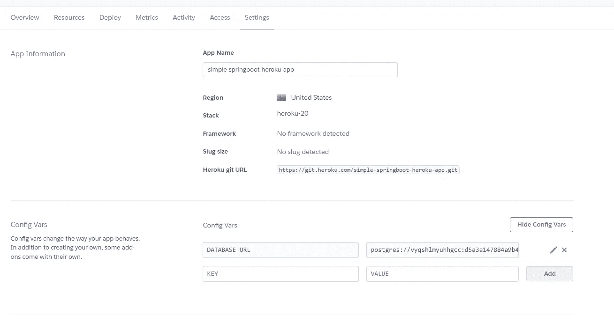
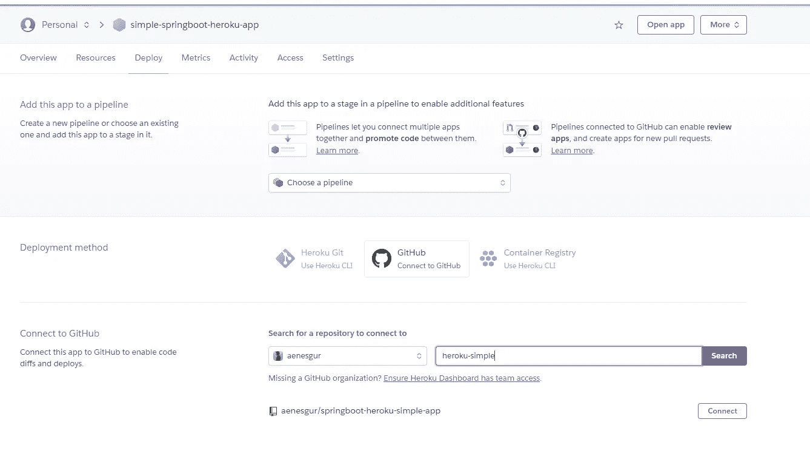
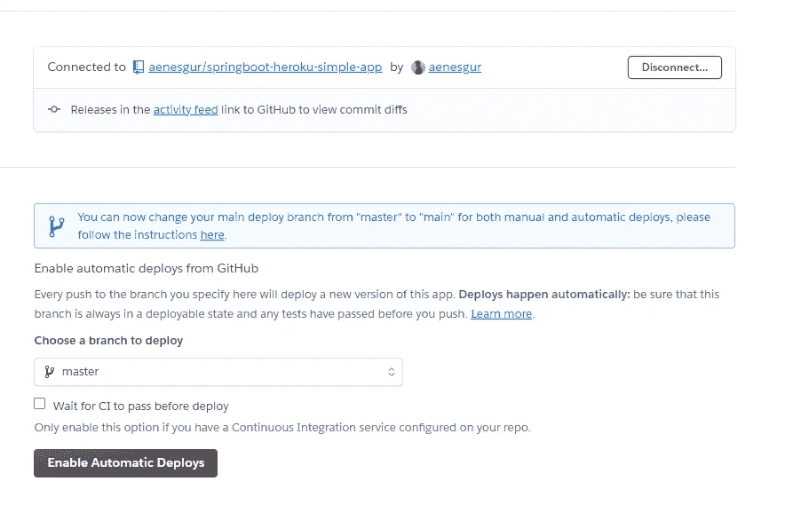
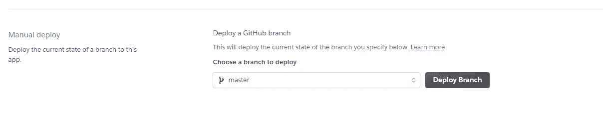
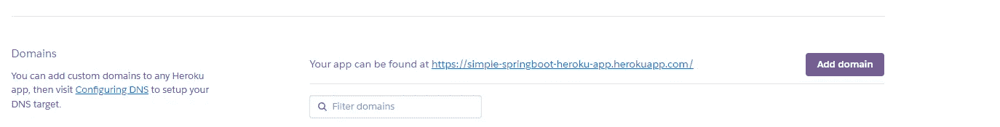
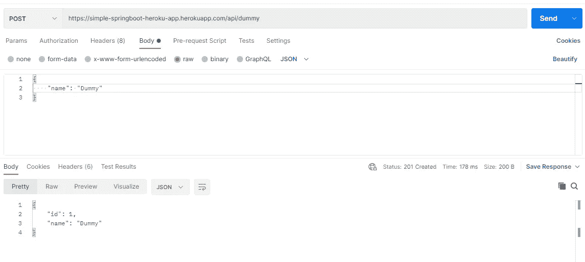

# 使用 PostgreSql 将 Spring Boot 应用程序部署到 Heroku

> 原文：<https://levelup.gitconnected.com/deploying-spring-boot-application-to-heroku-with-postgresql-dc94f193464c>

在本文中，我将讨论如何轻松地将连接到 PostgreSql 的 Spring Boot 应用程序部署到 Heroku。

# **单纯的 Heroku**

Heroku 是一家云计算应用基础设施服务提供商。它是一个平台，允许您快速部署以 Node.js、Ruby、Python、Java、PHP、Go、Scala、Clojure 等语言部署的基于 web 的应用程序，并且不需要技术服务器设置知识。

# **创建应用**

将有一个应用程序使用 Http Post 类型 REST 服务将记录保存到 PostgreSql。

通过 Spring Initializr，我们创建了一个使用以下依赖项和设置的应用程序，然后在 IDE 中打开这个应用程序。

因为应用程序在本地环境和 Heroku 环境中有不同的设置，所以我添加了一个名为 application-default.properties 的文件，并将其定义如下。

为了让应用程序动态地读取属性文件，我将应用程序类设置如下。

然后，我简单地添加了在**实体、控制器、服务**和**存储库**模块下执行必要操作的类。为了不使文章太长，我在这里不包括它们，你可以从文章末尾的 GitHub 链接看一下这个项目。

我通过 postman 在本地环境中测试了该应用程序，并获得了成功的结果。

应用程序现在可以部署到 Heroku 了。

首先，我们向应用程序添加一个名为 **app.json** 的文件。

> app.json 是描述 web 应用的清单格式。它声明了在 Heroku 上运行应用程序所需的环境变量、附加组件和其他信息。

我们如下创建 app.json 文件。

将应用程序部署到 Heroku 环境后，我们创建 application-prod.properties 文件来设置不同的配置并添加以下内容。

*spring . data source . URL = DATABASE _ URL，＄{ DATABASE _ URL }字段中的*将作为 heroku 环境中的值给出

然后，通过在 Gradle 选项卡中说 buildJar，我们在应用程序文件夹的构建路径中创建一个名为 libs 的文件，并在那里添加应用程序的 Jar。

现在我们将 **Procfile** 文件添加到应用程序中。

使用 Procfile 文件，我们可以显示应用程序的目标 jar 文件，并根据 heroku 环境的 application-prod.properties 配置创建它。

Procfile 文件设置如下。

最后，我们在应用程序路径上创建一个名为 **system.properties** 的文件，并在那里指定我们的 java 版本。

因为我们将通过 GitHub 将我们的应用程序部署到 Heroku 环境，所以我们将应用程序推送到 GitHub。

我们在 [Heroku](https://www.heroku.com/home) 免费注册应用程序，并继续使用免费部署方法。

一个像下面这样的仪表板屏幕将会向你问候，因为我有旧的项目，仪表板区域已经满了。

我们继续按下“New”按钮，然后选择“Create new app”。

我们继续从下面的屏幕中给我们的应用程序一个唯一的名称。

然后我们转到 Resources 选项卡，选择 Heroku Postgres 并将其添加到我们的应用程序中。

当我们转到 Settings 选项卡并查看配置时，我们看到刚刚在 Heroku 环境中创建的 PostgreSql 数据库的连接字符串被添加到 DATABASE_URL 键中。

现在，我们将转到 Deploy 选项卡，进行部署设置。通过点击 Connect to GitHub 选项，我们表明我们将通过 GitHub 部署应用程序。将 Heroku 与 GitHub 配对后，我们选择我们的回购如下。

如果我们希望在主分支中进行的每个更改中都自动部署，我们必须按下 Enable Automatic deployments 按钮。

如果我们希望在主分支中进行的每个更改中都自动部署，我们必须按下 Enable Automatic deployments 按钮。

部署完成后，我们从 Settings 选项卡中获取应用程序的 url，并通过 Postman 发送请求。

我们看到我们的虚拟记录已成功添加。

# **结论**

在本文中，我们看到了如何轻松地将 Spring Boot 应用程序部署到 Heroku 环境中，如何将 PostgreSql 添加到 Heroku 环境中并将其连接到应用程序。

你可以在这里找到应用程序[的源代码](https://github.com/aenesgur/springboot-heroku-simple-app)。

下一篇文章再见。