# 使用 Lets Encrypt 将支持 SSL 的应用程序部署到 AWS

> 原文：<https://levelup.gitconnected.com/deploying-ssl-enabled-react-angular-vue-applications-to-aws-using-lets-encrypt-a7aff5a417ee>

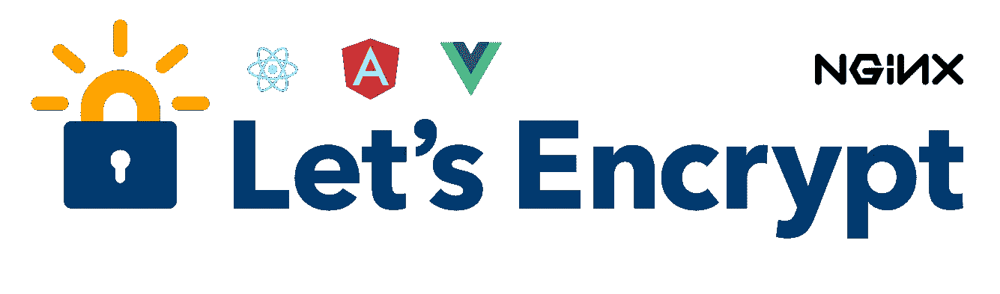

在上一篇文章的[中，我们看到了如何使用`nginx`和`docker`部署一个简单的 React(或任何 UI)应用程序。在本文中，我们将更进一步，使用加密为我们的域生成一个 SSL 证书，然后将`dockerized`应用程序部署到](/deploying-your-ui-applications-using-docker-and-nginx-b65ffa8f744e) [AWS](http://aws.amazon.com/) 。为此，我们将从 [GoDaddy](http://godaddy.com/) 购买、配置和设置一个自定义域名，然后使用[提供的 SSL 证书部署我们的应用程序，让我们加密](https://letsencrypt.org/)。

那确实是满嘴的。在继续之前，我们将把它分解成易于实施和理解的小步骤。我绝不是 DNS 和 SSL/TLS 加密领域的专家，所以在我们浏览这些步骤时，我会提供额外的材料。

# 先决条件

1.  对 AWS 的基本了解
2.  极好的账目
3.  机器上安装的 Docker

# 目录

1.  构建我们的静态网站
2.  在 GoDaddy 上购买域名
3.  在 AWS 上创建托管区域
4.  更新 GoDaddy 名称服务器
5.  运行让我们加密 docker 图像
6.  正在执行 DNS 质询
7.  配置 NGINX
8.  创建 Dockerfile 文件
9.  使用`docker-machine`推送图像
10.  更新托管区域上的`A`记录

尽管这些步骤看起来令人望而生畏。不要担心，它们很容易理解，你自己就可以完成。让我们开始吧。

**注意:**本文的主要目标是生成 SSL 证书并使用它。使用 docker-machine 将应用程序部署到 AWS 只是几个选项之一。部署静态应用程序可能有更合适和更受欢迎的方式(比如使用 cloudfront urls 的 S3 桶)。本文并不涵盖部署的最佳方式，而只是其中一种可能性。

## 步骤 1:构建我们的静态网站

因为这不是我们试图实现的关键步骤，我们可以跳过这一步，创建一个精益应用程序。我们可以使用`create-react-app`来创建这个示例应用程序。

```
create-react-app kashyapappcd kashyapappyarn start
```

创建应用程序后，我们只需将所有锅炉板代码替换为我们的占位符版本，如下所示:

就是这样。在这一点上，我们不太关心应用程序的样式，所以当我们有更多信息时，我们可以重新访问它。

## 第二步:在 GoDaddy 上购买域名

从技术上讲，我们可以从任何一家[域名注册商](https://en.wikipedia.org/wiki/Domain_name_registrar)那里购买域名。在这种情况下，我们将通过 [GoDaddy](https://www.godaddy.com/domains/domain-name-search) 购买我们的域名。

一旦我们搜索并购买了我们选择的域，我们需要通过进入 DNS 设置(也可以从主菜单中的管理域选项访问)来编辑该域的 DNS 配置。在所有可用的设置中，我们现在只关心域名服务器。

名称服务器是一种反向地址查找，当用户请求一个网站时，浏览器会执行该操作。当我们在浏览器中请求`kashyap.app`时，浏览器首先使用 DNS 检索与域名相关的当前域名服务器，然后向浏览器提供`A`记录，即我们网站的 IP 地址。然后，浏览器能够与我们的服务器通信，并加载我们请求的信息。

回到 GoDaddy 仪表板，我们转到所有域名的列表，然后选择选项来编辑我们选择的域名的 DNS 设置。导航到编辑屏幕后，我们将看到的选项之一是域名服务器，它当前正在处理到我们域的网络路由。它看起来类似于我们下面看到的:

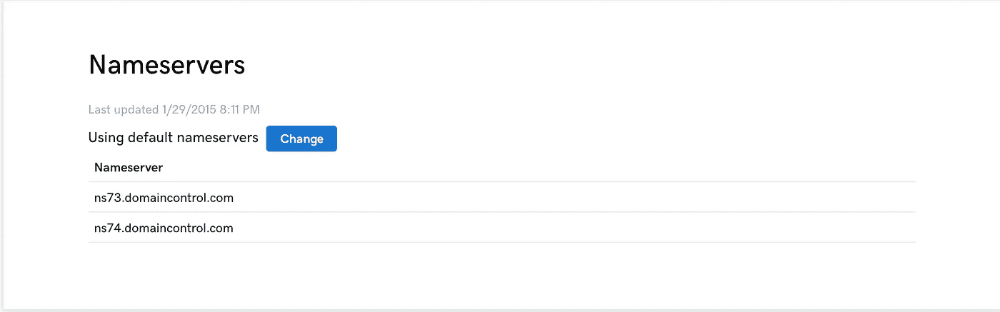

接下来，我们想把域名服务器解析交给 AWS，这样我们就可以在一个地方管理所有的东西，而不是把服务器放在 AWS 上，把域配置放在 GoDaddy 上。如果我们希望自动化我们的整个工作流程，这也是有帮助的。但是，可能有更好的自动化替代方案，例如使用 Docker Swarm 或 [Kubernetes](https://kubernetes.io/) 的集群部署。

为了完成到 AWS 的 DNS 切换，我们首先需要设置 AWS，特别是他们的名为 Route 53 的 DNS web 服务。

## 步骤 3:在 AWS 上创建托管区域

顾名思义，我们将在由 AWS 提供的 DNS web 服务`Route 53`中创建一个`hosted zone`。要创建托管区域，我们需要知道域名(我们已经在步骤 2 中购买了该域名)。要添加托管区域，请按照以下步骤操作。

导航至 AWS > Route 53 >托管区域>创建托管区域

这将打开`Create Hosted Zone`侧面板，我们需要在上面输入域名。将其余部分保留为默认值，然后单击 create。

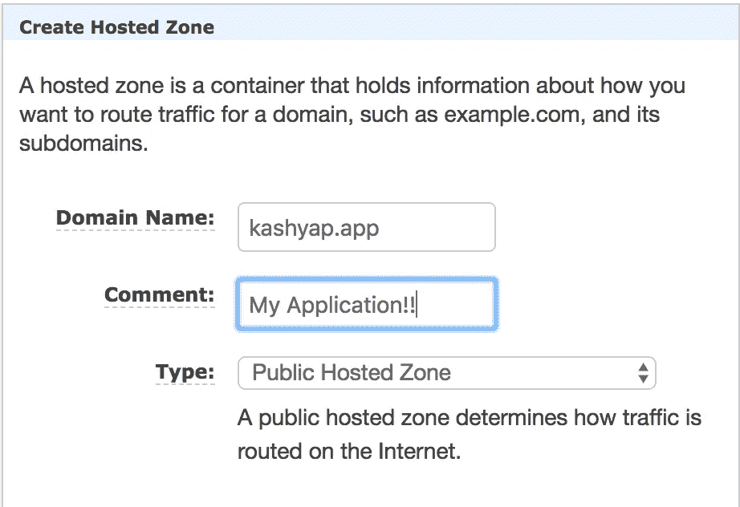

在选择新创建的托管区域时，我们可以看到在托管区域下创建的各种记录，例如授权中心(SOA)和名称服务器(NS)。目前，我们只关注 NS 记录。

## 步骤 4:更新 GoDaddy 名称服务器

创建托管区域后，单击托管区域的名称以查看分配给该域的名称服务器(NS)值。

此时我们只关心`NS`值，通常是 2–4 个，如下所示。把它们抄下来，然后去 GoDaddy。

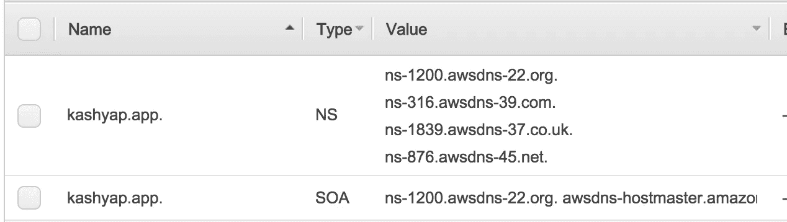

在 GoDaddy 上，像我们之前一样导航到 DNS 设置页面，这次在名称服务器部分下，单击编辑并从下拉列表中选择`Custom`以输入我们新的 AWS 托管区域的 NS 值。

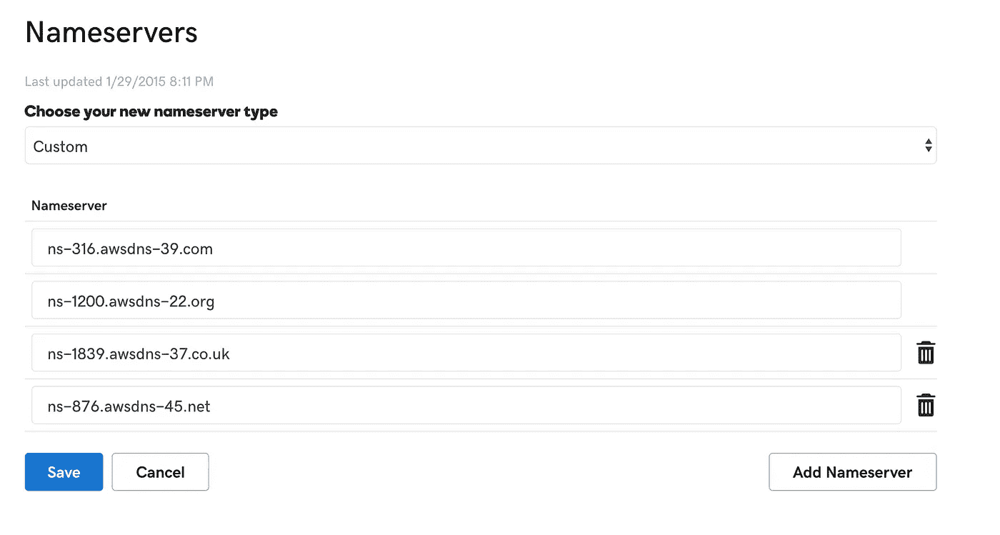

一旦我们保存了更改，需要一些时间将更改在互联网上传播，但一旦传播，GoDaddy 将通知我们他们不再维护我们的域名 DNS 记录:

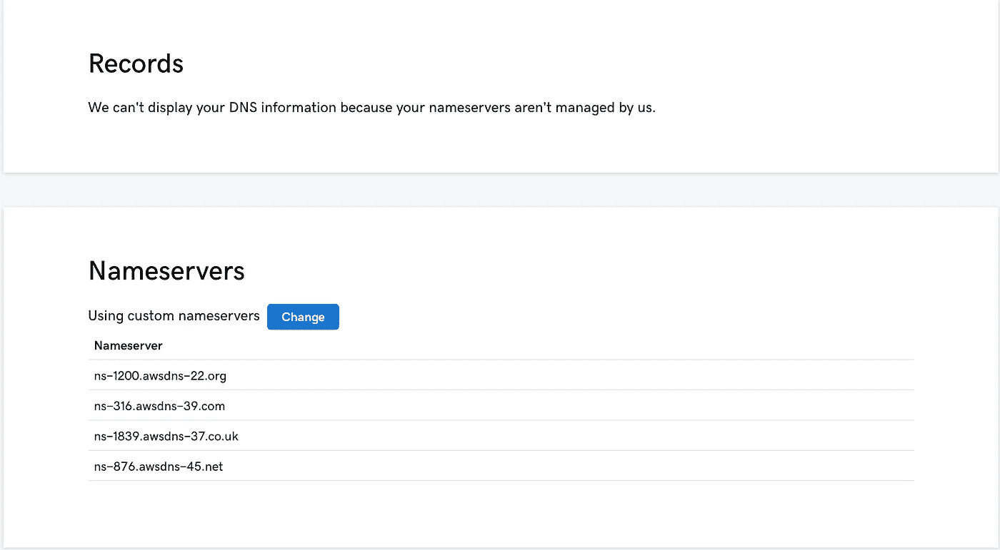

仅此而已。我们已经成功地在 GoDaddy 上购买了一个域名，并将其转移到 AWS Route 53。接下来，我们为我们的域名创建一个 SSL 证书。

## 步骤 5:运行加密 docker 映像

这里有一个简短的总结，它很好地解释了[让我们加密](https://letsencrypt.org/getting-started/)是关于什么的，而不涉及证书和证书颁发机构的太多细节:

> 若要在您的网站上启用 HTTPS，您需要从证书颁发机构(CA)获取证书(一种文件)。让我们加密一个 CA。为了从“让我们加密”网站获得您网站的域证书，您必须展示对该域的控制

Let's Encrypt 提供了一个名为`certbot`的客户端，可以用来自动生成和更新 SSL 证书。为了维护对该域的控制，`certbot`执行一个挑战，在这个挑战中，它与我们的 DNS 进行通信，并期待某个结果。根据执行的挑战类型，结果会有所不同。在我们的例子中，我们将采用`dns-01`挑战，它期望在 DNS 上出现某个 TXT 记录。

为了生成这个 TXT 记录，我们需要提供证据，我们可以在本地安装`cerbot`客户端，然后在我们的机器上运行[命令](https://certbot.eff.org/docs/intro.html#how-to-run-the-client)，或者为`cerbot`运行`docker`映像，这使得事情变得更简单，跨平台兼容，并允许我们潜在地自动化这个过程。在运行`certbot`映像时，它请求一些关于我们试图为其生成 SSL 证书的域的信息。这些信息可以在提示符下输入，也可以通过传递到容器中的标志和选项自动输入。下面是一个合并了所有选项并设置了一些逻辑默认值的脚本。确保了解他们的[费率限制](https://letsencrypt.org/docs/rate-limits/)，以防你打算批量使用。

## 步骤 6:执行 DNS 质询

在我们项目的根文件夹中运行上一步中的 bash 脚本，将首先下载`certbot` docker 映像，然后为我们提供必要的信息，作为 DNS 挑战的一部分添加到 DNS 记录中。

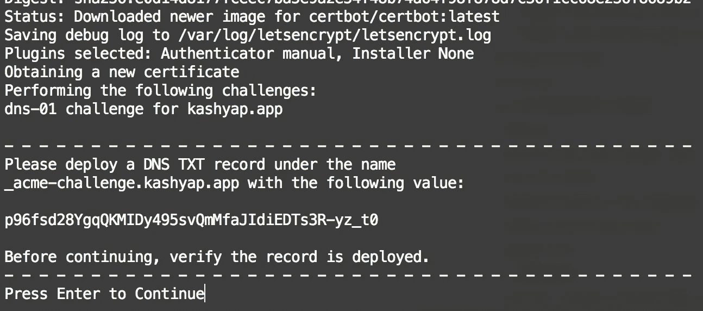

在上面，我们被要求输入所提供的值，作为我们域的 Route 53 托管区域上的一个`_acme-challenge` TXT 记录。

要输入 TXT 记录，我们必须返回到 Route 53 上的应用程序的托管区域，并使用如下所示的值创建一个新的记录集。

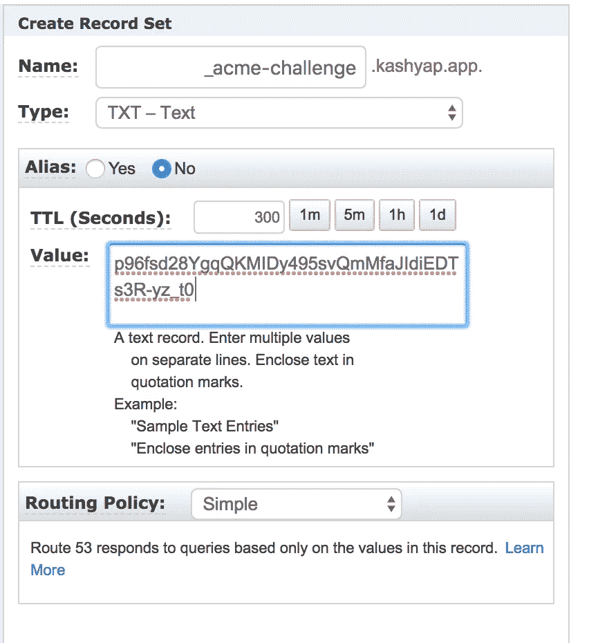

保存后，等待几秒钟(有时是几分钟)以传播更改，然后按下终端上的`enter`。然后,`certbot`客户端将执行`dns`挑战并验证我们的域名所有权。

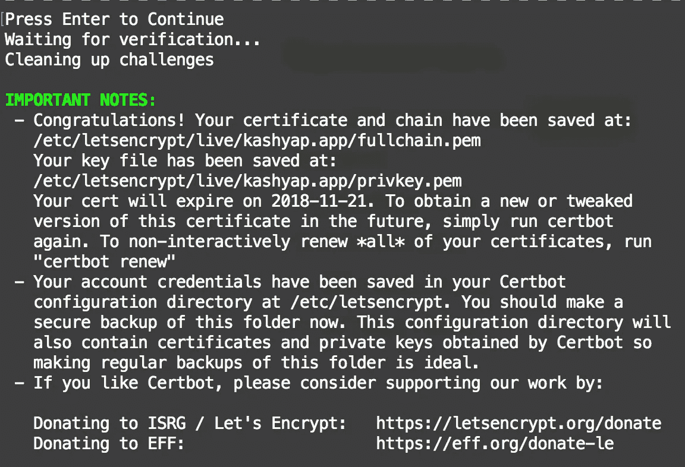

由于我们将卷挂载到`certbot`容器的方式，生成的证书现在可以在我们的项目根文件夹的`letsencrypt`文件夹中获得。

由我们来决定是否希望在每次部署时都运行 ssl 生成脚本，或者是否希望只手动运行一次来刷新我们的证书。标志`--keep-until-expiring`将确保新证书仅在旧证书到期时生成。

## 步骤 7:配置 NGINX

一旦生成了证书，我们需要将证书提供给我们的 web 服务器。由于我们只有一个静态网站要部署，我们将使用 NGINX 服务器来提供我们的文件。而且，因为我们想要使用新生成的 SSL 证书，所以我们必须创建 nginx 配置来包含该证书。

上面，我们有一个非常简单的`nginx`配置文件，它在两个端口 80 和 443 上为应用程序服务，分别用于 http 和 https。如果有人试图通过`http`协议访问应用程序，它将被重定向到第一个服务器块中的 301 重定向所定义的`https`。

现在我们的 nginx 配置已经准备好了，我们可以创建我们的`docker`映像来打包我们可发布的应用程序。请注意，我们正在为`/etc/letsencrypt/`文件夹中的`ssl_certificate`和`ssl_certificate_key`提供服务。我们必须确保在为我们的应用程序生成 docker 映像时，将我们的证书放在这个文件夹中。

## 步骤 8:创建 Dockerfile

Dockerfile 现在负责提取`nginx`图像，为我们的源代码复制`build/`文件夹，将证书复制到`nginx`，最后复制我们上面创建的定制`nginx`配置。

我们可以使用`npm run build`命令为 React 应用程序生成构建文件夹。这样一来，我们的`Dockerfile`将显示如下:

需要注意的最重要的事情是，我们将证书复制到我们试图在`nginx.config` 文件中读取它的相同位置。

## 第九步:使用`docker-machine`推送图像

创建 docker 文件后，我们现在可以用它来构建一个图像，并在我们希望的任何地方将它作为容器运行。当然，在这种情况下，我们不能在本地这样做，因为我们的 nginx 配置是用前面步骤中为我们的域生成的证书来设置的。相反，我们将上传图像并在 AWS EC2 实例上运行，该实例是由 AWS EC2 服务提供的*nix 系统。

下面是一个最小的 bash 脚本，它创建一个默认的(T2 微)EC2 实例，并在该实例上打开端口 80 和 443。我们还需要提供我们的 AWS 凭证作为`key`和`secret`。在本例中，我创建了一个具有编程访问权限的新用户，并从 AWS IAM 服务下载了密钥和秘密。此外，为了访问 EC2 服务，我将`AmazonEC2FullAccess`权限分配给我创建的用户。

运行上面的脚本需要几分钟，因为 EC2 启动需要一些时间。此外，由于我们每次构建图像并将其部署到新的 EC2 实例的方式，图像的层不会被缓存，而是在每次执行该脚本时重新下载。

> 不要将此作为您的生产策略。这只是暂时使事情变得容易的一个临时的旁路。

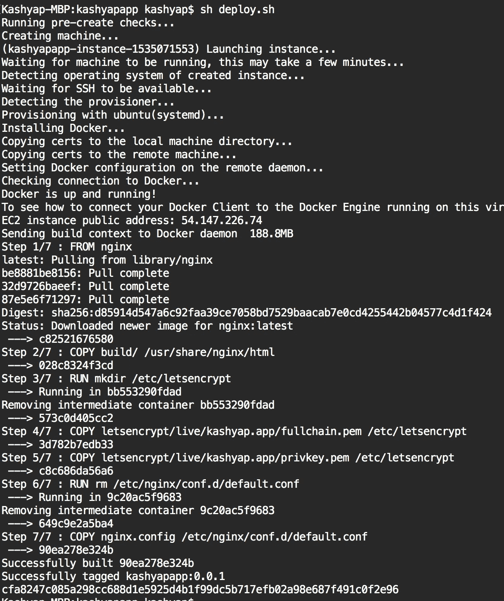

## **步骤 10:更新托管区域**上的 `**A**` **记录**

在上面的 bash 脚本中，我们还记录了刚刚创建的 EC2 实例的公共 IP 地址。剩下要做的就是复制实例的 IP 地址，并在我们的托管区域上提供它作为`A`记录。

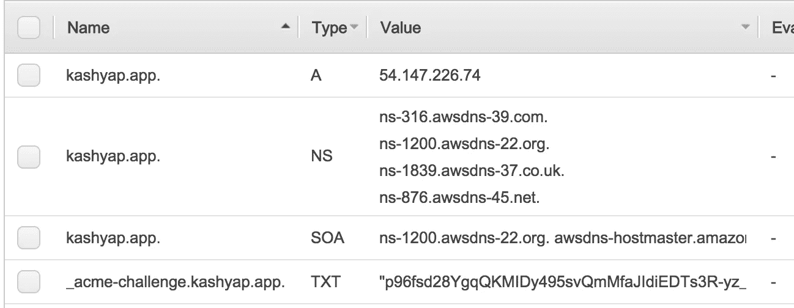

几秒钟后，我们的应用程序或本例中的 [https://kashyap.app](https://kashyap.app/) 应该启动并运行。

# 结论

创建 SSL 证书应该是一个免费且简单的过程。在这篇文章中，我希望已经提供了实现这个目标所必需的清晰性，感谢让我们加密。请留下评论来提供您的反馈或点击拍手

*如果你喜欢这个博客，一定要为它鼓掌，* [*阅读更多*](https://medium.com/@kashyap.mukkamala) *或者关注我的*[*LinkedIn*](https://www.linkedin.com/in/kashyap-mukkamala/)*。*

[](https://levelup.gitconnected.com/?utm_source=bottom-banner)[](https://gitconnected.com/learn/docker) [## 学习 Docker -最佳 Docker 教程(2019) | gitconnected

### 31 大 Docker 教程。课程由开发者提交和投票，使你能够找到最好的 Docker…

gitconnected.com](https://gitconnected.com/learn/docker) [](https://gitconnected.com/learn/nginx) [## 学习 Nginx -最佳 Nginx 教程(2019) | gitconnected

### 6 大 Nginx 教程。课程由开发者提交并投票，让你找到最好的 Nginx…

gitconnected.com](https://gitconnected.com/learn/nginx)