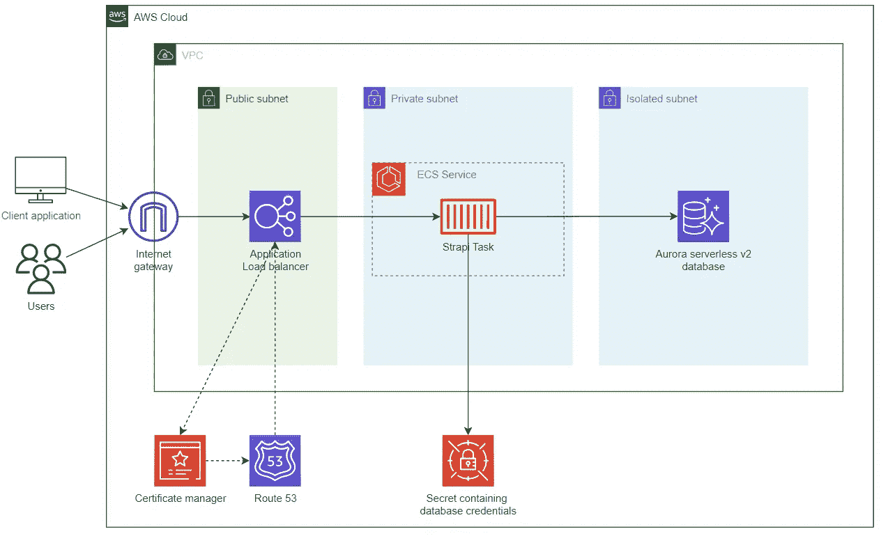
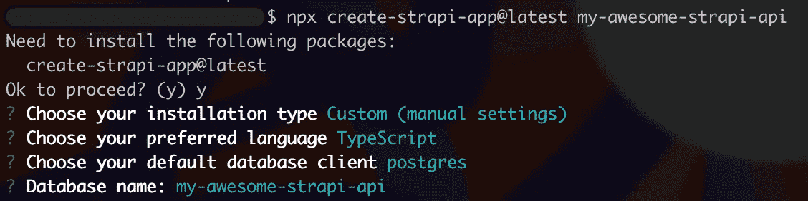
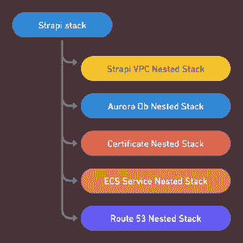
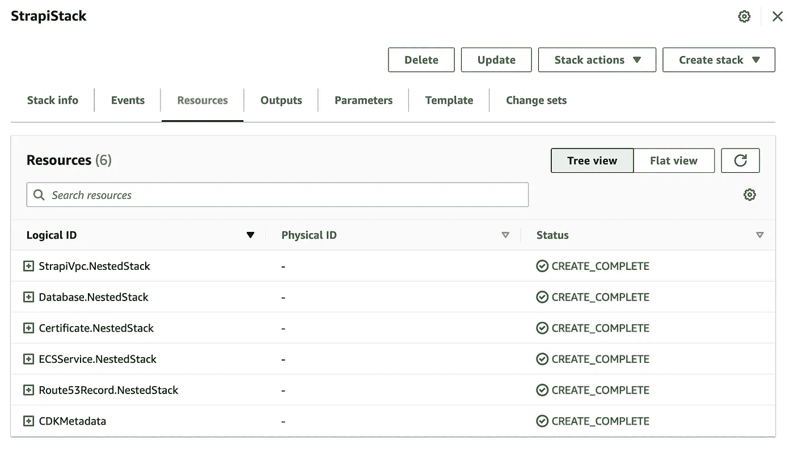
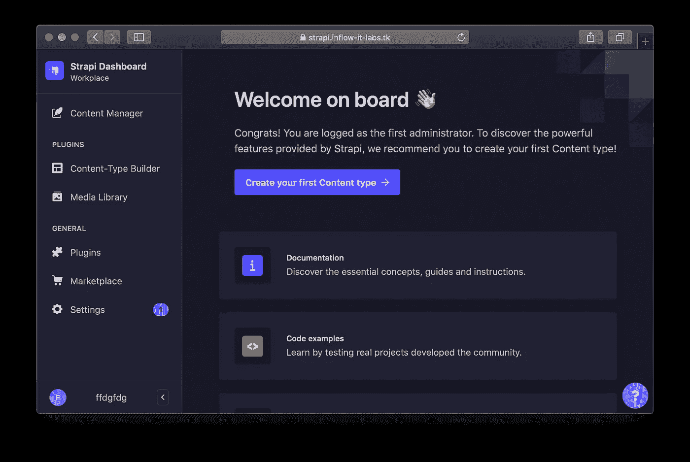

# 在 AWS 上部署 Strapi CMS，在 Fargate、Aurora 无服务器 v2 和 CDK 上部署 ECS

> 原文：<https://levelup.gitconnected.com/deploying-strapi-cms-on-aws-with-ecs-on-fargate-aurora-serverless-v2-and-cdk-3c9b9ec732a3>

我是一个狂热的 T4 Strapi 用户已经有一段时间了。Strapi 是一个开源的 node.js headless CMS，它帮助您以一种简单的方式用其管理 UI 搭建 api，并让您使用 REST APIs 或 GraphQL 管理内容。

AWS 上部署的官方 Strapi [文档](https://docs.strapi.io/developer-docs/latest/setup-deployment-guides/deployment/hosting-guides/amazon-aws.html)有助于快速入门，但不适合可重复和可伸缩的部署。

在本文中，我将向您展示如何使用 CDK 在 AWS 上使用无服务器组件部署 Strapi 项目:我们将在 Fargate 上的 ECS 上部署 Strapi 以及 Postgres Aurora 无服务器 V2 数据库。


## TL；速度三角形定位法(dead reckoning)

你可以在这里找到完整的 repo 和完整的 Github actions 工作流程

👉[https://github.com/ziedbentahar/strapi-on-aws-with-cdk](https://github.com/ziedbentahar/strapi-on-aws-with-cdk)

# 1 —架构概述

下面是我们将在 AWS 客户上部署的组件的体系结构图:



Strapi 部署在 Fragate 上的 ECS 上，使用 Aurora 无服务器 V2 作为数据库

在本例中，我们创建了一个专用的 VPC，但是如果您想在您自己现有的 VPC 上部署 Strapi，则不需要这样做。

我们有三个子网:

*   一个公共的，部署应用程序负载平衡器的地方
*   部署 ECS 群集的专用子网。在这个集群中，我们定义了由 Strapi 任务组成的 ECS 服务。
*   隔离子网:数据库的子网:它不会将流量路由到互联网；它不需要 NAT 网关。

我们还创建了一个 Aurora V2 无服务器 PostgreSQL 数据库以及一个包含数据库凭证的秘密。然后，这个秘密被安全地注入到 Strapi 容器中。

# 2 —设置 Strapi

在定义基础设施之前，让我们首先创建一个样本 Strapi 项目。直接根据文档，创建一个新的 Strapi 项目轻而易举:

```
npx create-strapi-app@latest my-awesome-strapi-api
```

在这一步，让我们确保选择`postgres`作为 dbclient，选择`typescript` 作为首选语言。



## **数据库配置**

`[config/database.ts](https://github.com/ziedbentahar/strapi-on-aws-with-cdk/blob/main/cms/config/database.ts)`文件定义了连接数据库所需的配置。它期望定义这些`DATABASE_*` 环境变量:

```
export default ({ env }) => ({
  connection: {
    client: "postgres",
    connection: {
      host: env("DATABASE_HOST"),
      port: env.int("DATABASE_PORT"),
      database: env("DATABASE_NAME"),
      user: env("DATABASE_USERNAME"),
      password: env("DATABASE_PASSWORD"),
      ssl: env.bool("DATABASE_SSL"),
    },
  },
});
```

我们将配置 ECS 任务定义，从一个秘密中检索数据库密码[，而不是直接将其作为明文环境变量注入。这样，AWS 管理控制台和任何有权访问 ECS 任务定义的人都无法发现它。](https://docs.aws.amazon.com/AmazonECS/latest/developerguide/specifying-sensitive-data-tutorial.html)

ECS 容器代理将通过引用秘密安全地将`DATABASE_PASSWORD` env 变量注入到 Strapi 容器中。

我将在下面描述如何使用 CDK 在 ESC 任务定义上安全地注入秘密。

## **创建 Dockerfile 文件**

需要一个定义容器的 Dockerfile 文件来部署到 ECS 集群中。在这个例子中，我将使用 Strapi 提供的官方 Dockerfile 文件，你可以在[这个链接](https://docs.strapi.io/developer-docs/latest/setup-deployment-guides/installation/docker.html#production-environments)中找到它

为了在构建映像时忽略这些文件夹，还需要一个`.dockerignore`文件。

```
node_modules/
.tmp/
.cache/
.git/
build/ 
```

# **3 —用 CDK 编码基础设施**

让我们首先初始化 CDK 项目。它将位于与 Strapi 项目相同的 git repo 和父文件夹中:

```
mkdir my-awesome-strapi-project-infra \
 && cd my-awesome-strapi-project-infra \
 && npx aws-cdk init app --l typescript
```

为了使我们的 CDK 项目组织良好，我们的基础设施的每个组件都将被定义为 Strapi 根堆栈的嵌套堆栈:



在这个新搭建的项目上，创建堆栈时，我们需要将`account`和`region`分别设置为`CDK_DEFAULT_ACCOUNT`和`CDK_DEFAULT_REGION`环境变量。这可确保堆栈部署在 AWS CDK CLI 在合成时确定的客户和区域中:

[bin/my-awesome-strapi-project-infra . ts](https://github.com/ziedbentahar/strapi-on-aws-with-cdk/blob/main/infrastructure/bin/my-awesome-strapi.ts)文件内容

## **创建数据库**

如上图所示，数据库将部署在隔离的子网上。创建一个安全组，以允许流量从专用子网(ECS 群集所在的子网)流向数据库。

还创建了一个包含数据库凭证(用户名和密码)的密码:它将在定义 Aurora 数据库凭证时使用，并将传递给 ECS 任务，以便安全地注入到容器中:

Aurora 无服务器 V2 配置

☝️ **注意**在这个例子中，我们使用 Aurora 无服务器 V2，它具有最小的扩展配置和一个实例。根据您的使用情况，您可能想要定义不同的配置。Aurora 无服务器 V2 允许的最小容量为 0.5 ACU。

你可以在[这个链接](https://github.com/ziedbentahar/strapi-on-aws-with-cdk/blob/main/infrastructure/lib/database.ts)后面找到数据库嵌套栈定义。

## **创建证书**

要使用 TLS 保护应用程序，需要在 AWS 证书管理器中为自定义 Strapi 域创建一个证书。它将与我们部署在同一个地区。该证书将与公共负载平衡器相关联:

作为先决条件，必须已经创建了托管区域。我们使用`HostedZone.fromLookup`按名称检索托管区域信息。

[该链接](https://github.com/ziedbentahar/strapi-on-aws-with-cdk/blob/main/infrastructure/lib/certificate.ts)提供了证书嵌套栈定义。

## **定义 ECS 部署**

我们使用这个 CDK [L3 解决方案构造](https://docs.aws.amazon.com/cdk/v2/guide/constructs.html) `[ApplicationLoadBalancedFargateService](https://docs.aws.amazon.com/cdk/api/v2/docs/aws-cdk-lib.aws_ecs_patterns.ApplicationLoadBalancedFargateService.html)`:顾名思义，这个构造表示一个解决方案，包括一个 AWS Fargate 容器服务，该服务通过一个公共应用程序负载平衡器公开(默认)。

让我们分解一下 Fargate 服务的定义:

*   在`taskImageOptions`属性上，我们用`ContainerImage.FromAsset`来定义`image`。这个 CDK 内置助手从提供的目录中自动构建映像，并将其自动推送到 ECR。
*   如上所述，一些值需要被定义为 Strapi 容器中的环境变量:我们将创建包含`DATABASE_PASSWORD`的值以及这些标记`JWT_SECRET`、`APP_KEYS`、`API_TOKEN_SALT`、`ADMIN_JWT_SECRET`的秘密。
*   然后，通过使用`ecs_Secret.fromSecretsManager.`在`taskImageOptions.secrets`中引用这些秘密，ECS 容器代理将安全地将它们注入到 Strapi 容器中:

我们将确保更新任务执行角色策略，以便能够读取`dbSecret`和`strapiSecret`。

☝️ **注意** : 为了保持这个例子的简单，我创建了一个单独的秘密`StrapiKey`用于所需的 Strapi 令牌。

**限制对管理 UI 的访问:**我想只授权一些 IP 地址访问 Strapi 管理 UI 和 api(以`/admin/*`开头的路由)。我在 ALB 上添加了基于路径和入站源 IP 的侦听器规则:

您将在此处找到此部署[的完整定义。](https://github.com/ziedbentahar/strapi-on-aws-with-cdk/blob/main/infrastructure/lib/ecs-service.ts)

## **创建 DNS 记录**

这个嵌套堆栈创建两个记录`A` IPV4 和`AAAA` IPV6 记录，目标是 ALB:

## 将整个堆栈放在一起

我将使用 [CDK 上下文](https://docs.aws.amazon.com/cdk/v2/guide/context.html)来传递`applicationName`、`hostedZoneDomainName`和`authorizedIPsForAdminAccess`参数，因为它们在合成时可用，我们可以在代码中使用它们。

我还将依赖每个嵌套栈`props`来传递来自根栈的值:

[Strapi 根栈](https://github.com/ziedbentahar/strapi-on-aws-with-cdk/blob/main/infrastructure/lib/strapi.ts)

☝️在这个例子中，Strapi 实例的域名将是`https://<your application name>.<your hosted zone domain name>`

# 4—让我们开始部署吧！

在部署基础设施之前:如果这是您的 AWS 帐户中的第一个 CDK 应用程序，您将需要执行以下命令来将 CDK 引导到您的帐户中:

```
cdk bootstrap
```

使用 CDK 进行部署非常简单:

```
npx cdk deploy --require-approval never \
  --context applicationName=<your application name> \
  --context hostedZoneDomainName=<your hosted zone domain name> \
  --context authorizedIPsForAdminAccess=<comma-separated list of IPs>
```

您将能够直接从 CloudFormation 控制台跟踪堆栈部署



云形成控制台上的 StrapiStack

🎉部署完成后，您将能够使用这个公共 URL `https://<your application name>.<your hosted zone domain name>`访问您的 Strapi


Strapi 服务器状态

您的管理用户界面也将仅限于在您的部署的 CDK 环境中提供的授权 IP:



Strapi 管理控制台

## 带有 github 操作的 CI/CD 管道示例

👉你可以在下面的[链接中找到一个完整的 Github actions pipline](https://github.com/ziedbentahar/strapi-on-aws-with-cdk/blob/main/.github/workflows/main-pipeline.yml) ，它将这个 Strapi 堆栈部署到一个 AWS 帐户中。

## 包扎

在本文中，我们已经看到了如何使用无服务器组件在 AWS 上部署 CDK·斯特拉皮:Fargate 和 Aurora 无服务器 V2。我们可以通过改进这个架构走得更远:配置一个 WAF (web 应用防火墙)并将其关联到负载平衡器，以及配置 Strapi 媒体库以使用一个[专用的 S3 桶](https://market.strapi.io/providers/@strapi-provider-upload-aws-s3)。

## 进一步阅读

 [## Strapi 开发人员文档

### 本文档包含与…的设置、部署、更新和定制相关的所有技术文档

docs.strapi.io](https://docs.strapi.io/developer-docs/latest/getting-started/introduction.html) [](https://docs.aws.amazon.com/cdk/api/v2/docs/aws-cdk-lib.aws_ecs_patterns-readme.html) [## aws-cdk-lib.aws_ecs_patterns 模块 cdk

### 语言|包

docs.aws.amazon.com](https://docs.aws.amazon.com/cdk/api/v2/docs/aws-cdk-lib.aws_ecs_patterns-readme.html) [](https://github.com/aws/aws-cdk/issues/20197) [## (rds):支持 Aurora 无服务器 V2 问题#20197 aws/aws-cdk

### 描述该功能请喜欢原帖，而不是留下+1 评论。添加 CDK 对 aurora 的支持…

github.com](https://github.com/aws/aws-cdk/issues/20197)  [## 教程:使用机密管理器机密指定敏感数据

### Amazon ECS 通过将敏感数据存储在 AWS Secrets 中，使您能够将敏感数据注入到容器中…

docs.aws.amazon.com](https://docs.aws.amazon.com/AmazonECS/latest/developerguide/specifying-sensitive-data-tutorial.html)