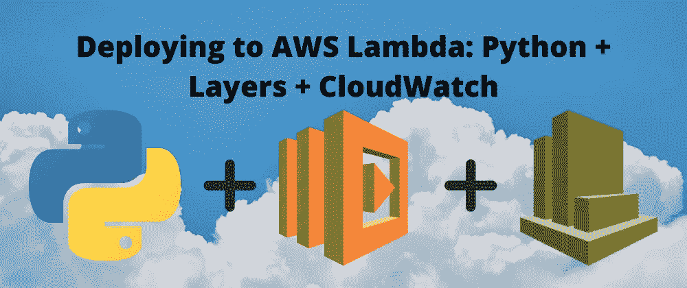

# 部署到 AWS Lambda:Python+Layers+cloud watch

> 原文：<https://levelup.gitconnected.com/deploying-to-aws-lambda-python-layers-cloudwatch-31c4119d3a69>



# 序言

在将我的 Spotify 帐户与 Last FM 整合后，我想开始向自己发送包含我的收听数据的电子邮件，我最终有了一个简单的脚本，可以从 Last FM 检索数据并将数据转换为表格(HTML)。

在测试这个脚本的过程中，我在 PyCharm 的本地机器上手动执行。那么，我该如何编程使其每周执行一次呢？您可能知道 cron jobs，这是一个在指定时间安排脚本执行的实用程序，并且您认为我们可以使用 cron 是正确的。

局限性在于，如果我们在本地机器(在我的例子中是 Macbook)上编写 cron 作业，它实际上没有价值，因为机器必须处于唤醒状态。这就是 AWS Lambda 的用武之地。

从表面上看，AWS Lambda 是由 Amazon Web Services 提供的托管服务，它允许用户上传代码，而不必担心服务器的基础设施。

这就解释了为什么它被认为是“无服务器的”这并不意味着根本没有服务器，只是用户没有配置或管理它们。我觉得 Lambda 最适合我的目标。

因此，在进入分步操作之前，有一些先决条件:

*   要跟进的 AWS 客户(自由层)
*   对 Python/编程、云计算(Python 库、Bash、SSH、SCP、AWS S3、AWS EC2)有基本的了解
*   您想要部署到 Lambda 的 Python 脚本

# 目标

我想在每周周日上午 10 点向我的 Gmail 帐户发送一封电子邮件，报告我在过去 7 天中听得最多的艺术家、专辑和歌曲。当在本地运行时，我的脚本已经连接到我的最后一个 FM 和 Gmail 帐户，我只需要将它部署到云中，这样它就可以在预定的时间运行。

在这篇文章中，我们不会深入研究这个脚本，但是我们将回顾一些将您选择的脚本部署到云(这里是 AWS Lambda)的基础知识，比如为外部依赖项创建一个层，以及在 CloudWatch 中创建 cron 表达式。

# 步骤 1:创建一个 Lambda 函数

为此，请转到 AWS 控制台中的 Lambda 服务。假设你也想部署一个 Python 脚本，从头选择**作者，**填写*函数名*，选择一个*运行时(*我的是 Python 3.6)。在 Permissions 部分，选择*创建一个具有基本 Lambda 权限的新角色就可以了。在这篇文章中，我们不会深究这个问题。点击*创建功能。**

向下滚动到功能代码，您应该会看到类似这样的内容:

```
import jsondef lambda_handler(event, context):# TODO implementreturn {‘statusCode’: 200,‘body’: json.dumps(‘Hello from Lambda!’)}
```

这是一个基本函数，将返回您在 *return* 块中看到的内容。如果您创建了一个*测试事件*(只是起个名字，不要麻烦去改变默认的 JSON)并测试它，这个函数应该成功地工作，并在执行日志中显示如下内容。

```
{“statusCode”: 200,“body”: “\”Hello from Lambda!\””}
```

注意，*导入 json* 不会导致任何问题，因为 **json** 是 Python 3.6 内置的一个模块。

在控制台中，你可以用自己的脚本替换 *lambda_function.py* 中的代码(复制粘贴即可)来建设性地遵循本教程。

我建议在您的脚本中也有一个 main 方法，并添加以下内容:

```
if __name__ == ‘__main__’:
 main()def lambda_handler(event, context):
 main()
```

我们不会深入讨论 lambda 处理程序或参数的目的——如果您的脚本不接受参数，以上内容应该足以满足 Lambda 的工作需求。

# 步骤 2:创建并上传 Lambda 图层

如果我们想将外部模块导入到我们的功能代码中，那么 AWS 建议我们将 zip 存档部署到 Lambda 层，所以我们会这样做。

我的 Python 脚本有以下导入语句:

我们如何将上面的内容作为“层”上传

所有这些都被 pip 安装到我的 Mac 上的本地用户库中，我们不想压缩我安装的每个模块，所以我们只需要将基本组件安装到一个单独的文件夹中，这样我们的压缩文件中就只有我们需要的包。

> 最初，我只是在我的 Mac 上本地创建一个目录并上传那个 zip 文件，最终看到一个错误，声称我的 Lambda 函数不能导入 numpy。
> 
> 我指出这一点是因为 Lambda 将在 Linux 操作系统上运行 AWS，由于我已经在 Mac OS 上安装了这些包，这在尝试导入 numpy 时导致了一个问题。

## 在 EC2 实例上安装软件包(Linux)

我找到的最快的解决方案是启动一个运行 Linux 的 EC2 实例，我只是选择了一个 **RHEL8 AMI** (Amazon 机器映像)并继续使用默认设置(包括生成或选择一个现有的密钥对，*我建议生成一个密钥对，如果至少为了练习*。

因此，在[登录到 EC2 实例](https://docs.aws.amazon.com/AWSEC2/latest/UserGuide/AccessingInstancesLinux.html#AccessingInstancesLinuxSSHClient)之后，您应该检查 Python 是否已经安装，运行一个

```
python --version 
```

去检查。如果它不是您的首选版本或者没有安装，请运行

```
sudo yum install python3 
```

为您的 AMI 安装最新的 Python 发行版。对于 RHEL8 AMI，将是 Python 3.6。

奔跑

```
python3 --version 
```

检查它是否已安装。

解决这个问题后，为您的库创建一个根目录。

我创建了一个目录 *gmail_music。*

Lambda 期望在某个目录结构[中有外部依赖，所以我们将在我们的实例中模仿它。因此，创建子目录后，您应该拥有以下结构:](https://docs.aws.amazon.com/lambda/latest/dg/configuration-layers.html#configuration-layers-path)

```
/gmail_music/python/lib/python3.6/site-packages
```

现在是安装 Python 库的时候了。

因此，在 EC2 实例的主目录中，您将开始安装带有 pip 的库，如下例所示，安装*请求*模块:

```
Pip3 install requests -t /gmail_music/python/lib/python3.6/site-packages
```

您将为每个没有内置到 Python 中的模块这样做(您可以一次安装多个模块，只需将它添加到上面的命令中)。

安装完你需要的东西后，你可以把它压缩并下载到你的本地机器上。

## 安装在 EC2 上的拉链模块

仍然在 EC2 实例上，使用

```
cd ~
```

安装带有的 zip 模块

```
sudo yum install zip
```

导航到安装模块的根目录。

```
Cd gmail_music
```

现在像这样压缩目录(相应地调整名称):

```
Zip -r9 ../gmail_music_layer.zip .
```

## 使用 SCP 将 Zip 下载到本地机器

为了简洁起见，[按照 AWS 提供的快速参考](https://docs.aws.amazon.com/AWSEC2/latest/UserGuide/AccessingInstancesLinux.html#AccessingInstancesLinuxSCP)将文件/文件夹从 EC2 实例复制到本地机器。

## 上传 Zip (Lambda 层)

这是简单的部分。

在 AWS 控制台的 Lambda 服务中，选择*图层*(可能在左侧汉堡菜单上)。

点击*创建图层*并命名你的图层。

你应该看到*上传一个. zip 文件*和*从亚马逊 S3* 上传一个文件的单选按钮。我已经上传了我的图层到 S3，但是有几个论坛会告诉你压缩文件在哪里并不重要，所以选择哪个选项，这就是你在上一步下载的压缩文件的位置！

我建议选择一个*兼容的运行时*或者更少，以匹配你的功能模块兼容的运行时(在我的例子中是 3.6)。

点击*创建。*

## 用λ函数链接λ层

这也是快速和简单的。

从汉堡菜单进入你的 Lambda 功能。

在*设计器*中，在你的函数名下，你应该会看到一个写着*层的方框。*点击这里，在页面的底部你会看到一个区域，有一个名为*添加图层的按钮。*在下一个屏幕上，简单地选择你刚刚上传/创建的图层和*版本*(如果这是你第一次上传图层，这将是 1)。点击*添加*连接成功！

# 步骤 3:创建一个 CloudWatch 触发器来运行 Lambda 函数

在 AWS 上，要像 CRON 那样按计划运行函数，我们将使用 CloudWatch。

在 Lambda 函数设计器中，您会看到一个标记为*添加触发器*的按钮。点击此处，从下拉列表中选择*云观察事件/事件桥*作为触发器。

在*规则*下拉列表中，选择*创建新规则。*

根据您的意愿命名和描述您的规则。

在*规则类型*部分，确保*调度表达式*被选中。输入框是您可以输入 CRON 表达式的地方。

> 注意，AWS 上的 CRON 表达式有六个参数，而不是五个。点击这里或点击这里阅读更多关于参数[的信息。](https://docs.aws.amazon.com/AmazonCloudWatch/latest/events/ScheduledEvents.html)

输入你的表达式，点击*添加*，你会看到它在你的*设计器*中触发。…就是这样！

# 参考

[AWS Lambda 入门](https://docs.aws.amazon.com/lambda/latest/dg/getting-started.html)

[用 Python 构建 Lambda 函数](https://docs.aws.amazon.com/lambda/latest/dg/lambda-python.html)

[Lambda 层的外部依赖性](https://docs.aws.amazon.com/lambda/latest/dg/configuration-layers.html#configuration-layers-path)

[EC2 上的 SSH 和 SCP](https://docs.aws.amazon.com/AWSEC2/latest/UserGuide/AccessingInstancesLinux.html#AccessingInstancesLinuxSSHClient)

[规则的时间表表达式](https://docs.aws.amazon.com/AmazonCloudWatch/latest/events/ScheduledEvents.html)

[使用 Rate 或 Cron 调度表达式](https://docs.aws.amazon.com/lambda/latest/dg/services-cloudwatchevents-expressions.html)

**注意:**对于本文中的每一步，都有不止一种方法来完成相应的活动，这里的那些可能不被认为是*最佳实践*，但是提供了一种尽快部署和测试的方法，正如我所希望的。这篇文章中提到的最后一个 FM 脚本是一个正在进行的工作，请继续关注一篇或几篇关于它的文章。

## 不管怎样，希望这有所帮助，感谢阅读！