# 启动和运行:将 Vue.js 部署到 AWS

> 原文：<https://levelup.gitconnected.com/deploying-vue-js-to-aws-with-https-and-a-custom-domain-name-3ae1f79fe188>


## 部署 Vue 的快速入门教程。Js 在 AWS S3 和 CloudFront 的应用

作为初创企业的原型开发人员，我最近需要部署一个 Vue.js 前端应用程序，作为一个更大项目的一部分。我的要求是:使用 **AWS** ，使用 **HTTPS** ，使用**自定义域名**，快速启动并运行**。**

**出于 [*公开学习*](https://www.swyx.io/writing/learn-in-public/) 的兴趣，我在这里分享我的过程，作为一个循序渐进的教程，帮助那些可能有类似需求的人。**

> **在这个快速入门教程中，我们将设置一个基本的 Vue.js 应用程序。然后，我们将介绍将应用程序部署到 AWS S3 以便立即托管的步骤。最后，我们将利用 AWS CloudFront 来确保我们的应用程序支持 HTTPS，并且可以通过自定义域名访问。**

**以下是我们将要采取的步骤:**

1.  **使用`vue-cli`创建新的应用程序。**
2.  **设置 S3 与静态网站托管桶。**
3.  **设置一个 IAM 用户和策略，这样我们就可以通过编程方式写入 S3 存储桶。**
4.  **使用`aws-cli`将我们构建的应用程序部署到 S3。**
5.  **使用`https`设置 AWS CloudFront 来安全地提供我们的 S3 桶。**
6.  **使用 AWS CertificateManager 为自定义域名创建 SSL 证书。**
7.  **将 CNAME 记录添加到我们根域的 DNS 设置中，以完成证书请求，并将我们的自定义域指向我们的 CloudFront 发行版。**
8.  **配置我们的 CloudFront 发行版以接受我们的自定义域名作为别名。**

**本教程假设您有一个 AWS 的[帐户，以及一个可以修改 DNS 设置的注册域名。您不需要对 Vue.js 有太多的经验，但是您应该对从命令行在 NodeJS 空间中工作比较熟悉。](https://aws.amazon.com/)**

## **使用`vue-cli`设置 Vue.js 应用程序**

**我们的目标是*不要构建*一个令人敬畏的 Vue.js 应用程序。我们只想向*展示如何部署*我们的应用程序。因此，我们将使用`vue-cli`来创建应用程序——初始应用程序是我们所需要的。**

**创建一个新的项目文件夹(我们称之为`vue-deploy-aws`)。我们将使用`yarn`作为我们的包管理器。在那个文件夹里，运行`yarn init`，根据自己的情况回答提示问题。唯一需要回答的非默认问题是*入口点*，我们应该将其设置为`index.html`。这实际上一点也不影响我们的功能，但是它会帮助你在查看你的`package.json`文件时避免混淆。**

```
~/vue-deploy-aws$ **yarn init** ...
question entry point (index.js): **index.html
...**
```

**接下来，添加`vue-cli`包。**

```
~/vue-deploy-aws$ **yarn add @vue/cli**
```

**现在，使用`vue-cli`，创建一个新项目，使用当前文件夹作为项目根。一路上会问你几个问题。**注意:**别忘了句号(**)。**)在下面命令的末尾。**

```
~/vue-deploy-aws$ **yarn vue create .** # Generate project in current directory? **Y**
# Please pick a preset: **default (babel, eslint)**
```

**就这样，我们有了一个工作应用程序。您可以运行`yarn serve`在本地提供站点服务。然后，在浏览器中打开`[http://localhost:8080/](http://localhost:8080/)`查看 Vue.js 应用程序:**

**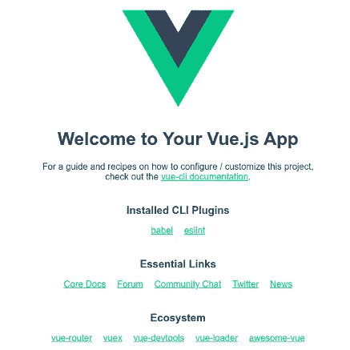**

**太棒了。现在，您已经有了一个可以工作的 Vue.js 应用程序，可以部署了。回到命令行，运行`yarn build`。**

```
~/vue-deploy-aws$ **yarn build** DONE  Compiled successfully in 5129ms
...
DONE  Build complete. The **dist** directory is ready to be deployed.
```

**这个命令将您的应用程序打包到一个名为`dist/`的子文件夹中。这个`dist/`文件夹是我们将部署到 AWS S3 作为静态网站的内容。前进！**

## **为静态网站托管创建一个 AWS S3 桶**

**现在我们有了 Vue.js 应用程序，我们需要一个 AWS S3 桶来保存`dist/`文件夹的内容。该桶将被配置为一个静态网站，可供公众阅读。**

**登录你的 [AWS 控制台](https://aws.amazon.com/)，然后导航到 S3。点击**创建桶**。**

**为您的存储桶选择名称。 [AWS S3 文档](https://docs.aws.amazon.com/AmazonS3/latest/dev/UsingBucket.html)指出，S3 存储桶名称是全球唯一的，因此您可能无法使用我们在本教程的示例中使用的相同存储桶名称。**

**接下来，为您的存储桶选择一个 AWS 区域。对于本教程，我们将使用`us-west-2`。您可以选择您喜欢的任何地区——只要确保您在本教程的剩余部分中为我们将使用的其他 AWS 服务选择相同的地区。如果不知道选哪个地区，就用`us-west-2`好了。**

**最后，*取消选中*的“阻止所有公共访问”选项，并点击复选框，确认您了解您的存储桶可能会被公共访问。这对于公开提供一个网站是必要的。**

**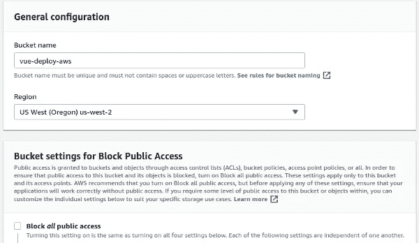**

**确保 ***取消勾选*** “阻止所有公共访问”，然后向下确认您想要这样做。**

**有了这些选项，点击**创建存储桶**。你现在会在你的 S3 桶列表中看到它。点击你新创建的桶来打开它。打开桶，点击**属性**标签，然后点击**静态网站托管**面板。选择“使用此桶托管网站”选项，并将索引文档设置为`index.html`:**

**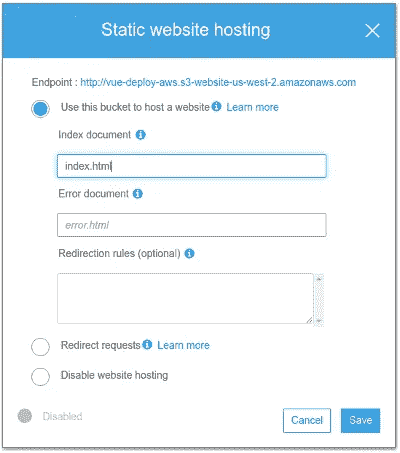**

**记下显示的*端点* URL。我们一会儿会用到它。所有这些就绪后，点击**保存**。**

**在设置我们的 bucket 时，我们还需要做一件事，那就是[创建一个 bucket policy](https://docs.aws.amazon.com/AmazonS3/latest/dev/WebsiteAccessPermissionsReqd.html) ，授予公众访问我们的 bucket 内容的权限。**

**点击您的存储桶的*权限*选项卡，然后点击**存储桶策略**。粘贴以下要点的 JSON，将`BUCKET-NAME-GOES-HERE`替换为您的 S3 桶的名称:**

**允许公众访问您的 S3 存储桶的存储桶策略**

**点击**保存**。**

**现在，我们的 bucket 被设置为一个静态网站。**

## **设置 IAM 以编程方式访问 S3 时段**

**我们最终会希望将本地机器的`dist/`文件夹与这个 S3 桶同步。为此，我们将使用`aws-cli`。我们需要凭证来表明我们被授权写那个 S3 桶。为此，我们将创建一个 IAM 策略和用户。**

**从 AWS 控制台，导航到 IAM。在左侧菜单中，导航至*策略*。我们需要一个策略来读写我们刚刚创建的 S3 存储桶。在策略页面上，点击**创建策略**。然后点击 *JSON* 选项卡。**

**您可以从以下要点复制并粘贴 JSON。将`BUCKET-NAME-GOES-HERE`替换为您的存储桶的名称。**

**点击**查看策略**，然后为您的策略提供一个名称，并点击**创建策略**。**

**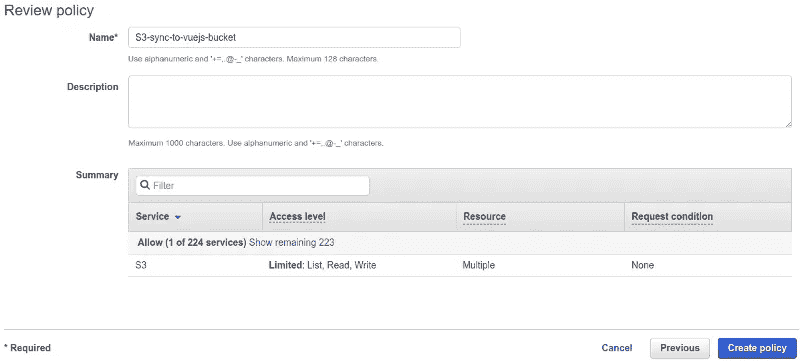**

**接下来，我们将创建一个 IAM 用户，并将该策略附加到他的权限集。我们将在`aws-cli`中使用这个用户的凭证。在左侧菜单中，点击*用户*。然后，点击**添加用户**。**

**为您的用户选择一个名称，并选中“编程访问”的*访问类型*框点击**下一步:权限**。这里，我们将添加上面创建的策略。点击“直接附加现有保单”选项**

**在这里，您将选择要授予您的用户的策略(权限)。您可以“过滤策略”以仅显示“客户管理的”策略，这样可以更容易地找到我们刚刚创建的策略。在列表中找到该策略，并选中它旁边的框。**

**点击**下一页:标签**。我们不需要在这里做任何事情。**

**点击**下一步:复习**。**

**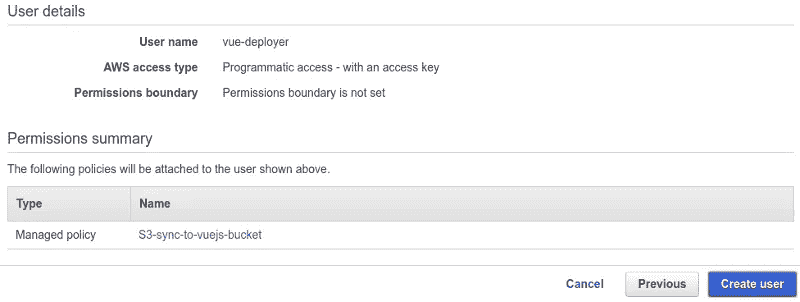**

**点击**创建用户**完成。您将看到新创建的用户，以及一个*访问密钥 ID* 和一个*秘密访问密钥*。让这扇窗户开着。我们将在几分钟后回到这个话题。**

**让我们返回到命令行来使用`aws-cli`，并确保我们可以访问我们的 S3 桶。**

## **部署:从命令行同步我们的 S3 存储桶**

**对于这一步，您需要确保在您的本地机器上安装了`aws-cli` [。首先，我们将设置一个本地 AWS 概要文件。确保准备好上述步骤中的*访问密钥 ID* 和*秘密访问密钥*。我们将使用`aws configure`在本地机器上建立一个配置文件:](https://docs.aws.amazon.com/cli/latest/userguide/install-cliv2.html)**

```
~/vue-deploy-aws$ **aws configure --profile vue-deployer**
AWS Access Key ID [************]: PASTE ACCESS KEY ID FROM AWS
AWS Secret Access Key [********]: PASTE SECRET ACCESS KEY FROM AWS
Default region name [None]: **us-west-2**
Default output format [None]: None
```

**我们将我们的 AWS 概要文件命名为`vue-deployer`，只是为了与我们创建的 IAM 用户保持一致；但是，您可以选择任何您喜欢的档案名称。顺便说一下，运行`aws configure`会在一个文件中设置凭证，这个文件可以在`~/.aws/credentials`中找到。**

**设置好我们的概要文件后，我们现在可以从命令行访问我们的 S3 存储桶(用您的存储桶名称替换`BUCKET-NAME-GOES-HERE`):**

```
~/vue-deploy-aws$ **aws --region us-west-2 --profile vue-deployer s3 ls s3://BUCKET-NAME-GOES-HERE**
```

**仔细分析一下我们上面做的事情:我们使用`aws-cli`向 S3 发出命令。但是首先，我们用`--region us-west-2`设置我们的区域，我们用`--profile vue-deployer`设置我们要使用的配置文件。这告诉`aws-cli`引用我们上面设置的`vue-deployer`概要文件的访问密钥 ID 和秘密访问密钥。然后，我们想使用`s3`在我们的 bucket 上运行一个`ls`命令。对于`s3`命令，bucket 总是用一个`S3Uri`来引用，基本上是`s3://`后跟您的 bucket 的名称。**

**如果一切都设置正确，那么运行上面的命令**应该看起来像什么都没发生**。别担心——这是好事！记住，我们的 S3 桶目前是空的，所以一个 T10 命令 T28 应该不会返回任何东西。最重要的是，我们没有遇到任何错误(如`NoSuchBucket`或`AccessDenied`)。这意味着我们的 IAM 用户和策略已经正确设置，并且我们的`aws-cli`配置文件凭证也已经正确设置。**

**非常好。现在，让我们同步我们的`dist/`文件夹到我们的 S3 桶。记住，`dist/`文件夹是我们之前运行`yarn build`时创建的。以下是我们同步文件夹和存储桶所需的命令(用您的存储桶名称替换`BUCKET-NAME-GOES-HERE`):**

```
~/vue-deploy-aws$ **aws --region us-west-2 --profile vue-deployer s3 sync ./dist s3://BUCKET-NAME-GOES-HERE --delete**
```

**当您运行这个命令时，您应该会看到一个`upload`消息列表，显示您的`dist/`文件夹中的每个文件是如何上传到您的 bucket 的。**

**顺便说一下，上面的`--delete`标志告诉`aws-cli`如果一个文件在我们的 S3 桶中，但不再在我们的`dist/`文件夹中，那么它应该从 S3 桶中删除。这是我们未来想要的，因为`dist/`文件夹的内容(而不是其他)应该成为 S3 桶中提供的内容的标准。**

**让我们做一些手动检查，以确保一切都按照预期的方式工作。首先，转到 AWS 控制台并导航到 S3。找到您创建的 bucket 并单击它。它应该不再是空的。相反，它应该看起来像是你的`dist/`文件夹中的一面镜子。**

**接下来，点击 S3 桶的*属性*选项卡。点击面板进行*静态网站托管*。在顶部，有一个用于存储桶的*端点* URL。当你把这个 URL 粘贴到你的浏览器中时，你会看到你的 Vue.js 应用程序，通过你的 S3 桶提供。**

**您的应用程序已上线！**

**为了更加方便，我建议从上面获取整个`s3 sync`命令，并将其复制到`package.json`文件的`scripts`部分。命名脚本命令`deploy`:**

```
...
"scripts": {
    "serve": "vue-cli-service serve",
    "build": "vue-cli-service build",
    "lint": "vue-cli-service lint",
    **"deploy": "aws --profile vue-deployer --region us-west-2 s3 sync ./dist s3://BUCKET-NAME-GOES-HERE --delete"**
  },
...
```

**这样，你可以随时快速运行`yarn deploy`来同步你的 S3 桶和你的`dist/`文件夹的当前内容。**

## **把申请交给 HTTPS**

**静态网站托管这种方式的局限性之一是， [*S3 网站端点不支持 HTTPS*](https://docs.aws.amazon.com/AmazonS3/latest/dev/WebsiteEndpoints.html) *。*这就是 AWS CloudFront 的用武之地——我们将使用 CloudFront 在 HTTPS 交付我们的网站内容。**

**在 AWS 控制台中，导航到 CloudFront。点击**创建分销**。我们将使用*网站*作为我们内容的交付方式。点击**开始**。**

**对于*源域名*，粘贴您的 S3 桶的网站端点 URL。这是您在浏览器中用来查看部署的 Vue.js 应用程序的 URL。*源域名*的输入字段可能会有下拉选项供您选择，其中一些选项可能看起来与您的端点 URL 非常相似。不要选择那些中的任何一个——它们很相似，但又不完全相同。我们需要在这里输入的是网站端点 URL，正如它在我们的 S3 存储桶属性中显示给我们的。**

**为*原点 ID* 输入您选择的任何值。**

**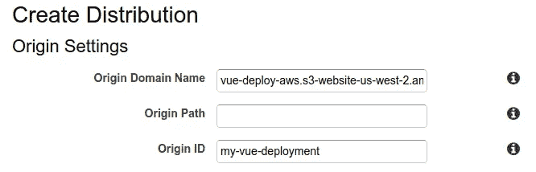**

**使用您的 S3 水桶网站端点 URL 作为原始域名**

**为*查看器协议策略*选择“将 HTTP 重定向到 HTTPS”。**

**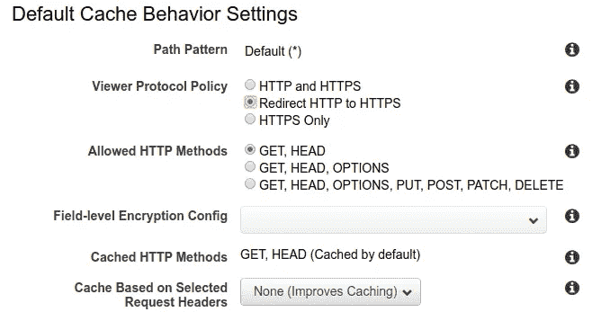**

**确保“将 HTTP 重定向到 HTTPS”**

**对于分销设置*价格等级*，现在选择“仅使用美国、加拿大和欧洲”。这更经济，虽然性能较差。但是对于本教程，选择这个选项就足够了。**

**对于 *SSL 证书*，现在选择“默认 CloudFront 证书”。我们将在以后附加自定义域名时对此进行更改。**

**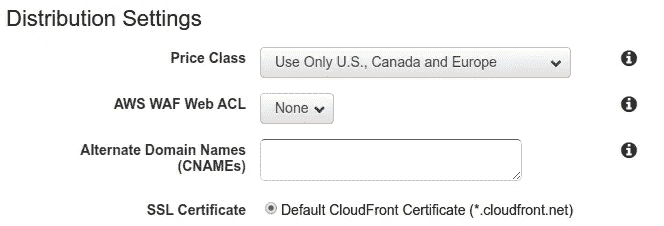**

**保留其余的默认选项。点击**创建分销**。**

**现在，您将在 CloudFront dashboard 的列表中看到新创建的发行版。设置此分发时，您的分发状态将为“进行中”**

**您的 CloudFront 发行版可能需要几分钟来设置(我的大约需要 5 分钟)。坐着别动。舒展一下筋骨。去把你的咖啡加满。**

**当所有设置完成后，您的发行版的状态将变为“已部署”现在，当您单击列表中的发行版名称时，您将看到您的发行版的所有属性。它应该是这样的(当然，不完全是这样):**

**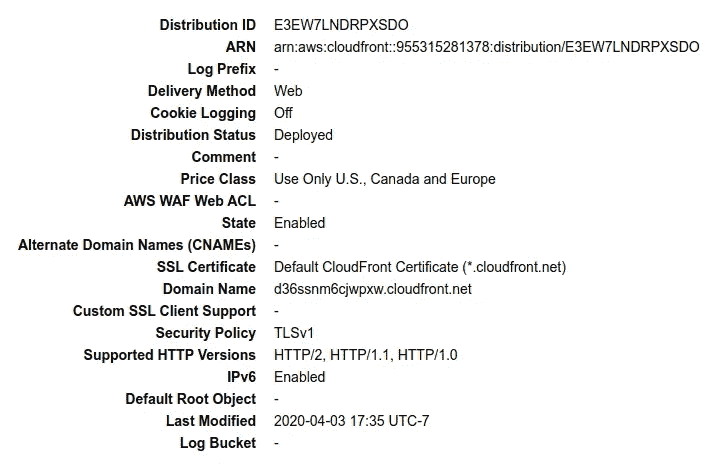**

**请特别注意以`cloudfront.net`结尾的*域名*。复制域名并将其粘贴到您的浏览器中。您应该看到您的 Vue.js 应用程序，现在使用 HTTPS 服务于一个`cloudfront.net`地址。**

**进步很大！剩下要做的就是连接一个自定义域名。**

## **为您的自定义域名创建 SSL 证书**

**要在 CloudFront 中使用自定义域名，您需要一个有效的 SSL 证书，该证书通过 AWS Certificate Manager 创建和验证。**

**在 AWS 控制台中，导航到证书管理器。**重要:为了让 CloudFront 发行版使用自定义证书，必须为** `**us-east-1**` **(N. Virginia)地区**生成该证书。在证书管理器中，您需要做的第一件事是将您的区域(右上角)切换到`us-east-1.`**

**点击**请求证书**。(您*可以*导入您已经拥有的证书，但是我们将完成生成新证书的步骤。)**

**我们想要“请求公共证书”然后，您将添加想要用于您的证书的域名。这需要是您可以修改 DNS 设置的域名。对于本教程，我将为我控制的域名生成一个证书:`vue-deployment.ootbdev.com`。**

**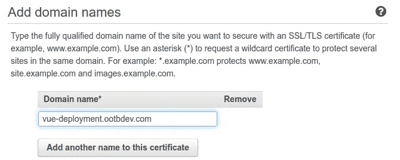**

**点击**下一个**。**

**选择 *DNS 验证*作为验证方法，然后再次点击**下一步**。**

**不需要添加任何标签。点击**查看**。**

**最后，**确认并请求**。**

**您的证书申请将显示为“等待验证”此时，您需要根据此处提供的值，在您的域名的 DNS 设置中创建一个 CNAME 记录。**

**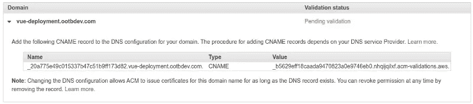**

**所有域名注册商的流程应该非常相似。**

**当您在那里修改 DNS 记录时，除了这个记录之外，您还需要添加另一个记录来进行证书验证。我们**还需要一个 CNAME 记录，将我们的域名指向我们的 CloudFront 分发域**。**

**为此，添加一个 CNAME 记录，其中主机名是您的自定义子域。在我上面的例子中，主机名应该是`vue-deployment`。该值应该是 CloudFront 域名。在我上面的例子中，这将是`d36ssnm6cjwpxw.cloudfront.net`。**

**总而言之，你应该增加两项 CNAME 记录。我的 DNS 记录看起来如下(你的应该看起来相似，但略有不同):**

**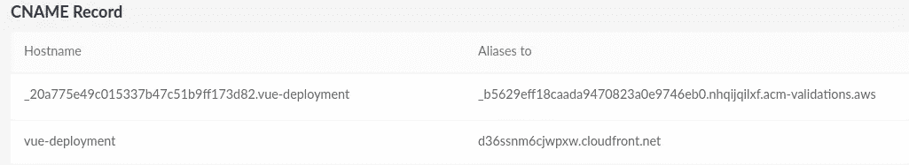**

**回到 AWS 证书管理器，当您刷新证书列表时，您可能会看到您请求的证书仍处于“待验证”状态。根据您的注册商，此验证可能需要几分钟到几小时不等。如果您通过 AWS Route53 管理您的域，那么这肯定会产生最快的(几乎是即时的)验证。我的证书验证花了大约 45 分钟，在 Linode 进行了 DNS 更改。**

**您可以随时使用[这个 CNAME 查找工具](https://mxtoolbox.com/CnameLookup.aspx)来检查您的 CNAME 记录更改是否已经传播。如果您输入 CNAME 记录主机名并进行查找，您将看到记录值(一旦您的更改已传播):**

**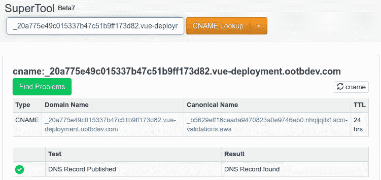**

**验证您的 CNAME 记录更改是否有效**

## **修改 CloudFront 发行版以接受使用自定义域名的请求**

**现在，随着我们的 AWS 证书的验证和生成，以及 CNAME 记录将我们的自定义域名与我们的 CloudFront 发行版进行别名化，我们需要对我们的 CloudFront 发行版进行一些修改，以便将它们结合在一起。**

**返回 AWS CloudFront 并打开您创建的发行版，显示它的属性。在*常规*选项卡下，点击**编辑**。**

**您需要对您的发行版进行两项更改。首先，在*备用域名(CNAMEs)的输入中添加您的自定义域名。*其次，在 *SSL 证书*下，选择“自定义 SSL 证书”然后，当您点击文本输入来选择要使用的证书时，您新请求的证书(来自`**us-east-1**`地区，请记住)应该会出现。选择那个。**

**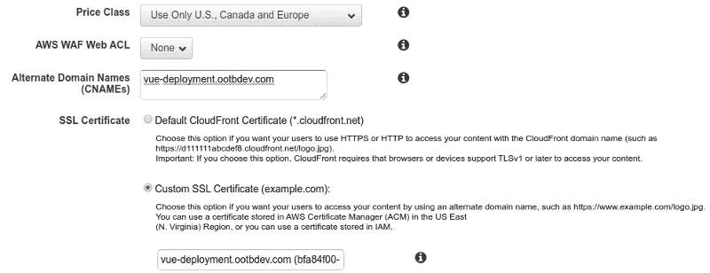**

**更新“备用域名”并选择“自定义 SSL 证书”**

**最后，点击**编辑**提交您的更改。**

**您的发行版将再次处于“进行中”状态。更新和部署这些发行版更改需要几分钟时间。**

**完成发行版部署后，您可以尝试在浏览器中访问您的自定义域。您应该看到您部署的 Vue.js 应用程序，并且您应该看到您到自定义域的连接是安全的，与 HTTPS 连接。**

**仅此而已。我们做到了！**

## **审查和结论**

**本教程的目标是向我们介绍将 Vue.js 应用程序部署到 AWS 进行托管的步骤，进行必要的调整以支持 HTTPS 和自定义域名。**

**让我们简要回顾一下我们在这里做了什么:**

1.  **用`vue-cli`设置一个新的 Vue.js 应用。**
2.  **创建了一个 AWS S3 桶来保存我们的 Vue.js 项目的`dist/`文件夹的内容，将这个桶配置为一个静态网站。**
3.  **创建了一个 AWS IAM 策略和用户，我们在本地机器上使用`aws-cli`来将我们的应用程序部署到 S3。**
4.  **使用`aws-cli`为我们创建的 IAM 用户配置凭证，然后调用`s3 sync`来同步我们的 S3 桶和我们的`dist/`文件夹。我们还在我们的`package.json`文件中添加了一个快捷方式，这样我们就可以运行`yarn deploy`来执行这个`s3 sync`操作。**
5.  **创建了 AWS CloudFront 分发版，通过 HTTPS 提供我们的 S3 bucket 网站。**
6.  **在 AWS 证书管理器中创建了一个 SSL 证书，用于我们的自定义域名。**
7.  **将 CNAME 记录添加到我们的自定义域的 DNS 设置中——一个用于证书验证，一个用于对我们的 CloudFront 域名的别名请求。**
8.  **修改了我们的 CloudFront 发行版，使用我们的自定义域名作为备用域，并使用我们新创建的 SSL 证书。**

**设置好基础设施后(本教程可供您参考)，以后您需要做的就是在准备好部署对 Vue.js 应用程序所做的更改时运行`yarn deploy`。**

**今天干得不错，朋友们。现在，去喝杯咖啡休息一下吧。**

***阿尔文·李*是亚利桑那州凤凰城的一名全栈开发人员和远程工作者。他专门从事 web 开发、技术咨询以及为初创公司和小型企业构建原型。他在 Moonlight 上有空，在那里你可以[查看他的个人资料](https://www.moonlightwork.com/app/users/2862/profile)或者[请求雇佣他提供服务](https://www.moonlightwork.com/r/2862)。**