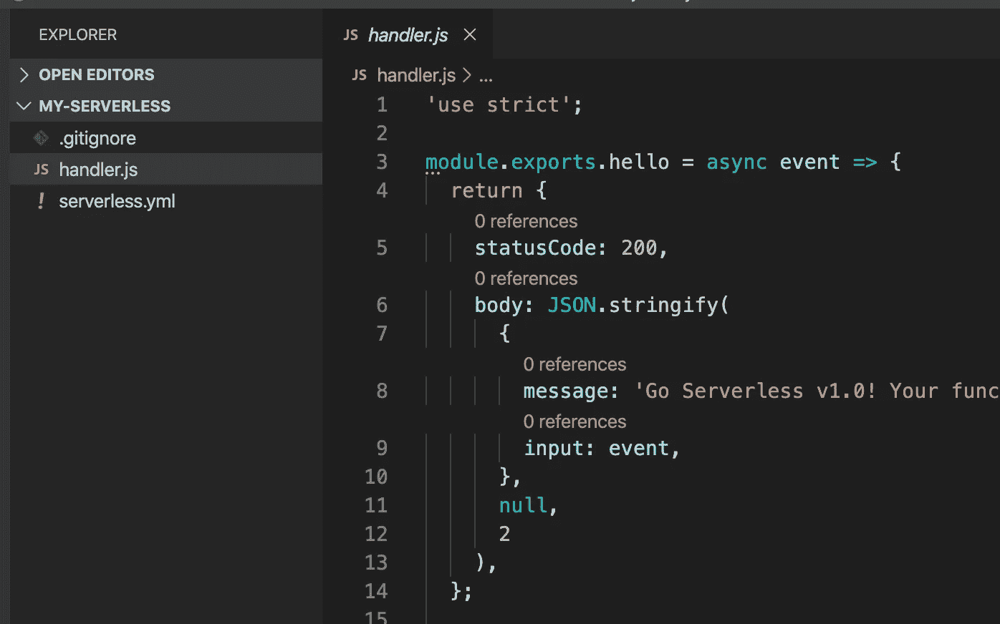

# 将第一个无服务器 Node.js API 部署到 AWS Lambda

> 原文：<https://levelup.gitconnected.com/deploying-your-first-serverless-node-js-api-to-aws-lambda-eb34044b1fb5>

无服务器使您专注于代码，而不是考虑供应实例和管理服务器。在本文中，我们将在几分钟内将一个基本的 Node.js web 应用程序部署到 AWS Lambda。

首先，您需要使用 npm 全局安装无服务器框架。该工具将为您处理简单的部署。

```
npm install -g serverless
```

现在，让我们用 AWS Node.js 模板创建一个新项目。

```
mkdir my-serverless && cd my-serverlessserverless create -t aws-nodejs
```

你可以使用 AWS Lambda 支持的任何语言。有关更多信息，请查看 Servless 文档。

这将为您生成一个新的无服务器项目，正如我们在下图中看到的，我们只有两个文件。

`handler.js`是您的函数所在的地方。在示例中，它只导出一个名为`hello`的函数，仅此而已。



`serverless.yml`文件有很多可以使用的配置，比如环境变量、S3 桶、AWS 权限等，但是对于本文，让我们来看看`functions`条目。在这里，您可以确定函数处理程序，也可以添加 http 端点。让我们把它改成如下:


```
functions: hello: handler: handler.hello events: - http: path: /hey method: get
```

除了告诉函数位于何处(`handler.hello`意味着文件`handlers.js`带有函数名`hello`)之外，我们还指定了`event`条目，并用`GET`动词设置了路径`/hey`。所以我们只需向`/hey`发送一个 GET 请求，函数`hello`就会运行。

现在是时候设置您的 AWS 凭证了。

转到 AWS 控制台，打开 IAM 服务。在左侧，点击`Users`，然后点击`Add User`

给你的用户取一个名字并勾选`Programmatic access`框。这类用户无权访问控制台，但可以通过 API 和密钥访问 AWS 服务。


授予用户`Administrator Access`权限。我们需要的许可足够了。


确保将您的**访问密钥 ID** 和**秘密访问密钥**复制到安全的地方，我们现在要使用它们。

回到您的终端，通过运行以下命令告诉 Serverless 您的 AWS 凭证，您就可以开始了。用您的 AWS 凭证替换**您的访问密钥 ID** 和**您的秘密访问密钥**。

```
serverless config credentials --provider aws --key YOUR_ACCESS_KEY_ID --secret YOUR_SECRECT_ACCESS_KEY
```

如果您愿意，可以更改您的功能，让我们来部署它！

我只是将函数的`message`体改为如下所示:


部署您的功能所需要做的就是从您的终端调用`deploy`命令。您还可以传递一个`stage`参数来确定您要部署到哪个环境。

```
serverless deploy --stage development
```

它在这里做的是将 Cloudformation 堆栈上传到您的 AWS 帐户并运行它。您可以在运行`deploy`命令后创建的`./serverless`目录下找到它。

端点是使用 AWS API Gateway 创建的，您可以在 AWS Lambda 服务中找到您的函数。

完成后，您将看到一个带有我们之前签名的端点。`GET /hey`

此外，环境是您的端点的前缀，您可以在 url 中看到`development/hey`。这很有帮助，因为您可以在不同的 URL 中保存多个环境。


第一次部署应该比下一次花费更长的时间。


就这样了，伙计们。当然，在一个真实的应用程序中，我们需要考虑更多的事情，比如设置单元测试集成，或者在部署管道中运行更多的操作。但是正如我们所看到的，无服务器确实使开发变得更加容易。:)