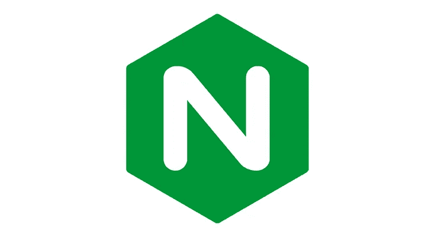
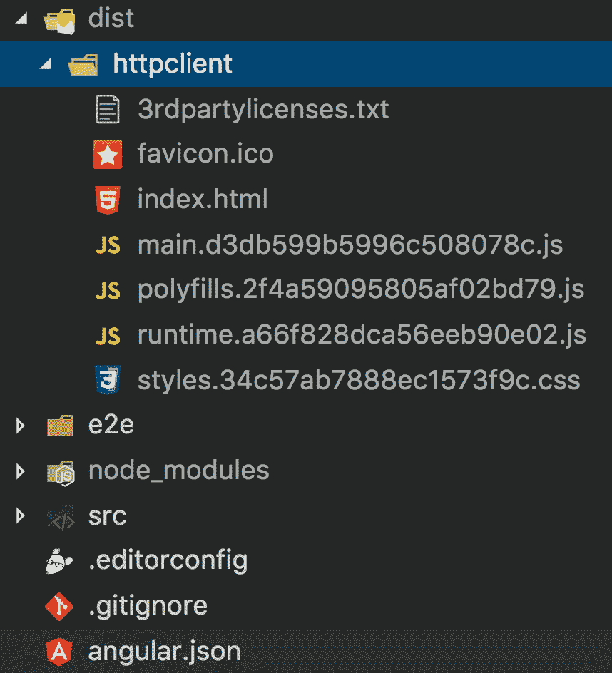
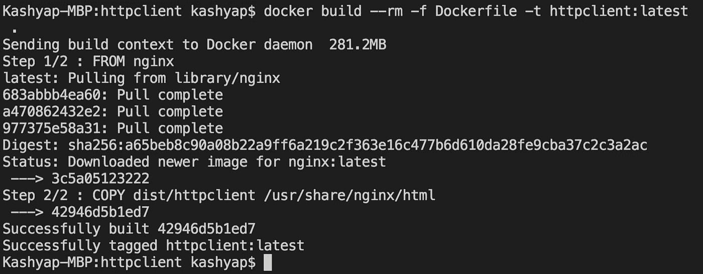
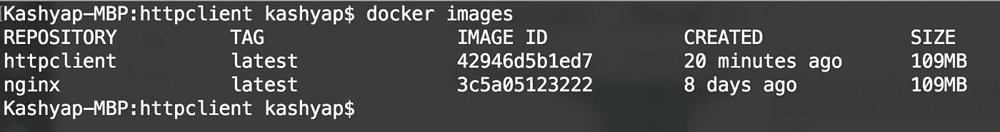
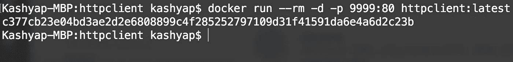

# 使用 Docker 和 NGINX 部署 UI 应用程序

> 原文：<https://levelup.gitconnected.com/deploying-your-ui-applications-using-docker-and-nginx-b65ffa8f744e>



这就是你——你日以继夜地试图创建你的网站，这个网站很棒，能解决未来的问题。但是现在，您需要想出如何部署它。虽然您可以使用 Heroku 之类的服务来部署应用程序，但在这个例子中，我们将看到一种将您的应用程序 dockerizing 和使用 nginx 的基本方法。

# 打包应用程序

当在我们的机器上本地运行时，我们总是需要一个开发服务器，它可以热重载和服务传输的代码。无论是被转换成 JS 的 React JSX 文件还是被编译成 JS 的 Angular TypeScript 文件都是如此。

但是当部署到服务器时，我们不需要任何 transpilation，因为它不再需要任何更改，所有的最终代码都准备好了。在这种情况下，我们只需要生成准备好发布的静态文件和*一些可以服务这些静态文件的东西*。在我们的例子中，*是 nginx。你可以在这里了解更多关于 nginx [的信息。](https://docs.nginx.com/)*

有人可能会问，Docker 适合做什么？我们把申请归档是什么意思？简而言之，我们使用 Docker 来避免在部署应用程序的每台服务器上安装和重新安装 nginx(或任何其他系统级依赖项)。点击了解更多关于 Docker [的信息。](https://docs.docker.com/get-started/)

对于本文，我们将使用这个[演示应用程序](https://github.com/40x/httpclient)，它生成一个简单的 HTTP 请求，并将响应记录到控制台。首先，让我们继续为项目创建分发文件。由于这是一个 Angular 项目，我们将使用 CLI 命令来构建项目。

```
npm run build
```

根据项目的类型，您将看到一个`dist` / `build`文件夹，在我们的例子中，它将采用以下结构:



# 创建 Dockerfile 文件

既然应用程序已经打包，我们将创建一个简单的 **Dockerfile** ，它将把`dist`文件夹的内容复制到 nginx 的`html`文件夹，nginx 是作为我们映像的一部分下载的。

在上面的 docker 文件中，我们只是指定我们的基本图像是 nginx，它在这里[可用](https://hub.docker.com/_/nginx/)，然后我们用我们的内容替换默认的 nginx html 页面。我们可以在这里添加其他内容，以便 nginx 可以将我们的请求代理到我们的自定义后端，这将在上一节讨论。

# 构建图像

要在 nginx 上构建映像，即打包的代码，我们可以使用以下命令:

```
docker build --rm -f Dockerfile -t httpclient:latest .
```

我们显式地指定了我们希望它使用的`Dockerfile`(默认情况下它会选择这个文件名的文件，如果你愿意，你可以重命名它)然后我们指定了图像名`httpclient:latest`，最后一个`.`指定了我们希望在这个项目中构建所有东西。

运行该命令后，我们会看到如下响应:



为了验证映像是否已创建，我们可以通过运行命令`docker images`进行检查，我们会看到如下结果:



# 运行图像

现在我们已经准备好了映像，我们将使用一个简单的命令来运行它

```
docker run --rm -d -p 9999:80 httpclient:latest
```

我们正在运行刚刚创建的 docker 映像，并使用`-p`参数指定端口映射。我们知道 nginx 公开了端口号 80，我们希望将它映射到我们机器上的端口 9999。因此，当我们的浏览器试图访问端口 9999 时，请求将被转发到运行在我们的映像中的端口 80。



要测试应用程序，请在浏览器上打开`http://localhost:9999`，您会看到应用程序按预期运行。

# 代理后端 API

在示例应用程序中，我们指向第三方服务器来获取允许[跨源请求](https://en.wikipedia.org/wiki/Cross-origin_resource_sharing)的数据。但是，对于生产后端应用程序，这是不推荐的，如果您正在分别运行您的 UI 和后端，那么您可能也想代理请求。为了设置代理，nginx 提供了一个配置文件，它可以为我们保存必要的配置，并根据定义转发请求。该文件的一个简单示例如下所示:

我们只是将从`/api/`开始的请求转发到后端服务器，并将 UI 页面请求等其他内容转发回索引页面，因为路由是由 spa 自己处理的。

为了告诉 nginx 选择我们的 nginx 配置而不是默认配置，我们只需修改我们的`Dockerfile`来选择我们的配置文件。

下次我们构建映像时，nginx 配置会被复制到映像中。像映像构建和运行方式这样的其他事情都与上面解释的一样。

# 结论

既然应用程序已经按预期运行，下一步就是使用一些云服务，比如 AWS、Azure 或 Google Cloud，将您的图像保存在图像存储库中，启动服务器并在其上运行您的图像。

完整的代码样本可在[这里](https://github.com/40x/httpclient/tree/docker-nginx)获得。

如果你喜欢这个博客，一定要为它鼓掌或者关注我的 [*LinkedIn*](https://www.linkedin.com/in/kashyap-mukkamala/)

[](https://levelup.gitconnected.com/?utm_source=bottom-banner)[](https://gitconnected.com/learn/docker) [## 学习 Docker -最佳 Docker 教程(2019) | gitconnected

### 31 大 Docker 教程。课程由开发者提交和投票，使你能够找到最好的 Docker…

gitconnected.com](https://gitconnected.com/learn/docker)