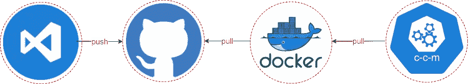
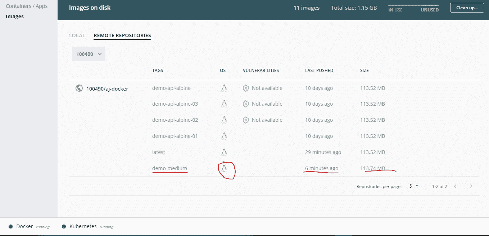
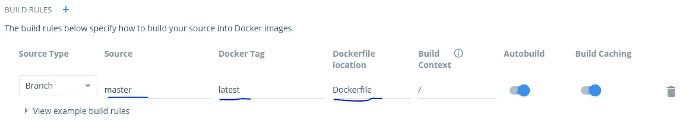
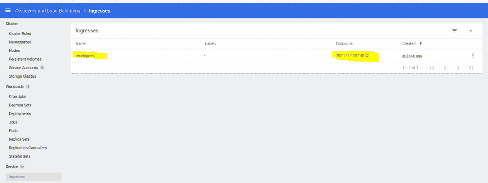

# 在 Kubernetes 上部署微服务。

> 原文：<https://levelup.gitconnected.com/deployingmicroservices-with-kubernetes-82c5f303be1a>



使用 Kubernetes 部署微服务。

朋友们好，今天我将探讨如何在 minikube 上部署 spring boot 微服务。有几篇好文章已经存在，但它们分散在许多文章中。我正试图把所有这些知识放在一个桶里，以便快速而容易地理解。

> **👉先决条件**

*   windows 10 专业版 1909 或 windows 10 家庭版专业版 1903
*   巧克力版本:v0.10.15
*   Docker 版本:v 10.0.9
*   minikube 版本:v1.15.1
*   git 版本:windows.1
*   [Github 账户](https://github.com/join)
*   [Docker hub 账户](https://hub.docker.com/signup)

> **在 minikube 环境中尝试您的牌局设置:**

**🍫Chocolatey** : Chocolatey 是一个帮助我们安装/卸载 windows 软件包的优秀工具，感觉就像 ubuntu 用户，但在这里不是强制的。你也可以从原来的网站下载软件包，但是我建议你使用 **choco** 来快速安装软件包。

**👉**使用 cmd 或 PowerShell 安装 Chocolatey

在 cmd/shell 上运行以下命令，并等待几秒钟以完成安装。

*   使用 cmd.exe 安装(以管理员身份运行)

```
@”%SystemRoot%\System32\WindowsPowerShell\v1.0\powershell.exe” -NoProfile -InputFormat None -ExecutionPolicy Bypass -Command “[System.Net.ServicePointManager]::SecurityProtocol = 3072; iex ((New-Object System.Net.WebClient).DownloadString(‘https://chocolatey.org/install.ps1'))" && SET “PATH=%PATH%;%ALLUSERSPROFILE%\chocolatey\bin”
```

*   使用 PowerShell 安装(以管理员身份运行)

```
Set-ExecutionPolicy Bypass -Scope Process -Force; iex ((New-Object System.Net.WebClient).DownloadString(‘[https://chocolatey.org/install.ps1'](https://chocolatey.org/install.ps1')))
```

你已经准备好使用巧克力了！键入`choco`或`choco --version`

## **🐳Docker (** 集装箱管理软件)

在开始安装 docker 之前，我们在一个非常高的层次上回顾一些重要的 Docker 术语，这将有助于我们轻松掌握部署过程。

> **什么是 Docker？**

从技术角度来看，docker 帮助我们实现容器化的应用程序，构建容器就绪的映像，将 Docker 映像推送到中央存储库，而无需担心环境设置。

> **什么是 docker 图像？🎶 ➕️🎶 ➡️ 💿**

Docker 图像由不同类型的层组成。每一层代表特定的功能，可能是操作系统、依赖项或任何类型的软件，每个映像层称为 AUFS(联合文件系统)。

> **你的集装箱的 Docker 图像蓝图。**

*   图像层及其内容被收集在`diff`目录中
*   图像层堆叠在`layers`目录中
*   容器被安装在`mnt`目录中

让我们试着把这个层和。构建图像时必须使用的 docker 文件。

```
** build stage ** **FROM** maven:3.6.0-**-slim AS build <-- **layer 1 (mvn setup)****RUN** mvn -f /pom.xml clean package <-- **layer 2 top of 1 layer to use mvn command**
```

> 什么是集装箱？💿使进入📻和⏩️

Docker 容器: **Docker 镜像在 Docker 引擎上运行时变成了一个容器**。容器构建称为容器的特殊包，在其中，你可以构建任何你能构建的东西。

## **👉**安装 Docker 桌面

**1️⃣** 如果安装了 Chocolatey 软件包管理器，使用下面的命令或者你也可以从[这里](https://www.docker.com/products/docker-desktop)下载桌面 docker 安装程序。

```
choco install docker-desktop
```

2️⃣，你可以使用 Docker 了！键入 **docker — version** 检查设置是否已成功完成。

使用 docker desktop，我们还可以访问我们的远程 docker 存储库，以及管理本地图像。最大的好处是我们可以很容易地找到并更新 docker 设置。如果你还没有 docker id，不用担心，你可以从这里的[](https://hub.docker.com/)****创建，它在一定程度上是免费的。****

**尝试从 power shell 运行`**docker login**`命令，这样我们将构建、标记和推送图像到 Docker 存储库。**

**3️⃣在 docker hub 上创建了一个知识库**

**登录 Docker hub →点击创建存储库→给出存储库名称→点击创建存储库**

```
In My Case 100490/aj-docker **100490 -->** dockerId and **aj-docker** --> repository
```

****👀这里需要注意的要点是**，我们的主要格言是，动态地从存储库中提取图像并构建一个容器。为了保持事情的简单性，并利用基础知识向前推进，我在这里解释拉、构建、提交和推的概念。如果您已经了解这些概念，可以忽略它们，继续下一步(安装 Minikube)。**

*   **使用 spring.io 创建一个 spring boot 项目，或者也可以从我的 GitHub repo 中克隆一个示例微服务来构建 docker 映像。 [***此处***](https://github.com/AjLogic/demo-api.git)**
*   **如果您已经从我 GitHub 存储库中克隆了 API，您可以忽略它。否则，您需要更新您的。dockerFile，它将包含以下命令，并根据您的目录结构更改卷属性值。**

**。dockerFile 文件**

*   **尝试执行**docker pull open JDK:8-JDK-alpine**安装 JDK 8 的轻量版。您还可以从 docker hub repo 仪表板中提取不同的图像。**
*   **使用下面的命令构建 docker 镜像(确保你在工作目录中)**

```
docker build -t 100090/aj-docker:demo-medium -f ./dockerFile .
docker build -t your_docker-id/your repo:{tag_name} -f path_of_docker_file .
```

*   **使用 **docker images** 命令查找图像 id。在我的例子中，c619178c180d*是我的图像 id。**
*   ****在推入 docker repo 之前，标记您的图像**。**

```
docker tag c619178c180d 100490/aj-docker:demo-medium
docker tag your_image_id/your_repo:{give_tag_name_in_build_cmd}
```

*   ****将图像**推送到 Docker 存储库。**

```
docker push 100490/aj-docker
docker push docker_id/repo
```

****在本地机器上使用下面的命令运行 Docker 镜像****

```
docker run -p 8080:8080 100490/aj-docker:demo-medium
docker run -p 8080:8080 your_docker_id/your_repo:your_tag_name
```

****

## ****👉**安装 Minikube ( Kubernetes)**

*   **您可以使用下面的命令下载 minikube，也可以从[这里](https://www.docker.com/products/docker-desktop)下载 minikube 安装程序**

```
choco install minikube
```

*   **让我们使用**minikube start—VM = true***命令来启动 Kubernetes *集群* 。如果 minikube 无法启动，请访问[驱动程序包](https://minikube.sigs.k8s.io/docs/drivers/)以获得设置兼容容器的帮助。***

> ***什么是 Kubernetes 集群？***

***集群是 Kubernetes 的灵魂。它是运行我们的容器应用程序的一组节点。Kubernetes 通过将容器放入 Pods 中在*节点*上运行来运行您的应用程序。根据群集的不同，节点可以是虚拟机或物理机。每个节点都包含运行 pod 所需的服务。***

> ***什么是 Kubernetes 仪表板？***

***这是一个用户界面，可以让您了解在 Kubernetes 集群上运行的应用程序的概况。您可以使用以下命令启动 minikube 仪表板。***

```
*minikube dashboard --url or minikube dashboard*
```

> *****用 GitHub** **项目**配置 Docker hub repo***

***每当我们将代码推送到 codebase 时，docker hub 库就可以用我们的新变化创建一个新的 docker 映像。***

*****1️⃣** 导航到资源库→选择您的资源库→构建→使用您的 Github 凭证进行身份验证→选择项目。***

***2️⃣在构建规则会话中我们需要指定我们的 docker 文件名(名称与我们在项目中提到的完全相同)来构建图像。***

******

# *****👉安装 kubectl*****

***Kubectl 是一个命令行工具，可以对 Kubernetes 集群运行命令，获取 pod 细节，应用配置和服务日志。***

```
*choco install kubernetes-cli*
```

> *****创建一个秘密*****

***秘密可以保存 pod 访问资源所需的用户凭证。在我们的例子中，我们将为我们的私有存储库创建一个秘密来提取 docker 图像。有几种方法来保持秘密你也可以使用掌舵秘密或者在 git repo 中保持秘密，但是现在，我们在这里保持简单。***

*****创建秘密的步骤*****

```
*docker login*
```

***登录过程使用认证令牌更新 **config.json 文件。*****

```
*cat ~/.docker/config.json*
```

*****使用现有的 docker hub 凭证创建一个秘密**。Kubernetes cluster 使用该秘密来认证并从私有回购中提取图像。***

```
*kubectl create secret docker-registry regcred --docker-server=<your-registry-server> --docker-username=<your-name> --docker-password=<your-pword> --docker-email=<your-email>*
```

***在我的例子中， **regcred** 是我们的 secret 的名称，它将在部署文件中用于从 repo 中提取图像。您的命令如下所示。***

```
*kubectl create secret docker-registry regcred --docker-server=[https://index.docker.io/v1/](https://index.docker.io/v1/) --docker-username=1004** --docker-password=**j*****1 --[docker-email=ranade.ajinkya1@gmail.com](mailto:docker-email=ranade.ajinkya1@gmail.com)*
```

> ***创建部署文件***

***在这一步中，我们必须创建一个部署文件，它是构建 pod 的一组指令。让我们试着理解一些与部署文件相关的要点。***

***👉**种类** :-种类表示对象的类型或其行为。它可能是服务、部署、机密、pod 类型等。***

***👉 **IMAGE** :构建容器的 docker 图像的路径。***

```
*{your_docker_id}/(your_docker_repo_name}:{your_tag_name}*
```

***👉I **magePullPolicy:** 当我们需要一个新的 docker 映像到一个容器时，这是一个对容器的指令。默认值为`IfNotPresent.`***

***👉**服务:**公开 Kubernetes 外部的端点。***

> ***启用入口(负载平衡器/路由规则)***

***入口将来自群集外部的 HTTP 请求路由暴露给群集中的服务，并通过入口资源管理流量路由。***

***我们的请求首先到达入口控制器，并根据路由规则转发给服务(在我们的例子中是开发服务)，然后将这个请求转发给 POD 执行。***

***您可以使用下面的命令来启用插件***

```
*cmd :  minikube addons enable ingress*
```

## *****将部署文件应用到集群*****

***让我们创建一个简单的 deployment.yml 文件，其中包含与名称空间、部署和服务相关的配置。部署文件包含我们需要的 pod 复制副本的数量、我们在前面的步骤中创建的 imagepullscrect 名称，以及用于提取特定映像的映像名称。***

*****👀**您也可以使用 kuberctl 命令创建名称空间。***

***通过 kubectl 命令将 deployment.yml 应用到集群。***

```
*kubectl apply -f ‘.\DeploymentAll (1).yml’*
```

> *****重新访问 Docker 文件*****

***炉排。我们几乎完成了向上动态拉的练习，这一步我们将把 maven 层和安装包层放入我们现有的。docker 文件如下图所示。一旦你将修改后的 docker 文件放入 codebase 集群，选择最新的映像并构建容器。***

> *****重要命令*****

```
*minikube stop →Stop minikube
minikube start →Start minikube
minikube dashboard →open minikube interface
docker login →docker login
docker pull openjdk:8-alpine →pull a docker image from docker hub 
docker build -t 100490/aj-docker:demo-api-alpine -f dockerFile . → create docker file
docker tag {image_id} {docker_id}/{docker_repo_name}:tag →add tag to push image on repo
docker push 100490/aj-docker →Push docker image
kubectl expose pods {pods-name} - target-port 8080 - type NodePort → expose pod to access outside(without load balancer)
kubectl get service -n development →get all services present inside the development namespace
kubectl get pod -n development →get all pod present inside the development namespace
kubectl apply -f .\DeploymentAll.yml →apply config to pod
kubectl create secret generic regcred →from-file=.dockerconfigjson=C:\Users\ajinkya.ranade\.docker\config.json - type=kubernetes.io/dockerconfigjson
kubectl create secret docker-registry regcred →docker-server=[https://index.docker.io/v1/](https://index.docker.io/v1/) - docker-username=100490 - docker-password=A***** - [docker-email=****@gmail.com](mailto:docker-email=****@gmail.com)
kubectl get secret regcred - output=yaml*
```

***今天到此为止，但我们还没有结束！！接下来，我们将深入探索入口控制器，并将我们的基本 k8s 设置转换为特定于环境的设置。***

***感谢您的阅读😅 😃请👏如果你觉得有用的话。***

******

*****你的成就！！！！*****