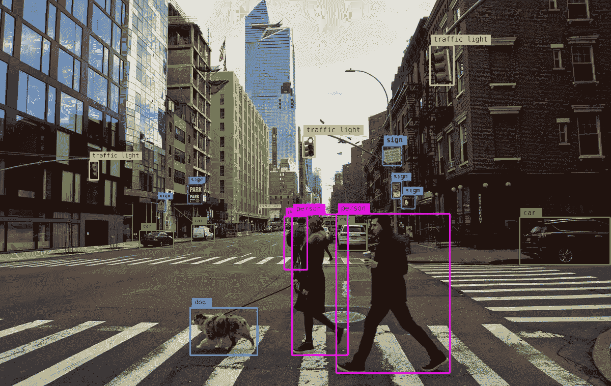
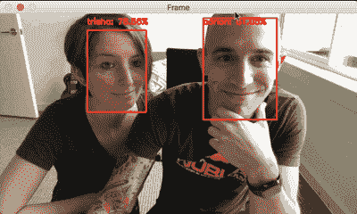
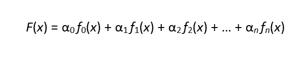
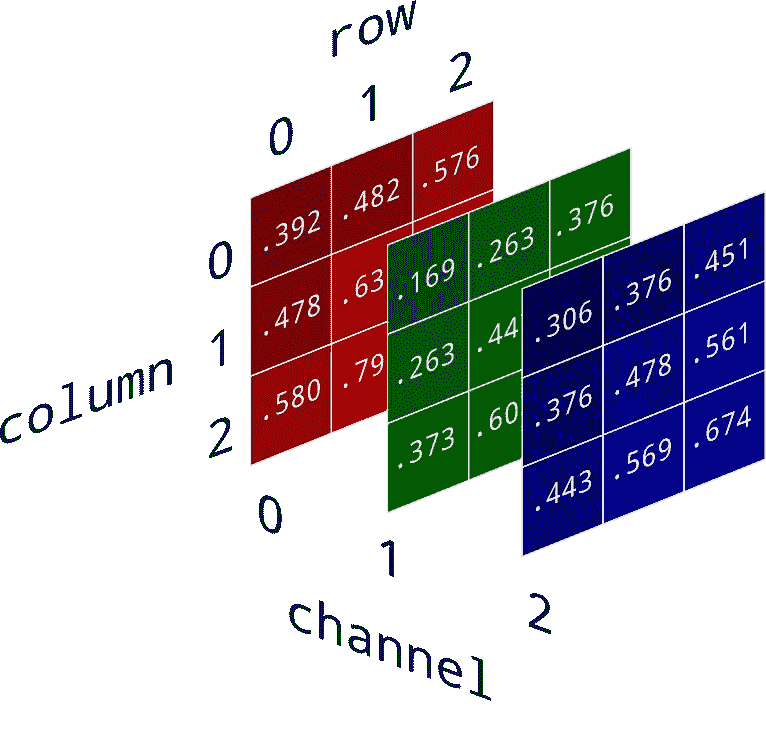
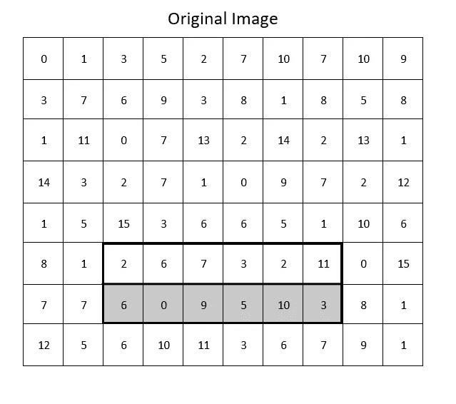
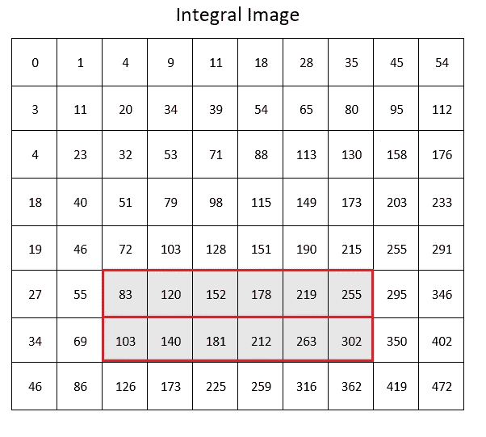
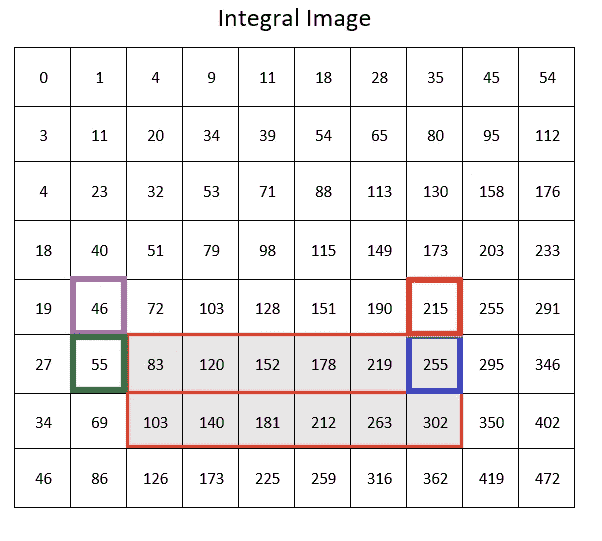
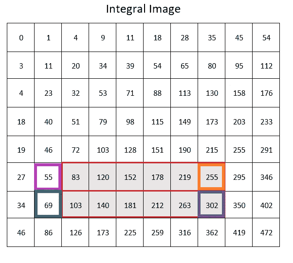
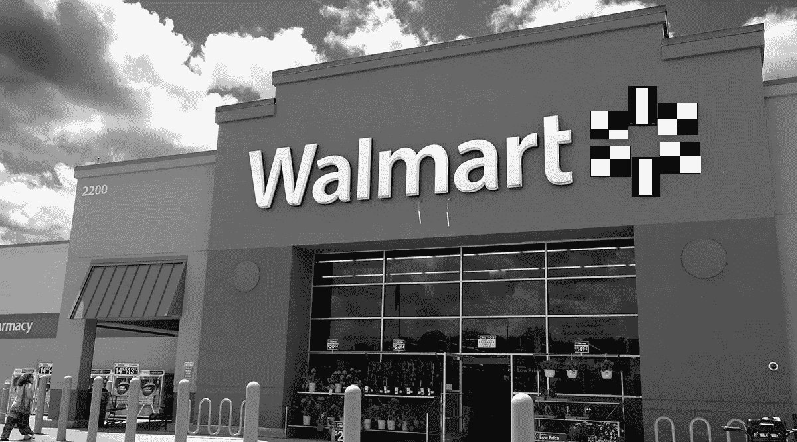
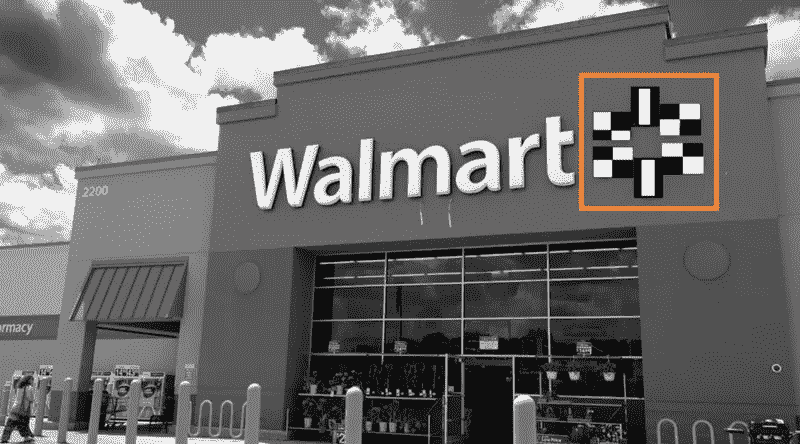

# 部署:实践中的计算机视觉

> 原文：<https://levelup.gitconnected.com/deployment-computer-vision-in-practice-99b7bbb6aa7c>

## 计算机视觉导论，第七部分

在过去的六周里，我们学到了很多关于如何教一个模型去检测图像的知识。我们从计算机如何读取和存储图像的基础知识开始。然后过渡到算法如何通过使用 Haar-like 特征来定义图像中的对象。我们讨论了积分图像如何减少计算图像中成千上万个可能特征的时间和必要资源。从那以后，我们讨论了模型是如何被训练的，既有直觉层面的，也有数学层面的，特别是当它与 Adaboost 相关的时候。最后，我们看到了模型训练的作用。今天，我们将采用上次构建的“训练过的”模型，并应用我们所学的所有知识来理解对象检测如何实时工作。

> 注意:这段时间，我们所有的知识都是基于 Viola-Jones 算法，利用 Viola 和 Jones 20 年前研究的 Haar 类的基本特性。虽然深度学习神经网络正在慢慢成为新的标准，但 Viola-Jones 算法仍然是一个强大的工具，可以作为建立一个人对计算机视觉的理解的伟大基础。
> 
> 虽然 Viola-Jones 算法被用于人脸检测，但其核心是一种**物体检测**算法，这种算法是在人脸上经过**训练**的。因此，我们可以很容易地将相同的过程应用到我们的场景中。

# 从静止图像到实时图像

从静态图像分类到实时图像分类的转变实际上是相当不稳定的。请记住，我们所说的“视频”只不过是快速连续拍摄的一系列静态照片。该模型将这些图像作为输入，就像在训练期间一样，并针对这些图像测试现在“训练的”(或“拟合的”)方程。为了让模型跟上实时提要，需要在提要的分辨率、可用的处理能力和每秒捕获的帧数(又名:每秒帧数，或“FPS”)之间建立平衡。当这些元素都正确排列时，您将获得如下结果:

图片来源:【PyImageSearch.com 

正如你所看到的，勾勒这对夫妇个人面部轮廓的框架能够实时缩放、计算和跟踪。如果电脑的处理能力太低，或者 FPS 或分辨率设置太高，您会看到帧滞后。这在中低端数码相机中很常见。

实时对象检测之所以可用，主要是因为通过使用 Integral Image 和 Adaboost 进行了优化。相对平滑的过渡的另一个原因是，一旦模型被训练、测试和部署，模型等式中保留的权重和特征(例如，*f*(*x*)=*α*₀*f*₀(*x*)+*α*₁*f*₁(*x*)+*α*₂*这意味着权重( *αₙ* )和特征( *fₙ)* 不能改变，除非你打算重新训练模型。*

在某种程度上，您可以将训练好的模型视为清单。如果最小数量的特征出现在预定义空间的一侧，则它是目标对象的概率非常高。我说的预定义空间是什么意思？简单地说，就是你在上面看到的每个面周围的缩放框！它可以缩放以补偿不同的面部尺寸和强制透视(当对象根据与相机的距离看起来更小或更大时)。该模型在图像上滑动该框，直到它检测到所有必要的特征都在该框内。一旦找到这些特征，它就开始计算。

在继续之前，让我们最后一次仔细看看那张 GIF。你可能会注意到每个方框右上角的波动数字。这表示轮廓物体成为目标物体的*概率*。让我们最后再看一遍模型后面的方程。

上次我们说 *F* ( *x* )代表的是分类器。虽然这是事实，但这不是全部的真相。记住，所有这些都是一个大的数学方程式。因此，当你把所有的项( *αₙ fₙ* ( *x* ))加起来时，结果将是一个数字。这个数字是模型找到目标对象的可能性。因此， *F* ( *x* )是在该帧内检测到目标对象的*概率*。

所有这些问题都解决了，让我们向前看，看看我们的模型是如何工作的。

# 检测沃尔玛

所以上次我们假装训练了一个可以检测沃尔玛的图像分类器。因此，我们可以说，在我们的实时提要中捕获的图像之一是这样的:

图片来源:[TTNews.com](https://www.ttnews.com/articles/walmart-fights-54-million-lawsuit-verdict-awarding-drivers-sleeper-berth-pay)

在我们的屏幕上，我们看到了这个图像，但是请记住，在本系列的第一部分中，图像实际上是一个分布在三个通道上的数组，这三个通道对应于像素的红色、绿色和蓝色通道。

阵列的尺寸等于图像的分辨率，因为每个单元代表一个像素。每个通道的单元表示该像素通道的强度(或亮度)。因此，当我们看到沃尔玛的图片时，计算机将其视为数字和渠道的集合。

## 转换

接下来，模型在后台执行两个转换。这两种变换您以前都见过:将图像转换为灰度，并缩放数值(不是分辨率)。

独立通道中的每个单元格都被转换为灰度。这使得数学更简单，有助于降低任务的复杂性。

第二个转换是缩放每个单元格中的值。通常，亮度在 0 到 255 之间，255 是最亮的。然而，为了简单起见，这些值被缩放，以便它们在 0 和 1 之间(0 表示没有光，1 表示最亮)。

现在，你可能还记得，在训练过程中，图像的分辨率也被缩小了。嗯，这不会在模型部署后发生。相反，所有的特征都被放大以匹配图像分辨率的比例！所以只要记住:在训练期间，*形象*被缩小**。实际上，*的特征*被放大**到**。**

## **检测特征**

**有了正确格式的图像阵列、通道和数字，模型就开始寻找目标的特征。它计算出所有必要的*类似 Haar 的特征。你可能记得这张图片:***

****

**该模型想要确定图像的轮廓部分是否包含边缘特征。这是通过创建一个完整的图像来实现的，如下图所示:**

****

**它使用积分图像来定位它需要的 4 个神奇数字，以快速找到总和并计算较亮和较暗部分的平均值:**

****

**较轻的那一半的数字**

****

**黑暗一半的数字**

## **级联:另一个出色的优化**

**这一切听起来非常熟悉，但这次有些不同。我之前提到过，它正在计算*必要的*特性。请记住，在培训期间，我们删除了所有不必要的功能，并将等式简化为如下形式:**

***f*(*x*)=*α*₀*f*₀(*x*)+*α*₁*f*₁(*x*)+*α*₂*f*₂(*x*)+…+*α*₅**

**如果围绕图像平移的帧(像这对夫妇的 GIF 中的帧)没有找到第一个特征， *f* ₀，它简单地停止计算，移动一个像素并再次尝试。如果它找到了 *f* ₀，但没有找到 *f* ₁，它再次停止并移动一个像素。它将这样做，直到₀到₅都在盒子里面。这种节省时间的方法叫做“层叠”。这使得模型不必浪费时间来计算类似 Haar 的特征等。如果所有的重要特征都不存在。在我们的模型中，这些特征对应于下面看到的特征:**

****

**因此，我们的模型移动一个框架，直到上面的所有六个特征都在其中找到。**

****

## **预测**

**此时，模型采用先前计算的值(以确定它们是否是类哈尔特征)，并将它们代入方程中对应的 *fₙ* 项。它将它们乘以各自的权重( *αₙ* )。结果是检测到的物体是目标的概率。**

**在我们这种情况下，概率非常高，我们的直播提要突出了这一点。**

****

**但是，这里有一个问题！看这个盒子！我们想要一个检测沃尔玛商店的模型，但是我们的模型只检测到沃尔玛的标志！幸运的是，有一些方法可以纠正这一点。然而，在目前的状态下，该模型很擅长告诉我们沃尔玛是否出现在实时画面中，但在勾勒物体本身方面表现不佳。**

# **摘要**

**在这个系列中，我们讨论了计算机视觉基础的复杂发展。它们是如此的基础，以至于即使深度学习神经网络，在抛弃像 Haar-like 特征等概念的同时。仍然遵循类似的模式，例如在图像内定义边缘。它们也非常强大，以至于这些算法今天仍在许多模型中使用！**