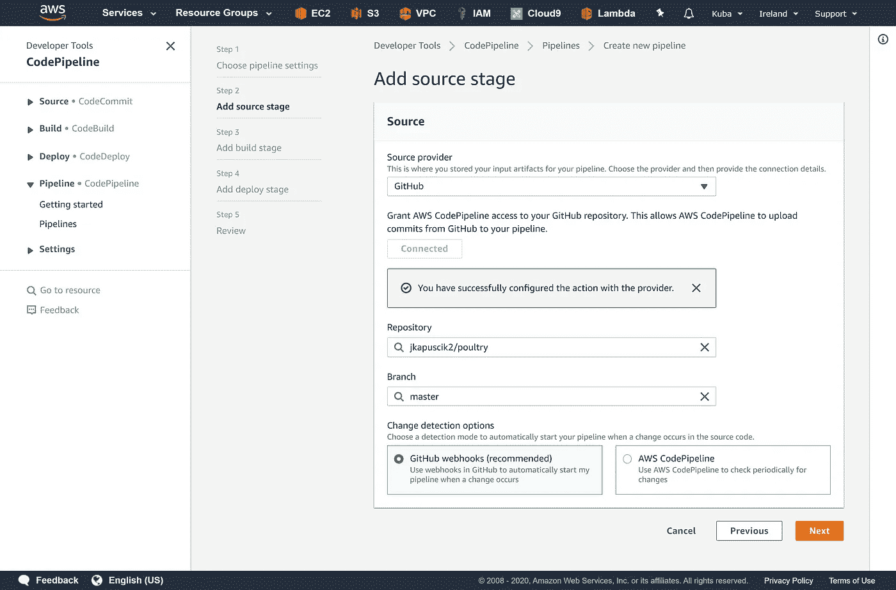

# 部署到 AWS 自动扩展组

> 原文：<https://levelup.gitconnected.com/deployment-to-aws-auto-scaling-group-8585178cdc8a>

## 让我们立即创建一个简单的 CI/CD 管道


我们最近创建了一个高度可用的[应用程序](https://medium.com/swlh/autoscale-your-website-in-5-minutes-or-less-3c47f6483b72)，显示精心挑选的家禽品种。它使用了负载平衡器和 AWS 自动伸缩组。该系统使用云形成，并且一旦创建了新的实例，就构建所有的依赖项并下载应用程序。

现在新的挑战是:“我们如何将应用程序的新版本部署到多个实例中？”。这些数量不断变化，取决于我们收到的网络流量，所以手动部署不是一个选项。答案可能是被称为代码部署和代码管道的服务。我们将创建一个示例配置，将所提供的软件版本推送到所有实例并进行安装。此外，我们将在 AWS 上创建一个完整的连续交付管道，以进一步自动化该过程。

我们的应用程序正在快速发展，我们希望用户能够尽快体验新的功能。在对部署分支进行新的提交或合并之后，我们希望运行测试并将其直接部署到生产中。这是一个相当大胆的方法，要在实际应用中使用，需要良好的测试覆盖和出错时的自动回滚。实际上，我们在本地和生产之间经常有多个暂存环境。部署通常也是手动触发的。在大多数情况下，我们往往太害怕破坏一些东西，以至于无法将软件自动化到这样的程度。但是现在我们还没有并将继续全面持续部署。

让我们从构建我们的应用程序开始:

```
sh manage.sh create CF_STACK_NAME EC2_ACCESS_KEY_NAME
```

设置好一切需要几分钟时间。我们已经向我们的资源库添加了一个名为`buildspec.yml`的小脚本。我们将采用一种称为代码构建的服务命名约定。它将告诉 AWS 服务如何在我们的应用程序上构建和运行测试。它将创建一个临时容器，用于克隆源代码、安装依赖项和运行测试。如果一切顺利，我们将着手部署。

我们可以创建自己的环境，手动安装所有软件包，或者使用 AWS 提供的一些[映像。有一个 PHP 7.3 Docker 图像很适合我们。](https://docs.aws.amazon.com/codebuild/latest/userguide/build-env-ref-available.html)

我们将首先创建一个代码构建项目，然后我们将添加代码部署配置，并用代码管道将它们连接在一起。我们将使用 AWS CLI 并完成该过程的每一步。


我们需要提供项目的名称和 git 存储库的 URL。我们也将把 Ubuntu 作为一个操作系统来开发。其余的都可以保持违约。就是这样。现在，只要我们愿意，只需点击一下鼠标，就可以在一个隔离的 Docker 容器上运行我们的应用程序测试。

部署的设置会稍微复杂一点。我们需要创建一个应用程序和部署组。


创建新的应用程序非常简单

部署组是该服务应该如何处理新部署以及将它放在哪里的配置。我们将为其命名，选择默认角色并选择我们的自动缩放组。代码部署也将使用我们的负载平衡器。它将取消每个更新实例的注册，以便在它未准备好时不会接收任何流量。的确非常聪明。


我们的应用程序将根据`appspec.yml`中的说明进行部署。每次推出新版本的应用程序时，我们都希望复制所有新的源代码并安装依赖项。我们可以用[生命周期钩子](https://docs.aws.amazon.com/codedeploy/latest/userguide/reference-appspec-file-structure-hooks.html#appspec-hooks-server)来定义在给定的顺序中应该发生什么。

我们现在可以手动构建和部署我们的应用程序。最后一步是用代码管道把它们放在一起，这样在每次推送到主分支之后，所有的测试都会运行，代码也会部署到生产环境中。


我们需要建立一个新的渠道



添加源代码库并选择部署分支


我们可以选择刚刚创建的代码构建项目


我们还准备好了代码部署项目


一切都变绿了

我们的管道已经准备好，代码将直接进入生产服务器，停机时间最少或没有。我们还可以添加一些额外的步骤，如手动批准。然后，我们将收到一条确认部署的消息。在现实世界中，这可能非常有帮助，并给我们一些额外的时间来测试和考虑。

让我们面对现实吧。这非常简单，但是非常有用。我们几乎可以用非常基本的技能立即获得 CI / CD 解决方案。对我来说，这是云和托管解决方案的一大优势。我们可以拥有出色的、可扩展的支持解决方案，而无需花费太多精力和精力在我们的核心领域。

## 完整源代码可从以下网址获得:

[](https://github.com/jkapuscik2/poultry) [## jkapuscik 2/家禽

### 使用 Lumen 框架创建的示例应用程序。它应该展示自动化水平的可能性…

github.com](https://github.com/jkapuscik2/poultry) 

## 资源:

[](https://medium.com/swlh/autoscale-your-website-in-5-minutes-or-less-3c47f6483b72) [## 在 5 分钟或更短时间内自动缩放您的网站

### 让你的网站黑色星期五和圣诞节马上准备好

medium.com](https://medium.com/swlh/autoscale-your-website-in-5-minutes-or-less-3c47f6483b72) [](https://aws.amazon.com/codepipeline/) [## AWS 代码管道|持续集成和持续交付

### AWS CodePipeline 是一个全面管理的连续交付服务，可帮助您自动完成发布流程，从而快速…

aws.amazon.com](https://aws.amazon.com/codepipeline/)