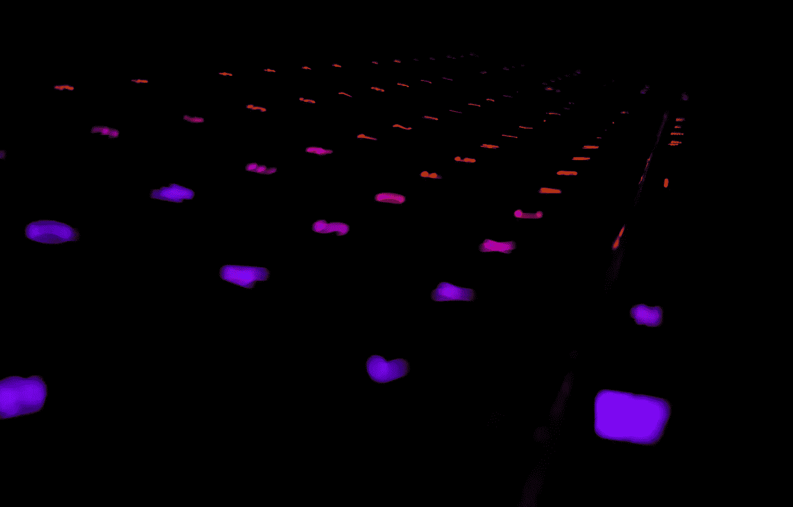
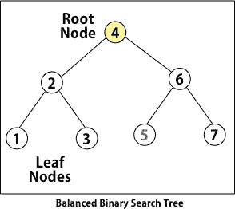
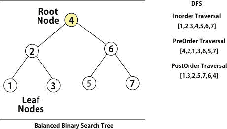
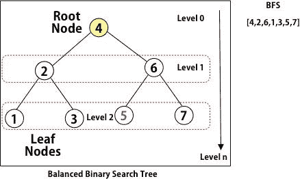

# 使用 Swift 进行深度和广度优先搜索

> 原文：<https://levelup.gitconnected.com/depth-and-breadth-first-search-using-swift-ecd19324543a>



[https://unsplash.com/photos/rfg4l6_lu3c?utm_source=unsplash&UTM _ medium = referral&UTM _ content = creditShareLink](https://unsplash.com/photos/rfg4l6_lu3c?utm_source=unsplash&utm_medium=referral&utm_content=creditShareLink)

下面的文章重点介绍了广泛使用的树遍历技术**(广度和深度优先搜索)。**在我们深入遍历的实现部分之前，我想回顾一下最基本的知识，以便我们理解**树**的数据结构是什么样子。

# 树

树是由节点组成的数据结构。每个节点以自上而下的方式连接到其他节点。

顶部的节点被认为是根节点。**根**可以有一个或多个子代。

没有子节点的节点称为“**叶节点**”。



## 基本树节点实现

```
public class TreeNode{
    public var val:Int
    public var left: TreeNode?
    public var right: TreeNode?
    public init() {
        self.val = 0
        self.left = nil
        self.right = nil
    }
    public init(_ val:Int) {
        self.val = val
        self.left = nil
        self.right = nil
    }

    public init(_ val:Int,_ left:TreeNode?, _ right: TreeNode?){
        self.val = val
        self.left = left
        self.right = right
    }
}
```

# 深度优先搜索

深度优先搜索是一种以特定模式遍历树的算法。问题是，除非我们到达树的底部，否则我们会一直以特定的模式遍历节点。

在这个算法中可以使用不同类型的遍历，但是总体概念是相同的。

## 遍历类型

*   **按顺序** —左—根—右
*   **前序** —根—左—右
*   **发布顺序** —左—右—根



## DFS 实施

```
//Inorder Traversal
var result:[TreeNode] = [TreeNode]()func dfs_inorder(_ root: TreeNode?) -> TreeNode? {

    if root == nil {
        return root
    }

    dfs_inorder(root?.left)
    if let root = root {
        result.append(root)
    }
    dfs_inorder(root?.right)

    return root;

}
// Preorder
func dfs_preorder(_ root: TreeNode?) -> TreeNode? {

    if root == nil {
        return root
    } if let root = root {
        result.append(root)
    }
    dfs_inorder(root?.left)
    dfs_inorder(root?.right)

    return root;

}
//PostOrder
func dfs_postorder(_ root: TreeNode?) -> TreeNode? {

    if root == nil {
        return root
    }

    dfs_inorder(root?.left)
    dfs_inorder(root?.right)
    if let root = root {
        result.append(root)
    }
    return root;

}
```

这涵盖了树中深度优先遍历的实现部分。如果您想执行 DFS，请记住使用递归来遍历树。对于树来说，这是最常用的遍历技术之一。

# 广度优先搜索(BFS)

BFS 是另一种被强烈推荐的遍历树和图的技术。树顶部的节点被认为是在零层，然后它从上到下向前移动。树中的节点基于**级别**而不是深度进行分组。

通常，人们对使用递归来实现 BFS 有一种误解，但实际上这是使用**队列**来实现的。如果你理解遍历算法，这相当简单。



## BFS 实施

```
var bfsResult:[Int] = []
func bfs(_ queue: inout [TreeNode], _ root: TreeNode?) {

    guard let root = root else {return}

    if queue.isEmpty {
        queue.append(root)
    }

    while !queue.isEmpty {

        var counter = queue.count - 1

        while counter >= 0 {

            let removedEl =  queue.removeFirst()
            bfsResult.append(removedEl.val)

            if let left = removedEl.left {queue.append(left)}
            if let right = removedEl.right {queue.append(right)}
            counter -= 1

        }
    }
}
```

这涵盖了 BFS 的实施细节。

我希望这篇文章能帮助你理解使用 Swift 实现树遍历的基础知识。下一篇文章再见。

编码快乐！干杯