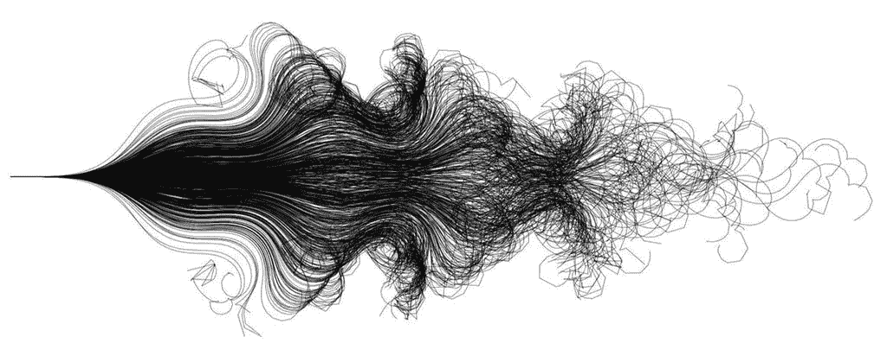
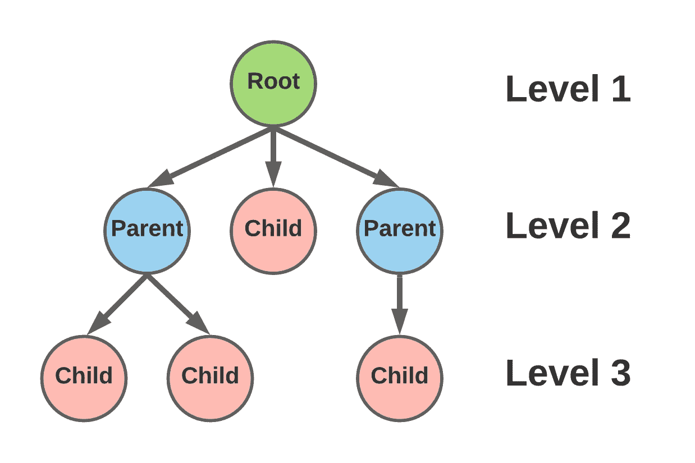
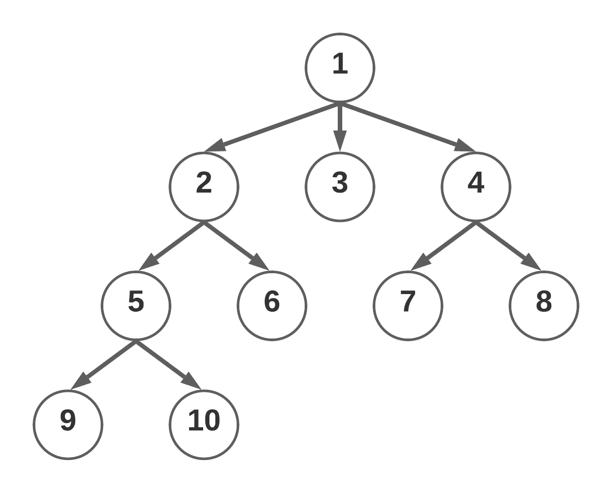

# 围棋深度和广度优先搜索

> 原文：<https://levelup.gitconnected.com/depth-breadth-first-search-in-go-8a6ddcdc73d9>

## 每个开发者都应该知道的两个图算法！

从[开始，骑一辆自行车需要两个神经元](http://paradise.caltech.edu/~cook/papers/TwoNeurons.pdf)

在数据时代，图遍历算法是软件工程师最适用的工具。图遍历是在网络中寻找一些路径的过程，或者只是以特定的方式探索网络。有几十种遍历图的算法和策略——广度优先搜索(BFS)和深度优先搜索(DFS)被证明是处理图问题的简单而高效的算法。

在本文中，除了用我最喜欢的编程语言 Go 实现这两种算法之外，我们还将学习理解它们。

# 理解算法

在我们开始任何代码之前，理解问题总是好的第一步。画出想象图，研究例子，向自己重复这个问题是逐步解决问题的好方法。

用 LucidChart 做的

从基础开始，一个图形网络可以有无限多种大小和配置。本文将关注树格式的图，其中有一个根节点和许多子节点。

任何子节点都被指定为子节点，它所派生的节点被标记为其父节点。

树的每一层都由子层次结构的深度决定。对于理解本文上下文中的图表来说，这些信息已经足够了。

现在，进入算法！

**深度优先搜索** (DFS)将深入而非广泛地探索一个图形。当谈到理解图论时，可视化是关键。如果一张图片胜过千言万语，那么一张 gif 就非常有价值。

这里有一个简单但很棒的例子，说明深度优先搜索如何在继续前进之前深入到图形中。你是否会使用这个特殊的算法，完全取决于你的问题的背景，以及你是否想快速到达图的末端。

来自[维基媒体](https://commons.wikimedia.org/wiki/File:Depth-First-Search.gif)

广度优先搜索 (BFS)将广泛而非深入地探索一个图形。虽然 DFS 试图尽可能快地到达图表的端点，但 BFS 将逐层探索图表。在 DFS 和 BFS 之间做出选择取决于具体环境，它们都以自己的方式同样有用。

来自[维基媒体](https://commons.wikimedia.org/wiki/File:Breadth-First-Search-Algorithm.gif)

# Go 中的实现

现在到了你们真正想要的部分。通过这些例子，我不禁欣赏 Go 在创建自己的定制数据类型时所提供的简单性。这是我们将使用的示例树:

用 LucidChart 做的

在编码面试中，经常会要求在这样的树上执行 DFS 或 BFS。像这样的问题通常要求返回一个数组，该数组由图中节点的值组成，这些值根据我们使用的算法按顺序排列。以下是我们的示例返回值:

**DFS:**【1，2，5，9，10，6，3，4，7，8】

**BFS:**【1，2，3，4，5，6，7，8，9，10】

## 围棋深度优先搜索

DFS 的代码真的不多。我不会在这篇文章中包含构建树的代码，但是如果你真的想看的话，请在下面留下评论，我会添加的！回到我们的例子，我们的`Node`数据类型有两个属性`Value`和一个表示其子节点的节点数组。

我们的`DepthFirstSearch()`函数通过将传递的节点结构作为它的前一个参数`(n *Node)`来操作它。然后，我们按照遍历方法的顺序传递保存数组值的数组。DFS 很简单，因为我们只需在每个节点的子节点上立即调用 DFS。

**注意:**这不是递归算法！我们只是在从前一个节点解包的每个子节点上调用 DFS。我们使用`range`关键字遍历一个节点的子节点，并丢弃第一个参数`_`，因为它只是一个我们不关心的索引。

## **Go 中的广度优先搜索**

BFS 比 DFS 复杂一点，但也不复杂多少！主要的区别在于，我们不是立即遍历我们找到的下一个子节点，而是在移动到下一层之前，将单个节点的每个子节点的值相加。

我们通过利用一个`queue`来实现，我们在第 7 行将其初始化为一个数组，存储对以单个结构开始的节点的引用。然后，我们开始一个 for 循环，只要队列中还有项目，这个循环就会继续。因为`queue`表示我们要遍历的节点的顺序，所以我们知道一旦`queue`为空，我们就已经探索了整个图。

外部的 for 循环表示我们所在的图的级别。所以我们首先用第 9 行队列的第一个元素初始化当前节点。然后我们通过在 Go 中使用数组切片来“弹出”我们的队列。这是通过说我们想要第一个元素和随后的所有元素，即`queue[1:]`来实现的。

接下来，我们将刚才遍历的当前值添加到要返回的值数组中。最后一步是将该节点的所有子节点添加到我们的`queue`中，这是通过在节点的子节点上再次使用`range`关键字来完成的。

> *总之，DFS 和 BFS 的主要区别在于 DFS 会立即遍历下一个子节点，而 DFS 会通过队列逐层浏览图。*

我希望你喜欢阅读这篇文章。如果你想增加更多的细节或者想学习另一种算法，请在下面留下你的评论！感谢阅读。