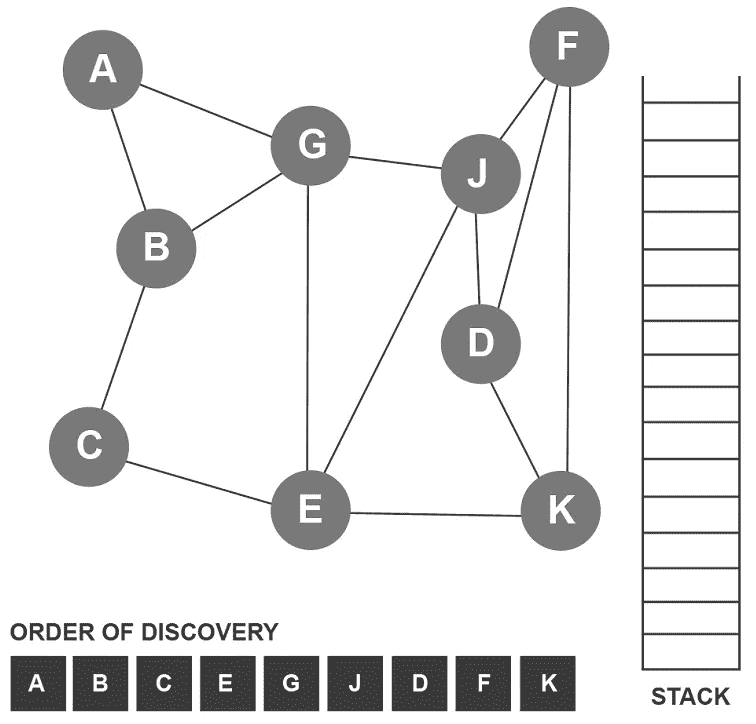

# 直观解释深度优先搜索(DFS)算法

> 原文：<https://levelup.gitconnected.com/depth-first-search-dfs-algorithm-visually-explained-87bca008085f>

深度优先搜索算法遍历图，并在回溯和移动到下一个节点之前探索每个相邻节点。它利用堆栈数据结构。记住，堆栈使用后进先出(LIFO)方法。我们将项目推入堆栈，并从堆栈顶部弹出项目。我们将跟踪堆栈，并按照顶点被发现的顺序显示它们。

我们将从顶点 A 开始遍历。顶点 A 已经被发现，所以它被添加到发现列表中。顶点 A 也被推到堆栈上，并被标记为已访问。

顶点 A 当前位于堆栈的顶部。该算法从顶点 A 开始检查所有未访问的节点。顶点 A 连接到未访问的节点 B 和 DFS 算法将下一个节点推送到堆栈上，在本例中是 B，因为它按字母顺序排列。顶点 B 也被添加到发现列表中，并被标记为已访问。

顶点 B 当前位于堆栈顶部。该算法检查从顶点 B 开始的所有未访问的节点。顶点 B 连接到未访问的节点 C 和 DFS 算法将下一个节点推送到堆栈上，在本例中是 C，因为它按字母顺序排列。顶点 C 也被添加到发现列表中，并被标记为已访问。

顶点 C 当前位于堆栈顶部。该算法检查从顶点 C 开始的所有未访问的节点。顶点 C 连接到未访问的节点 DFS 算法将 E 推送到堆栈上。顶点 E 也被添加到发现列表中，并被标记为已访问。

顶点 E 当前位于堆栈的顶部。该算法从顶点 E 开始检查所有未访问的节点。顶点 E 连接到未访问的节点 G、J 和 DFS 算法将 G 推送到堆栈上。顶点 G 也被添加到发现列表中，并被标记为已访问。

顶点 G 当前位于堆栈的顶部。该算法从顶点 G 开始检查所有未访问的节点。顶点 G 连接到未访问的节点 DFS 算法将 J 推送到堆栈上。顶点 J 也被添加到发现列表中，并被标记为已访问。

顶点 J 当前位于堆栈的顶部。该算法从顶点 J 开始检查所有未访问的节点。顶点 J 连接到未访问的节点 D 和 DFS 算法将 D 推送到堆栈上。顶点 D 也被添加到发现列表中，并被标记为已访问。

顶点 D 当前位于堆栈顶部。该算法从顶点 D 开始检查所有未访问的节点。顶点 D 连接到未访问的节点 F 和 DFS 算法将 F 推送到堆栈上。顶点 F 也被添加到发现列表中，并被标记为已访问。

顶点 F 当前位于堆栈的顶部。该算法从顶点 F 开始检查所有未访问的节点。顶点 F 连接到未访问的节点 DFS 算法将 K 推送到堆栈上。顶点 K 也被添加到发现列表中，并被标记为已访问。

此时，所有节点都已被发现。顶点 K 在栈顶。因为没有其他未访问的节点可以从顶点 K 到达，所以它从栈顶弹出。算法回溯到顶点 F，因为它现在在栈顶。

没有其他未访问的节点可以从顶点 F 到达，所以它从栈顶弹出。该算法回溯到顶点 D，因为它现在在栈顶。

没有其他未访问的节点可以从顶点 D 到达，所以它从栈顶弹出。该算法回溯到顶点 J，因为它现在在栈顶。

没有其他未访问的节点可以从顶点 J 到达，所以它从栈顶弹出。算法回溯到顶点 G，因为它现在在栈顶。

没有其他未访问的节点可以从顶点 G 到达，所以它从栈顶弹出。算法回溯到顶点 E，因为它现在在栈顶。

没有其他未访问的节点可以从顶点 E 到达，所以它从栈顶弹出。该算法回溯到顶点 C，因为它现在在栈顶。

没有其他未访问的节点可以从顶点 C 到达，所以它从栈顶弹出。该算法回溯到顶点 B，因为它现在在栈顶。

没有其他未访问的节点可以从顶点 B 到达，所以它从栈顶弹出。算法回溯到顶点 A，因为它现在在栈顶。

没有其他未访问的节点可以从顶点 A 到达，所以它从栈顶弹出。该算法试图回溯，但堆栈是空的。这向 DFS 算法发出遍历完成的信号。

这是一个很好的例子，说明了 DFS 算法是如何发现所有顶点并在最后回溯的。让我们看另一个简单的例子，其中 DFS 算法在遍历过程中进行回溯。

我们将使用的示例图与上一个相似，但边更少。

我们将从顶点 A 开始 DFS 算法。顶点 A 已经被发现，所以它被添加到发现列表中。顶点 A 也被推到堆栈上，并被标记为已访问。

顶点 A 当前位于堆栈的顶部。该算法从顶点 A 开始检查所有未访问的节点。顶点 A 连接到未访问的节点 B 和 DFS 算法将下一个节点推送到堆栈上，在本例中是 B，因为它按字母顺序排列。顶点 B 也被添加到发现列表中，并被标记为已访问。

顶点 B 当前位于堆栈顶部。该算法检查从顶点 B 开始的所有未访问的节点。顶点 B 连接到未访问的节点 C 和 DFS 算法将下一个节点推送到堆栈上，在本例中是 C，因为它按字母顺序排列。顶点 C 也被添加到发现列表中，并被标记为已访问。

没有其他未访问的节点可以从顶点 C 到达，所以它从栈顶弹出。该算法回溯到顶点 B，因为它现在在栈顶。

顶点 B 当前位于堆栈顶部。该算法检查从顶点 B 开始的所有未访问的节点。顶点 B 连接到未访问的节点 DFS 算法将下一个节点推送到堆栈上，在本例中是 G，因为它按字母顺序排列。顶点 G 也被添加到发现列表中，并被标记为已访问。

顶点 G 当前位于堆栈的顶部。该算法从顶点 G 开始检查所有未访问的节点。顶点 G 连接到未访问的节点 DFS 算法将 E 推送到堆栈上。顶点 E 也被添加到发现列表中，并被标记为已访问。

顶点 E 当前位于堆栈的顶部。该算法从顶点 E 开始检查所有未访问的节点。顶点 E 连接到未访问的节点 J 和 DFS 算法将 J 推送到堆栈上。顶点 J 也被添加到发现列表中，并被标记为已访问。

顶点 J 当前位于堆栈的顶部。该算法从顶点 J 开始检查所有未访问的节点。顶点 J 连接到未访问的节点 D 和 DFS 算法将 D 推送到堆栈上。顶点 D 也被添加到发现列表中，并被标记为已访问。

顶点 D 当前位于堆栈顶部。该算法从顶点 d 开始检查所有未访问的节点。顶点 J 连接到未访问的节点 DFS 算法将 K 推送到堆栈上。顶点 K 也被添加到发现列表中，并被标记为已访问。

没有其他未访问的节点可以从顶点 K 到达，所以它从栈顶弹出。该算法回溯到顶点 D，因为它现在在栈顶。

没有其他未访问的节点可以从顶点 D 到达，所以它从栈顶弹出。该算法回溯到顶点 J，因为它现在在栈顶。

顶点 J 当前位于堆栈的顶部。该算法从顶点 J 开始检查所有未访问的节点。顶点 J 连接到未访问的节点 DFS 算法将 F 推送到堆栈上。顶点 F 也被添加到发现列表中，并被标记为已访问。

没有其他未访问的节点可以从顶点 F 到达，所以它从栈顶弹出。该算法回溯到顶点 J，因为它现在在栈顶。

没有其他未访问的节点可以从顶点 J 到达，所以它从栈顶弹出。算法回溯到顶点 E，因为它现在在栈顶。

没有其他未访问的节点可以从顶点 E 到达，所以它从栈顶弹出。算法回溯到顶点 G，因为它现在在栈顶。

没有其他未访问的节点可以从顶点 G 到达，所以它从栈顶弹出。该算法回溯到顶点 B，因为它现在在栈顶。

没有其他未访问的节点可以从顶点 B 到达，所以它从栈顶弹出。算法回溯到顶点 A，因为它现在在栈顶。

没有其他未访问的节点可以从顶点 A 到达，所以它从栈顶弹出。该算法试图回溯，但堆栈是空的。这向 DFS 算法发出遍历完成的信号。

如果你喜欢你所读的，我的书，**【算法的说明性介绍】，涵盖了这个算法和更多。**

**

*Dino Cajic 目前是 [LSBio(寿命生物科学公司)](https://www.lsbio.com/)、[绝对抗体](https://absoluteantibody.com/)、 [Kerafast](https://www.kerafast.com/) 、 [Everest BioTech](https://everestbiotech.com/) 、 [Nordic MUbio](https://www.nordicmubio.com/) 和 [Exalpha](https://www.exalpha.com/) 的 IT 负责人。他还是我的自动系统公司的首席执行官。他有十多年的软件工程经验。他拥有计算机科学学士学位，辅修生物学。他的背景包括创建企业级电子商务应用程序、执行基于研究的软件开发，以及通过写作促进知识的传播。*

*你可以在 [LinkedIn](https://www.linkedin.com/in/dinocajic/) 上联系他，在 [Instagram](https://instagram.com/think.dino) 上关注他，或者[订阅他的媒体出版物](https://dinocajic.medium.com/subscribe)。*

*阅读 Dino Cajic(以及 Medium 上成千上万的其他作家)的每一个故事。你的会员费直接支持迪诺·卡吉克和你阅读的其他作家。你也可以在媒体上看到所有的故事。*