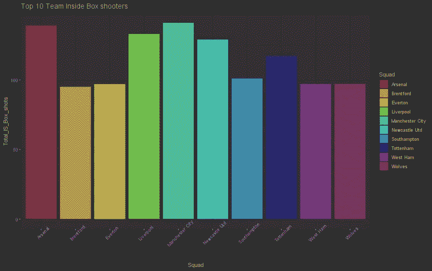

# 使用著名的 worldfootballr 软件包从 fb ref 中获得见解

> 原文：<https://levelup.gitconnected.com/deriving-insights-from-fb-ref-using-the-famous-worldfootballr-package-d4e49de1d391>

当你知道要寻找什么时，搜集和观想洞见会非常简单。

今天的文章让我再次掸掉身上的灰尘，我已经忘记了一些函数是多么的直观！

worldfootballr 是一个不可思议的软件包，用于收集一些最好的免费足球统计网站，今天我已经把它捡起来了，在不久的将来我肯定会用它来建立数据库。

今天我将提取到本周为止每场英超比赛的所有射门数据。这些数据可以在上周一莱斯特对森林的比赛中得到，我希望这个周末的链接可以很快得到。

首先，我已经通过 cran 导入并安装了这些包。

```
*library*(worldfootballR)
*library*(tidyverse)
*library*(ggplot2)
```

使用一个内置的 worldfootballr 函数，我从 fbref 中检索了所有包含比赛镜头的 URL，并将它们设置为一个变量。

```
# retrieve urls for this season

epl_2023_urls <- *fb_match_urls*(country = "ENG", gender = "M", season_end_year = 2023, tier="1st")

epl_shot_Data = *fb_match_shooting*(epl_2023_urls)
```

然后，我将为所有镜头记录的距离(m)列的变量类型更改为数字类型，这样我就可以在创建新列时使用案例来可视化。无论球是在禁区外还是在禁区内，他们都会知道！最后，我将这个表绑定到一个数据帧中。

```
#Convert  column type to numeric
epl_shot_Data$Distance <- *as.numeric*(*as.character*(epl_shot_Data$Distance))

#create new columns
epl_shot_Data$OutsideBoxShot <- *case_when*(
          (epl_shot_Data$Distance >=19) ~ 1,
          (epl_shot_Data$Distance <=18) ~ 0
    )

epl_shot_Data$InsideBoxShot <- *case_when*(
          (epl_shot_Data$Distance <19) ~ 1,
          (epl_shot_Data$Distance >18) ~ 0
    )

epl_shot_Data <- *data.frame*(*cbind*(epl_shot_Data))
```

在这个练习中，我想探究哪些球队和球员在禁区外(和禁区内)是最活跃的。

我必须用 group_by 对每个球队和球员在禁区内外的投篮次数进行分组，并对数值求和，我用 1 表示真，用 0 表示假。然后我在每个类别中选出前十名。

```
players_outside_box <- *data.frame*(epl_shot_Data %>% *group_by*(Shooting_Player, OutsideBoxShot) %>%
  *summarise*(Total_OS_Box_shots=*sum*(OutsideBoxShot)))

players_inside_box <- *data.frame*(epl_shot_Data %>% *group_by*(Shooting_Player, InsideBoxShot) %>%
  *summarise*(Total_IS_Box_shots=*sum*(InsideBoxShot)))

players_outside_box_top10 <- players_outside_box[*with*(players_outside_box,*order*(-Total_OS_Box_shots)),]
players_inside_box_top10 <- players_inside_box[*with*(players_inside_box,*order*(-Total_IS_Box_shots)),]

players_inside_box_top10 <- players_inside_box_top10[1:10,]
players_outside_box_top10 <- players_outside_box_top10[1:10,]

team_outside_box <- *data.frame*(epl_shot_Data %>% *group_by*(Squad, OutsideBoxShot) %>%
  *summarise*(Total_OS_Box_shots=*sum*(OutsideBoxShot)))

team_inside_box <- *data.frame*(epl_shot_Data %>% *group_by*(Squad, InsideBoxShot) %>%
  *summarise*(Total_IS_Box_shots=*sum*(InsideBoxShot)))

team_outside_box_top10 <- team_outside_box[*with*(team_outside_box,*order*(-Total_OS_Box_shots)),]
team_inside_box_top10 <- team_inside_box[*with*(team_inside_box,*order*(-Total_IS_Box_shots)),]

team_inside_box_top10 <- team_inside_box_top10[1:10,]
team_outside_box_top10 <- team_outside_box_top10[1:10,]
```

最后我用老朋友 ggplot2 做一些条形图，以供感悟。

```
# Barplot
*ggplot*(team_inside_box_top10, *aes*(x=Squad, y=Total_IS_Box_shots, fill = Squad)) + *geom_bar*(stat = "identity")  +  *ggtitle*("Top 10 Team Inside Box shooters") + *theme*(axis.text.x = *element_text*(angle=45))

# Barplot
*ggplot*(team_outside_box_top10, *aes*(x=Squad, y=Total_OS_Box_shots, fill = Squad)) + *geom_bar*(stat = "identity")  +  *ggtitle*("Top 10 Team Outside Box shooters") + *theme*(axis.text.x = *element_text*(angle=45))

# Barplot
*ggplot*(players_outside_box_top10, *aes*(x=Shooting_Player, y=Total_OS_Box_shots, fill = Shooting_Player)) +
*geom_bar*(stat = "identity") +  *ggtitle*("Top 10 Outside Box shooters") + *theme*(axis.text.x = *element_text*(angle=45))

# Barplot
*ggplot*(players_inside_box_top10, *aes*(x=Shooting_Player, y=Total_IS_Box_shots, fill = Shooting_Player)) +
*geom_bar*(stat = "identity") +  *ggtitle*("Top 10 Inside Box shooters") + *theme*(axis.text.x = *element_text*(angle=45))
```

让我们展示结果！

*   阿森纳和曼城在禁区内投篮最多。在撰写本文时，他们目前分别排名第二和第一。框内投篮通常等同于高 xG 机会。利物浦和纽卡斯尔紧随其后。



由作者创建。

狼队在禁区外投篮最有希望，难怪他们本赛季得分如此之低！


由作者创建。

现在轮到球员了。

从远处看，马迪森和德布鲁因是最强有力的。这里有意思的是 Neco Williams 特色！他是右后卫。鲁本·内维斯和约翰·麦吉恩一样喜欢充满希望的远射。


由作者创建。

现在让我们看看谁有可能在禁区内投篮。不足为奇的是，这份名单主要由罢工者组成。哈兰是这一指标中的王者。萨卡人的荣誉奖是边锋。这确实表明了前锋们在禁区内完成了大部分的工作。


由作者创建。

就是这样。我希望这个快速练习对你从搜集数据和 r 可视化中获得的一些见解有用。完整代码如下。