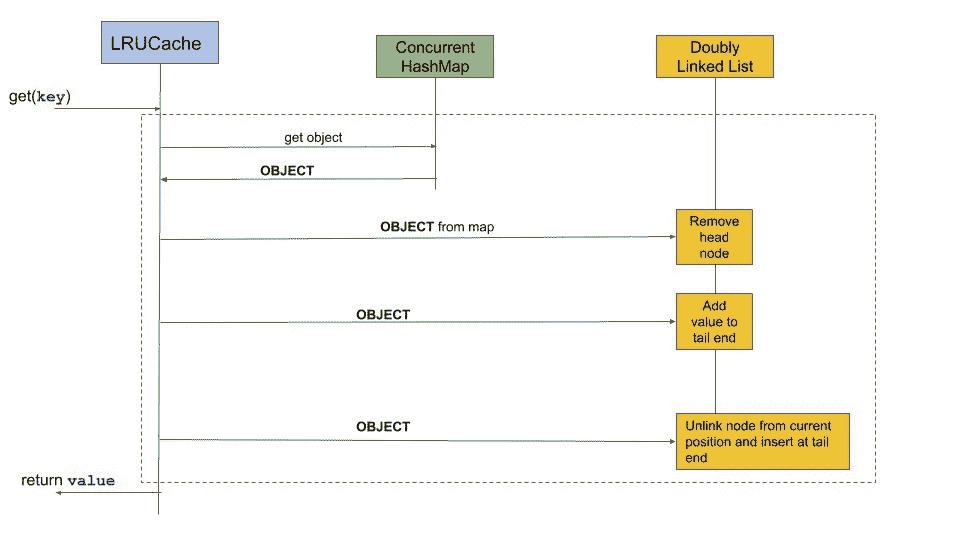

# 用 Python 设计一个最近最少使用的缓存

> 原文：<https://levelup.gitconnected.com/design-an-least-recently-used-cache-in-python-2f2d4a3fee6d>

## 关于 LRU、缓存及其使用哈希表和双向链表的实现细节，您需要了解的一切。


使用哈希表和双向链表的 LRU 缓存

# 目录

*   [什么是 LRU 缓存](#db52)
*   [LRU 用例](#5a67)
*   [实现 LRU](#062f)
*   [使用代码](#42dd)

# **什么是 LRU 缓存**

**缓存的**主要目的是通过减少访问底层较慢存储层的需求来提高数据检索性能。

牺牲容量来换取速度，一个**缓存**通常会暂时存储数据的一个子集，相比之下，数据库的数据通常是完整和持久的。

一个 **LRU 缓存**代表**最近最少使用的**缓存。这是一种高效的缓存数据结构，可用于确定当缓存已满时应该清除什么。它具有以下特点:

*   固定大小 ***缓存容量***
*   项目按照从*最近使用的*到*最近最少使用的*的顺序组织
*   每当一个项目超出容量时，最近最少使用的元素就会被逐出或移除

# LRU 用例

在使用 macOS Finder 时，标题为“ **Recents** ”的侧边栏是基于 LRU 缓存实现的。


最近侧边栏

它实际上是 macOS 中的一个“智能文件夹”，用于搜索最近修改或创建的文件。

这意味着您打开的最后一个文件将位于列表的顶部。这对于查找您最近处理过但似乎在其他地方找不到的文档非常有帮助。

# 实现 LRU 缓存

为了设计和实现最近最少使用(LRU)缓存的数据结构，通常需要对 LRU 概念有一个基本的理解。

[](https://leetcode.com/problems/lru-cache/) [## LRU 缓存- LeetCode

### 提高你的编码技能，迅速找到工作。这是扩展你的知识和做好准备的最好地方…

leetcode.com](https://leetcode.com/problems/lru-cache/) 

LRU 缓存应满足以下要求:

*   用正的大小`capacity`初始化 LRU 缓存。
*   `**get(int key)**`:如果键存在，返回`key`的值，否则返回`-1`。
*   `**put(key, value)**`:如果`key`存在，更新`key`的值。否则，将`key-value`对添加到缓存中。
*   如果键的数量超过`capacity`，则驱逐最近最少使用的键。
*   时间复杂度:**快速访问 O(1)和快速更新 O(1)**

示例:

```
LRUCache cache = new LRUCache(2);

cache.put(5, 7);
cache.put(8, 20);
cache.get(5);       // returns 7
cache.put(3, 6);    // evicts key 8
cache.get(8);       // returns -1 (not found)
cache.put(4, 12);   // evicts key 5
cache.get(5);       // returns -1 (not found)
cache.get(3);       // returns 6
cache.get(4);       // returns 12
```

## 数据结构的构建块

我们使用两种数据结构来实现 LRU 缓存。


使用哈希表和双向链表的 LRU 缓存

1.  **双向链表**

*双向链表*用于**维护**的顺序。最近使用的链接节点将靠近尾部，最近最少使用的节点将靠近头部。

**2。散列表**

Hashmap *将关键字映射到双向链表中节点的地址。*一般来说，在链表中查找一个条目需要 *O* ( *n* )时间，因为我们需要遍历整个链表。然而，通过使用 Hashmap，在缓存的链表中查找一个元素只需要 O(1)时间。

哈希表的最大大小将等于缓存容量。

## Put 操作的流程图


1.  在哈希映射中查找该键。
2.  如果键在哈希映射中(**缓存命中)，则**找到对应的链表节点，从当前位置解除该节点的链接，并将其移动到列表的尾部。
3.  如果该项不在哈希映射中(“**缓存缺失**”)，则将它加载到缓存中
4.  我们的缓存满了吗？如果是这样，我们需要**驱逐一些东西**来腾出空间:获取最近最少使用的缓存项——它将位于链表的头部。通过从链表和哈希映射中移除该项来从缓存中驱逐该项。
5.  为该项创建新的链接列表节点。将其插入到链表的尾部。
6.  将该项添加到哈希映射中，将新创建的链表节点存储为值。

## 获取操作流程图



1.  在哈希映射中查找该键。
2.  获取哈希映射键指向的链接节点对象，从当前位置取消该节点的链接，并将其移动到列表的末尾。

# 使用代码

## 其他相关员额

[](https://dzone.com/articles/java-based-simple-cache-lru-eviction) [## 使用 LRU 驱逐策略的 Java 缓存

### LRU(或最近最少使用的)是一种缓存驱逐策略，其中如果缓存大小已经达到最大分配…

dzone.com](https://dzone.com/articles/java-based-simple-cache-lru-eviction) [](https://krishankantsinghal.medium.com/my-first-blog-on-medium-583159139237) [## 如何用 HashMap 和双向链表实现 LRU 缓存

### LRU 缓存代表最近最少使用的缓存。其驱逐最近最少使用条目。因为缓存的目的是提供…

krishankantsinghal.medium.com](https://krishankantsinghal.medium.com/my-first-blog-on-medium-583159139237)