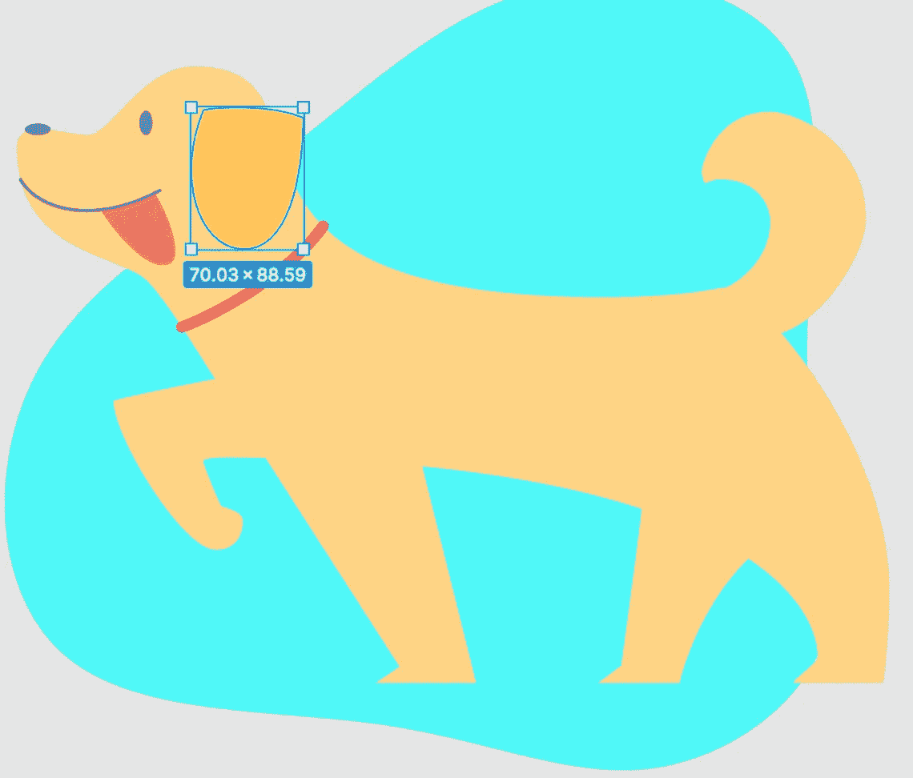

# 用 SVG 设计动画

> 原文：<https://levelup.gitconnected.com/design-animations-with-svgs-afc89544f671>

通过学习如何使用 SVG 创建动画来提升你的 CSS 游戏。

在提高我的前端开发和设计技能的过程中，我遇到了许多关于 SVG 的讨论。我意识到，如果我要在任何地方碰到这个术语，我需要更多地探索这些 SVG 是什么。连 D3.js 都用 SVGs！

SVG 代表可缩放矢量图形。有两种类型的图形，矢量和光栅。光栅图形是使用像素构建的，包括以下图像格式。jpeg，。png 和. gif。矢量图像使用直线和曲线。光栅图形和矢量图形的主要区别在于它们在缩放下的行为。放大光栅图像时，会增加像素的大小，因此图像会变得模糊不清。另一方面，矢量图形可以在没有任何质量损失的情况下进行缩放。SVG 是一种基于 XML 的标记语言，它允许我们在 HTML 中绘制矢量图形。

这个博客将作为 SVG 动画的介绍。我将从 drawkit.io 网站下载一个 SVG。draw kit 上的所有图像都是免费的！我还将使用一个名为 Figma 的设计工具来帮助操纵 SVG。

# 入门指南

首先，在 Figma 上创建一个帐户(除非您已经有了一个帐户)。在您的主页上，单击屏幕右上角的“+”号创建一个新文件。

接下来，在 drawkit.io 上选择一个你想制作动画的 SVG。我选择了这个 doggo 图像。现在，下载图像的 SVG 文件。

狗 SVG

回到 Figma，将下载的 SVG 图像拖放到新文件中。

# 在 Figma 中操作 SVG

使用矢量图形的伟大之处在于，你可以选择你想要设计或制作动画的特定“矢量”或图像的一部分。例如，如果我只想改变衣领的颜色，我可以只选择衣领向量。对于光栅图像，如果没有一些高级的 Photoshopping 技巧，这几乎是不可能或很难做到的。

将 SVG 图像提交到 Figma 后，您会在左侧看到这个菜单。

狗的矢量菜单

这是这个狗 SVG 拥有的所有向量的列表。让我们从改变狗的颜色开始。

改变 Figma 狗项圈的颜色

正如你所看到的，当我点击狗的项圈时，它会在左侧菜单中高亮显示相应的矢量。要更改颜色:查看右边的菜单，单击“Stroke”元素，然后选择一种颜色。

你可以随心所欲地设计这只狗。我将把这只狗变成一只黄色的拉布拉多/金毛猎犬，以纪念我的老狗走过彩虹桥😿🌈。只需在左侧菜单或狗图片上点击选择你想要的矢量。

现在，我们应该有一个想法，我们想动画这只狗的特定元素。我决定制作尾巴、上爪和舌头的动画。

为了做到这一点，我们需要抓住每一个向量。

在 Figma 中选择尾部向量

我们先点击尾部向量。一旦你看到左边菜单上的尾部向量高亮显示，按下`command` + `g`(在 Mac 上)或`ctrl` + `g`(在 Windows 上)。这将创建一个组，自动命名为“组 1”我们应该把这个改名为“尾巴”。对上面的爪子(在半空中的爪子)做同样的动作。

您需要创建组来组织要制作动画的向量。该组的名称将成为 HTML 中元素的 ID 属性(稍后您将看到)。

请注意，SVG 的某些部分有多个向量，您需要将它们放在一个组中。例如，这里的舌头有两个向量:舌头上的线和舌头本身。我们需要抓住这两个向量，并将它们放在一个名为“舌头”的组中

带有舌向量的舌组

*另一个注意:*你也可以通过选择特定的矢量并按“删除”来删除矢量

## 导出 SVG

在我们完成了所有必要向量的分组和 SVG 的设计之后，是时候导出图像了。

在 Figma 上导出 SVG

在右下菜单的“导出”下，确保选择“SVG”。然后，单击 3 点图标并勾选“包括‘id’属性”。最后，单击“导出”，您的 SVG 文件将被下载。

# 制作 SVG 动画

现在我们终于有了我们的 SVG，是时候让这个狗活起来了！我要用 Codepen 来做这个。

首先要做的是将 SVG 文件拖放到 HTML 中。这将产生 SVG 的代码。

接下来是 CSS。我们需要获取“舌头”、“上爪”和“尾巴”的 id。记住这些是我们之前在 Figma 中创建的向量组。重要的部分是使用关键帧来激活这些元素。我不会在这篇博客中详细介绍 CSS 动画。如果你想了解更多，请查看我的另一个[博客](/intro-to-css-animation-31be57f4654c)，我在里面深入解释了 CSS 动画。

我的目标是通过让这只狗摇摆尾巴，上下移动上爪，左右摆动舌头来创造一些微妙的动画。

# 代码和成品

瞧啊。我们刚刚一起创建了我们的第一个 SVG 动画！我希望你和我一样在玩 SVG 的时候玩得开心。随意谷歌“免费 SVG 图片”。有很多资源可以找到 SVG 进行实验。

再见了。😊

我的猫第一次见到他的狗兄弟时的确切反应。