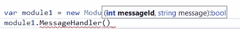

# 在中设计最佳实践。NET C#

> 原文：<https://levelup.gitconnected.com/design-best-practices-in-net-c-8e37b7c3500a>

## 最佳实践

## 一些需要遵循的设计最佳实践。NET C#

由 [Unsplash](https://unsplash.com/?utm_source=unsplash&utm_medium=referral&utm_content=creditCopyText) 上的 [Immo Wegmann](https://unsplash.com/@macroman?utm_source=unsplash&utm_medium=referral&utm_content=creditCopyText) 拍摄，由 [Ahmed Tarek](https://medium.com/@eng_ahmed.tarek) 调整

在软件领域工作了一段合理的时间后，日复一日，你会越来越有信心，仍然有一些你还不知道的新事物。

根据您对不同类型的项目和需求的接触，您将利用新的技能。不过，依我拙见，最珍贵的技能是**分析**和**设计**技能。

不要误解我的意思，我们都知道最终会有一些代码需要编写，并且最终会有人去做。然而，编写代码可以从在线或离线文档或教程中学习。另一方面，**分析**和**设计**技能不同…

在本文中，我们将探索一些实践证明有效的**设计最佳实践**。

 [## 🔥订阅艾哈迈德的时事通讯🔥

### 订阅艾哈迈德的时事通讯📰直接获得最佳实践、教程、提示、技巧和许多其他很酷的东西…

medium.com](https://medium.com/subscribe/@eng_ahmed.tarek) 

# 统一返回对象

你知道当你发现自己需要描述一个方法返回的数据时？我们称之为**元数据**,因为这种信息不是数据本身，而是一些重要的信息，这些信息可以在以后被同一个模块或其他模块用来理解实际的数据或知道如何处理数据。

有时，您需要定义一些元数据并在系统中传播，这一点听起来很清楚，但有时有点棘手。

使用**元数据**的一个著名例子是树结构中的节点对象。除了树结构中关于节点名称、id…和位置的信息之外，您知道每个节点最终都应该保存一些关于业务层次结构中某个实体的信息。

然而，有时并不清楚你是否有元数据 T21。

**当调用一个** `**void RenameFile(string newName)**` **方法**时，传入一个新名称，并且不期望任何返回。然而，在现实世界中，这可能是一个问题，因为可能在保存该文件的文件系统中，这个`newName`已经存在。在这种情况下，该方法需要返回一些东西来通知调用者这一点。

我可以听到有人说“让我们以新名称的字符串形式返回”或者另一个人说“让我们在这种情况下抛出一个异常”。

这些解决方案可能有效，但是，这里最好的办法是返回一个统一的对象，其中包含一些描述实际发生的事情的数据。类似于:

返回统一对象的一些好处:

1.  将逻辑移动到它实际属于的地方，因为在大多数情况下，这迫使调用的处理程序完成其全部工作并提供全部信息，而不是毫无逻辑地将此委托给调用者。
2.  在调用者和处理者之间定义一个更清晰的契约。
3.  呼叫者现在可以根据处理程序提供的全部信息做出准确的决定。
4.  处理统一对象使得设计通用模块变得更加容易。
5.  还有其他人…

如果你想看使用**统一返回对象**的实际实现，你可以查看 [**分页/分区——学习主要的等式以使**](/paging-partitioning-main-equations-to-make-it-easy-44fe89d5290b?sk=f65265d7b4c203ac219e7dec1208c0f2) 和 [**更好的增强存储库模式实现。NET C#**](/better-enhanced-repository-pattern-implementation-in-net-c-4e6f4bbe48a9?sk=dff8866ff91a36a314de8eb40a169955) 。

# 不要滥用依赖注入(DI)、控制反转(IoC)和 IoC 容器

假设您正在定义`Car`类，并且在`Accelerate`方法中您想要记录一条关于汽车当前速度的消息。你会把你的华丽的`ILogger`注入到类的构造函数中，然后开始使用它，对吗？

是的，它可以工作，不幸的是，根据今天的设计标准，这是完美的。不过，我可以问你一件事吗？

如果我们没有一个`ILogger`，`Car`级应该能有预期的表现吧？我们是否可以说`Car`类实际上依赖`ILogger`到了没有它就无法完成工作的程度？

答案很简单，`Car`不应该依赖于`ILogger`。你可能会说，即使它不完全依赖它，它仍然需要它。我对此的回答是:不完全是。`Car`甚至不需要`ILogger`，真正需要`ILogger`的是知道`Car`和`ILogger`的主应用程序。主应用程序需要从`Car`获取一些信息，然后开始使用`Ilogger`记录这些信息。

因此，这里正确的设计是完全去除这种依赖性，开始实现**事件**。因此，在我们的例子中，`Car`类需要定义一个`CarAccelerationChanged`事件，主应用程序应该订阅它。

如果你想了解更多这方面的内容，可以查看 [**何时不使用 DI、IoC 和 IoC 容器**](https://betterprogramming.pub/when-not-to-use-di-ioc-and-ioc-containers-f95881d0fe0?sk=b2aa002a72db4258756feb9cf1daa2a9) 。

# 委派控制如何触发事件

现在，您听取了前面的建议，在`Car`类中定义了伟大的`CarAccelerationChanged`事件，现在让我们看看您是如何实现它的。

太好了，它工作得很好。然而，如果你现在有一种新型汽车，一辆`GhostCar`呢？这个`GhostCar`是一个`Car`但是它是无声的，它不应该报告它的加速度。

在这种情况下，您需要执行如下操作:

你必须对`Car`类做一些修改，你必须从那里复制一些逻辑，这是因为你只想停止触发`CarAccelerationChanged`事件。

你可以通过遵循一个**最佳实践**从一开始就避免这种情况。您应该已经如下定义了您的`Car`类:

# 快照结构

继续我们的`Car`类，现在你正在构建一个`Tracker`模块，它应该跟踪`Car`加速度。现在很明显，`Tracker`模块将订阅`CarAccelerationChanged`事件，如下所示:

我们有一个问题，`Car`在产生`Tracker`之前已经在以稳定的加速度移动了。这意味着在创建`Tracker`的实例时，第 **13** 行的`ShowOnScreen(CurrentAcceleration)`调用将在屏幕上显示**零**，尽管这不是真的。

为了解决这个问题，你需要你的`Car`类来公开一个加速属性，然后使用这个属性来获得第 13 行的加速度的初始值。

然而，如果不仅仅是关于加速度呢？如果你有更多的属性来反映某一时刻的`Car`状态呢？在`Car`类中为所有这些创建属性并不好。

这方面有一个最佳实践，称为**快照**。因此，要应用这一点，代码应该如下所示:

遵循以下模式:

1.  我们定义了一个`CarState`类，用加速度和温度来表示`Car`在某一时刻的状态。注意，它是不可变的。
2.  它还实现了`IEquatable<CarState>`,因此在任何时候，我们都可以比较不同时刻的两个状态，看看状态是否发生了变化。供您参考，如果您使用的是 Visual Studio，您可以使用一些键盘快捷键轻松生成这些成员(在我的 VS 键盘方案上，是 **Alt + Insert** )。
3.  我们在`Car`类中定义了`public CarState Snapshot`。
4.  在`Accelerate`方法中，我们现在正在更新`Snapshot`并在任何需要的地方使用它。
5.  现在，在`Tracker`类中，除了订阅`CarAccelerationChanged`事件之外，我们还使用`Snapshot`来获得加速度值。

现在，这是完美的。

# 不变

长话短说，不变性是好的，让我们做更多🙂

开个玩笑，要知道为什么不变性是好的，让我们看看:

1.  你保持对象的状态安全，不被篡改。
2.  你可以依靠它来做很多事情，比如比较来检查状态。
3.  您可以轻松地编写单元测试。
4.  你可以写干净的代码。
5.  您可以省去在应用更改之前复制对象以保持不同状态的麻烦。
6.  还有其他人…

因此，正如我们对`CarState`类所做的，这是使类不可变的方法。

这里值得一提的是，从 C# 9.0 开始我们有了一个叫做`Record`的东西。我将让你去寻找它。

# 分页和分区

分页是被广泛使用的模式之一，但是几乎没有人在设计实践中谈论它。简单来说，没有什么是绝对的。

当你创建一个 API 时，不管它是不是 REST API，你都必须控制流经你的 API 的数据量。是的，你可以说你没有极限，但实际上，没有。你有极限，但这些极限是如此之高，以至于你错过了它们。

因此，我总是建议开发人员在设计 API 时要做的是设置一个节流策略，并设计解决方案，使他们的 API 和节流策略协调工作。

例如，如果您有一个`GetAllEmployees` API，那么您应该只允许调用者获取少于 10，000 人的所有雇员。然而，如果有一天系统拥有超过 10，000 名员工，此时应该只返回第一个 10，000 名员工，并向调用者提供一个**元数据**对象，告诉他发生了什么以及如何获得下一个 10，000 名员工，等等……这就是**分页**我的朋友。

如果你想了解更多关于分页的内容，可以查看 [**分页/分区——学习主要方程使之变得简单**](/paging-partitioning-main-equations-to-make-it-easy-44fe89d5290b?sk=f65265d7b4c203ac219e7dec1208c0f2) **。**

如果你想看一个如何在设计 API 中使用分页的实际例子，你可以查看。NET C# 。

# 代表职能<>

大多数时候，当我想定义一个方法的引用时，我更喜欢定义一个`delegate`，然后开始使用它。

这两种方式的区别在于，通过定义的`delegate`，您可以获得更好的智能感知和自动完成支持

而不是像这样以另一种方式结束

# 字符串。GetHashCode 噩梦

你有没有想过`String.GetHashCode`会让你发疯？如果没有，它发生了，我的朋友。

在做兼职项目时，我遇到了一个让我抓狂的恼人问题。我花了一段时间才明白是怎么回事，最后我发现是由`String.GetHashCode`引起的。

长话短说，如果你打算持久保存从`String.GetHashCode`返回的值，以便将来在不同的应用程序运行会话中使用，你应该用不同的方法。

如果你想了解这个问题以及如何修复它，你就需要查看文章[中的**时的字符串。中的 GetHashCode()。NET C#让你疯狂**](https://itnext.io/when-string-gethashcode-in-net-c-drives-you-crazy-c97ac7507d7b?sk=f9baa36c281e5f8afd79ef665ab39953) 。

# 将状态与行为分开

在过去，我们曾经解释过**面向对象编程(OOP)语言**中的**类**的含义，它是用来创建对象的模板。我们常说这个模板定义了对象的状态和行为。

因此，按照这个概念，我们过去用字面上属于一个对象的一切来定义类，这包括状态和行为。

然而，在多年开发不同种类的软件系统之后，这种工作方式被证明是低效的，特别是在**游戏开发**领域。

在**游戏开发**领域，对象更有可能改变它们的状态和行为，有时是分开的。因此，很难接受一个对象总是被这些随时可能改变的变量所膨胀。因此，需要一种新的工作方式。

简单来说:

1.  **状态**应该容易持久化、复制、再复制。
2.  **行为**应该在运行时根据需要和变化轻松切换。

如果你想阅读更多关于这个主题的内容，你可以查看文章 [**中的策略设计模式。**NET c#](/strategy-design-pattern-in-net-c-b9dbd863c31e?sk=e96fabc74efc59f6ba55784788b3b69f)。

# 不使用 IoC 容器不是借口

好吧，有时我看到开发人员在新项目或遗留项目上工作，我注意到`new`关键字分散在整个解决方案中。

大多数时候当我问为什么我得到的答案是:

> 不幸的是，我们没有使用控制反转(IoC)容器。

好的，我明白了，出于某种原因，你没有使用控制反转(IoC)容器。但是，然后呢？！！

这不是借口。让我用简单的话来说。

开发人员有时会对**依赖注入(DI)** 、**控制反转(IoC)** 和 **IoC 容器**感到困惑。

这是三件不同的事情，有时它们并不在一起。它不像一个包裹，你要么全部接受，要么全部放弃。

**控制反转(IoC)** 讲的是哪个模块应该依赖哪个模块。因此，它主要是关于以正确的方式定义你的依赖关系。

**依赖注入(DI)** 是关于在依赖它的模块内部注入依赖的方法。

IoC 容器是关于将依赖抽象映射到实现的方法。

因此，如果你在一天结束时没有使用 IoC 容器，这并不意味着你的依赖项应该在没有任何计划和设计的情况下浮动。

是的，你最终会需要使用`new`,但是在一些孤立的地方使用它和在解决方案的任何地方都使用它是有很大区别的。

# 包装静态对象和第三方

大多数时候，我们在编写单元测试时遇到的困难是由静态对象和第三方引起的，我们开始在产品代码中直接使用它们。

对于静态对象和第三方，你失去了使用 mocks 和 stubs 的好处，实际上你让你的生活变得如此艰难。

相反，您应该将这些抽象出来，并将其包装到您可以轻松模仿和粘贴的薄包装中。

如果你想看一个如何做到这一点的实际例子，你可以查看 [**如何完全覆盖。带有单元测试的. NET C#控制台应用程序**](https://itnext.io/how-to-fully-cover-net-c-console-application-with-unit-tests-446927a4a793?sk=63c75b56de78903f09f0d0116df5fe3a) 。

# 使用计时器的最佳实践

在某些情况下，您会发现您需要在解决方案中使用计时器。这是可以的。然而，不可以的是，你假设你不能完全控制你的计时器。

通过控制，我的意思是能够完全测试使用定时器的模块。我知道一些开发者把计时器当成黑洞来处理。有时，在某种程度上，他们使用带有“等待”的循环，而不是使用计时器。

好吧，我明白了，这不是直截了当的，但也不是不可能。我已经写了一篇带有代码示例的文章。如果你愿意，你可以查看文章 [**中使用定时器的最佳实践。NET C#**](/best-practice-for-using-system-timers-timer-in-net-c-867ab6b5027?sk=df2c03aff9a8bddbd62ce4d342d55c71) 。

# 避免代码隐藏意图

有一次，我和一个开发朋友聊天，聊到一半时，我告诉他我们的代码意图应该很清楚。他说到这里停了下来，说这是他第一次听到这句话。

我不确定这是不是我发明的，或者只是我脑海中的一个想法。不过，现在这不是重点。

为了解释我所说的隐藏的意图，让我先解释一些事情。在软件解决方案中，我们有不同的模块。这些模块通过契约相互交互。这些契约代表了输入和输出，但这不是全部。

契约也代表了一些逻辑和它的商业意义。因此，如果你有一个包含两个方法的接口，比如`CalculateIncomeTax`和`CalculateVatTax`，你不能假设终端用户只关心输入和输出，不，他需要相信实现者不会交换这两个方法的实现。这是编译器无法检测到的。

如果你已经知道 SO **L** ID 原则中的**利斯科夫替代原则**，那么你会注意到这指的是我们正在谈论的东西。

如果你想了解更多关于这个话题的内容，可以查看文章[**SOLID:lis kov Substitution Principle 中的解释。NET C#**](/the-liskov-substitution-principle-explained-in-net-c-2a838b8a5155?sk=e12ebd1a8be3c4e2fb7a6670a487f8bf) 。

# 在通用接口旁边定义非通用接口

好吧，仿制药是好的，但是……T2 就足够了吗？我还需要定义`IMyInterface`吗？

为了理解我的意思，你需要看一个真实的例子，这个例子我在我的文章 [**中已经做过了。NET C#**](/a-best-practice-for-designing-interfaces-in-net-c-2c6ebdb4f1c1?sk=1f07b674adf763b7567d652ddd9f4a43) 。

因此，我给你的建议是去看看这篇文章，因为它会带你经历整个经历。

由[皮埃特罗·拉姆帕佐](https://unsplash.com/@peterampazzo?utm_source=unsplash&utm_medium=referral&utm_content=creditCopyText)在 [Unsplash](https://unsplash.com/?utm_source=unsplash&utm_medium=referral&utm_content=creditCopyText) 拍摄，由[艾哈迈德·塔雷克](https://medium.com/@eng_ahmed.tarek)调整

# 最后的话

这些就是我想与你分享的所有**设计最佳实践**吗？绝对没有，但是，这些是最重要的，相信我，我认识一些实际上并不了解它们的前辈。

就这样，希望你觉得读这个故事和我写它一样有趣。

# 希望这些内容对你有用。如果您想支持:

如果您还不是**中型**会员，您可以使用 [**我的推荐链接**](https://medium.com/@eng_ahmed.tarek/membership) ，这样我就可以从**中型**中获得您的一部分费用，您无需支付任何额外费用。订阅
[**我的简讯**](https://medium.com/subscribe/@eng_ahmed.tarek) 将最佳实践、教程、提示、技巧和许多其他很酷的东西直接发送到您的收件箱。

# 其他资源

这些资源可能对你有用。

 [## 中的分层树形数据。NET C#

### 为分层树形数据及其相关操作设计一个数据结构。NET C#

levelup.gitconnected.com](/hierarchical-tree-form-data-in-net-c-d2a868fcb756)  [## 将参数传递给. NET C#方法

### 向. NET C#方法传递参数的不同方式。

levelup.gitconnected.com](/passing-parameters-to-a-net-c-method-388badb7c095)  [## 中的生成器设计模式。NET C#

### 一步一步的指南，从零开始开发一个流畅的 API。NET C#使用生成器设计模式。

levelup.gitconnected.com](/builder-design-pattern-in-net-c-bbf11c891548)  [## 当实现影响抽象时

### 关于实现的知识会影响抽象设计吗？

levelup.gitconnected.com](/when-implementations-affect-abstractions-1bb2adc808d1) 