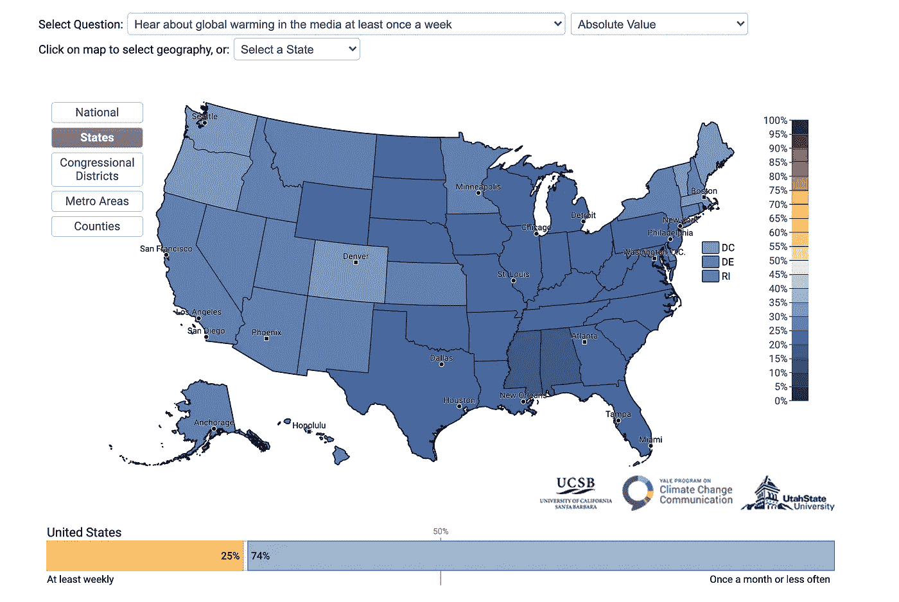

# 设计评论和再设计:可视化气候变化

> 原文：<https://levelup.gitconnected.com/design-critique-and-redesign-visualizing-climate-change-d2e6826a9325>

气候变化影响的可视化

当我负责寻找对我们的人口有影响的最新数据可视化时，我立即想到了气候变化。今年有无数关于普通民众对气候变化感受的预测和评估，每一个都试图强调我们面临的问题的严重性，并唤起我们公民的行动。一些可视化技术在强调气候变化紧迫影响的时间敏感性方面做了很好的工作，例如 [NYC Metronome](https://www.nytimes.com/2020/09/20/arts/design/climate-clock-metronome-nyc.html) ，它显示了“防止全球变暖的影响变得不可逆转的关键行动窗口”的倒计时时间。然而，其他人在明确表达当前对气候变化的看法和立即解决这一问题的重要性方面不太有效。

纽约节拍器

我看过的一个视频是 2020 年 9 月 20 日由[耶鲁气候变化交流项目](https://climatecommunication.yale.edu/)发布的。他们“使用基于 2008 年至 2020 年间收集的全国调查数据(n > 25，000)的统计模型”来估计民意数据，在那里他们收集了从“同意”或“支持”到“不同意”或“反对”等陈述的回应我查看了给出数据的每个问题，发现了下图:

图 1.0: [耶鲁 2020 年气候意见图](https://climatecommunication.yale.edu/visualizations-data/ycom-us/)

[耶鲁 2020 年气候意见地图](https://climatecommunication.yale.edu/visualizations-data/ycom-us/)与参与者一起探索了许多关于环境变化的不同问题，并将他们的数据绘制成如上图所示的图表，显示了每个州/县/地区等给出的陈述的总体情绪。他们研究的深度和他们给出的表示数据的各种方法(水平条形图、标记地图、梯度垂直显示)允许对人口对气候变化的感受进行彻底的分析。此外，它们的间距允许清晰地阅读显示的图形，因为它符合设计的[格式塔原则](https://www.toptal.com/designers/ui/gestalt-principles-of-design)，并使页面上的每个单独的图形“流行”然而，考虑到这个图表/配色方案的性质和图 1.0 中的陈述，我不认为这个可视化在讲述一个完整的故事。

我认为，这种形象化的修辞框架是为了强调这样一种观点，即我们没有足够地听到或谈论全球变暖；然而，这张地图太混乱了，观众很难立即接收到信息。为了解决这个图表中令人困惑的方面，并可能使这个数据更加符合我们一直在学习的数据可视化原则，我创建了这个可视化的以下翻版:

图 2.0:图 1.0 中数据的新表示

我对图表做的第一个改变是它的色标。由于收集到的数据中的回答范围从 0 到 100，从不同意到同意，我觉得在原始图表的一侧使用[发散色标](https://socviz.co/lookatdata.html)表示百分比是不合适的，因为这种色标通常表示从零点值在任一方向上的均匀变化。此外，使用美国两大政党的颜色——红色和蓝色——来选择一种不同的尺度，似乎肯定会做出一种声明，并给美国地图增添意义。然而，这里没有额外的含义，因为民主党人不倾向于认为他们比共和党人更少谈论气候变化，所以这种额外的含义只会导致用户的困惑。

为了以更直接的方式传达信息，我实现了一种顺序灰度，只根据亮度而不是色调来改变每个部分。对调查的回答代表了对同一个问题的一系列回答，没有中间立场可以偏离。特别是因为手头的问题涉及响应者讨论气候变化的频率，从每周到从不，在时间域中没有“中性响应”。此外，我认为，为了生动地描绘民众的感受，用黑白顺序显示美国人同意或不同意手头陈述的程度是一个视觉上更强大的选择。

在这一点上，重要的是要记住[“如果我们选择了错误的调色板来表示我们的数据，对于任何特定的梯度，一个值和另一个值之间相同大小的跳跃(例如，从 0 到 1，与从 3 到 4 相比)可能会被观察者不同地感知。”](https://socviz.co/lookatdata.html)通过选择加入调色板，原始地图可能已经模糊了观众看到每个阴影州的大小的方式，从而模糊了个人对关心/不关心气候变化的人的感知方式。最后，通过去掉地图上无关的颜色，我增加了[数据和墨水的比率](https://speedwell.com.au/insights/2019/the-manifesto-of-the-data-ink-ratio#:~:text=The%20data%2Dink%20ratio%20is,be%20deleted%20everywhere%20where%20possible.)，因此使地图更容易理解。

图 3.0:数据中问题的措辞

我对原始数字所作的第二项修改是手头问题的措辞。我不得不在耶鲁的网站上深入挖掘，以找到向他们的研究参与者提出的原始问题，即:“*你多久在媒体上听到一次全球变暖？”仅仅看着给出的图像，我永远也不会知道这一点。事实上，当我第一次看这张图片的时候，我以为问参与者的问题是“我们应该多长时间在媒体上听到一次全球变暖？”对这两个问题的回答讲述了完全不同的故事:一个关于现在，一个关于未来。因此，我在我对数据的解读中添加了一个更精确的标题，以便让观众明白他们到底在看什么。此外，我在显示结果的水平底部添加了一个渐变，以进一步强调越暗的州，其公民越不可能经常在新闻中听到气候变化。我认为，对图 2.0 中数据的重新解读更清楚地表明，白色的州是异常值，因此也更清楚地表明，大多数州的公民目前定期讨论气候变化是不寻常的。*

可视化的目标受众:每个人。

此外，除了数据分析，我还想谈谈图 1.0 的可访问性。我只能假设这个最初可视化的目标受众是*每个人*；然而，手头的原始数据将一些公民排除在对话之外。当然，色盲公民在观看彩色编码的美国地图时处于不利地位。但是，这种观点地图只能在耶鲁大学气候变化项目的网站上找到，对移动设备不友好(不在手机屏幕上显示完整的地图)，并且只出现在那些已经在寻找气候数据或学术文章的搜索中(周围有许多其他关于保护我们地球重要性的文章)。因此，看起来实际上只有受过教育的人才能看到这些数据，他们很可能已经关心气候变化了。这是不幸的，因为那些需要被提醒我们对地球的影响以及现实(如图 1.0 和 2.0 所示)的人，是那些永远不会遇到气候变化的人，他们目前没有足够的人口定期讨论气候变化。

改变地图的措辞和配色方案是很好的第一步，可以让那些看不到所有颜色或不了解研究中所提问题的深入信息的人更容易获得地图，但要让所有公民更容易获得这些信息，还必须采取更多措施。例如，让这个网站对手机友好将使更多的美国人获得这些信息，考虑到[截至 2019 年 96%的美国人拥有智能手机](https://www.pewresearch.org/internet/fact-sheet/mobile/)，人口正变得[越来越依赖我们的手机获取新闻来源](https://www.journalism.org/2020/07/30/americans-who-mainly-get-their-news-on-social-media-are-less-engaged-less-knowledgeable/)。此外，大多数无法使用其他技术设备并依赖手机获取信息的人[“往往比那些主要使用其他几个平台的人更年轻，不太可能是白人，受教育程度也更低。”](https://www.journalism.org/2020/07/30/americans-who-mainly-get-their-news-on-social-media-are-less-engaged-less-knowledgeable/)这些人群目前不在图 1.0 的分布/表示中考虑。

数据可访问性

为了接触到具有各种背景和观点的更加多样化的美国观众，这种可视化应该是移动友好的，并且应该出现在人们可能还没有注意到气候变化的地方(例如，在社交媒体上，或者在反对文章旁边)。当像图 1.0 这样的可视化的可见性增加时，它的影响会变得更加广泛。我提议重新设计/重新分配图 1.0 中的视觉效果，因为我知道，作为世界公民，我们必须立即采取行动应对气候变化，以保护彼此和我们的星球。因此，有必要使气候数据的可视化尽可能容易理解和深入。