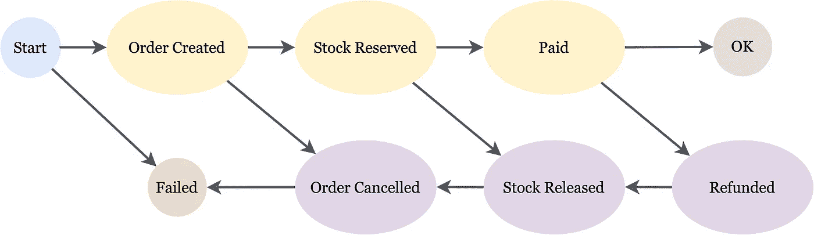
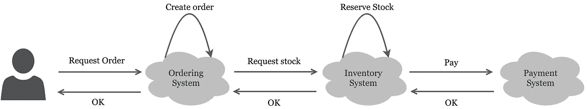
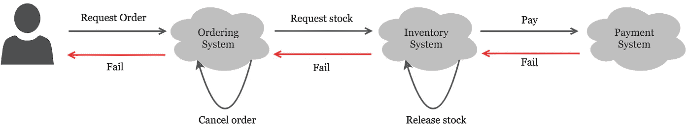
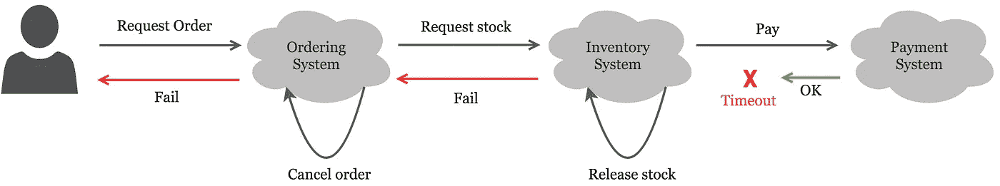
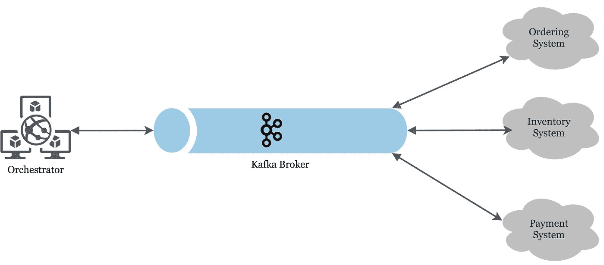
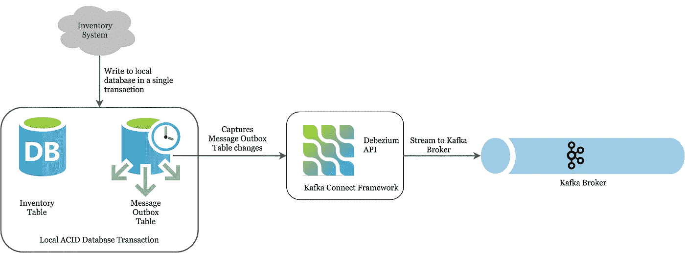
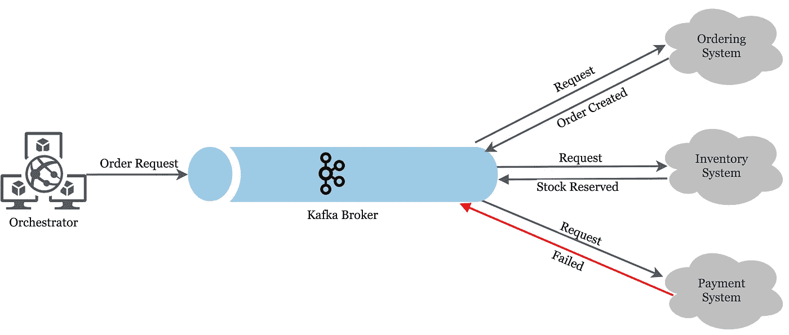
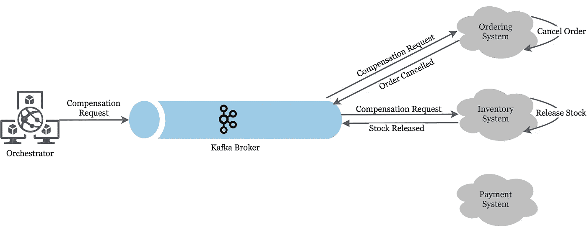

# 面向故障的设计——微服务中的分布式事务

> 原文：<https://levelup.gitconnected.com/design-for-failure-distributed-transaction-in-microservices-f026b25ba847>

有人表白自己对微服务的热爱，大概是没做对。一个觉得有点不方便的人可能正在做一些不完全错误的事情。深恶痛绝的大概是 Devops 的工程师。

当编写微服务时，很容易忘记它固有的分布式和脆弱的本质，尤其是如果整个团队只致力于一个服务。我们需要意识到隐含的网络成本和失败，并完全接受它。

一个理想的微服务只做一件事。它不依赖于其他服务，[就像黑暗森林中的猎人](https://en.wikipedia.org/wiki/Fermi_paradox#It_is_dangerous_to_communicate)，它对周围环境不做任何假设。它只关心自己的弹性和生存。

另一方面，意识到周围环境的微服务是脆弱的。您的应用程序代码需要处理的内容越多，您需要做出的假设就越多。在本帖中，我们将看看如何从应用程序代码中抽象出分布式事务，并让周围的基础设施来处理它。

D 分布式事务是一种跨网络跨多个数据库的事务，同时保留 ACID 属性。如果一个事务要求服务 A 和 B 都写入它们自己的数据库，并且在 A 或 B 失败时回滚，那么它就是一个分布式事务。

它在微服务中的流行是由于体系结构的分布式本质，其中事务通常是隐式分布的。然而，这并不是微服务所独有的。

## 难题

要理解为什么分布式交易很难，让我们看一看教科书上的但在现实生活中非常常见的例子——订购和支付系统。

假设我们有一个库存管理系统、一个订购系统和一个支付系统，每一个都被建模为一个微服务。界限很清楚，订购系统接受订单，库存系统分配库存，而支付系统只处理与支付和退款相关的问题。

单一订单交易=创建订单+储备库存+付款，任何顺序。事务过程中任何一点的失败都会恢复之前的一切。例如，支付失败会导致库存系统释放保留的库存，并导致订购系统取消订单。

前向创造状态和后向补偿状态

# 如何实现脆弱的分布式事务

一个简单的实现通常在服务之间使用链式 HTTP 调用进行 RPC，如果您正在进行一个快速的演示，这很好。

当订单请求进来时，订购系统接受订单，它向库存系统发出 HTTP 调用以保留库存。如果股票预订成功，它将调用支付系统，尝试使用用户提供的信用卡进行支付。否则，不保留该股票。

天真实现的分布式事务的快乐场景

现在，如果支付失败，我们必须回滚股票预订和订单创建。

依赖于稳定网络的级联本地事务回滚

这种方法有一些严重的缺陷。

1.  [分布式系统的谬误](https://en.wikipedia.org/wiki/Fallacies_of_distributed_computing) —在整个交易过程中严重依赖网络的稳定性
2.  事务可能会以不确定的状态结束
3.  易受拓扑变化的影响—每个系统都清楚地知道其依赖性

HTTP 调用无限期阻塞，想象一下支付服务调用一些第三方 API，如 PayPal 或 Stripe，交易实际上不受你的控制。如果 API 关闭或受到限制，会发生什么情况。或者网络路径上的网络中断。或者由于从应用程序错误到[海底电缆中断](https://en.wikipedia.org/wiki/2008_submarine_cable_disruption)的 1000 个原因中的任何一个，3 个服务中的一个服务被关闭。

我们可以设置一个客户端超时。但是你会设置什么呢？5s？10s？30 年代？任何数字都是任意的，并对网络做出隐含的假设。事实上，当一个连接超时时，它根本没有说任何关于事务状态的事情，它只是推断出调用花费的时间超过了您指定的超时时间。

事务处于不确定状态

具体地说，如果库存系统设法保留了一些库存，但是支付系统由于某种原因超时了，我们不能说支付失败了。如果我们将超时视为失败，我们将回滚股票预订并取消订单，但付款实际上确实进行了，可能外部付款 API 比平时花费了更多时间，或者网络中断，因此我们在付款服务有机会响应之前切断了连接。现在交易同时处于已支付和库存释放状态。

所有这些关于周围服务的知识迫使服务去处理细节，而不是提高它的一般弹性。这种原始形式的分布式事务严重依赖于与其他服务的交互，以及网络的可靠性。它极易受到地形变化或最轻微的网络干扰的影响。

有些人可能会建议像指数回退重试这样的事情，但它是对已经架构良好的系统的很好的增强，您不能像创可贴一样在这里应用它。让我们看看如何把它重新架构成更健壮的东西。

# 稳健的策略

应具有以下核心属性:

*   没有明确的服务间通信
*   不对网络和服务的可靠性做出假设
*   作为一系列本地 ACID 事务的全局事务
*   事务总是处于已定义的状态
*   事务状态不受管理
*   最终一致，但仍然一致
*   反应的

我们可以使用 Saga 模式来实现这一点，它将全局分布式事务建模为一系列本地 ACID 事务，并将补偿作为回滚机制。根据本地事务执行的结果，全局事务在不同的已定义状态之间移动。通常有两种 saga 实现。

1.  管弦乐编曲
2.  舞蹈编排

不同的是状态转换的方法，我们将在本帖中讨论第一个。

# 基于编排的传奇

这种类型的传奇是从天真的实现自然演变而来的，因为它可以被增量地采用。

## 管弦乐演奏家

或者说事务管理器，是一个粗粒度的服务，它的存在仅仅是为了促进这个传奇。它负责协调全局事务流，即与事务中涉及的适当服务进行通信，并协调必要的补偿操作。编排器知道全局分布式事务，但是单个服务只知道它们的本地事务。

在讨论补偿的概念之前，让我们通过移除服务之间的显式依赖来稍微改进一下架构。

## 放弃 HTTP 呼叫

还记得因为本地事务中的 RPC 而陷入等待付款服务的库存服务吗？理想情况下，服务的本地 ACID 事务应该只包含 2 个步骤:

1.  本地业务逻辑
2.  通知经纪人其工作已经完成

不要在事务过程中调用另一个服务，而是让服务在其作用域内完成工作，并通过消息代理发布状态。仅此而已。在事务中间的某个地方没有长的、同步的、阻塞的调用。我们将在这个例子中使用 Kafka 作为代理，其原因稍后将变得显而易见。

对于精明的读者来说，是的，通知消息代理破坏了本地事务的 ACID 属性，这在某种程度上破坏了整个要点。通知失败怎么办？数据已经写入数据库！

## 通过事务发件箱的事件驱动消息传递

为了确保这两个步骤在单个 ACID 事务中，我们可以利用[事务发件箱](https://microservices.io/patterns/data/transactional-outbox.html\)模式。

当我们将本地事务的结果写入数据库时，work done 消息也作为事务的一部分包含在消息发件箱表中。这样，本地事务和通知就在一个事务中，但界限分明。工作完成消息已经准备好被消息代理获取并发布。

现在，我们如何以及何时获取信息？数据库必须有办法通知消息代理发生了变化。

## 变更数据捕获

[改变数据捕获(CDC)](https://en.wikipedia.org/wiki/Change_data_capture) 模式确实如此。Kafka Connect 是一个很好的工具，可以捕捉数据库的变化并将其传输到 Kafka。它是一个框架，提供连接器的不同供应商实现，这取决于您的*源*是什么，可能是 Postgresql 数据库、S3 桶，甚至是 RabbitMQ 队列。Kafka Connect 只提供了几个内置的连接器，如果你使用 Postresql，那么你必须安装它的连接器，Debezium 为 Postgresql 提供了一个连接器实现。

使用 Debezium 将数据库更改流式传输到 Kafka

## 补偿

既然所有的服务和编排器都不知道彼此的存在，并且我们已经解决了本地事务问题，那么我们如何对全局分布式事务建模呢？一旦服务完成了它的工作，它就向代理发布一条消息(可能是成功或失败的消息)。如果支付系统发布了失败消息，编排者必须能够“回滚”由订购和库存系统完成的操作。

在这种情况下，每个服务都必须实现它自己版本的补偿函数。提供*储备库存*功能的库存系统还必须提供*释放库存*补偿功能。提供*支付*功能的支付系统还必须提供*退款*补偿功能。等等。

然后，编排器监听失败事件，并发布相应的补偿事件。

支付失败，但订购和库存保留成功的场景

Orchestrator 发布各自的补偿请求

## 处理请求等幂

对于分布式事务中涉及的所有服务来说，正确处理重复的请求是很重要的，否则，祝你好运。这通常是通过在整个分布式事务中使用唯一的幂等键来实现的，并将该键与 API 响应一起存储。每当出现一个重复的请求时，在键值存储中搜索幂等键并返回 API 响应，否则，将其视为一个新的请求。

这打开了分布式缓存的整个潘多拉盒子，我们不会在这里讨论。

# 与抗脆性的关系

虽然不完全抗脆弱，因为这种架构在黑天鹅事件发生时不会*茁壮成长*，但它严格遵守抗脆弱的核心原则。

天真的实现可能在大约 90%的情况下都能完美工作，但是会遭受 10%的巨大损失(这取决于您的业务)。由于最终一致的模型，基于 saga 的架构可能看起来不太优化，但是它对网络的波动是容忍的，并且在发生灾难的情况下，它的缺点是有限的。

# 结论

这不是在分布式系统级别应用“传统事务”的补救措施。相反，它将事务建模为状态机，每个服务的本地事务充当状态转换功能。

它保证事务总是处于许多定义的状态之一。在网络中断的情况下，您总是可以修复问题，并从最后一个已知状态恢复事务。

跟我来@[https://twitter.com/darrenbkl](https://twitter.com/darrenbkl)