# 设计模式协同:探索装饰模式

> 原文：<https://levelup.gitconnected.com/design-pattern-synergies-exploring-the-decorator-pattern-7c29bdd1ab1b>

在这篇文章中，我将谈论一下[装饰者](https://en.wikipedia.org/wiki/Decorator_pattern) [设计模式](https://en.wikipedia.org/wiki/Design_pattern)。

更具体地说，我将展示一些**装饰器**模式与其他**设计模式**的组合，以实现我们代码更好的可读性和可维护性。我将在本文的代码段中使用 **Java** ，但是所有的例子都应该适用于任何面向对象的语言。

在检查设计模式协同之前，让我们确保对**装饰**模式有一个共同的理解。

# 装饰图案定义

> 在面向对象编程中，装饰模式是一种设计模式，它允许动态地将行为添加到单个对象中，而不会影响同一类中其他对象的行为。-维基百科

书中提供的另一个定义[头先设计模式](https://www.oreilly.com/library/view/head-first-design/0596007124/)如下:

> 装饰模式动态地给对象附加额外的责任。Decorators 为扩展功能提供了子类化的灵活替代方案。-头部优先设计模式

# 理解装饰模式

**装饰器**模式有一些非常*强大的*特性。

**装饰模式动态地给一个对象附加额外的责任。**

这意味着人们可以*在[运行时](https://en.wikipedia.org/wiki/Runtime_(program_lifecycle_phase))修饰*一个对象，并为该对象添加额外的功能。

想象一下这个例子。我们有一个将文件写入文件系统的程序。

这可以用如下代码表示:

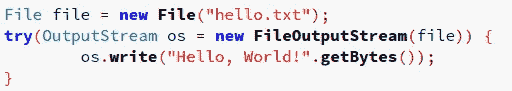

在某些时候，我们决定文件应该被压缩！然后通过遵循**装饰**模式，我们可以添加这个额外的功能*而不改变任何相关的类*！

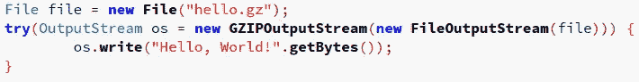

*请记住，如果在其中一个包装器的构建过程中出现错误，则* `*try-with-resources*` *可能会导致* [*无法关闭资源*](https://stackoverflow.com/questions/12552863/correct-idiom-for-managing-multiple-chained-resources-in-try-with-resources-bloc) *。*

为了使运行时的*变化*部分更加明显，假设我们的一些用户想要选择是否压缩文件。

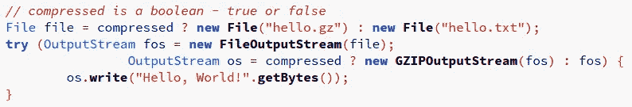

看，在上面的例子*中，行为可以在运行时*决定。

这个案例的关键点是**装饰器**都实现了[输出流](https://docs.oracle.com/en/java/javase/11/docs/api/java.base/java/io/OutputStream.html)接口。

每个**装饰器**都围绕**接口**定义的方法添加了额外的功能。例如， **GZIPOutputStream** 将包装`os.write("Hello, World!".getBytes())`并压缩数据。然后调用 **FileOutputStream** 的`write()`方法，将压缩数据写入指定文件。

我想这是最常见也可能是最强大的**装饰器**模式。你可能有一个**输出流**对象，它已经被*包装了十几次*，每一次都用**装饰器**增加了一点点功能。

除了上面描述的情况，有时候我们可能需要给一个对象添加额外的功能。可能不遵循*通用接口*的功能。

我们仍然可以这样做。考虑下面的例子，我们想额外产生一个已创建文件的散列并打印给用户。

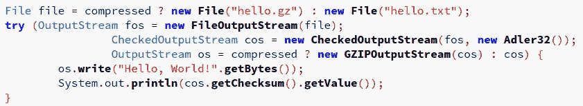

看，我们为[校验和](https://en.wikipedia.org/wiki/Checksum)的计算增加了一些额外的功能。这意味着现在我们依赖于代码中 **cos** 变量的存在，该变量具有*显式*类型的 **CheckedOutputStream** 。

实际上这并不坏。另一方面，如果我们想通过不为每个**装饰器**使用单独的变量来稍微不同地编写*带资源尝试*，事情会变得复杂。

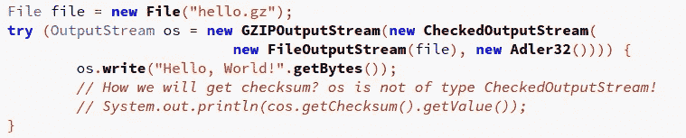

当然，在那种特定的情况下，有一种好的方法可以通过保存对`Adler32`对象的引用来获得**校验和**。

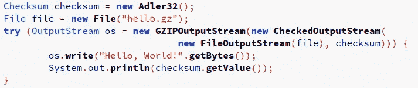

情况并非总是如此，因为我们可能需要访问特定包装器的字段。如果我们需要访问的特定**装饰器**是堆栈中的最后一个，那么访问它就很容易。否则，保留特定装饰器对象的引用是唯一的选择。

# 输出流装饰器

我们在前面的例子中看到的大多数**装饰器**都是 [java.io](https://docs.oracle.com/en/java/javase/11/docs/api/java.base/java/io/package-summary.html) 包的一部分。**装饰者**使用的基本接口是[输出流](https://docs.oracle.com/en/java/javase/11/docs/api/java.base/java/io/OutputStream.html)。

这个**装饰器**有很多实现。人们可以通过检查[输出流](https://docs.oracle.com/en/java/javase/11/docs/api/java.base/java/io/OutputStream.html)接口的 **Javadoc** 来找到它们。

**输出流**的**直接已知子类**有:

*   [ByteArrayOutputStream](https://docs.oracle.com/en/java/javase/11/docs/api/java.base/java/io/ByteArrayOutputStream.html)
*   文件输出流
*   [FilterOutputStream](https://docs.oracle.com/en/java/javase/11/docs/api/java.base/java/io/FilterOutputStream.html)
*   [对象输出流](https://docs.oracle.com/en/java/javase/11/docs/api/java.base/java/io/ObjectOutputStream.html)
*   [PipedOutputStream](https://docs.oracle.com/en/java/javase/11/docs/api/java.base/java/io/PipedOutputStream.html)

除此之外， **FilterOutputStream** 的**直接已知子类**还有:

*   [缓冲输出流](https://docs.oracle.com/en/java/javase/11/docs/api/java.base/java/io/BufferedOutputStream.html)
*   [检查输出流](https://docs.oracle.com/en/java/javase/11/docs/api/java.base/java/util/zip/CheckedOutputStream.html)
*   [密码输出流](https://docs.oracle.com/en/java/javase/11/docs/api/java.base/javax/crypto/CipherOutputStream.html)
*   [数据输出流](https://docs.oracle.com/en/java/javase/11/docs/api/java.base/java/io/DataOutputStream.html)
*   [放气输出流](https://docs.oracle.com/en/java/javase/11/docs/api/java.base/java/util/zip/DeflaterOutputStream.html)
*   [DigestOutputStream](https://docs.oracle.com/en/java/javase/11/docs/api/java.base/java/security/DigestOutputStream.html)
*   [通货膨胀输出流](https://docs.oracle.com/en/java/javase/11/docs/api/java.base/java/util/zip/InflaterOutputStream.html)
*   [PrintStream](https://docs.oracle.com/en/java/javase/11/docs/api/java.base/java/io/PrintStream.html)

**FilterOutputStream** 有这么多子类的原因是*这个类是所有过滤输出流的类的超类。这些流位于已经存在的输出流(底层输出流)之上，它将输出流用作其基本的数据接收器，但可能会沿途转换数据或提供附加功能。*

等等！还有*更有*！**放气输出流**具有以下**直接已知子类**:

*   [GZIPOutputStream](https://docs.oracle.com/en/java/javase/11/docs/api/java.base/java/util/zip/GZIPOutputStream.html)
*   [ZipOutputStream](https://docs.oracle.com/en/java/javase/11/docs/api/java.base/java/util/zip/ZipOutputStream.html)

然后**的 ZipOutputStream** 有作为**直接已知子类的**JarOutputStream。

**PrintStream** 拥有作为**直接已知子类**的 **LogStream** ，然而现在**已弃用**。

如果我们算上**所有的**，我们总共有 **15** 个具体的**输出流**实现。

当然，一个人必须非常熟悉`java.io` **API** 才能充分发挥它的潜力。

**装饰器**模式也用于 **API** 的其他部分，例如[输入流](https://docs.oracle.com/en/java/javase/11/docs/api/java.base/java/io/InputStream.html)。

# 装饰模式的缺点

到现在为止，**装饰器**模式的问题应该很明显了。

*   可能存在太多**装饰器**接口的实现。一个人可能很难找到所有的实现或者知道如何使用它们。注意 **OutputStream** 类甚至没有全部包含在这种**装饰器**专用的包中！
*   很难访问未被基本接口定义的方法，尤其是当添加额外功能的特定**装饰器**被**装饰器**的许多其他实例包装时。

下面我们将尝试通过添加更多的**设计模式**来解决这两个问题！

# 用于比较的代码

在继续之前，让我们设置一些我们稍后将尝试改进的公共代码:

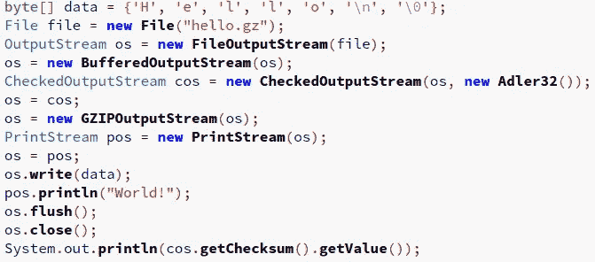

在本例中，我们保留了一个 **OutputStream** 对象，用于在其上执行所有基本操作，我们保留了对 **CheckedOutputStream** 和 **PrintStream** 装饰器的引用，因此我们可以调用这些 **2** 类型专门提供的一些方法。

为了清楚起见，我们现在省略 *try-with-resources* 。

# 使用工厂方法初始化装饰器

初始化共享一个公共**接口**的对象时想到的第一个**设计模式**可能是[工厂方法](https://en.wikipedia.org/wiki/Factory_method_pattern)模式。

通常一个**工厂方法**接受一个或几个参数。我们案例中的工厂方法可能是这样的:

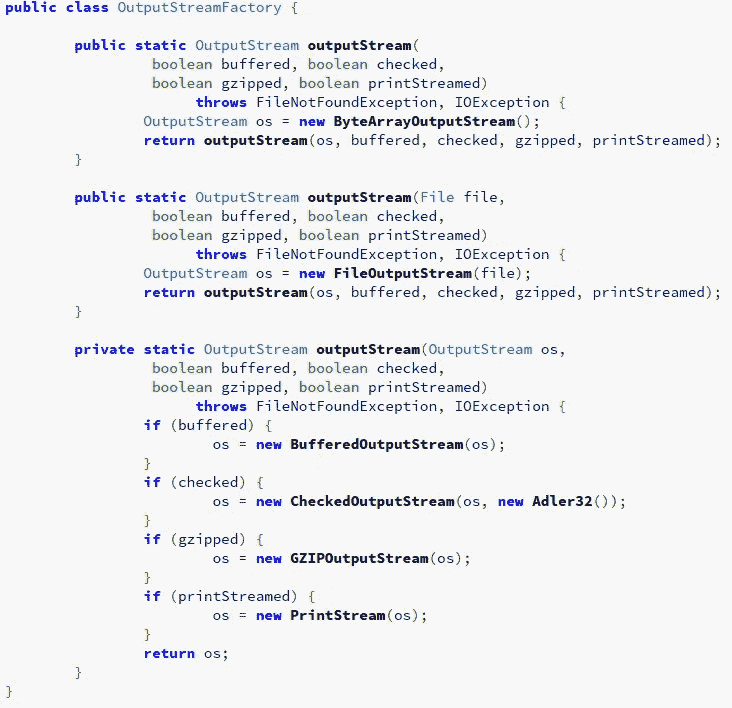

在代码中可以这样使用:

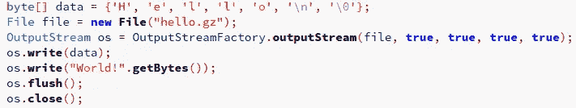

那么，我们取得了什么成就？

**优点**

*   初始化修饰对象的代码更少。
*   我们想要支持的所有可能的 decorators 都可能被 factory 方法初始化。很容易检查一个方法、它的参数和文档，并且知道哪种装饰器是可用的。
*   具体装饰类的使用被封装在**工厂方法**中，这使得未来的修改只需很少的重构工作。

**CONS**

*   没有办法访问内部装饰器。
*   工厂方法可能会因为过多的参数而变得过于拥挤。
*   异常处理和对象初始化可能有点复杂。

总的来说，我个人认为上述解决方案没有任何好处。

也许多个工厂方法的实现有一点不同，每种情况一个可能更有益。

考虑下面的**类**:

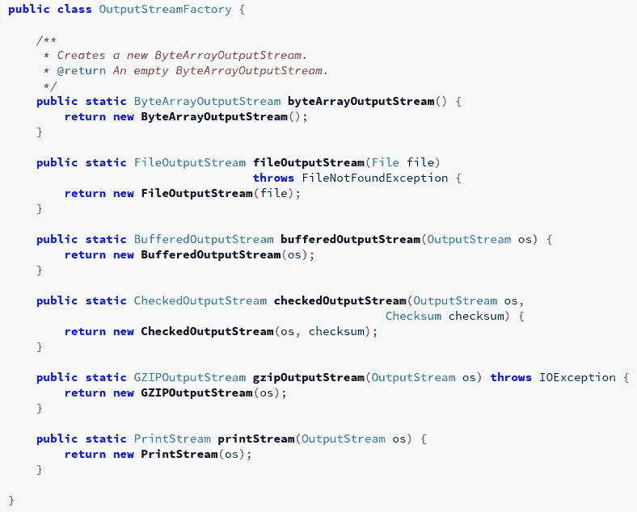

嗯，这样我们实际上将每个具体的**输出流**的初始化包装到了一个单独的方法中。这将被用于这样的行动:

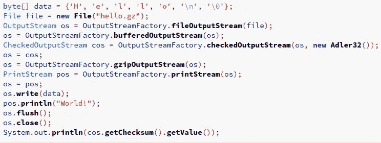

如果你考虑一下，这就像调用具体的构造函数，但是有一些额外的好处！

此外，我们可以返回接口类型，但我没有像本例中那样实现它，以避免额外的**类型转换**。

**额外优势**

*   通过浏览 **OutputStreamFactory** 类的(最好是有文档记录的)方法，很容易找到所有可用的**装饰器**。所有现代的 IDE 都应该支持自动完成。
*   封装的类可以通过最小的重构来改变(特别是如果我们将返回 **OutputStream** 对象而不是具体的类)。

总的来说，我认为只有在周围有太多装饰者的情况下，拥有这样的*类才有好处。**程序员**将可以自由地花更少的时间寻找外部文档，而花更多的时间依靠日常的行业工具，以便轻松地找到所需的信息。*

**CONS**

*   我们以前的其他缺点仍然存在。
*   **API** 过于*冗长。静态导入工厂类使它不那么冗长，但是可读性可能会差一些，因为所有的工厂方法都可能被误认为是本地方法。*

# 使用生成器模式进行装饰

另一种流行的对象创建模式是[构建器模式](https://en.wikipedia.org/wiki/Builder_pattern)。

我们将使用 [Josh Bloch 在](https://en.wikipedia.org/wiki/Joshua_Bloch) [Effective Java](https://www.amazon.co.uk/Effective-Java-Second-Joshua-Bloch/dp/0321356683) 中描述的模式变体。

这应该是这样的:

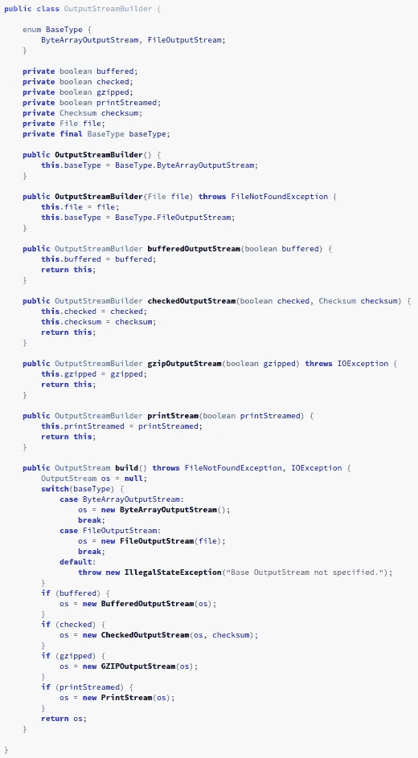

这个可以这样用:

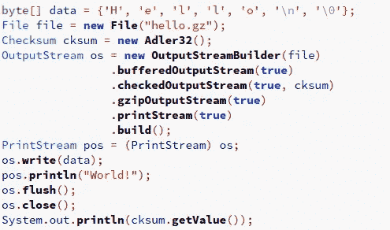

我们来评价一下这种模式吧！

**优点**

*   在**构建器**类下可以很容易地找到**装饰器**。
*   语法足够短。
*   我们可以使用创建的构建器来创建许多类似的对象。

**CONS**

*   我们不能访问中级装饰者。例如，在上面的代码中，我们将**输出流**转换为最后一个使用的**打印流**。例如，我们不能直接访问**检查输出流**。
*   装饰的顺序在`build()`方法中是固定的。我们不能用同一个装饰器进行多次装饰，或者在不使实现过于复杂的情况下轻易改变顺序。但是，这种结构对于大多数常见情况来说已经足够了。

几个音符。

1.  我们可以让 builder 类实现 **Autocloseable** ，以便**正确释放**在 *try-with-resources* 中使用的资源。
2.  如果我们想将 **false** 传递给构建器方法，我们可以省略对它们的调用，因为这是默认值。此外，我们可以实现更流畅的**API**。如果我们根本不接受论点。例如，为上一个示例调用一个更多的 **fluentAPI** 如下所示:

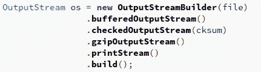

当然，在某些情况下，有参数会让使用 **API** 更容易一些。考虑这样一个例子，其中基于某些条件在运行时添加了**压缩的**功能。

我认为我个人最喜欢这种方式。它有一些粗糙的边缘，但它提供了一个美丽和可读的界面。

# 现在怎么办？更多生成器模式

Bloch 描述的构建器模式有一些重要的好处。

1.  与使用 **setters** 方法初始化对象的 [Javabean](https://en.wikipedia.org/wiki/JavaBeans) 相反，这样我们可以确保创建的对象将被完全初始化，并在使用它之前具有预期的状态。
2.  工厂可以被重用并创建类似对象的其他实例。

就装饰者的建造者而言，我们可能会为了其他利益而忽略这些利益。构建器可以这样写:

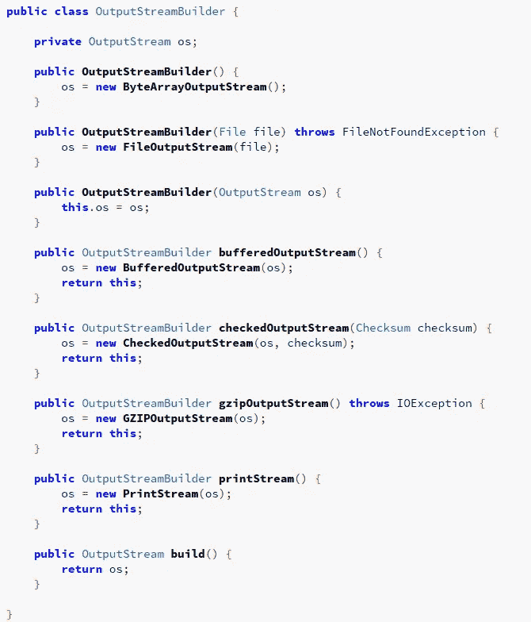

现在，我们已经失去了前面提到的第二个利益。然而，我们获得了其他的东西。我们可以通过这种方式访问中间装饰者:

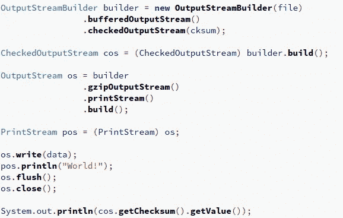

如果需要，我们可以这样多次包装一个装饰器。此外，装饰器的应用顺序不再固定。

正如我们所看到的，与原来的相比，*建筑*物体的这种变化可能通常更适合于建筑**装饰者**。

我想我们已经或多或少地讨论完了初始化装饰者实例的话题。在这个过程中，我们熟悉了每一种方法，以及它带来的好处和带来的问题。

让我们看看能否解决第二个问题。当我们**用装饰器装饰**一个对象时，它增加了**装饰器**接口中没有定义的额外功能，我们必须保留对具体类的引用。

# 遇见适配器

> 在软件工程中，适配器模式是一种软件设计模式(也称为包装器，与装饰器模式共享的替代命名)，它允许将现有类的接口用作另一个接口。[1]它通常用于使现有的类与其他类一起工作，而无需修改它们的源代码。-维基百科

为了解决访问中间具体类的问题，我们可以创建一个公开所有中间接口的[适配器](https://en.wikipedia.org/wiki/Adapter_pattern)。

我们示例中的适配器可能如下所示:

我在这个例子中只实现了一些方法，但是重点是实现添加额外功能的**装饰器**的**所有**。

有了这样的适配器，我们可以直接访问每一个，即使它没有被所有的装饰者实现。如果实现不存在，将抛出**异常**。

这个可以这样用:

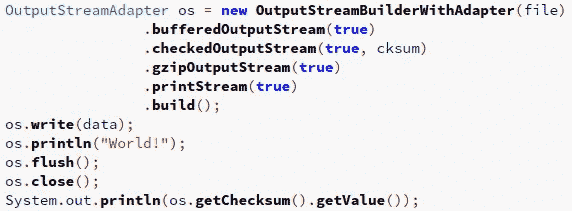

这使用了之前的基于 *Bloch 的* **Builder** 类。但是，需要进行一些修改。`build()`方法应该是这样的:

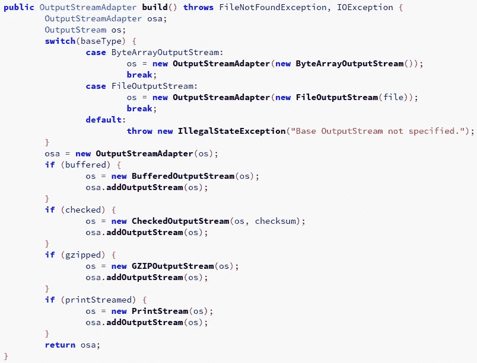

**优点**

*   我们可以访问所有的中间装饰器功能，而不会泄漏对中间具体类的引用。
*   如果实现没有抛出异常并将控制权委托给客户端，或者以某种方式无声地或优雅地失败，我们就有了控制权。

**CONS**

*   实现适配器的更多代码行。
*   维护成本增加。对于每个偏离主接口的新装饰器，我们必须将新方法添加到**适配器**。对于任何变化，我们可能必须相应地更新**适配器**。
*   构建器`build()`方法有点复杂。

不过，总的来说，我觉得在某些场合，它提供了一些有用的功能。

# 结论

在本文中，我们探索了**装饰器**模式与**工厂方法**、**构建器**和**适配器**模式的各种组合。希望我们都能更好地理解每种组合提供了什么。

无论如何不要走出去，开始使用这里演示的每一点设计模式组合。

在大多数情况下，单独使用**装饰器**模式是可以的，尤其是当装饰器的总数很低的时候。只是不要忘记提供必要的文档，也许可以将它们都放在同一个包/目录下。

不要急着添加你不会很快需要或永远不需要的东西。正如您所看到的，上述许多组合增加了复杂性，需要更多的维护工作。保持简单，但要记住问题出现时如何解决。

上述规则的唯一例外可能是您正在构建一个供外部使用的 **API** 。也许提供一个不会在未来引入突破性变化的 **API** 是很重要的。

最后，一些模式如**适配器**、**装饰器**或[、代理](https://en.wikipedia.org/wiki/Proxy_pattern) 共享类似的实现。不要搞混了，有时候差别很微妙。模式的名称首先表明了意图。具体的实现通常是明确定义的，但这是第二位的。

我希望你已经发现以上任何一点有用。直到下一次保持编码**智能** *:-)*

*原载于*[*https://masterex . github . io*](https://masterex.github.io/archive/2020/07/25/decorator-design-pattern-synergies.html)*。*