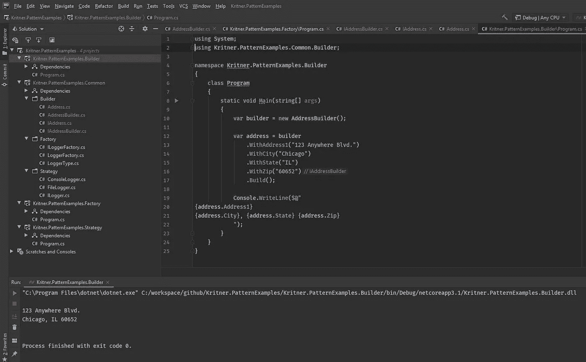

# 设计模式:构建器

> 原文：<https://levelup.gitconnected.com/design-patterns-builder-ac5f2fe78b71>


照片由[纳扎里·尤尔科夫](https://unsplash.com/@simple_shooter?utm_source=medium&utm_medium=referral)在 [Unsplash](https://unsplash.com?utm_source=medium&utm_medium=referral) 上拍摄

构建器是一种创造性的模式，可以用来构建更复杂的对象，而不必在调用代码时重新创建它们。

虽然 builder 模式不是我最常用的*创建模式(那是[工厂](https://blog.kritner.com/2020/02/27/design-patterns-factory))，但我经常依赖它来创建比工厂所允许的更复杂的对象。*

来自[维基百科](https://en.wikipedia.org/wiki/Builder_pattern):

> *构建器模式是一种设计模式，旨在为面向对象编程中的各种对象创建问题提供灵活的解决方案。构建器设计模式的目的是将复杂对象的构造与其表示分离开来。它是四人组设计模式之一。*

我想不出一个非常直截了当的例子来真正展示建设者的力量，但是我将把一些东西扔在一起作为一个示范。还要注意很多。net 核心应用程序引导围绕构建器的概念工作，IHostBuilder 立即出现在脑海中。

# 抽象

```
public interface IAddress
{
    string Address1 { get; }
    string Address2 { get; }
    string Address3 { get; }
    string City { get; }
    string State { get; }
    string Zip { get; }
}

public interface IAddressBuilder
{
    IAddressBuilder WithAddress1(string value);
    IAddressBuilder WithAddress2(string value);
    IAddressBuilder WithAddress3(string value);
    IAddressBuilder WithCity(string value);
    IAddressBuilder WithState(string value);
    IAddressBuilder WithZip(string value);
    IAddress Build();
}
```

上面显示了该模式可以完成的一些事情，但是请记住，这不会像`IHostBuilder`将从框架中给你提供的那样。

我们来分解一下接口暴露的类似方法之一:`IAddressBuilder WithAddress1(string value);`。这个方法接受一个`string value`并返回一个`IAddressBuilder`。这到底是什么意思？这意味着它公开了一个流畅的 api！

等等，什么是流畅的 api？流畅的 API 支持“方法链”，可能是这样的:

```
public void DoStuff()
{
    var address = builder
        .WithAddress1("123 Anywhere Blvd.")
        .WithCity("Chicago")
        .WithState("IL")
        .WithZip("60652")
        .Build();
}
```

因为`IAddressBuilder`中的每一个“非构建”方法都返回一个`IAddressBuilder`，它允许在构建器上“链接”方法调用，如上所述，当调用`.Build()`时，最终在构建的`IAddress`中达到顶点。

# 履行

```
internal class Address : IAddress
{
    public string Address1 { get; }
    public string Address2 { get; }
    public string Address3 { get; }
    public string City { get; }
    public string State { get; }
    public string Zip { get; }

    public Address(string address1, string address2, string address3, string city, string state, string zip)
    {
        Address1 = address1;
        Address2 = address2;
        Address3 = address3;
        City = city;
        State = state;
        Zip = zip;
    }
}

public class AddressBuilder : IAddressBuilder
{
    private string _address1;
    private string _address2;
    private string _address3;
    private string _city;
    private string _state;
    private string _zip;

    public IAddressBuilder WithAddress1(string value)
    {
        _address1 = value;
        return this;
    }

    public IAddressBuilder WithAddress2(string value)
    {
        _address2 = value;
        return this;
    }

    public IAddressBuilder WithAddress3(string value)
    {
        _address3 = value;
        return this;
    }

    public IAddressBuilder WithCity(string value)
    {
        _city = value;
        return this;
    }

    public IAddressBuilder WithState(string value)
    {
        _state = value;
        return this;
    }

    public IAddressBuilder WithZip(string value)
    {
        _zip = value;
        return this;
    }

    public IAddress Build()
    {
        return new Address(_address1, _address2, _address3, _city, _state, _zip);
    }
}
```

上面看起来应该很简单，如果你以前没见过的话，我觉得唯一“奇怪”的是所有`With[x]`实现中的`return this;`。`return this;`完成了前面讨论的方法链接，因为“实例(this)从方法返回，并且可以立即再次被调用”。

这是它运行的一个例子:



# 使用这种模式的原因

为什么您想要使用这种模式可能不是很明显，所以希望这一节能够有所帮助！

*   可以通过工厂处理更复杂的对象构造。一个工厂通常(希望)有一到两个不同的参数来决定返回哪种类型的实例；一个构建者的 API 可以轻松地支持更多，而不会变得不堪重负。
*   “可选”参数对于对象构造来说更简单，只需调用构建器的这一部分。
*   “默认”实现在构建器实现中是可能的(在上面的例子中没有显示)。也许对于“生产”代码来说不是非常有用，但是我已经多次使用它来测试代码。
*   “只读”类可能不需要公开处理参数组合每次迭代的构造函数
*   本文或工厂文章中没有涉及，但这两种模式都可以返回它们的程序集内部的“混凝土”,从而确保对象是由它们的构建者/工厂构建的，而不是直接在代码中更新。
*   构建器可以包含“验证”逻辑，并且可以接受在 POCO 中不需要的依赖项。如果上面的构建器有一个类似于“IStateValidator”的构造器，它可以在设置状态时使用(或者作为“Build()”步骤)
*   这个可能会让人迷惑，但我过去用过，不知道好不好，但至少*聪明*？构建器可以根据构建器的状态返回另一个不同的构建器，而不是返回要构建的对象。设想一个实例，其中一些选项在场景 A 中有效，而其他选项在场景 B 中有效。您不一定希望构建器的使用者能够在您的构建器上设置无效选项，因此您可以引入由根构建器返回的其他构建器(场景 A 和场景 B)。我的意思的例子[https://stack overflow . com/questions/51392145/conditional-variable-scope-in-c-sharp/51392536 # 51392536](https://stackoverflow.com/questions/51392145/conditional-variable-scope-in-c-sharp/51392536#51392536)

# 关于建筑商的重要说明

*   范围——我通常尽可能坚持单例类型的范围，因为除非必要，否则不需要一个类的多个实例。i̵n̵̵t̵h̵e̵̵b̵u̵i̵l̵d̵e̵r̵s̵̵c̵a̵s̵e̵̵*̵i̵t̵̵i̵s̵̵n̵e̵c̵e̵s̵s̵a̵r̵y̵̵t̵o̵̵h̵a̵v̵e̵̵m̵u̵l̵t̵i̵p̵l̵e̵̵i̵n̵s̵t̵a̵n̵c̵e̵s̵̵a̵r̵o̵u̵n̵d̵*̵！̵̵̵b̵u̵i̵l̵d̵e̵r̵s̵̵b̵y̵̵t̵h̵e̵i̵r̵̵n̵a̵t̵u̵r̵e̵̵c̵o̵n̵t̵a̵i̵n̵̵*̵s̵t̵a̵t̵e̵*̵,̵̵a̵n̵d̵̵a̵s̵̵s̵u̵c̵h̵̵s̵h̵o̵u̵l̵d̵̵n̵e̵v̵e̵r̵̵b̵e̵̵i̵n̵̵a̵̵s̵i̵n̵g̵l̵e̵t̵o̵n̵̵s̵c̵o̵p̵e̵,̵̵a̵s̵̵m̵u̵l̵t̵i̵p̵l̵e̵̵c̵o̵n̵t̵e̵x̵t̵s̵̵a̵c̵t̵i̵n̵g̵̵u̵p̵o̵n̵̵a̵̵s̵i̵n̵g̵l̵e̵t̵o̵n̵̵b̵u̵i̵l̵d̵e̵r̵̵c̵a̵n̵̵l̵e̵a̵d̵̵t̵o̵̵s̵o̵m̵e̵̵v̵e̵r̵y̵̵u̵n̵e̵x̵p̵e̵c̵t̵e̵d̵̵b̵e̵h̵a̵v̵i̵o̵r̵.̵:如果你使用复制构造函数，而不是返回“this”而是返回实例的副本，那么你可以继续使用单例作用域。
*   “目标受众”——我不确定这个词是否正确，但是当看建筑商和工厂时，我倾向于认为这两种模式的目标受众是不同的。工厂通常接受一两个参数来决定返回什么样的“东西”实例。在一个构建器中，通常情况下，我只有一个“东西”可以被返回，有很多选项可以用来构建这个东西。

*   [设计模式:工厂](https://medium.com/swlh/design-patterns-factory-b5d0417bb086)
*   [维基百科](https://en.wikipedia.org/wiki/Builder_pattern)
*   [IHostBuilder](https://docs.microsoft.com/en-us/aspnet/core/fundamentals/host/generic-host?view=aspnetcore-3.1)
*   [Neato 构建器链接](https://stackoverflow.com/questions/51392145/conditional-variable-scope-in-c-sharp/51392536#51392536)
*   [GitHub: Kritner。图案样本](https://github.com/Kritner-Blogs/Kritner.PatternExamples)

*原载于 2020 年 6 月 6 日 https://blog.kritner.com*[](https://blog.kritner.com/2020/06/06/design-patterns-builder/)**。**