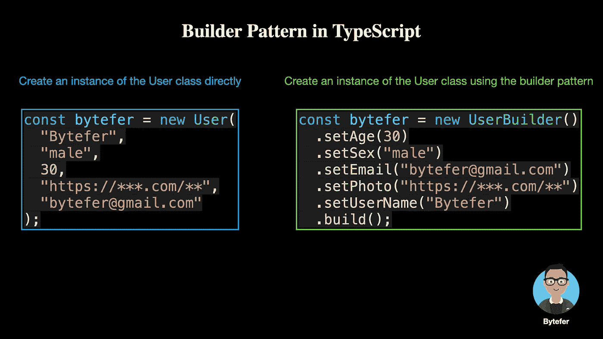

# 设计模式:TypeScript 中的生成器模式

> 原文：<https://levelup.gitconnected.com/design-patterns-builder-pattern-in-typescript-2defc304954a>

## 掌握构建器模式，轻松处理对象的创建。


艾伦·罗德里格斯在 [Unsplash](https://unsplash.com?utm_source=medium&utm_medium=referral) 上的照片

设计模式对于 web 开发人员来说非常重要，通过掌握它们我们可以写出更好的代码。在本文中，我将使用**类型脚本**来介绍**构建器模式。**

构建器模式将一个复杂的对象分解成相对简单的部分，然后根据不同的需求分别创建，最后构建复杂的对象。

那么如何更好地理解构建器模式的作用呢？接下来，我们来举个例子。

```
class User {
  constructor(
    public username: string,
    public sex: string,
    public age: number,
    public photo: string,
    public email: string
  ) {}
}
```

在上面的代码中，我们使用了 class 语法来定义一个`User`类，有了这个类，我们可以创建一个`User`类的实例:

```
const bytefer = new User(
  "Bytefer",
  "male",
  30,
  "[https://***.com/**](https://***.com/**)",
  "[bytefer@gmail.com](mailto:bytefer@gmail.com)"
);
```

对于上面的代码，虽然我们可以成功创建 User 类的一个实例。但是在创建**实例的过程中，我们需要注意** `**User**` **类构造函数参数**的类型和顺序。同时，我们还需要一次传入足够的参数来构造一个`User`类的实例。

要解决上述问题，一个解决方案是使用**构建器设计模式**。这种模式的关键是将一个复杂的对象分解成相对简单的部分，然后根据不同的需求分别创建，最后构建复杂的对象。

了解以上关键信息后，我们来定义一个`UserBuilder`类:

在`UserBuilder`类中，我们定义了几个`setXXX`方法和一个`build`方法。`setXXX`方法用于设置`UserBuilder`实例的属性值，`build`方法用于执行创建`User`类实例的操作。

使用`UserBuilder`类，我们可以通过以下方式创建`User`类的实例:

```
const bytefer = new UserBuilder()
  .setAge(30)
  .setSex("male")
  .setEmail("[bytefer@gmail.com](mailto:bytefer@gmail.com)")
  .setPhoto("[https://***.com/**](https://***.com/**)")
  .setUserName("Bytefer")
  .build();
```

接下来，我们用一个图表来展示创建`User`实例的不同方式:



看完上面的例子，你会发现构建器模式并不复杂。在一个实际的 TypeScript 项目中，我们可以使用 [**builder-pattern**](https://github.com/Vincent-Pang/builder-pattern) 库来高效地使用 builder 模式。

**基本用法**

```
interface UserInfo {
  id: number;
  userName: string;
  email: string;
}const userInfo = Builder<UserInfo>()
                   .id(28)
                   .userName('bytefer')
                   .email('bytefer@gmail.com')
                   .build();
```

**模板对象的用法**

```
const defaultUserInfo: UserInfo = {
  id: 1,
  userName: 'bytefer',
  email: 'bytefer@gmail.com'
};const modifiedUserInfo = Builder(defaultUserInfo)
                          .id(28)
                          .build();
```

**与类对象一起使用**

```
class UserInfo {
  id!: number;
  userName!: string;
  email!: string;
}const userInfo = Builder(UserInfo) 
                   .id(28)
                   .userName('bytefer')
                   .email('bytefer@gmail.com')
                   .build();
```

看了上面三个使用实例，是不是觉得 [builder-pattern](https://github.com/Vincent-Pang/builder-pattern) 库的功能还是挺强大的。实际上，该库是基于 [**ES6 代理 API**](https://developer.mozilla.org/en-US/docs/Web/JavaScript/Reference/Global_Objects/Proxy) 内部实现的。有兴趣可以看它的[源代码](https://github.com/Vincent-Pang/builder-pattern/blob/master/src/Builder.ts)。

在数据查询的场景中，我们经常会看到 builder 模式。比如构造 sql 或者 elasticsearch 查询条件，这里我们以一个 [**bodybuilder**](https://bodybuilder.js.org/) (一个 elasticsearch 查询 bodybuilder)库为例来看看它的基本用法:

```
bodybuilder()
  .query('match', 'message', 'this is a test')
  .filter('term', 'user', 'kimchy')
  .filter('term', 'user', 'herald')
  .orFilter('term', 'user', 'johnny')
  .notFilter('term', 'user', 'cassie')
  .aggregation('terms', 'user')
  .build()
```

最后，让我们总结一下构建器模式的使用场景:

*   当一个类有 4 个以上的构造函数参数，并且其中一些参数是可选的，考虑使用构造函数模式。

如果你有任何问题，请随时给我留言。后面我会继续介绍其他模式，如果你有兴趣，可以关注我的[中](https://medium.com/@bytefer)或者[推特](https://twitter.com/Tbytefer)。

如果你想学习 TypeScript，那么不要错过 TypeScript 系列中的**设计模式，它介绍了一些使用 TypeScript 进行 web 开发时有用的设计模式。**

以前的文章如下:

*   [打字稿中的策略模式](https://javascript.plainenglish.io/design-patterns-strategy-pattern-in-typescript-54eda9b40f09)
*   [打字稿中的责任链模式](https://javascript.plainenglish.io/design-patterns-chain-of-responsibility-pattern-in-typescript-dba6bdffe456)
*   [打字稿中的观察者模式](https://javascript.plainenglish.io/design-patterns-observer-pattern-in-typescript-f6589f1ce4fc)
*   [TypeScript 中的模板方法模式](https://javascript.plainenglish.io/design-patterns-template-method-pattern-in-typescript-ce0c8b158985)
*   [打字稿中的适配器模式](https://javascript.plainenglish.io/design-patterns-adapter-pattern-in-typescript-4b7ad3c1c234)
*   [打字稿中的工厂方法模式](https://javascript.plainenglish.io/design-patterns-factory-method-pattern-in-typescript-c4c3047a6289)
*   [在 TypeScript 中抽象工厂模式](https://javascript.plainenglish.io/design-patterns-abstract-factory-pattern-in-typescript-84cd7b002964)
*   [打字稿中的简单工厂模式](https://javascript.plainenglish.io/design-patterns-simple-factory-pattern-in-typescript-ddb74e9d54eb)


[字节优先](https://medium.com/@bytefer?source=post_page-----2defc304954a--------------------------------)

## 掌握打字稿系列

[View list](https://medium.com/@bytefer/list/mastering-typescript-series-688ee7c12807?source=post_page-----2defc304954a--------------------------------)46 stories