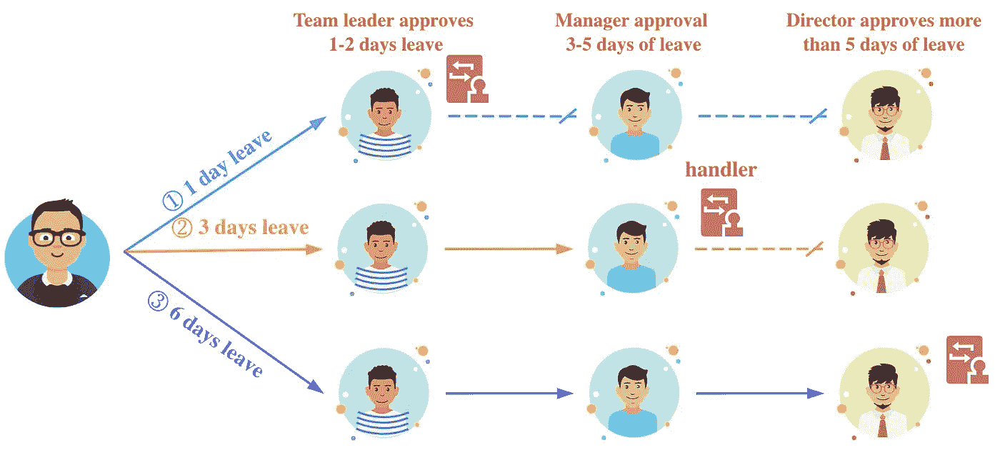
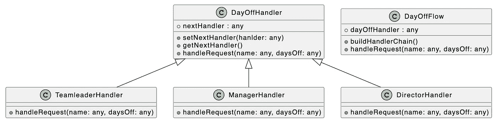

# 设计模式:JavaScript 中的责任链模式

> 原文：<https://levelup.gitconnected.com/design-patterns-chain-of-responsibility-pattern-in-javascript-80b3c44d0f4e>

## 使得对象不需要知道哪个对象处理它的请求和链的结构，并且发送方和接收方不需要有关于彼此的清楚信息。


由[法鲁克·凯马克](https://unsplash.com/@fkaymak?utm_source=medium&utm_medium=referral)在 [Unsplash](https://unsplash.com?utm_source=medium&utm_medium=referral) 上拍摄的照片

设计模式对于 web 开发人员来说非常重要，掌握它们我们可以写出更好的代码。在本文中，我将使用 **JavaScript** 来介绍**责任模式链**。

公司里不同的职位有不同的职责和权限。以某公司的请假流程为例，团队成员请假 1–2 天，组长批准就够了，请假申请不需要流向部门经理和总监。上述公司对应的请假流程如下图所示。



从上图可以看出，如果流程中的审批人(请求处理对象)不能处理当前的休假审批请求，该请求将被转发给下一级审批人。对于 web 开发人员来说，在开发类似的审批流功能时，可以考虑使用**责任链模式**。

责任链模式通过给多个对象一个处理请求的机会，避免了请求的发送方和接收方之间的耦合。**在责任链模式中，许多对象将包含对下一个对象的引用，它们被连接起来形成一个链。**请求在链上传递，直到链上的对象可以处理该请求。

在了解了责任链模式的作用之后，我将带您使用责任链模式来完成请假审批流程的上述功能。责任链模式主要由以下两个角色组成:

*   `Handler`:抽象处理程序类，包含处理请求的抽象方法和指向后继处理程序的成员属性。
*   `ConcreteHandler`:实现请求的具体处理逻辑，内部将决定请求是否可以处理，如果可以直接处理，则请求将被转发给后续的处理程序。

为了更好地理解下面的代码，我们来看看下面对应的 UML 类图:



首先，让我们定义一个用于处理休假请求的抽象处理程序类:

```
class DayOffHandler {
  nextHandler;

  setNextHandler(hanlder) {
    this.nextHandler = hanlder;
  }

  getNextHandler() {
    return this.nextHandler;
  }

  handleRequest(name, daysOff) {
    throw new Error("This method is implemented by subclasses!");
  }
}
```

在`DayOffHandler`抽象类中，私有成员属性`nextHandler`用于保存后继处理程序的引用，`setNextHandler`和`getNextHandler`方法用于设置和获取`nextHandler`属性的值。因为每个角色处理请求的逻辑是不同的，所以我们定义了一个`handleRequest`抽象方法。

然后在`DayOffHandler`抽象类的基础上，通过继承实现不同的子类。需要注意的是，当**每个角色处理一个特定的请求时，会判断自己是否能处理该请求。如果它可以处理请求，它将直接处理它，否则，它将把请求转移到后续处理程序。**

**teamleadhandler**

```
class TeamleaderHandler extends DayOffHandler {
  handleRequest(name, daysOff) {
    const msg = `${name} asked for leave for ${daysOff} days, approved by the team leader`;
    if (daysOff <= 2) {
      console.log(`${msg}, the process is over! \r\n`);
    } else {
      console.log(`${msg}, forwarded to the next level for approval.`);
      this.getNextHandler() &&
        this.getNextHandler().handleRequest(name, daysOff);
    }
  }
}
```

**经理处理员**

```
class ManagerHandler extends DayOffHandler {
  handleRequest(name, daysOff) {
    const msg = `${name} asked for leave for ${daysOff} days, approved by department manager`;
    if (3 <= daysOff && daysOff <= 5) {
      console.log(`${msg}, the process is over! \r\n`);
    } else {
      console.log(`${msg}, forwarded to the next level for approval.`);
      this.getNextHandler() &&
        this.getNextHandler().handleRequest(name, daysOff);
    }
  }
}
```

**董事经理**

```
class DirectorHandler extends DayOffHandler {
  handleRequest(name, daysOff) {
    if (5 < daysOff) {
      console.log(
        `${name} asked for leave for ${daysOff} days, Approved by the director, the process is over! \r\n`
      );
    }
  }
}
```

> 提示:在实际项目中，每个角色可以批准的休假天数应该支持动态配置。

在创建了对应于不同角色的处理程序类之后，我们仍然需要根据休假审批流程将处理程序对象串在一起，形成一个处理程序链。接下来我们要做的是封装上面的处理逻辑，所以我们引入了一个新的类。

```
class DayOffFlow {
  dayOffHandler;
  constructor() {
    this.dayOffHandler = this.buildHandlerChain();
  }

  buildHandlerChain() {
    const teamleaderHandler = new TeamleaderHandler();
    const managerHandler = new ManagerHandler();
    const directorHandler = new DirectorHandler();
    teamleaderHandler.setNextHandler(managerHandler);
    managerHandler.setNextHandler(directorHandler);
    return teamleaderHandler;
  }

  handleRequest(name, daysOff) {
    this.dayOffHandler.handleRequest(name, daysOff);
  }
}
```

在上面的代码中，我们定义了一个`DayOffFlow`类，它包含两个核心方法:

*   `buildHandlerChain`:该方法用于根据已知的休假审批流程构建休假处理链；
*   `handleRequest`:该方法接受两个参数，`name`和`daysOff`分别代表请假人员和请假天数，用于处理实际的请假请求。

现在我们有了`DayOffFlow`类，让我们验证它的功能:

```
const dayOffFlow = new DayOffFlow();
dayOffFlow.handleRequest("Bytefer", 1); // 1 days off
dayOffFlow.handleRequest("Bytefish", 3); // 3 days off
dayOffFlow.handleRequest("Chris1993", 6); // 6 days off
```


当上述代码成功运行时，控制台将输出以下结果:

```
Bytefer asked for leave for 1 days, approved by the team leader, the process is over! 

Bytefish asked for leave for 3 days, approved by the team leader, forwarded to the next level for approval.
Bytefish asked for leave for 3 days, approved by department manager, the process is over! 

Chris1993 asked for leave for 6 days, approved by the team leader, forwarded to the next level for approval.
Chris1993 asked for leave for 6 days, approved by department manager, forwarded to the next level for approval.
Chris1993 asked for leave for 6 days, Approved by the director, the process is over! 
```

最后，让我们总结一下责任链模式的使用场景:

*   有多个对象可以处理同一个请求。哪个对象处理请求将在运行时确定。**客户只需要向链提交请求，不需要关心请求由谁处理以及如何处理**。
*   可以动态指定一组对象来处理请求，客户端可以动态创建一个责任链来处理请求，还可以更改链中处理器的顺序。

稍后我会继续介绍其他模式，如果你有兴趣，可以在 [Medium](https://medium.com/@bytefer) 或者 [Twitter](https://twitter.com/Tbytefer) 上关注我。

如果你想学习打字，不要错过**掌握打字**系列。

[](https://medium.com/frontend-canteen/with-these-articles-you-will-not-be-confused-when-learning-typescript-d96a5c99e229) [## 有了 40+篇文章，学习 TypeScript 就不会迷茫了

### 通过生动的动画，让你轻松了解 TypeScript 的难点和核心知识！不断地…

medium.com](https://medium.com/frontend-canteen/with-these-articles-you-will-not-be-confused-when-learning-typescript-d96a5c99e229)