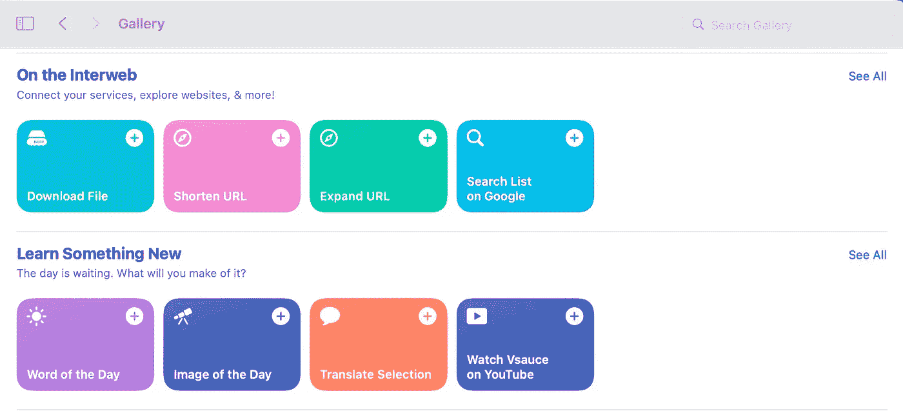
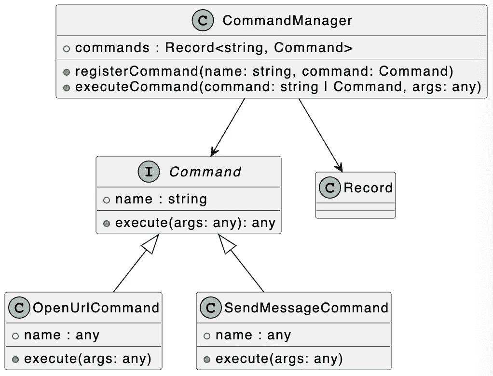

# 设计模式:TypeScript 中的命令模式

> 原文：<https://levelup.gitconnected.com/design-patterns-command-pattern-in-typescript-10b3162e3bee>

## 将呼叫方和接收方解耦，消除不同接收方之间的差异。允许您轻松添加不同的命令来添加不同的功能。


汉娜·乔舒亚在 [Unsplash](https://unsplash.com?utm_source=medium&utm_medium=referral) 上拍摄的照片

欢迎来到 TypeScript 系列的**设计模式，该系列介绍了一些使用 TypeScript 进行 web 开发时有用的设计模式。**

以前的文章如下:

*   [打字稿中的访问者模式](/design-patterns-visitor-pattern-in-typescript-b80bd7cba155)
*   [打字稿中的策略模式](https://javascript.plainenglish.io/design-patterns-strategy-pattern-in-typescript-54eda9b40f09)
*   [TypeScript 中的单例模式](https://medium.com/p/e98ec08a9c14)
*   [类型脚本中的构建器模式](/design-patterns-builder-pattern-in-typescript-2defc304954a)
*   [打字稿中的模板方法模式](https://javascript.plainenglish.io/design-patterns-template-method-pattern-in-typescript-ce0c8b158985)
*   [打字稿中的责任链模式](https://javascript.plainenglish.io/design-patterns-chain-of-responsibility-pattern-in-typescript-dba6bdffe456)

[](https://medium.com/frontend-canteen/9-design-patterns-every-engineer-should-know-f2423d36d468) [## 每个工程师都应该知道的 9 种设计模式

### 掌握这 9 种设计模式，写出更好的代码

medium.com](https://medium.com/frontend-canteen/9-design-patterns-every-engineer-should-know-f2423d36d468) 

设计模式对于 web 开发人员来说非常重要，通过掌握它们我们可以写出更好的代码。在本文中，我将使用 **TypeScript** 来介绍**命令模式。**

在 iOS 和 macOS 上，内置了**快捷方式**应用。有了这个程序，用户可以快速执行一个或多个任务。例如，快速发送消息、翻译文本、缩短 URL 和下载文件等任务。



接下来，让我们实现一个类似的应用程序。在下面的代码中，我们定义了一个`Shortcuts`类，其中创建了`openUrl`、`shortenUrl`、`sendMessage`等 5 个成员方法。

```
class Shortcuts {
  openUrl(url: string) {
    console.log(`Open url: ${url}`);
  }
  shortenUrl(url: string) {
    console.log(`Shorten url: ${url}`);
  }
  sendMessage(msg: string) {
    console.log(`Send message: ${msg}`);
  }
  translateText(originText: string) {
    console.log(`Translate text: ${originText}`);
  }
  downloadFile(fileUrl: string) {
    console.log(`Download file: ${fileUrl}`);
  }
}
```

使用`Shortcuts`类，我们定义了一个`UIEventHandler`类，它包含一个用于处理用户行为事件的`handleAction`成员方法。

```
class UIEventHandler {
  constructor(public shortcuts: Shortcuts) {}

  handleAction(action: ShortcutsMethods, arg: string) {
    this.shortcuts[action](arg);
  }
}

// "openUrl" | "shortenUrl" | "sendMessage" | "translateText" | "downloadFile"
type ShortcutsMethods = Methods<Shortcuts>;

type Methods<T> = {
  [P in keyof T]: T[P] extends (...args: any) => void ? P : never;
}[keyof T];
```

`handleAction`方法接收`action`和`arg` 2 参数。`action`参数的类型为`ShortcutsMethods`，通过`Methods`工具类型生成。此实用工具类型在内部使用 TypeScript 映射类型。如果您想了解更多关于映射类型的知识，我推荐您阅读这篇文章。

[](https://javascript.plainenglish.io/using-typescript-mapped-types-like-a-pro-be10aef5511a) [## 像专业人员一样使用 TypeScript 映射类型

### 映射类型—用动画解释。掌握 TypeScript 映射类型并理解 TypeScript 的内置…

javascript.plainenglish.io](https://javascript.plainenglish.io/using-typescript-mapped-types-like-a-pro-be10aef5511a) 

对于`UIEventHandler`类，我们可以通过以下方式使用它:

```
const shortcuts = new Shortcuts();
const eventHandler = new UIEventHandler(shortcuts);

eventHandler.handleAction("openUrl", "https://medium.com/@bytefer");
eventHandler.handleAction("sendMessage", "Hello Bytefer!");
```

对于前面的代码，似乎没有问题。但仔细分析后，你会发现以下问题:

*   在调用`handleAction`方法时，我们需要保证`action`名称与`Shortcuts`类中方法的名称一致。
*   随着函数的不断增加，`Shortcuts`类中相应的方法也会越来越多。因此，我们需要不断地修改`Shortcuts`类。

那么应该如何处理上述问题呢？对于这个问题，我们可以使用**命令模式**。为了更好地理解下面的代码，我们先来看看相应的 UML 图:



事实上，我们可以将发送消息、翻译文本和缩短 URL 等任务包装成单独的命令。

```
interface Command {
  name: string;
  execute(args: any): any;
}
```

在上面的代码中，我们使用`interface`关键字来定义`Command`类型。在`Command`类型中，定义了一个`execute`方法来封装每个命令需要执行的逻辑。使用`Command`界面，让我们定义具体的命令。

```
class OpenUrlCommand implements Command {
  name = "openUrl";
  execute(args: any) {
    console.log(`Open url: ${args[0]}`);
  }
}

class SendMessageCommand implements Command {
  name = "sendMessage";
  execute(args: any) {
    console.log(`Send message: ${args[0]}`);
  }
}
```

在上面的代码中，我们创建了`OpenUrlCommand`和`SendMessageCommand`类。今后，我们的命令将继续增加。为了便于管理不同的命令类，我们需要定义一个管理命令的类:

```
class CommandManager {
  commands: Record<string, Command> = {};

  registerCommand(name: string, command: Command) {
    this.commands[name] = command;
  }

  executeCommand(command: string | Command, ...args: any) {
    if (typeof command === "string") {
      this.commands[command].execute(args);
    } else {
      command.execute(args);
    }
  }
}
```

在`CommandManager`类中，`registerCommand`方法用于注册命令。而`executeCommand`方法用于执行命令。有了`CommandManager`类，让我们更新之前创建的`UIEventHandler`类。

```
class UIEventHandler {
  constructor(public cmdManager: CommandManager) {}
  handleAction(command: string | Command, arg: string) {
    this.cmdManager.executeCommand(command, arg);
  }
}
```

更新完`UIEventHandler`类后，让我们验证一下它的功能。

```
const commandManager = new CommandManager();
commandManager.registerCommand("openUrl", new OpenUrlCommand());
commandManager.registerCommand("msg", new SendMessageCommand());

const eventHandler = new UIEventHandler(commandManager);
eventHandler.handleAction("openUrl", "https://medium.com/@bytefer");
eventHandler.handleAction("msg", "Hello Medium!");
eventHandler.handleAction(new SendMessageCommand(), "Hello Bytefer!");
```

在上面的代码中，我们首先创建了`CommandManager`对象，然后注册了 2 个命令。然后我们创建一个`UIEventHandler`对象，并在该对象上使用`handleAction`方法来执行注册的命令。上述代码成功执行后，控制台将输出以下信息:

```
Open url: https://medium.com/@bytefer
Send message: Hello Medium!
Send message: Hello Bytefer!
```

**在富文本编辑器和命令行应用程序的环境中，也经常使用命令模式。**比如用于创建命令行应用的第三方库 [CAC](https://github.com/cacjs/cac) ，内部也使用了 command 模式。有兴趣可以看一下[对应的源代码](https://github.com/cacjs/cac/blob/master/src/Command.ts)。

最后，让我们总结一下命令模式的使用场景:

*   当需要抽象各种执行动作时，使用不同的参数来确定执行哪个动作。
*   系统需要分离请求调用者和请求接收者，这样调用者和接收者就不会直接交互。请求的调用方不需要知道接收方的存在，也不需要知道接收方是谁，接收方也不需要关心什么时候被调用。

如果你有任何问题，请随时给我留言。稍后我会继续介绍其他模式，如果你有兴趣，可以在 [Medium](https://medium.com/@bytefer) 或者 [Twitter](https://twitter.com/Tbytefer) 上关注我。

如果你想学习打字稿，那么就不要错过**掌握打字稿**系列。

[](https://medium.com/frontend-canteen/with-these-articles-you-will-not-be-confused-when-learning-typescript-d96a5c99e229) [## 有了 30+篇文章，学习 TypeScript 就不会迷茫了

### 通过生动的动画，让你轻松了解 TypeScript 的难点和核心知识！不断地…

medium.com](https://medium.com/frontend-canteen/with-these-articles-you-will-not-be-confused-when-learning-typescript-d96a5c99e229) 

# 分级编码

感谢您成为我们社区的一员！在你离开之前:

*   👏为故事鼓掌，跟着作者走👉
*   📰查看[升级编码出版物](https://levelup.gitconnected.com/?utm_source=pub&utm_medium=post)中的更多内容
*   🔔关注我们:[Twitter](https://twitter.com/gitconnected)|[LinkedIn](https://www.linkedin.com/company/gitconnected)|[时事通讯](https://newsletter.levelup.dev)

🚀👉 [**加入升级人才集体，找到一份神奇的工作**](https://jobs.levelup.dev/talent/welcome?referral=true)