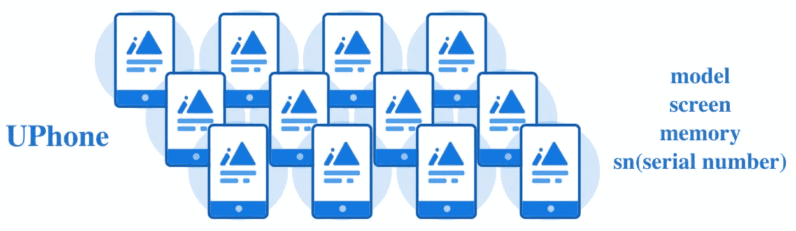
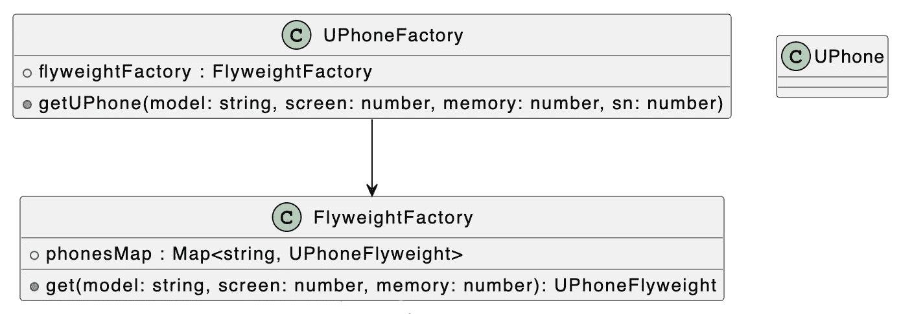
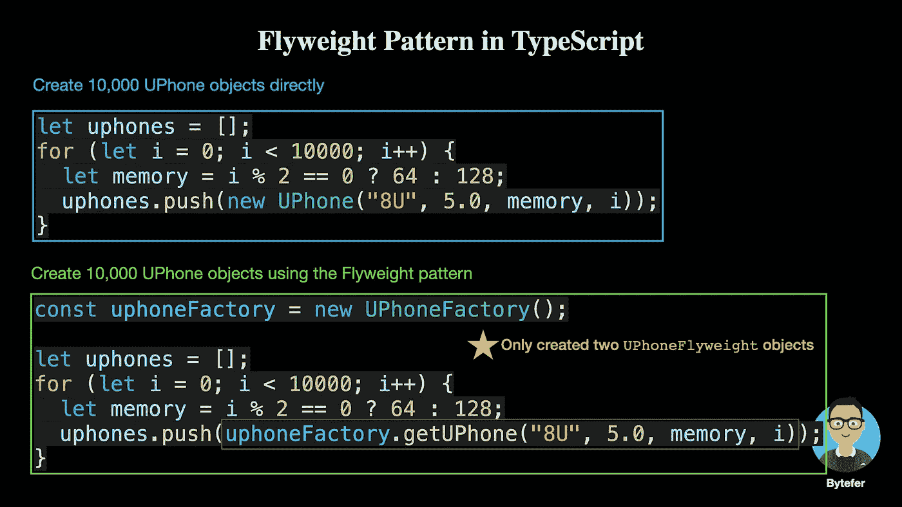

# 设计模式:TypeScript 中的 Flyweight 模式

> 原文：<https://levelup.gitconnected.com/design-patterns-flyweight-pattern-in-typescript-539066d57b42>

## 对象的创建大大减少，系统内存减少，效率提高。


亚历山大·格雷在 [Unsplash](https://unsplash.com?utm_source=medium&utm_medium=referral) 上拍摄的照片

欢迎来到 TypeScript 系列的**设计模式，这里介绍了一些使用 TypeScript 进行 web 开发时有用的设计模式。**

[](https://medium.com/frontend-canteen/9-design-patterns-every-engineer-should-know-f2423d36d468) [## 每个工程师都应该知道的 9 种设计模式

### 掌握这 9 种设计模式，写出更好的代码

medium.com](https://medium.com/frontend-canteen/9-design-patterns-every-engineer-should-know-f2423d36d468) 

设计模式对于 web 开发人员来说非常重要，通过掌握它们我们可以写出更好的代码。在本文中，我将使用**类型脚本**来介绍 **Flyweight 模式。**

Flyweight 模式就是运行共享技术来有效支持大量细粒度对象，避免大量内容相同的小类的开销(比如内存消耗)，允许大家共享一个类。

UPhone 公司是一家手机制造商，它可以批量生产 UPhone 手机，手机的大部分数据，比如型号和屏幕都是一样的，小部分数据是不一样的。例如内存大小和序列号。



```
class UPhone {
  constructor(model: string, screen: number, 
    memory: number, sn: number) {}
}let uphones = [];
for (let i = 0; i < 10000; i++) {
  let memory = i % 2 == 0 ? 64 : 128;
  uphones.push(new UPhone("8U", 5.0, memory, i));
}
```

在上面的代码中，创建了 10，000 个 UPhone 对象，每个 UPhone 独立地申请一个内存。**但如果我们仔细观察，可以看到大部分 UPhone 对象都是相似的，只是内存和序列号不同**。如果是性能要求高的程序，就要考虑优化。对于有大量相似物体的场景，我们可以使用 flyweight 模式进行优化。

flyweight 模式中有两个重要的概念:内部状态和外部状态。

*   **内部状态**:flyweight 对象内部不随外界环境变化而变化的共享部分。
*   **外部状态**:不能共享的状态是随着环境变化而变化的外部状态。

由于 flyweight 模式区分了内部状态和外部状态，**我们可以通过设置不同的外部状态，让同一个对象具有一些不同的特性，而内部状态则设置为同一个部分**。

接下来，我们将介绍如何使用 flyweight 模式来解决前面的问题。为了更好地理解下面的代码，我们先来看看相应的 UML 图:



上例中的大部分 UPhone 手机型号、屏幕、内存都是一样的，所以这部分数据是可以共享的，这是 flyweight 模型中固有的数据，所以我们定义 UPhone 对应的 flyweight 类如下:

```
class UPhoneFlyweight {
  constructor(public model: string, public screen: number,
    public memory: number) {}
}
```

> **内部状态(模型、屏幕、内存)**:flyweight 对象内部不随外界环境变化而变化的共享部分。

在`UPhoneFlyweight`类中，有三个成员属性`model`、`screen`和`memory`。除了 flyweight 类，我们还需要一个 flyweight 工厂来维护这些数据:

```
class FlyweightFactory {
  private phonesMap: Map<string, UPhoneFlyweight> = new Map(); public get(model: string, screen: number, memory: number):  
   UPhoneFlyweight {
    const key = model + screen + memory;
    if (!this.phonesMap.has(key)) {
      this.phonesMap.set(key, new UPhoneFlyweight(model, 
        screen, memory));
    }
    return this.phonesMap.get(key)!;
  }
}
```

在`FlyweightFactory`类中，我们定义了一个`phonesMap`对象来保存 flyweight 对象，并提供了一个`get`方法来根据模型、屏幕和内存参数获取 flyweight 对象。如果`phonesMap`对象包含对应的`UPhoneFlyweight`对象，则直接返回。否则创建一个新的`UPhoneFlyweight`对象并返回。

由于每个 UPhone 的序列号都是唯一的，因此该属性需要用作外部状态。基于`UPhoneFlyweight`类，让我们更新之前定义的`UPhone`类:

```
class UPhone {
  constructor(
    public flyweight: UPhoneFlyweight, 
    public sn: number) {}
}
```

> **外部状态(sn)** :不能共享的状态是随着环境变化而变化的外部状态。

此外，为了更容易地创建 UPhone 对象，我们继续定义一个`UPhoneFactory`类:

```
class UPhoneFactory {
  private static flyweightFactory: FlyweightFactory = 
    new FlyweightFactory(); public getUPhone(model: string, screen: number, 
     memory: number, sn: number) {
       const flyweight: UPhoneFlyweight = 
         UPhoneFactory.flyweightFactory.get(
           model, screen, memory
         );
       return new UPhone(flyweight, sn);
  }
}
```

使用`UPhoneFactory`类，我们可以通过以下方式创建 10，000 个 UPhone 对象:

```
const uphoneFactory = new UPhoneFactory();let uphones = [];
for (let i = 0; i < 10000; i++) {
  let memory = i % 2 == 0 ? 64 : 128;
  uphones.push(uphoneFactory.getUPhone("8U", 5.0, memory, i));
}console.log(
  "UPhoneFlyweight count:",
  UPhoneFactory.flyweightFactory.phonesMap.size
);
```

当您成功运行上述代码时，终端将输出以下结果:

```
UPhoneFlyweight count: 2
```

从上面的结果来看，虽然我们创建了 10000 个 UPhone 对象，但是我们只创建了两个`UPhoneFlyweight`对象。

```
class UPhoneFlyweight {
  constructor(model: string, screen: number, memory: number) {}
}
```



最后，让我们总结一下 flyweight 模式的使用场景:

*   一个程序使用大量相似的对象，造成很大的内存开销；
*   一个对象的大部分状态可以变成外部的，通过剥离一个对象的外部状态，可以用相对较少的共享对象来替换大量的对象。

完整的代码如下所示:

如果你有任何问题，请随时给我留言。稍后我会继续介绍其他模式，如果你有兴趣，可以在 [Medium](https://medium.com/@bytefer) 或 [Twitter](https://twitter.com/Tbytefer) 上关注我。

如果你想学习 TypeScript，那么不要错过**掌握 TypeScript** 系列。

[](https://medium.com/frontend-canteen/with-these-articles-you-will-not-be-confused-when-learning-typescript-d96a5c99e229) [## 有了 30+篇文章，学习 TypeScript 就不会迷茫了

### 通过生动的动画，让你轻松了解 TypeScript 的难点和核心知识！不断地…

medium.com](https://medium.com/frontend-canteen/with-these-articles-you-will-not-be-confused-when-learning-typescript-d96a5c99e229)