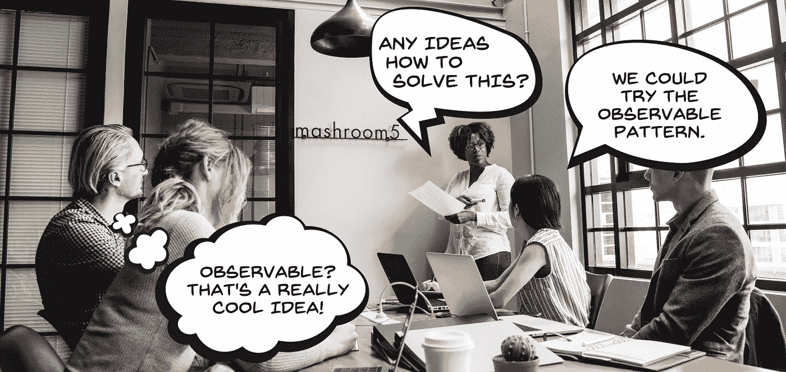
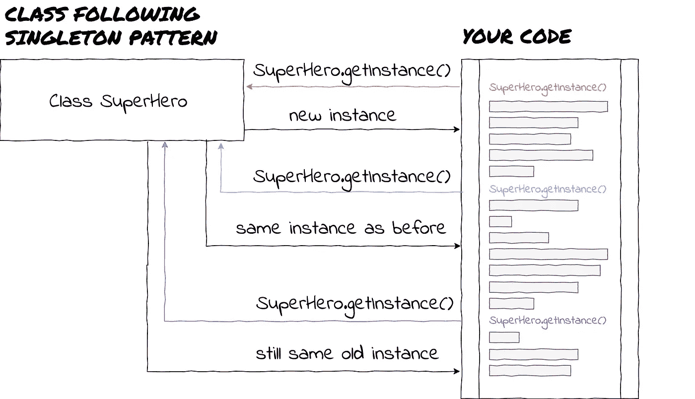
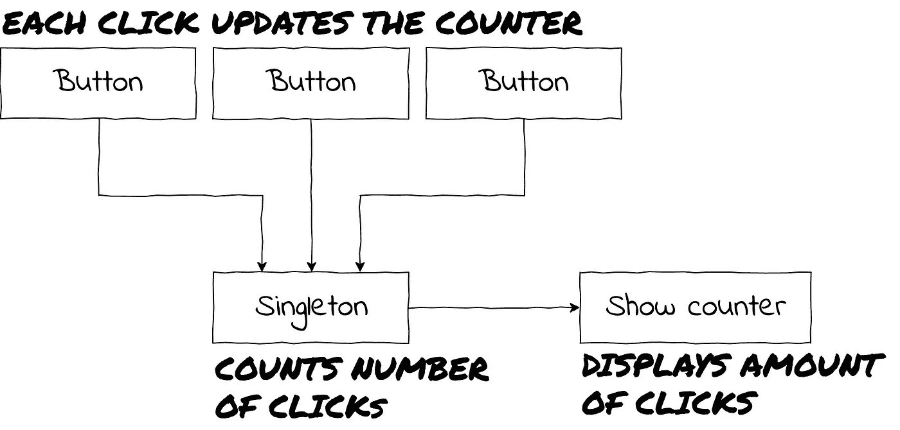
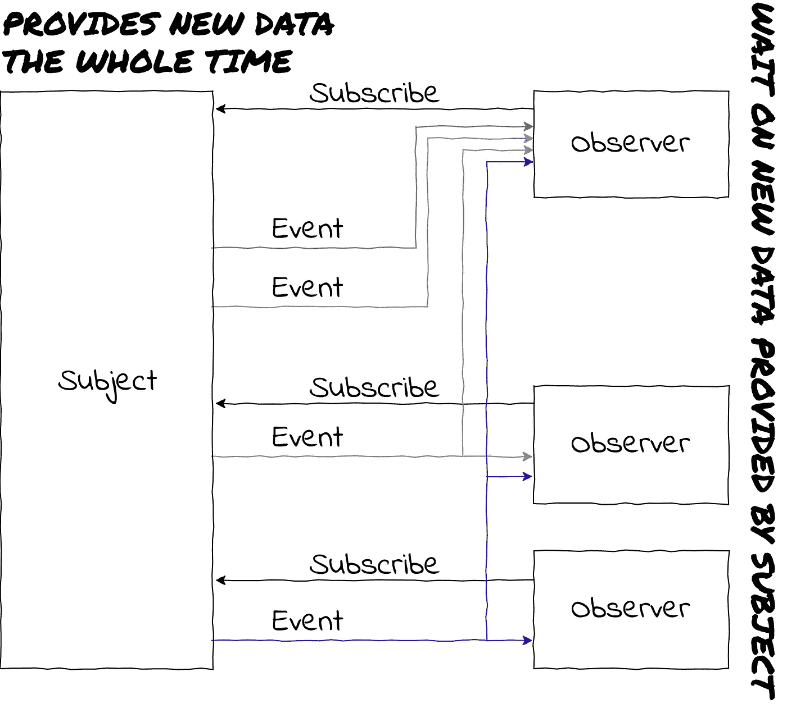
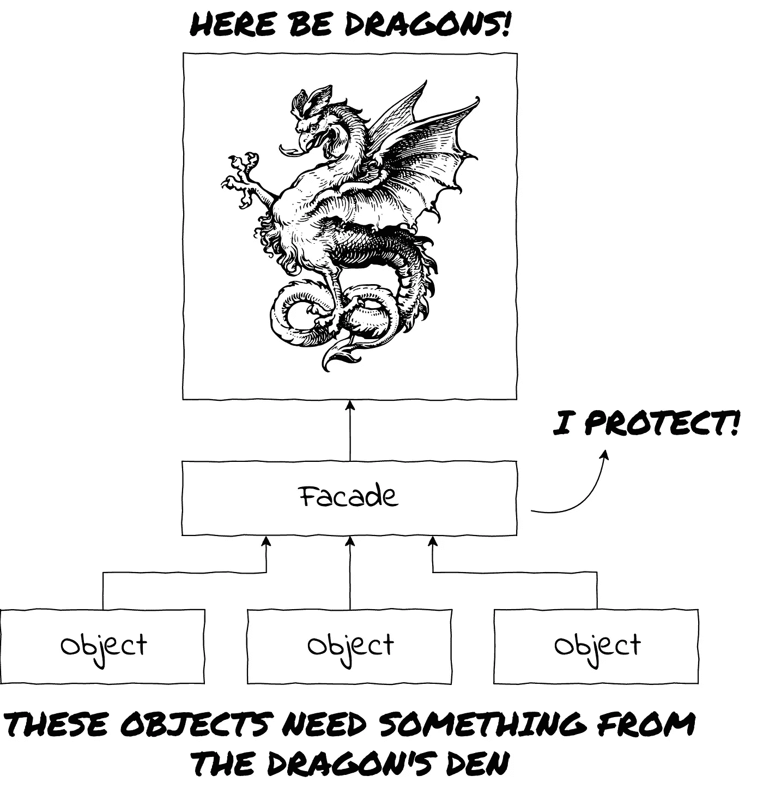
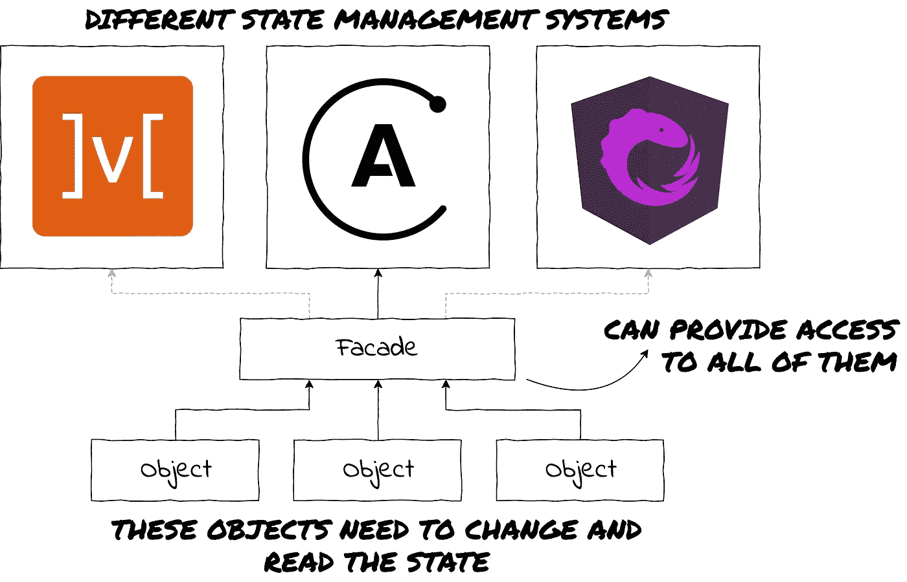

# 现代 JavaScript 开发中的设计模式

> 原文：<https://levelup.gitconnected.com/design-patterns-in-modern-javascript-development-ec84d8be06ca>

## 关于软件项目设计中有效沟通的思考

# 模式？设计？我们还在谈论软件开发吗？

毫无疑问。

就像面向对象编程的情况一样，我们这些开发人员正试图对我们周围的世界进行建模。因此，尝试使用我们周围的世界作为工具来描述我们的工艺是有意义的。

在这种情况下，我们从《建筑》( the one with buildings and bridges)和开创性的建筑书籍《A Pattern Language: Towns，buildings，Construction*by**Christopher Alexander，Sara Ishikawa，Murray 银色啤酒杯乐队*那里的模式描述如下:**

> **每个模式描述了一个在我们的环境中反复出现的问题，然后描述了该问题解决方案的核心，以这样一种方式，你可以使用这个解决方案一百万次，而不必以同样的方式做两次。**

**在软件开发中，架构是以健康、健壮和可维护的方式构建应用程序的过程，模式提供了一种为常见问题的解决方案命名的方式。这些解决方案的范围从抽象/概念到非常精确和技术性，并允许开发人员有效地相互交流。**

****

**高效。**

**如果一个团队中有两个或更多的开发人员了解模式，那么讨论问题的解决方案会变得非常有效。如果只有一个开发人员了解模式，向团队的其他成员解释它们通常很容易。**

****本文的目标是通过向您介绍软件设计模式的概念，并展示几个有趣的模式，来激发您对软件开发知识的某种形式表示的兴趣，因为它们在现代 JavaScript 项目中得到了广泛的使用。****

# **单一模式**

## **什么**

**单例模式不是使用最广泛的模式之一，但是我们从这里开始，因为它相对容易掌握。**

**单例模式源于单例的数学概念，即:**

> **在数学中，**单元素**，也称为**单位集**，是恰好有一个元素的集合。例如，集合{null}是一个单例。**

**在软件中，这仅仅意味着我们将一个类的实例化限制到一个对象。实现 singleton 模式的类的对象第一次被实例化时，它实际上会被实例化。任何后续尝试都将返回第一个实例。**

****

**有了蝙蝠侠谁还需要两个超级英雄？**

## **为什么**

**除了允许我们只能有一个超级英雄(很明显是蝙蝠侠)，我们为什么要使用单身模式呢？**

**尽管单身模式并非没有问题(它以前被称为邪恶，单身者被称为病态说谎者)，但它仍然有其用途。最值得注意的是实例化配置对象。您可能只希望您的应用程序有一个配置实例，除非您的应用程序的一个特性是提供多个配置。**

## **哪里**

**Angular 的服务是大型流行框架中使用单例模式的主要例子。Angular 的文档中有一个[专用页面](https://angular.io/guide/singleton-services)解释了如何确保一个服务总是作为单例提供。**

**服务是单例的很有意义，因为服务被用作存储状态、配置和允许组件之间通信的地方，并且您希望确保没有多个实例混淆这些概念。**

**例如，假设您有一个简单的应用程序，用于计算按钮被点击的次数。**

****

**您应该跟踪一个对象中按钮按下的次数，该对象提供:**

*   **计数的功能**
*   **并提供当前的点击次数。**

**如果该对象不是单例对象(每个按钮都有自己的实例)，那么点击计数就不正确。此外，您将向显示当前计数的组件提供哪个计数实例？**

# **观察者模式**

## **什么**

**观察者模式定义如下:**

> ****观察者模式**是一种软件设计模式，其中一个名为**主题**的对象维护一个名为**观察者**的依赖者列表，并自动通知它们任何状态变化，通常是通过调用它们的方法之一。**

**如果我们尝试将观察者模式与现实世界中的一个例子——报纸订阅进行比较，就很容易理解观察者模式。**

**买报纸时通常的情况是，你走到报摊前，询问你最喜欢的报纸的新一期是否出版了。如果不是，这是一个可悲的低效率的事情，你不得不走回家，稍后再试。用 JavaScript 术语来说，这就相当于循环，直到得到想要的结果。
当你最终拿到报纸时，你可以做你一直想做的事情——坐下来喝杯咖啡，享受你的报纸(或者，用 JavaScript 术语来说，执行你一直想做的回调函数)。**

****

**最后。**

**明智的做法是订阅报纸(并且每天都能得到你喜爱的报纸)。这样，出版公司会在新一期报纸发行时通知你，并把它送到你手中。再也不用跑去报摊了。不再失望。极乐世界。
用 JavaScript 的术语来说，在你运行一个函数之前，你不会循环并询问结果。相反，您应该让主题知道您对事件(消息)感兴趣，并提供一个回调函数，当新数据准备好时应该调用该函数。那么，你就是观察者。**

****

**再也不要错过你的晨报。**

**好的一面是——你不必是唯一的订户。正如你会因为错过报纸而失望一样，其他人也会失望。这就是为什么多个观察者可以订阅该主题。**

## **为什么**

**observer 模式有许多用例，但通常，当您想要在非紧密耦合的对象之间创建一对多的依赖关系，并且有可能让数量不限的对象知道状态何时发生变化时，应该使用它。**

**JavaScript 是可观察模式的好地方，因为一切都是事件驱动的，而不是总是询问事件是否发生，你应该让事件通知你(就像古老的谚语*“不要打电话给我们，我们会打电话给你”*)。很可能你已经做了一些看起来像观察者模式的事情。将事件侦听器添加到元素中具有观察者模式的所有特征:**

*   **您可以订阅该对象，**
*   **您可以取消订阅该对象，**
*   **并且该对象可以向其所有订户广播事件。**

**学习观察者模式的最大收获是，您可以更快地实现自己的主题或掌握一个已经存在的解决方案。**

## **哪里**

**实现一个基本的 observable 应该不会太难，但是有一个很棒的库被许多项目使用，那就是[react vex](http://reactivex.io/)，其中 [RxJS](https://github.com/ReactiveX/rxjs) 是它的 JavaScript 对应物。**

**RxJS 不仅允许您订阅主题，还允许您以任何可以想象的方式转换数据，组合多个订阅，使异步工作更易于管理。如果您想将数据处理和转换水平提高到一个更高的水平，RxJS 将是一个很好的学习库。**

**除了观察者模式之外，ReactiveX 还以实现迭代器模式而自豪，迭代器模式使主体有可能让其订阅者知道订阅何时结束，有效地从主体端结束订阅。在本文中，我不打算解释迭代器模式，但是对你来说，学习更多的迭代器模式，看看它是如何适应 observable 模式的，将是一个很好的练习。**

# **立面图案**

## **什么**

**facade 模式是一种以建筑学命名的模式。在建筑领域:**

> **立面通常是建筑物的一面，通常是正面。这是一个外来词，来自法语*faade*，意思是“正面”或“脸”。**

**由于架构中的外观是建筑物的外部，隐藏了其内部工作，因此软件开发中的外观模式试图将底层的复杂性隐藏在前面，有效地允许您使用更容易掌握的 API，同时提供了按照您想要的方式更改底层代码的可能性。**

## **为什么**

**您可以在许多情况下使用 facade 模式，但最值得注意的是使您的代码更容易理解(隐藏复杂性)并使依赖尽可能松散耦合。**

****

**Fus Ro Dah！**

**很容易理解为什么一个 facade 对象(或者包含多个对象的层)是一个好东西。如果可以避免的话，你不会想和龙打交道。facade 对象将为您提供一个很好的 API，并自己处理所有的 dragon 恶作剧。**

**我们在这里可以做的另一件大事是在不影响应用程序其余部分的情况下从背景中改变龙。假设你想用一只小猫把龙换出来。它仍然有爪子，但更容易喂养。改变它就是在不改变任何依赖对象的情况下重写外观中的代码。**

## **哪里**

**一个地方，你会看到门面往往是角使用其服务作为一种简化背景逻辑的手段。但它不一定只是有角的，你将在下一个例子中看到。**

**假设您想在应用程序中添加状态管理。你可以选择 Redux、NgRx、Akita、MobX、Apollo 或任何一款新上市的产品。那么，为什么不把它们都选出来，带它们去兜风呢？**

**状态管理库将为你提供什么基本功能？**

**大概是:**

*   **一种让状态管理知道您想要状态改变的方式**
*   **以及获取当前(部分)状态的方法。**

**那听起来不太坏。**

**现在，有了 facade 模式的强大功能，您可以为状态的每个部分编写 facade，它们将为您提供一个很好的 API 类似于`facade.startSpinner()`、`facade.stopSpinner()`和`facade.getSpinnerState()`。这些方法很容易理解和推理。**

**之后，您可以处理外观并编写代码，该代码将转换您的代码，以便它可以与 Apollo 一起工作(使用 GraphQL 管理状态——现在非常热门)。你可能会注意到它根本不适合你的编码风格，或者单元测试的编写方式真的不适合你。没问题，写一个新的 facade 来支持 MobX。**

****

**还不如是龙…**

# **从这里去哪里**

**您可能已经注意到，我谈到的设计模式没有任何代码或实现。这是因为这些设计模式中的每一个都至少可以成为一本书中的一章。**

**既然我们在谈论书籍，深入研究一下一两本关于设计模式的书不会有什么坏处。**

**第一个也是最大的推荐是 [**设计模式:可重用面向对象软件的元素**](http://wiki.c2.com/?DesignPatternsBook) 由 *Erich Gamma* 、 *Richard Helm* 、 *Ralph Johnson* 和 *John Vlisside* 组成，也被称为*四人组*。这本书是一座金矿，也是软件设计模式事实上的圣经。**

**如果你正在寻找更容易消化的东西，有 [**头先设计图案**](https://www.goodreads.com/book/show/58128.Head_First_Design_Patterns) 由*伯特贝茨**凯西塞拉**埃里克弗里曼*和*伊丽莎白罗布森*。这是一本非常好的书，它试图通过视觉视角传达设计模式的信息。**

**最后但同样重要的是，没有什么比谷歌搜索、阅读和尝试不同的方法更好的了。即使你最终从未使用过某个模式或技术，你也会学到一些东西，并以你意想不到的方式成长。**

***插图中使用的语音气泡由*[*starline—www.freepik.com*](https://www.freepik.com/free-photos-vectors/frame)*制作。***

** [## 学习 JavaScript -最佳 JavaScript 教程(2019) | gitconnected

### 50 大 JavaScript 教程-免费学习 JavaScript。课程由开发人员提交并投票，从而实现…

gitconnected.com](https://gitconnected.com/learn/javascript)**