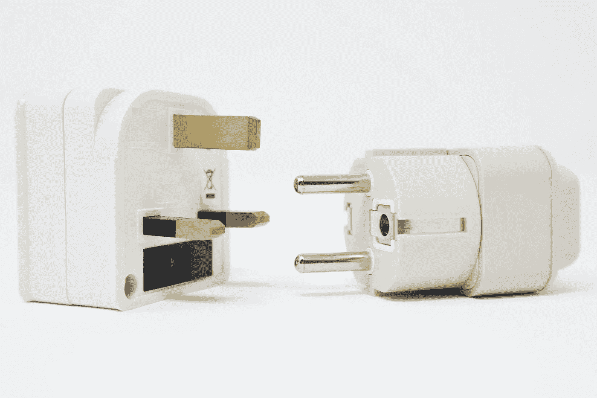

# Python 中的设计模式:适配器模式

> 原文：<https://levelup.gitconnected.com/design-patterns-in-python-adapter-pattern-a5e53ed2c85d>

## 适配器设计模式在 Python 中的实现

它是一种结构设计模式，相当于其名称的电子等价物。在这方面，它有一个成功的命名，其目的是可以理解的(也叫 *wrapper* )。如果你还记得的话，结构设计模式与不同的类一起工作有关。适配器设计模式还确保不兼容的接口可以互操作。它将一个类的接口转换为另一个类期望的接口。



照片由[在](https://unsplash.com/@callmefred?utm_source=unsplash&utm_medium=referral&utm_content=creditCopyText) [Unsplash](https://unsplash.com/s/photos/adapter?utm_source=unsplash&utm_medium=referral&utm_content=creditCopyText) 上叫我弗雷德

《越狱》前情提要:

[](https://medium.com/@okanyenigun/design-patterns-in-python-flyweight-pattern-ec3d321a86af) [## Python 中的设计模式:Flyweight 模式

### Flyweight 设计模式在 Python 中的实现

medium.com](https://medium.com/@okanyenigun/design-patterns-in-python-flyweight-pattern-ec3d321a86af) 

先说经典的例子。我们在一家国际公司做销售。我们的工作需要我们经常出差。许多国家使用不同类型的插座。因此，在我们去的国家，我们可能很难将电子设备插入插座。我们能做的是:


插头类型:来源:[飞马](https://www.flypgs.com/blog/ulkelere-gore-fis-ve-priz-rehberi/)

第一种选择可能是把所有的类型都带上。这里的结构是系统中的 if-else 条件语句。我们根据目的地国家选择必要的一个。这里的问题是，这种结构违背了开闭原则(OCP)。每个新的国家都需要一个新的条件。

[](https://towardsdev.com/solid-principles-explained-635ad3608b20) [## 解释了坚实的原则

### 用 Python 语言举例说明坚实的原理

towardsdev.com](https://towardsdev.com/solid-principles-explained-635ad3608b20) 

作为另一种解决方案，我们为每种类型的套接字对象创建子类，并覆盖它的方法。在这种情况下，子类的数量呈爆炸式增长。实际上，在这样的解决方案中，适配器嵌入在对象内部。除了自己的功能之外，对象还必须承担适配器的任务。这违反了单一责任原则。这仍然比第一个解决方案好，但不是理想的解决方案。

根据 SRP，我们必须在别处定义适配器任务。这是一项单独的责任。我们将有一个单独的类来解决兼容性问题。这个类将使一个不兼容的对象与另一个不兼容的接口互操作。

由于适配器设计模式，不兼容的对象获得了一个新的接口，适配器成为不兼容对象的包装器。也可以设计适配器来适应所有接口。但是在这种情况下，适配器对象本身将变得非常复杂。因此，在实践中，如果每个适配器都解决一个兼容性问题(双向的)会更好。

# 履行

在这个模式结构中，我们有 4 个组件。

*   **目标**:客户端请求的特定于域的接口。
*   **客户端**:应用业务逻辑，与目标协作。
*   **适配器**:与目标不兼容的接口。需要适配器。
*   **适配器**:适配器与目标之间的兼容对象。


来源: [geeksforgeeks](https://www.geeksforgeeks.org/adapter-pattern/)


UML 类图的例子。图片由作者提供。

```
my_plug = UkPlug()
my_plug.electricity_220v()#220 Voltmy_plug = UktoUsAdapter()
my_plug.electricity_220v()#110 Volt
```

我们通过使用适配器设计模式应用了 SRP 和 OCP 原则。我们的插座和插头对象有一个更简单的结构，因为他们只是忙于自己的工作。同样，适配器也完成了它的工作。我们让不同的界面协同工作。

感谢阅读。如果您有任何问题或意见，请随时写信给我！

# 下一章

[](https://medium.com/@okanyenigun/design-patterns-in-python-composite-pattern-2fa89a026564) [## Python 中的设计模式:复合模式

### Python 语言中复合设计模式的实现

medium.com](https://medium.com/@okanyenigun/design-patterns-in-python-composite-pattern-2fa89a026564) 

# 阅读更多内容…

[](https://python.plainenglish.io/data-classes-abstraction-interfaces-in-python-ea107d235d3e) [## Python 中的数据类、抽象和接口

### Python 中的抽象、接口和其他类概念

python .平原英语. io](https://python.plainenglish.io/data-classes-abstraction-interfaces-in-python-ea107d235d3e) 

# 参考

[https://www . geeks forgeeks . org/adapter-method-python-design-patterns/](https://www.geeksforgeeks.org/adapter-method-python-design-patterns/)