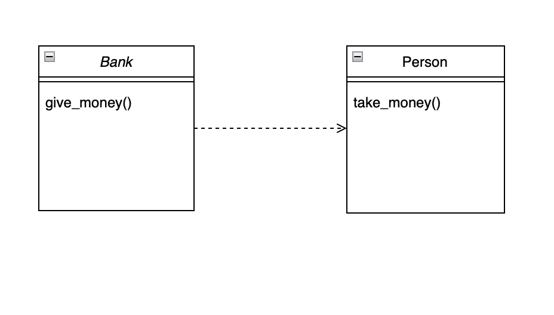
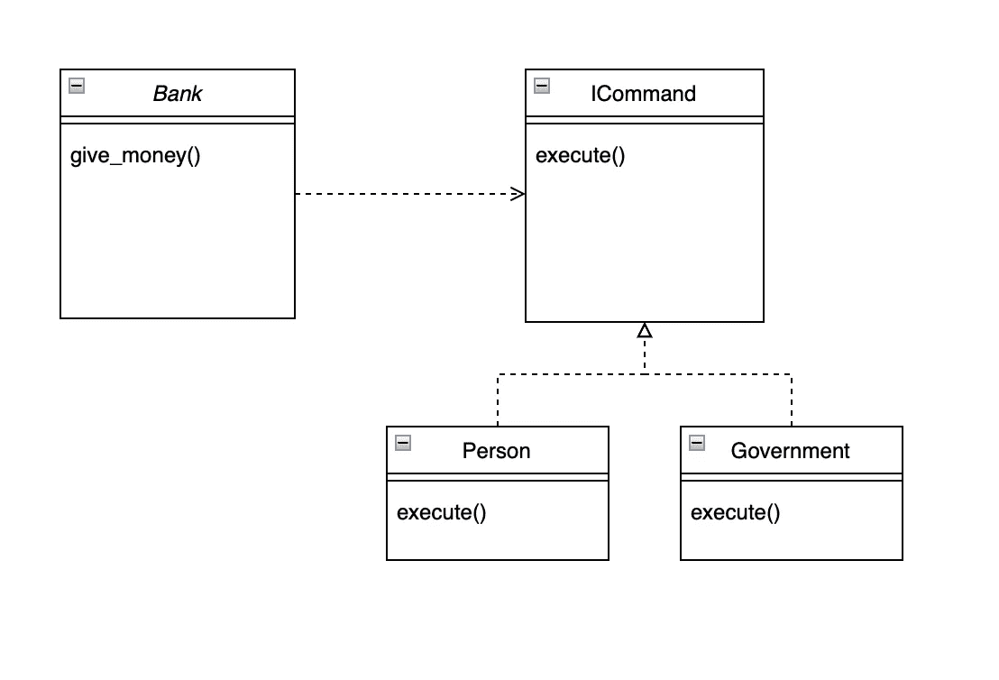
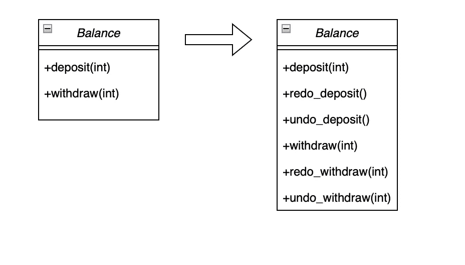
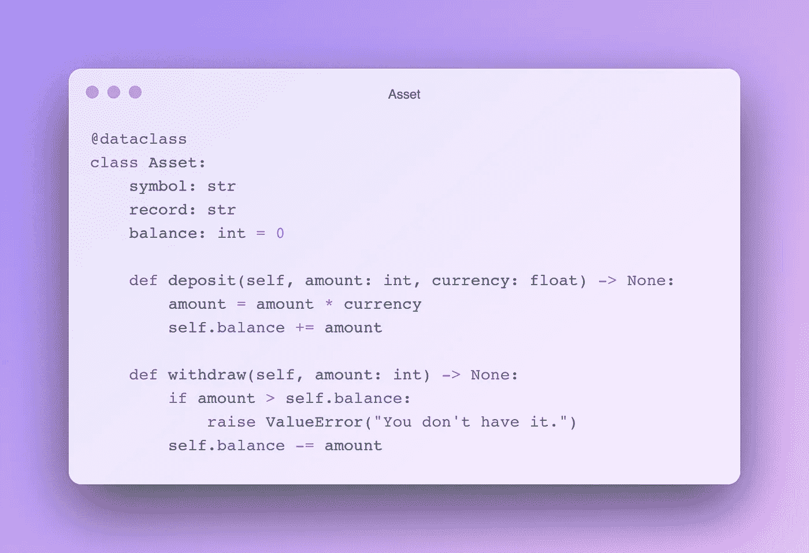
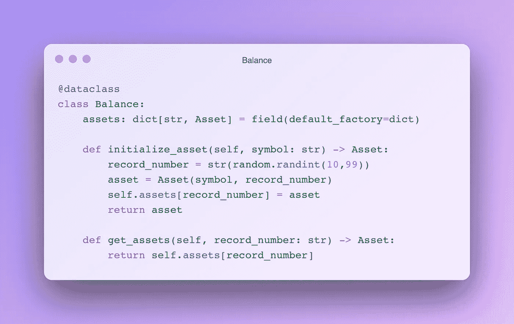
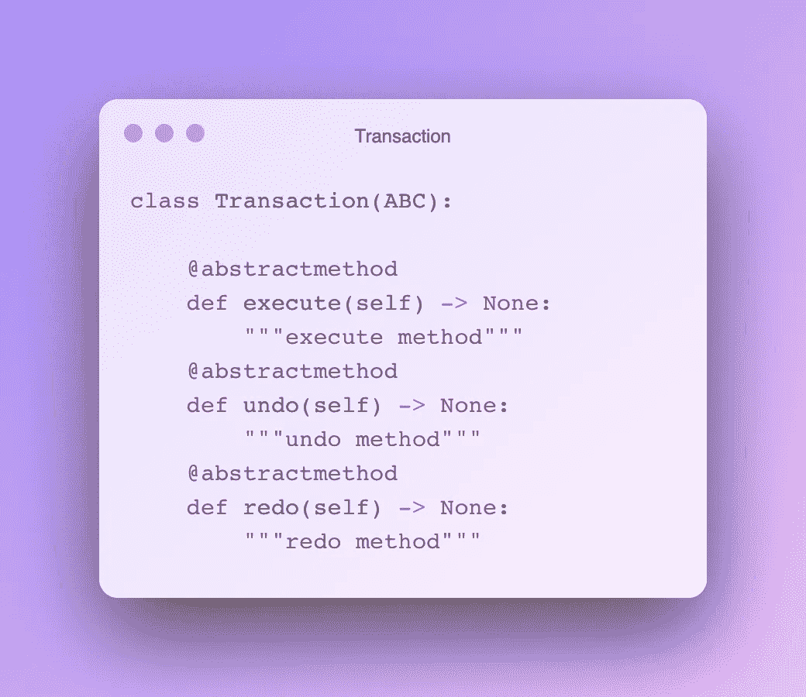
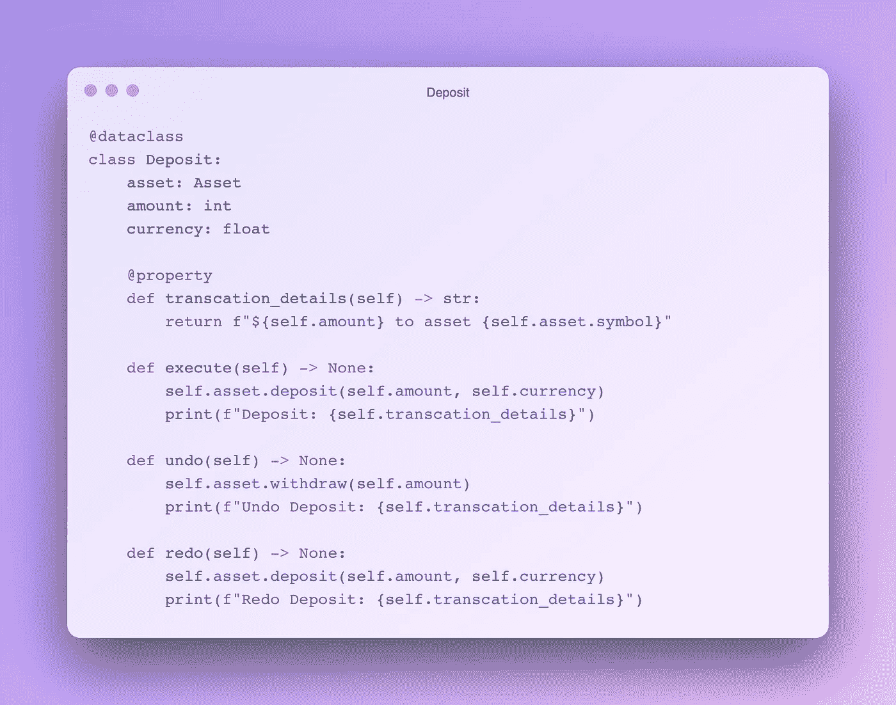
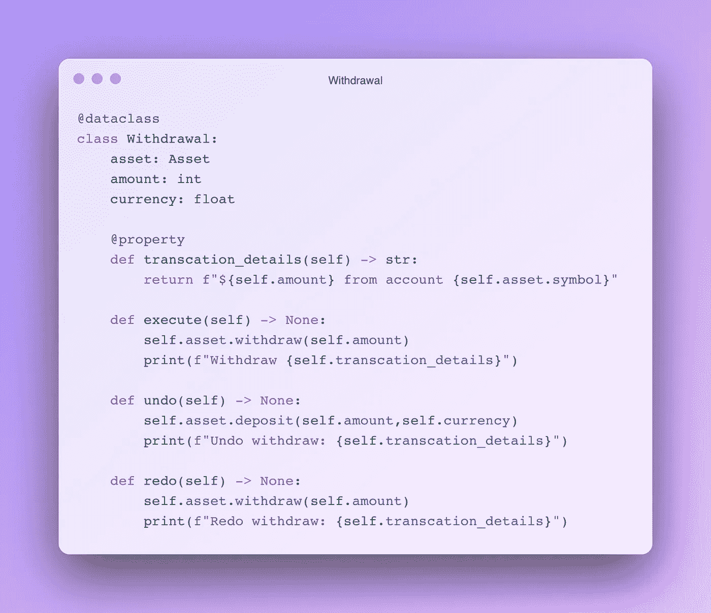
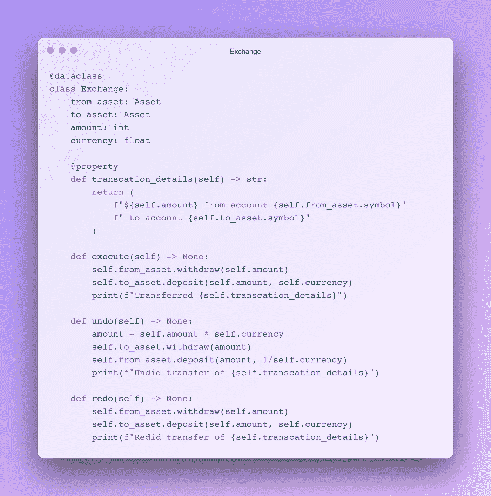
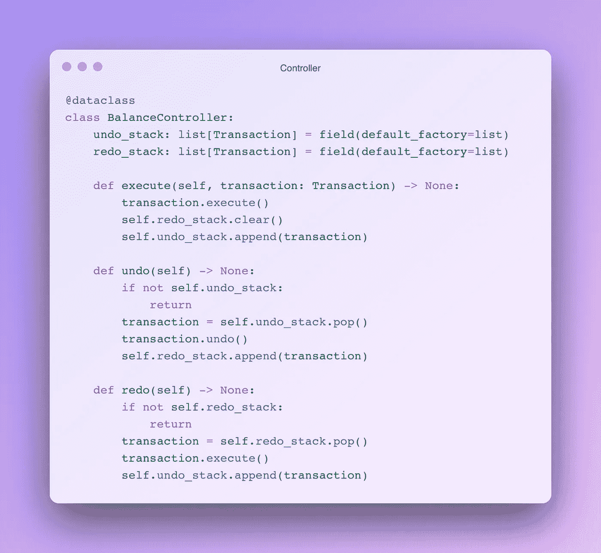

# Python 中的设计模式:命令模式

> 原文：<https://levelup.gitconnected.com/design-patterns-in-python-command-pattern-be5b72533829>

## 命令设计模式在 Python 中的实现


汉娜·乔舒亚在 [Unsplash](https://unsplash.com/s/photos/command?utm_source=unsplash&utm_medium=referral&utm_content=creditCopyText) 上的照片

命令设计模式是一种行为设计模式，它将请求抽象化，并将其封装为一个对象，以分离命令及其执行。

上一章:

[](/design-patterns-in-python-strategy-pattern-2189c540756d) [## Python 中的设计模式:策略模式

### 策略模式在 Python 中的实现

levelup.gitconnected.com](/design-patterns-in-python-strategy-pattern-2189c540756d) 

你可以很容易地注意到，在设计模式中，我们一直试图将客户端与正在发生的事件分开。根据客户端和系统之间的关系的结构类型，不同的设计模式被呈现为一种解决方案。这里，客户端不知道谁在处理消息。

回想一下，由于多态，客户端可以在不知道对象类型的情况下与对象进行交互。使用命令设计模式，一个未知的对象被命令做一些事情，而不知道该对象正在做什么，该对象知道它应该做什么。



高度耦合。图片由作者提供。

在上述案例中，银行和个人之间存在直接的给予和接受关系。银行知道它把钱给了谁，以及他们是如何收到钱的。这是一个耦合度非常高的问题。

相反，银行对未知对象调用 execute 方法。这个对象决定了这个方法的作用。

命令有一个抽象接口。这个接口有一个执行方法。每个具体的命令对象都重写了这个执行方法。客户端不知道 execute 方法在做什么。做的事情从类的名字就明白了。因为，这里我们把方法转换成了类，所以每个类都会有这个方法不同的业务类型，并会相应地命名。



命令界面。图片由作者提供。

此外，这种设计模式还用于完成撤销和重做之类的请求。否则，必须为所有这些类型的请求在对象上定义大量的助手方法。在这种情况下，对象变得越来越复杂。



复杂类中的撤消、重做。图片由作者提供。

如果我们将由于辅助方法而膨胀的主方法分离出来，并将其建模为一个新的对象，我们将摆脱上述麻烦。多亏了抽象，我们把方法级的工作提升到了对象级。如果您还记得，在策略设计模式中，我们对客户端隐藏了执行对象。在这里，我们还对客户端隐藏了完成这项工作的方法。

## 履行

作为一个例子，我们将考虑一个银行账户和在这个账户上进行的外币交易。

我选择将我们的类创建为 *dataclasses* ,因为它们易于使用，并且在表示上很方便。你可以在我下面的文章中获得更多关于*数据类*的信息。

[](https://python.plainenglish.io/data-classes-abstraction-interfaces-in-python-ea107d235d3e) [## Python 中的数据类、抽象和接口

### Python 中的抽象、接口和其他类概念

python .平原英语. io](https://python.plainenglish.io/data-classes-abstraction-interfaces-in-python-ea107d235d3e) 

资产类别代表货币。它有三个属性，它的符号，一个标识它的记录的随机数，和它的数量。我们用*存款*方法增加这项资产，用*提款*方法减少它。



资产类

*Balance* 类保存该账户拥有的资产。方法 *initialize_asset* 负责创建新的资产记录。使用 *get_asset* ，我们可以获得任何货币的结果。



```
balance = Balance()#create some assets
usd = balance.initialize_asset("USD")
euro = balance.initialize_asset("EUR")
paund = balance.initialize_asset("GBR")#deposite some
usd.deposit(100,1)
euro.deposit(100,1)
paund.deposit(100,1)#usd to euro
usd.withdraw(50)
euro.deposit(50,0.9)print(balance)#OUT: Balance(assets={'12': Asset(symbol='USD', record='12', balance=50), '52': Asset(symbol='EUR', record='52', balance=145.0), '34': Asset(symbol='GBR', record='34', balance=100)})
```

上面的代码有问题。我们对交易的控制有限。现在让我们在这个例子中使用命令设计模式。

首先，我们创建一个事务类来显式地处理事务。它是一个接口，有*执行*方法和*撤销* & *重做*方法。



交易类别

现在，让我们定义命令。首先，存款；



存款类别

每个*存款*对象取一个资产、金额和货币比率。它有*执行*方法，使用资产的*存款*方法存款。要撤销，它使用资产的*撤销*方法(要撤销存款，您必须撤销)。

*撤回*类也差不多；



撤回类

*交换*类，顾名思义，处理货币之间的交换。它从给定的货币中提款，存入新的货币。



交换

一般来说，我们需要一个控制器来执行这些操作。它还跟踪使用列表堆栈进行的事务。



```
balance = Balance()
controller = BalanceController()#create some assets
usd = balance.initialize_asset("USD")
euro = balance.initialize_asset("EUR")
paund = balance.initialize_asset("GBR")#deposit some
controller.execute(Deposit(usd, 1000, 1))
controller.execute(Deposit(euro, 1000, 1))
controller.execute(Deposit(paund, 1000, 1))#exchange
controller.execute(Exchange(euro, usd, 500, 0.9))print(balance)#OUT
Deposit: $1000 to asset USD
Deposit: $1000 to asset EUR
Deposit: $1000 to asset GBR
Transferred $500 from account EUR to account USD
Balance(assets={'82': Asset(symbol='USD', record='82', balance=1450.0), '10': Asset(symbol='EUR', record='10', balance=500), '97': Asset(symbol='GBR', record='97', balance=1000)})
```

如上所述，客户端使用控制器执行交易(存款、兑换、取款)。它不知道这些过程背后发生了什么。它只需要调用*执行*方法。

```
controller.undo()
print(balance)#OUT
Undid transfer of $500 from account EUR to account USD
Balance(assets={'52': Asset(symbol='USD', record='52', balance=1000.0), '33': Asset(symbol='EUR', record='33', balance=1000.0), '76': Asset(symbol='GBR', record='76', balance=1000)})
```

## 结论

如果有必要减少客户端和处理器之间的依赖性，可以使用命令设计模式。我们将方法抽象到类的层次，而不是抽象方法。这将增加体制内流动的可能性，创造自由。

## 下一章:

[](https://medium.com/@okanyenigun/design-patterns-in-python-iterator-pattern-2073f10aa0f0) [## Python 的设计模式:迭代器模式

### Python 语言中迭代器设计模式的实现

medium.com](https://medium.com/@okanyenigun/design-patterns-in-python-iterator-pattern-2073f10aa0f0) 

## 阅读更多内容…

[](/design-patterns-in-python-adapter-pattern-a5e53ed2c85d) [## Python 中的设计模式:适配器模式

### 适配器设计模式在 Python 中的实现

levelup.gitconnected.com](/design-patterns-in-python-adapter-pattern-a5e53ed2c85d) [](https://faun.pub/design-patterns-in-python-decorator-pattern-b85e1cab097a) [## Python 中的设计模式:装饰模式

### 装饰设计模式在 Python 中的实现

faun.pub](https://faun.pub/design-patterns-in-python-decorator-pattern-b85e1cab097a) [](https://faun.pub/design-patterns-in-python-decorator-pattern-b85e1cab097a) [## Python 中的设计模式:装饰模式

### 装饰设计模式在 Python 中的实现

faun.pub](https://faun.pub/design-patterns-in-python-decorator-pattern-b85e1cab097a) [](https://medium.com/@okanyenigun/scala-5-classes-63fc049d9665) [## Scala #5:类

### 关于在 Scala 中使用类的简单帖子

medium.com](https://medium.com/@okanyenigun/scala-5-classes-63fc049d9665) 

## 参考

[https://refactoring.guru/design-patterns/command](https://refactoring.guru/design-patterns/command)

https://en.wikipedia.org/wiki/Command_pattern

https://www.youtube.com/watch?v=FM71_a3txTo[t = 750s](https://www.youtube.com/watch?v=FM71_a3txTo&t=750s)

# 分级编码

感谢您成为我们社区的一员！更多内容请参见[升级编码出版物](https://levelup.gitconnected.com/)。
跟随: [Twitter](https://twitter.com/gitconnected) ， [LinkedIn](https://www.linkedin.com/company/gitconnected) ，[时事通讯](https://newsletter.levelup.dev/)
向上一级是转型科技招聘👉 [**加入我们的人才集体**](https://jobs.levelup.dev/talent/welcome?referral=true)