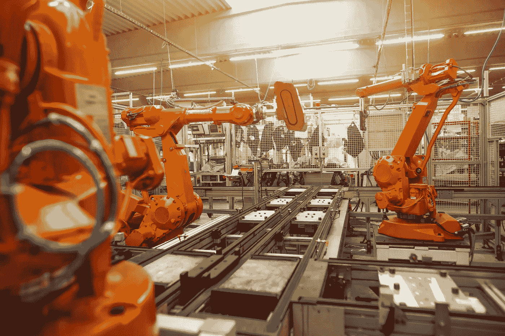
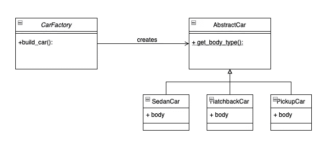
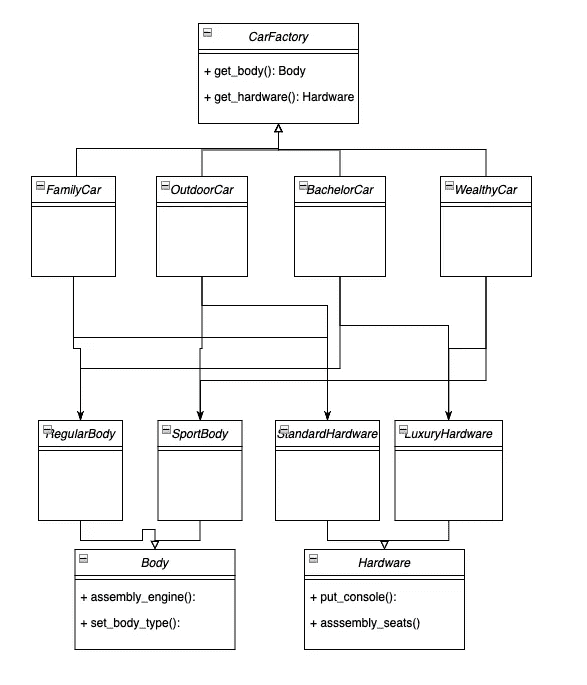
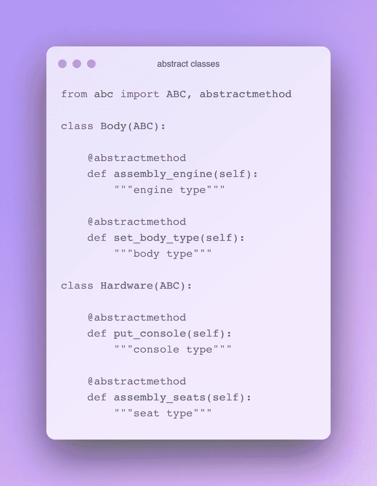
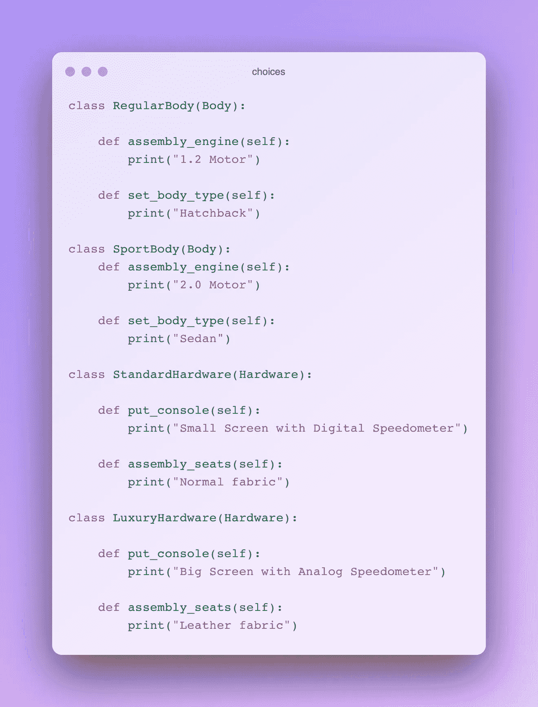
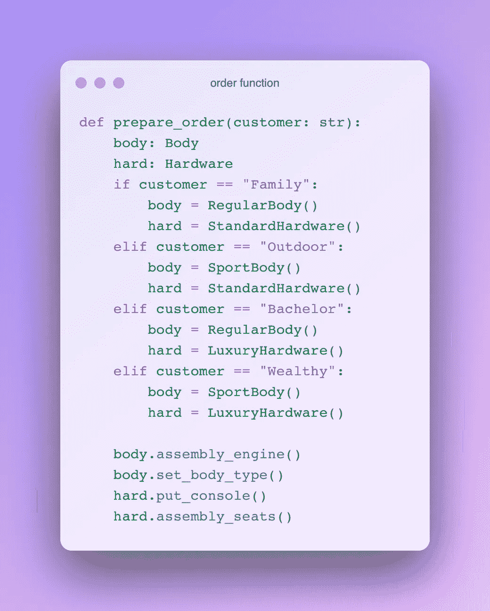
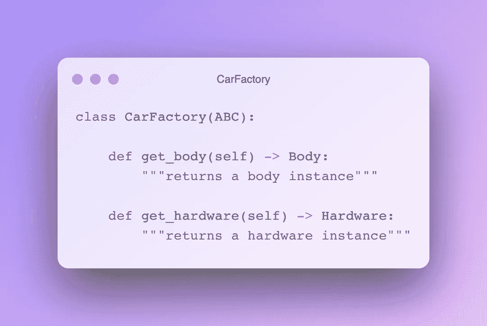
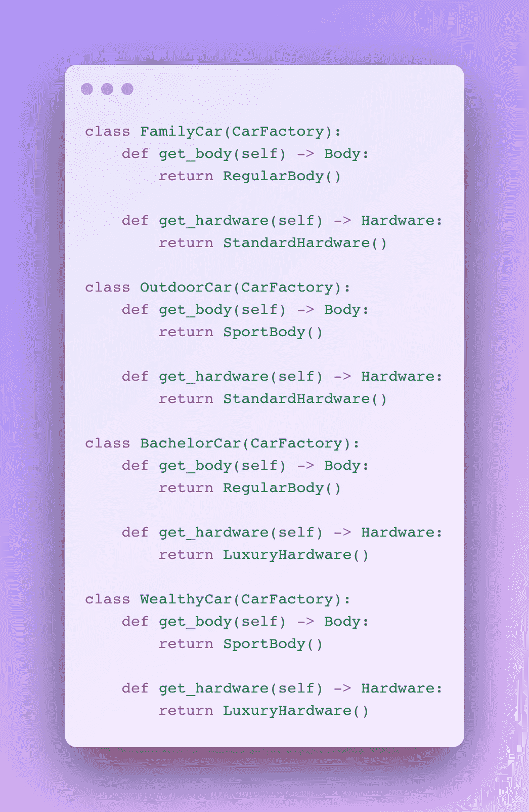
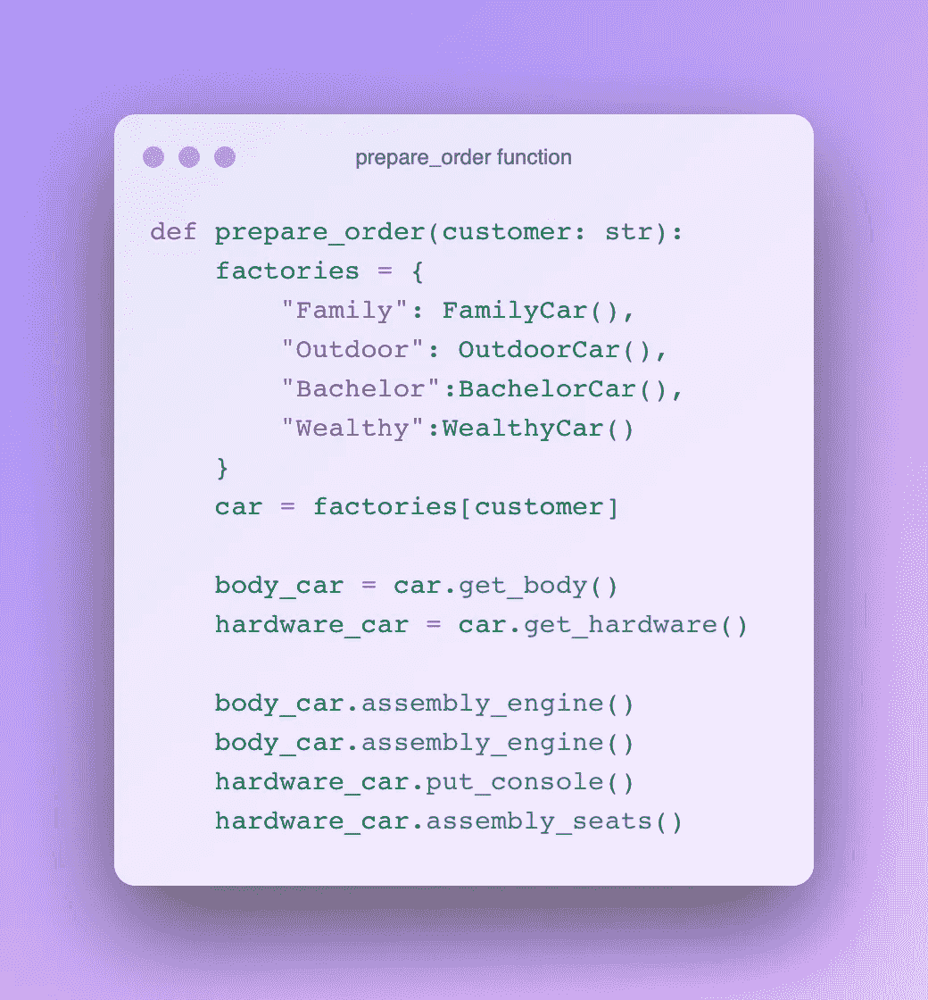

# Python 中的设计模式:工厂和抽象工厂模式

> 原文：<https://levelup.gitconnected.com/design-patterns-in-python-factory-pattern-beea1da31c17>

## Python 中工厂和抽象工厂模式的实现

工厂设计模式是一种创造性的设计模式。这是编程中最常用的模式之一。

创建对象是一项复杂的任务。通常，构造函数在创建对象时会带很多参数。创造性的设计模式，也就是工厂模式，使得那里的工作更容易。工厂模式也可以作为单例类来实现。



西蒙·卡杜拉在 [Unsplash](https://unsplash.com/?utm_source=unsplash&utm_medium=referral&utm_content=creditCopyText) 上的照片

前情提要…

[](https://medium.com/@okanyenigun/design-patterns-in-python-singleton-pattern-f76dc26281f8) [## Python 中的设计模式:单例模式

### Python 中 Singleton 设计模式的实现

medium.com](https://medium.com/@okanyenigun/design-patterns-in-python-singleton-pattern-f76dc26281f8) 

项目中的许多地方都需要业务对象。因此，创建相关对象的代码片段或构造函数将在整个系统中被调用。因为这个原因，会有很多复制粘贴的重复。

工厂模式解决了在哪里创建对象的问题。它抽象了对象创建过程。它的子类接管具有不同专门化但来源相同的对象的创建控制。对象创建过程通过工厂模式与已创建对象的使用相分离。是一种放松创作和大量使用之间关系的方法。

在对象创建过程中检索状态信息的责任尽可能多地分配给创建者方法。如果可能的话，创建者应该自己获取这些信息，而不是从外部传递参数。这降低了创建对象的复杂性。

## 编码工厂模式

## 领域问题

为了清楚起见，让我们在这个例子中考虑一个假想的业务问题。一家汽车制造公司生产三种车身的汽车:轿车、掀背车和皮卡。

每当生产计划部门发出新的生产计划时，工厂生产线都希望准备好生产这些不同类型的汽车。

## 类图

让我们用工厂设计模式来解决这个问题。我有一门汽车抽象课。有不同类型的 car 子类实现这个 car 抽象类。汽车工厂根据收到的需求创建相关的汽车类别。



工厂模式类图。图片由作者提供。

## 编码

```
plan_list = ["Sedan", "Hatchback", "Pick-Up", "Motobike"]
for p in plan_list:
    car = CarFactory.build_car(p)
    body = car.get_body_type()
    print(body)#Out: 
Body Type: Sedan
Body Type: Hatchback
Body Type: Pick-up
Car type is not valid.
```

# 抽象工厂模式

如上所示，工厂设计模式基于通过继承父类来派生子类。生成这些派生类的是一个**方法**。它只负责创建一个对象。

另一方面，抽象工厂模式是一个**类**。它负责创建对象系列。该系列是设计用于一起使用的对象，并且适用于该系列。因此，它提供了多个要创建的对象。它可以做到这一点，因为它包含了对象系列的工厂。也就是说，抽象工厂设计模式包含许多工厂设计模式。

这两个也可以认为是同一个设计模式。抽象工厂设计模式可以被认为是另一种模式的定制版本。

## 领域问题

同一家汽车制造商根据不同的客户群生产不同的车型。营销团队将潜在客户分为 4 个不同的群体:*家庭、户外、单身汉和富人*。

另一方面，产品开发部门在根据这一细分创造产品时，决定汽车的两个主要部分:*车身*和*硬件*。

## 类图



抽象工厂模式类图。图片由作者提供。

让我们为这些部分创建抽象类。



图片由作者提供。

车身分类总成根据客户群确定的发动机类型和车身类型。

产品开发部门为这两种零件开发了两种不同的选项。



图片由作者提供。

我们有使用低容量发动机和掀背式车身的普通车身，以及使用高容量发动机和轿车车身的运动车身。同样，我们有一个标准的硬件套件，包括一个小屏幕和普通的织物座椅。此外，我们有一个豪华的硬件套件，包括一个更大的屏幕和皮革织物座椅。

## 更差的实现

让我们创建一个根据订单设计汽车的函数。



图片由作者提供。

输出将是:

```
prepare_order("Family")
"""1.2 Motor
Hatchback
Small Screen with Digital Speedometer
Normal fabric"""
```

这个实现可以正常工作，没有任何问题。但是，您应该看到对象创建和使用之间的关系令人沮丧。假设产品开发部门有了新的愿景，并决定创建不同的车辆模型。或者，营销产生了新的细分。在这种情况下，创建 vehicle 对象和使用这些创建的对象会相互干扰，极大地增加了复杂性，并且可能会产生无尽的 if-else 语句和独特的对象创建过程。

## 编码

创建了汽车的抽象工厂类。它决定了发动机和车身。它返回一个主体实例和硬件实例。



图片由作者提供。

根据来自市场营销的细分，现在产品开发部门可以创造无限多的汽车类型。



图片由作者提供。

现在，生产新汽车更容易，也更清洁。



图片由作者提供。

感谢阅读。如果您有任何问题或意见，请随时写信给我！

## 下一集

[](https://medium.com/@okanyenigun/design-patterns-in-python-prototype-pattern-9e520d36565e) [## Python 中的设计模式:原型模式

### Python 中原型模式的实现

medium.com](https://medium.com/@okanyenigun/design-patterns-in-python-prototype-pattern-9e520d36565e) 

## 阅读更多内容…

[](/design-patterns-in-python-singleton-pattern-f76dc26281f8) [## Python 中的设计模式:单例模式

### Python 中 Singleton 设计模式的实现

levelup.gitconnected.com](/design-patterns-in-python-singleton-pattern-f76dc26281f8) [](https://towardsdev.com/solid-principles-explained-635ad3608b20) [## 解释了坚实的原则

### 用 Python 语言举例说明坚实的原理

towardsdev.com](https://towardsdev.com/solid-principles-explained-635ad3608b20) [](https://python.plainenglish.io/data-classes-abstraction-interfaces-in-python-ea107d235d3e) [## Python 中的数据类、抽象和接口

### Python 中的抽象、接口和其他类概念

python .平原英语. io](https://python.plainenglish.io/data-classes-abstraction-interfaces-in-python-ea107d235d3e) [](https://medium.com/@okanyenigun/polymorphism-in-python-cf3bef17f7f2) [## Python 中的多态性

### Python 中重载和重写的实现

medium.com](https://medium.com/@okanyenigun/polymorphism-in-python-cf3bef17f7f2)