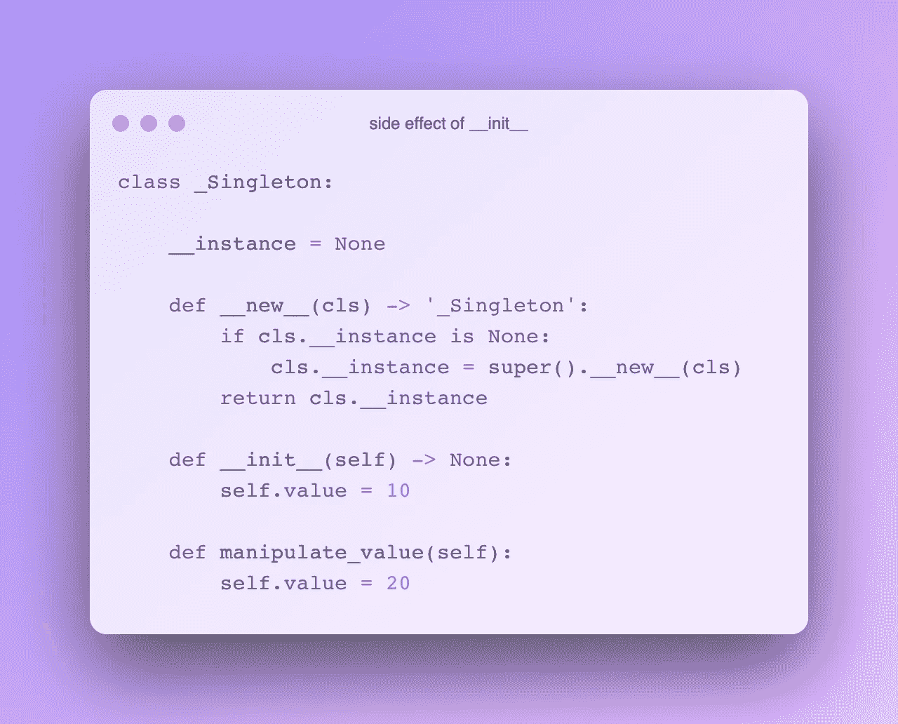
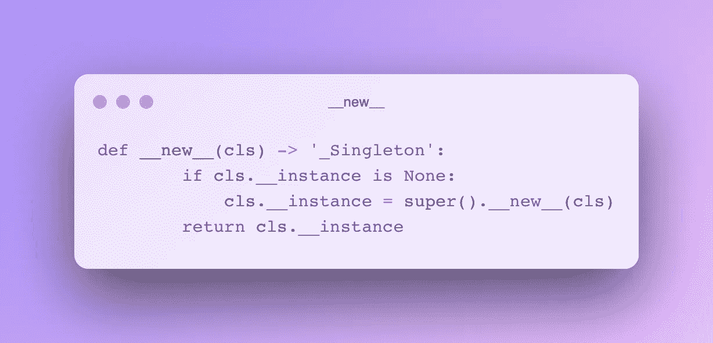
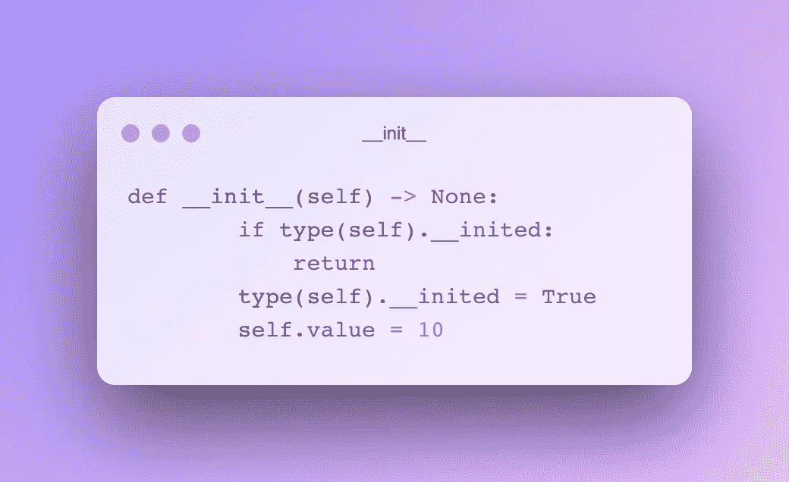

# Python 中的设计模式:单例模式

> 原文：<https://levelup.gitconnected.com/design-patterns-in-python-singleton-pattern-f76dc26281f8>

## Python 中 Singleton 设计模式的实现

单体设计模式是创造性设计模式之一。从单例类中只能创建一个对象。这是这种设计模式最显著的特点。


照片由[在](https://unsplash.com/@callmehangry?utm_source=unsplash&utm_medium=referral&utm_content=creditCopyText) [Unsplash](https://unsplash.com/?utm_source=unsplash&utm_medium=referral&utm_content=creditCopyText) 上叫我 hangry 🇫🇷

## 创造性的设计模式

对象创建是基于 OOP 的系统中最常见的任务之一。这是一个昂贵的过程。一个对象与其他对象的关系、对象的任务、考虑可重用性的因素、对象所处的状态及其对这些状态的反应等等。，使该对象的结构变得复杂。因此，大多数时候，对象创建过程是**而不是**一个只能留给构造函数的过程。

创造设计模式解决了两个问题:**在哪里**创建对象和**如何**创建对象。对象创建是抽象的，它们使过程更简单。

单例模式包含在创造性模式中。然而，它具有不同于其他创作模式的结构，在某些方面不同于其他模式。根据一些大师的说法，它被认为是一种反模式。

# 一个

单例类只生成一个对象，这个对象是全局访问点。只能派生一个对象是一个约束，它阻止了类在其他地方被随机生成。这样就不会产生其他对象，所有系统部件都访问并使用唯一的现有对象。

文献中大量遇到的一个类比将这种设计模式比作一个国家的政府。一个国家只有一个政府，这个政府可以被这个国家的所有设备接入，而且这个接入肯定是对真正的政府。因此，无论何时我们想与政府联系，我们都能确保与真正的、唯一的政府联系。

单例设计模式违背了单一责任原则。因此，在决定其用途时，应考虑到这一点。

[](https://towardsdev.com/solid-principles-explained-635ad3608b20) [## 解释了坚实的原则

### 用 Python 语言举例说明坚实的原理

towardsdev.com](https://towardsdev.com/solid-principles-explained-635ad3608b20) 

## 用例

这种模式通常可以用在管理系统的对象上。文件系统或窗口管理器、缓存系统或管理数据库连接的单个数据库对象。

它也可以用于“助手”类。它是许多不同工作的静态中心。同样，它也可以用作日志记录器(最常见的例子)。

记住，单例对象是全局可访问的。所以我们可以用 Singleton 来代替定义全局变量。

# 编码

有多种方法可以在 Python 中实现单例设计模式。这里就不一一提及了，只展示我喜欢和使用的方法。

现在让我们检查这个类实现的逐行结构。

首先，我使用前缀下划线来命名该类，以表明它是特殊的: *_Singleton* 。

*__instance* 是一个与类本身相关联的类变量。它跟踪该类是否已经被创建。

*__inited* 用于消除 Python 中由于 *__init__* 构造函数带来的类初始化副作用。 *__init__* 在 *__new__* 构造函数运行后重新运行。因此，即使我们得到了相同的对象，因为它被重新初始化，每次我们调用这个单例类时， *self.value* 参数将等于 10。想象一下，你把 *self.value* 参数操纵成别的东西，由于 *__init__* 副作用，你每次调用 class 都会把它的值重新设置成 10。通过检查它的初始化，我们消除了这个副作用。所以，我添加了一个方法来操作该值，并移除了 *__inited* 来演示这个副作用。



图片作者。

```
s1 = _Singleton()
print(s1.value) **#10**
s1.manipulate_value()
print(s1.value) **#20**
s2 = _Singleton()
print(s1 == s2) **#True --> same object**
print(s1.value) **#10 --> it is reset to 10**
print(s2.value) **#10**
```

*__new__* 方法是另一种 Pythonic 式的构造函数。每当我们创建一个对象时都会调用它。在 *__init__* 方法之前调用。这个类给自己作为一个引用 *(cls)* 。



图片由作者提供。

如果实例仍然是 *None* 这意味着它仍然不存在，那么将通过调用基类来创建它。它为我们创建了一个单例，并返回实际的实例。

在 *__init__* 构造函数中，我们检查 Singleton 之前是否初始化过。如果是这样，我们返回它，因此，它不操纵属性，并保持它们不变。



图片作者。

```
s1 = _Singleton()
print(s1) #<__main__._Singleton object at 0x7fcea840efd0>
s2 = _Singleton()
print(s2) #<__main__._Singleton object at 0x7fcea840efd0>
```

感谢阅读。如果您有任何问题或意见，请随时写信给我！

# 下一集:

[](https://medium.com/@okanyenigun/design-patterns-in-python-factory-pattern-beea1da31c17) [## Python 中的设计模式:工厂模式

### 工厂模式在 Python 中的实现

medium.com](https://medium.com/@okanyenigun/design-patterns-in-python-factory-pattern-beea1da31c17) 

# 阅读更多内容…

[](https://towardsdev.com/solid-principles-explained-635ad3608b20) [## 解释了坚实的原则

### 用 Python 语言举例说明坚实的原理

towardsdev.com](https://towardsdev.com/solid-principles-explained-635ad3608b20) [](https://python.plainenglish.io/data-classes-abstraction-interfaces-in-python-ea107d235d3e) [## Python 中的数据类、抽象和接口

### Python 中的抽象、接口和其他类概念

python .平原英语. io](https://python.plainenglish.io/data-classes-abstraction-interfaces-in-python-ea107d235d3e)