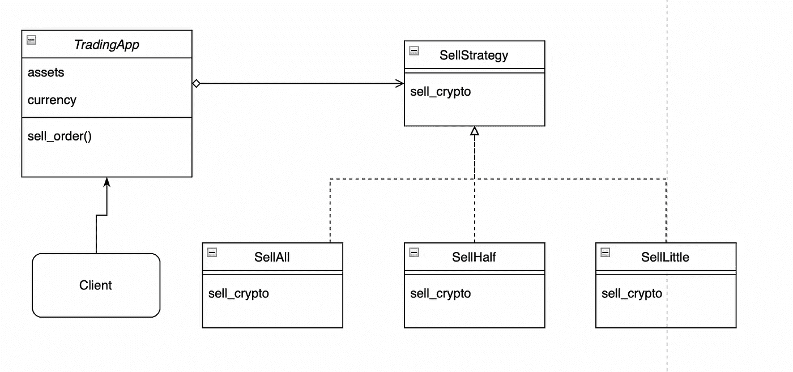

# Python 中的设计模式:策略模式

> 原文：<https://levelup.gitconnected.com/design-patterns-in-python-strategy-pattern-2189c540756d>

## 策略模式在 Python 中的实现

策略设计模式是行为设计模式的一种。行为设计模式处理类将拥有的职责或算法的分配。这样做的同时，也有助于班级之间的交流。它主要用于管理变化。


维多利亚诺·伊斯基耶多在 [Unsplash](https://unsplash.com/?utm_source=unsplash&utm_medium=referral&utm_content=creditCopyText) 上的照片

前一集:

[](https://medium.com/@okanyenigun/design-patterns-in-python-bridge-pattern-a87f7708858f) [## Python 中的设计模式:桥模式

### 桥设计模式在 Python 中的实现

medium.com](https://medium.com/@okanyenigun/design-patterns-in-python-bridge-pattern-a87f7708858f) 

一系列算法由承担类似任务但在某一方面不同的对象组成，每一个都可以互换。多亏了策略设计模式，我们可以独立于将使用该系列中任何对象的客户机来重新定位这些对象。

如果在没有模式的情况下部署设计，这样的算法家族通常会导致 if-else 地狱。因为一个曾经分支的概念是可扩展的，这意味着随着业务的增长和扩展，必然会发现或需要新的方法。这样家庭就扩大了，客户的需求也更加多样化。

我们需要打破假设结构。客户端必须独立于任何算法。否则，既违背单一责任原则，也违背开闭原则。

[](https://towardsdev.com/solid-principles-explained-635ad3608b20) [## 解释了坚实的原则

### 用 Python 语言举例说明坚实的原理

towardsdev.com](https://towardsdev.com/solid-principles-explained-635ad3608b20) 

## 密码

作为一个例子，让我们以一种非常简单的方式将这种设计模式应用于自动化交易应用程序的销售决策部分。



UML 图的例子。图片由作者提供。

我们有一个用于客户端的应用程序类。它根据情况使用各种销售策略。根据具体情况，它可能需要使用这些销售策略中的任何一种。销售接口类包含一个方法: *sell_crypto* 。在我们的例子中，3 种不同的销售策略将这个接口实现为具体的类。

```
A = TradingApp()
assets = A.sell_order(SellLittle())
print(assets)#Out: {'btc': 90.0, 'usdt': 300000.0}assets = A.sell_order(SellHalf())
print(assets)#Out: {'btc': 45.0, 'usdt': 1350000.0}
```

## 结论

在客户端和要与策略模式一起使用的算法或方法之间建立了抽象关系。客户端可以按照自己的意愿转向不同的行为，系统不受此影响。新的算法可以很容易地添加到家庭中。

## 下一集:

[](https://medium.com/@okanyenigun/design-patterns-in-python-command-pattern-be5b72533829) [## Python 中的设计模式:命令模式

### 命令设计模式在 Python 中的实现

medium.com](https://medium.com/@okanyenigun/design-patterns-in-python-command-pattern-be5b72533829) 

## 参考

[https://refactoring.guru/design-patterns/strategy](https://refactoring.guru/design-patterns/strategy)

[https://www . tutorialspoint . com/design _ pattern/strategy _ pattern . htm](https://www.tutorialspoint.com/design_pattern/strategy_pattern.htm)