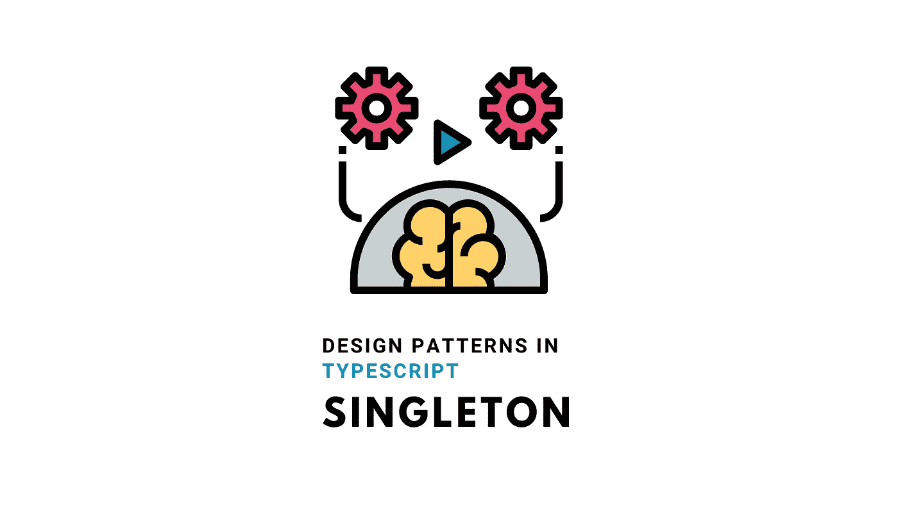
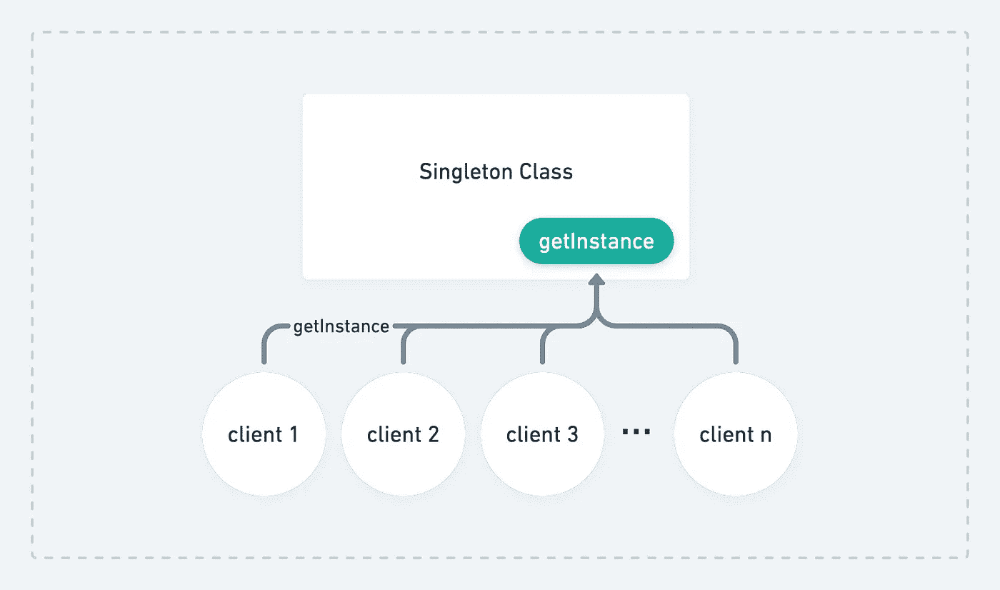

# TypeScript 中的设计模式— Singleton

> 原文：<https://levelup.gitconnected.com/design-patterns-in-typescript-singleton-d165e8058cb7>

## 如何将一个类的实例化限制到一个对象



与 [Canva](https://www.canva.com/) 合影。

Singleton 是软件开发中最常用的设计模式之一。在这篇文章中，我们将学习如何在使用 TypeScript 的 web 开发环境中实现这种模式。

# 什么是 Singleton？

《设计模式:可重用面向对象软件的元素》一书的作者将单例模式定义为:

> 单例类是有一个**单个对象**的类，这个唯一的对象构成了所有客户端的全局工具。

基本上，单例模式迫使你通过一个**类方法**或者一个 **getter** 来获得一个类的实例。因此，不是使用`new`操作符创建一个实例，而是所有客户端都将访问由该类创建和存储的实例。



在这种特殊情况下，您的应用程序中只有一个该类的实例，并且您可以确保所有客户端都将使用相同的实例属性。这是减少内存消耗的好方法，因为对于这个类的实例，我们在内存中只有一个对象。

# 履行

最初，我们将定义类和其中的私有构造函数。通过将该类的构造函数设置为 private，我们可以防止客户端错误地实例化该类。

> **专业提示**:即使类没有参数，定义一个**私有构造函数**也很重要。

下一步是创建一个静态私有属性，该属性将与类的实例一起分配:

最后，让我们创建将成为实例创建者的`getInstance`公共方法:

客户端可以通过调用这个方法得到`MySingleton`实例:

```
MySingleton.getInstance();
```

公开类实例的另一种方法是为静态实例定义一个 getter:

并且客户端可以通过 getter 获得`MySingleton`实例:

```
MySingleton.instance;
```

# 例子

# 结论

在 TypeScript 中实现这种单例模式非常容易，特别是对于来自其他语言如 Java 或 Golang 的程序员。但是，您必须确保您的代码是正确的、线程安全的，并且能够正确地使用所有 JavaScript 特性，比如异步代码。