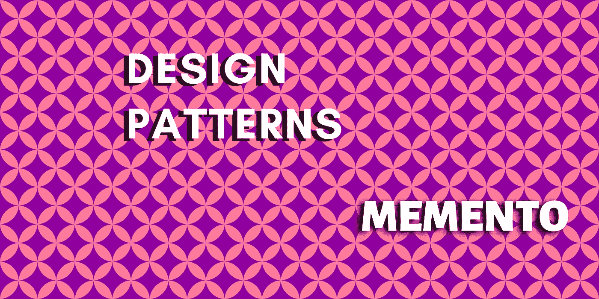

# 设计模式:纪念品

> 原文：<https://levelup.gitconnected.com/design-patterns-memento-3cfe8351ae6a>



纪念品设计模式。图片由[作者](https://medium.com/@aaron.dezoysa)经由【Canva.com】T4

memento 设计模式为我们提供了非常有用的功能，可以在需要时恢复到对象的先前状态。它由三个不同的角色组成，必须创建这三个角色才能正常工作。这三个角色是:

1.  **Originator-**Originator 是将保存其状态以便我们稍后恢复的对象。
2.  **看守-** 当需要这些动作时，该对象将保存并恢复发起者的状态。
3.  **Memento-**Memento 是看护者用来存储发起者状态的对象。当保存纪念品时，发起者将把他们的状态写入该纪念品，并且当状态被恢复时，从该纪念品中读取。

# 实现 Memento 设计模式

假设我们有一个音乐应用程序，我们开始一首接一首地听歌。在某些时候，我们会听到一首美妙的歌曲，你觉得你需要再听一遍，因为它实在是太棒了！您无需再次搜索歌曲，而是单击“上一首曲目”按钮。为了做到这一点，我们将使用 memento 设计模式来实现程序，以便我们可以返回并再次播放那首歌曲。

首先让我们创建一个名为“NowPlaying”的类，它将承担本例中发起者的角色。

```
public class NowPlaying {private String currentSong;public void play(String song) {
      this.currentSong = song;
   }private String getCurrentSong() {
      return currentSong;
   }@Override
   public String toString() {
      return "Now playing: " + currentSong;
   }}
```

现在我们已经准备好了，我们需要创建一个类作为纪念品。我们可以称之为‘now playing memento ’,我将它实现为一个内部类，这样就可以通过‘now playing’类来访问它。“NowPlaying”类现在看起来像这样:

```
public class NowPlaying { private String currentSong; public void play(String song) {
      this.currentSong = song;
   } private String getCurrentSong() {
      return currentSong;
   } **  public NowPlayingMemento save() {
      return new NowPlayingMemento(getCurrentSong());
   }** **public void previous(NowPlayingMemento nowPlayingMemento) {
      this.currentSong = nowPlayingMemento.getSong();
   }** @Override
   public String toString() {
      return "Now playing: " + currentSong;
   } **static class NowPlayingMemento {** **private String song;** **public NowPlayingMemento(String song) {
         this.song = song;
      }** **private String getSong() {
         return song;
      }** **}**}
```

我强调了我添加的代码行，以便于理解。

现在是时候创建这个类了，它将作为这个例子的看管者。我们将创建一个名为“PlayedHistory”的类，它将有一个堆栈来存储“NowPlayingMemento”的实例，用于逐个移动到以前播放的歌曲。

```
import java.util.Stack;public class PlayedHistory { Stack<NowPlaying.NowPlayingMemento> history = new Stack<>(); public void save(NowPlaying nowPlaying) {
      history.push(nowPlaying.save());
   } public void previous(NowPlaying nowPlaying) {
      if(!history.isEmpty()) {
         nowPlaying.previous(history.pop());
      } else {
         System.out.println("End of played history.");
      }
   }}
```

在弹出最后一首保存的歌曲之前，我们使用了一个 if 条件来检查堆栈是否为空。现在让我们创建一个类来看看这个音乐播放器的运行情况。

```
public class Application { public static void main(String[] args) { PlayedHistory history = new PlayedHistory(); NowPlaying nowPlaying = new NowPlaying(); nowPlaying.play("Sweet Child o' Mine");
      history.save(nowPlaying);
      System.out.println(nowPlaying); nowPlaying.play("Back In Black");
      history.save(nowPlaying);
      System.out.println(nowPlaying); nowPlaying.play("Disenchanted");
      history.save(nowPlaying);
      System.out.println(nowPlaying); nowPlaying.play("Say Amen");
      history.save(nowPlaying);
      System.out.println(nowPlaying); nowPlaying.play("House of Wolves");
      history.save(nowPlaying);
      System.out.println(nowPlaying); // Going back to previous songs
      history.previous(nowPlaying);
      System.out.println(nowPlaying); history.previous(nowPlaying);
      System.out.println(nowPlaying); history.previous(nowPlaying);
      System.out.println(nowPlaying); }}
```

为了测试应用程序，我们为“PlayedHistory”类和“NowPlaying”类各创建了一个实例。在每次调用`play()`方法后，我们调用`history.save()`将当前歌曲的纪念品保存到堆栈中。一旦我们播放完所有的歌曲，我们就一首接一首地回到之前播放的歌曲，并得到以下输出(请忽略我的音乐品味…)。

```
Now playing: Sweet Child o' Mine
Now playing: Back In Black
Now playing: Disenchanted
Now playing: Say Amen
Now playing: House of Wolves
Now playing: House of Wolves
Now playing: Say Amen
Now playing: Disenchanted
```

你会看到最后一首歌(狼之屋)放了两遍。这是因为我们在播放歌曲后立即将歌曲保存到堆栈中，所以我们将在返回之前看到最后一首歌曲的重播(大多数情况下音乐播放器都会这样)。

**注意:**这只是一个简单的音乐播放器，目的是提供一个如何使用这种设计模式的例子。

我希望这篇文章能为你提供一些关于纪念品设计模式的有用信息。感谢阅读！

# 参考

## 录像

[用纪念品图案撤销更改|你必须知道的设计图案](https://www.youtube.com/watch?v=Pwm-jrG2ZVA)