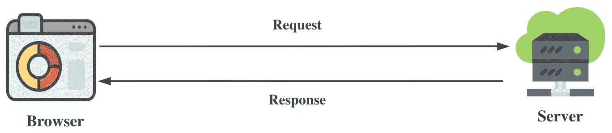
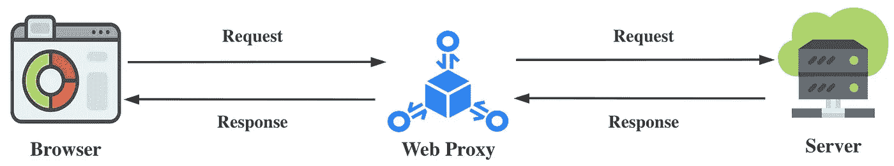
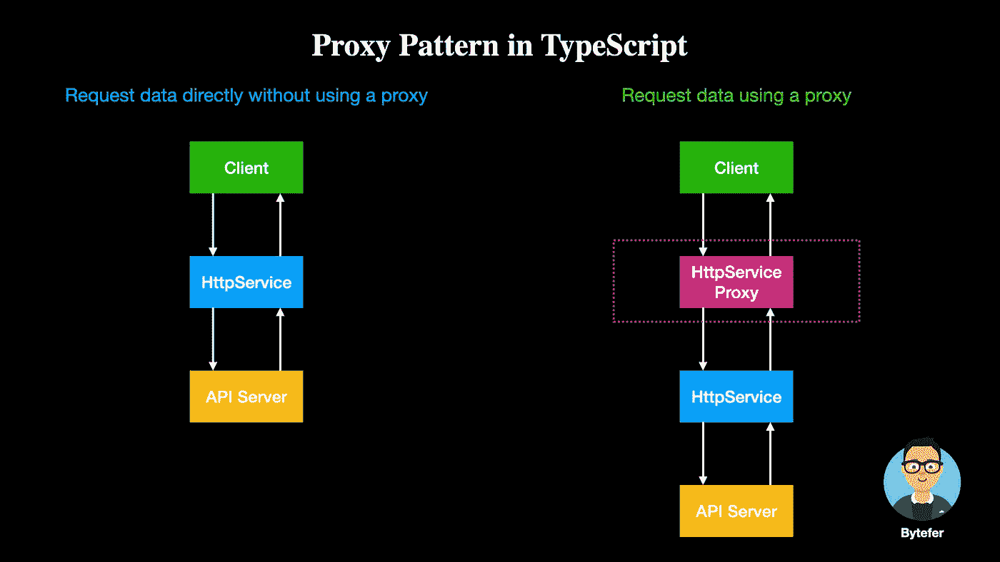
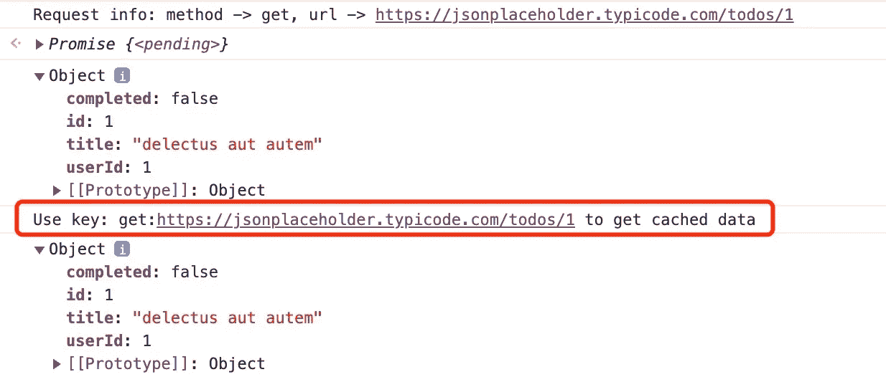

# 设计模式:TypeScript 中的代理模式

> 原文：<https://levelup.gitconnected.com/design-patterns-proxy-pattern-in-typescript-b4b66fef3a59>

## 代理模式的本质是一个中间件，其主要目的是分离服务提供者和客户。


照片由[凯尔·格伦](https://unsplash.com/@kylejglenn?utm_source=medium&utm_medium=referral)在 [Unsplash](https://unsplash.com?utm_source=medium&utm_medium=referral) 上拍摄

欢迎来到 TypeScript 系列的**设计模式，该系列介绍了一些使用 TypeScript 进行 web 开发时有用的设计模式。**

[](https://medium.com/frontend-canteen/9-design-patterns-every-engineer-should-know-f2423d36d468) [## 每个工程师都应该知道的 9 种设计模式

### 掌握这 9 种设计模式，写出更好的代码

medium.com](https://medium.com/frontend-canteen/9-design-patterns-every-engineer-should-know-f2423d36d468) 

设计模式对于 web 开发人员来说非常重要，通过掌握它们我们可以写出更好的代码。在本文中，我将使用**类型脚本**来介绍**代理模式。**

HTTP 是用于传输超媒体文档的应用层协议。它是为 web 浏览器和 web 服务器之间的通信而设计的。



在开发 web 项目的过程中，您可能需要手动修改请求参数或响应结果。要实现这一点，您可以使用 web 调试代理工具，如 Fiddler 或 Charles。



从上图可以看出，使用 web 调试代理工具后，我们发起的 HTTP 请求会通过 Web 代理进行转发和处理。Web 代理层的增加使我们能够更好地控制 HTTP 请求流。

了解了 Web 代理的用途之后，我们来介绍一下代理模式的使用场景。在下面的代码中，我们定义了一个包含用于发送 HTTP 请求的`sendRequest`成员方法的`HttpService`类。

```
class HttpService {
  async sendRequest(method: string, url: string, body?: BodyInit) {
    console.log(`Request info: method -> ${method}, url -> ${url}`);
    return fetch(url, {
      method,
      body,
    }).then((response) => response.json());
  }
}
```

有了`HttpService`类，我们可以使用它的实例来获取远程数据。例如，获取 **{JSON}占位符**站点上提供的模拟数据:

```
const httpService = new HttpService();async function getTodoDetail(todoId: number) {
  return httpService.sendRequest(
    "get",
    `[https://jsonplaceholder.typicode.com/todos/${todoId}`](https://jsonplaceholder.typicode.com/todos/${todoId}`)
  );
}(async function main() {
  console.dir(await getTodoDetail(1));
  console.dir(await getTodoDetail(1));
})();
```

在上面的代码中，我们使用 **httpService** 对象来获取第一个 todo 项的信息。但现在的问题是，如果我们想让 **httpService** 对象支持缓存，我们该怎么做？最直接的方法是修改`HttpService`类，但是如果使用的是第三方 Http 服务，这种方法就行不通了。这个问题的另一个解决方案是使用代理模式。



在上图中，我们添加了一个 **HttpServiceProxy** 代理对象，用来代理现有的 **HttpService** 对象。接下来，让我们定义`HttpServiceProxy`类，我们在其中添加前面描述的缓存功能。

在 sendRequest 方法中，我们使用 HTTP 请求方法和 url 地址作为缓存键。每次发送请求时，它会先判断相应的数据是否已经存在于缓存中，如果是，则直接返回。否则，通过`HttpService`实例发送请求获取数据，并将返回的数据保存在缓存中。为简单起见，我们不考虑缓存有效期。

一旦我们有了`HttpServiceProxy`对象，我们就可以用它来请求第一个 todo 项的信息。

```
const httpServiceProxy = new HttpServiceProxy();async function getTodoDetail(todoId: number) {
  return httpServiceProxy.sendRequest(
    "get",
    `[https://jsonplaceholder.typicode.com/todos/${todoId}`](https://jsonplaceholder.typicode.com/todos/${todoId}`)
  );
}(async function main() {
  console.dir(await getTodoDetail(1));
  console.dir(await getTodoDetail(1));
})();
```

上述代码成功执行后，控制台将输出以下信息:



从上图可以看出，使用`HttpServiceProxy`对象后，缓存功能已经生效。使用同样的想法，我们也可以在浏览器上扩展全局对象的功能。例如，我们扩展了`localStorage`对象的功能，以支持设置存储数据的到期时间。

使用`LocalStorageProxy`对象，我们可以在将数据保存到`localStorage`时设置数据项的到期时间。

```
let storageProxy = new LocalStorageProxy();storageProxy.setItem("name", "bytefer", 1000);
console.log(storageProxy.getItem("name"));
setTimeout(() => {
  console.log(storageProxy.getItem("name"));
}, 1000);
```

需要注意的是，为了实现同样的功能，我们也可以使用一个非常强大的`Proxy` API。如果你对这个 API 感兴趣，推荐你看下面这篇文章。

[](https://javascript.plainenglish.io/the-proxy-api-is-so-powerful-that-every-web-developer-should-master-it-9bdc71a4032c) [## 代理 API 如此强大，每个 Web 开发人员都应该掌握它！

### 80%的 Web 开发人员不应该知道的代理 API 的 8 个主要使用场景！

javascript.plainenglish.io](https://javascript.plainenglish.io/the-proxy-api-is-so-powerful-that-every-web-developer-should-master-it-9bdc71a4032c) 

最后，让我们总结一下代理模式的使用场景:

*   当不希望从外部直接访问对象时，请考虑代理模式。
*   代理模式的本质是一个中间件，其主要目的是分离服务提供者和客户。客户端通过代理间接访问服务提供者，方便对服务提供者进行封装和控制。

如果你有任何问题，请随时给我留言。后面我会继续介绍其他模式，如果有兴趣可以关注我的[中](https://medium.com/@bytefer)或者[推特](https://twitter.com/Tbytefer)。

如果你想学习打字稿，那么就不要错过**掌握打字稿**系列。

[](https://medium.com/frontend-canteen/with-these-articles-you-will-not-be-confused-when-learning-typescript-d96a5c99e229) [## 有了 30+篇文章，学习 TypeScript 就不会迷茫了

### 通过生动的动画，让你轻松了解 TypeScript 的难点和核心知识！不断地…

medium.com](https://medium.com/frontend-canteen/with-these-articles-you-will-not-be-confused-when-learning-typescript-d96a5c99e229)