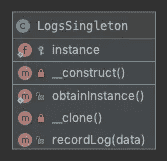
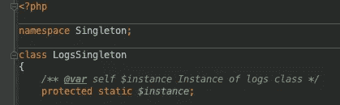
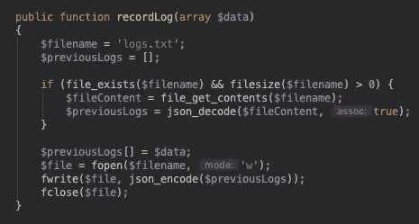
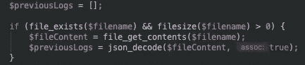
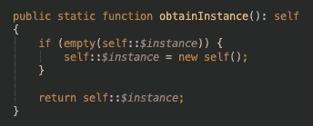
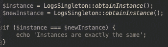

# 设计模式—单例

> 原文：<https://levelup.gitconnected.com/design-patterns-singleton-4476879ea1b0>

# 带有 Singleton 的全局接入点

假设你管理着一个大型银行系统。银行需要交易的安全性和所有可能发生的系统错误的可追溯性。在这个系统中，有一个单独的类负责写日志(日志用于记录系统中所做的事情)。


在每个操作中，也就是说，在系统上执行的几乎所有操作，都会用各种信息写入一个日志。然而，随着用户数量的增加，系统开始遇到性能问题。所有用户都不断抱怨速度太慢。

这个问题的原因之一是，每次我们需要写日志时，我们必须再次实例化这个类；每个新实例都会占用一个服务器内存空间。因为系统接收了相当多的并发用户，最终将系统的物理内存使用推到了极限。

在得出大量日志类实例是性能问题的主要原因的结论后，需要减少现有并发实例的数量。如果您可以实例化这个日志对象一次，并在整个系统运行时(计算机程序保持运行的时期)共享它，我们将解决这个问题；这就是单例模式的由来。

# 独生子女标准

## 定义

就像前面提到的银行系统问题一样，我们有一个应用程序性能问题，因为我们有一个类的大量实例——随着对服务器的每个请求同时创建——我们需要对一个类的不受控制的实例的创建进行更好的控制。

Singleton 旨在确保这种控制，管理为给定类创建的实例数量，并在单个全局访问点上集中创建这些对象(可以从系统中的任何地方访问)。

互联网上有几个单例实现的例子，其中主类控制其他类的实例。然而，这并不能保证对一个类的实例的实际控制，因为不知情的开发人员可能会忽略 Singleton 类(它控制实例的创建)并创建新的对象，要么是因为他们不知道它们的存在，要么是因为不想使用它们。

正确的是，遵循这种设计模式的类控制它自己的实例的创建，所以不可能创建它的实例。限制创建类本身的新实例的方法因语言而异。我们将看到用 PHP 7+实现这一点的所有步骤。

## Singleton，反模式

> 对于许多人来说，单例模式被认为是一种反模式，因为它以静态形式使用(调用类而不必实例化它)，尤其是通过对类实例的全局访问。使用静态类的问题很多:我们不能使用接口，我们的代码耦合性更高，等等。
> 
> 我们也有与实例变量的全局访问相关的问题。这使得人们很难理解为什么变量不直接与特定的系统范围相关联。我们还面临着这样的风险，即在系统中的任何一点可以改变的变量都会影响到其他部分。

尽管有这些缺点，任何标准的应用都应该根据实际需要来衡量。在 Singleton 的情况下，如果需要对共享资源进行同步访问控制，或者如果我们确实需要一个实例，就需要使用 Singleton。

## 类图

下面是根据我们的例子的单例模式类图:



## 单一元素的元素

Singleton 是一个类，负责控制自身实例的创建，并允许在整个应用程序中全局访问这些实例。这不同于稍后将会看到的 Adapter，因为它由单个元素组成。

# 用单个实例解决日志问题

在下面的例子中，我们将编写负责解决银行系统多实例问题的代码。这个想法是创建一个将日志写入文本文件的类。每次出现日志时，该日志将被写入文件。

这个类将遵循单例模式，无论使用多少次，都只允许创建一个实例。在下面的代码中，我们将开始构建 LogsSingleton 类，它将是我们模式的基础。我建议您创建一个名为 singleton 的文件夹，并将所有文件插入其中进行测试。



第一点是创建 *$instance* (attribute)属性，它将存储类的单个实例。从示例中可以看出，属性已经设置为 static，因为将实例存储在静态属性中确保了类实例所在的单点。

该属性已被设置为受保护的隐私级别。通过这种方式，我们无法从外部直接访问它。

如前所述，我们将把日志存储在一个文本文件中，文件名为 *logs.txt* ，数据为 JSON 格式。这种格式是跨系统存储和交换数据的简单结构，允许您以结构化的方式组织信息，甚至定义数据类型。

我们还需要调用将日志记录到文本文件的方法。让我们看看它会是什么样子，记住 *recordLog()* 方法应该在您之前创建的 *LogsSingleton()* 类中。



*recordLog()* 方法接受数组类型的参数( *$data* )。在这个参数中，我们将接收要写入文本文件的数据。

在下面的代码中，我们将 *$previousLogs* 变量声明为空数组(如果日志文件为空，这将避免错误)。然后，使用 *filesize()* 方法，我们检查文本文件中是否存储了任何内容；如果大小大于零，则内部有数据(日志)。

我们将从 PHP 的本机 *file_get_contents()* 函数中获取内容，然后用 *json_decode()* 函数将该内容(以 JSON 格式存储)转换成一个数组。最后，如果文件中没有内容，变量 *$previousLogs* 将包含一个空数组，或者一个包含以前在其他运行中写入的日志的数组。



在代码*中，$ previous logs[]= $ data；*我们正在增加日志数组并添加新日志，即使它是空的或已经包含日志。我们打开文本文件，这样我们就可以在行 *$file = fopen ($ filename，' w ')中再次键入文本；*。

然后我们把 JSON 写到文本文件，fwrite code *($file，JSON _ encode($ previous logs))；**JSON _ encode()*函数将日志数组转换成以下格式的文本。最后，我们调用函数 *fclose()* ，负责关闭已经打开进行写入的文件。

到目前为止，我们已经构建了一个可以将日志写入文本文件的类，并且有一个静态的全局变量来存储它自己的实例。但是，我们需要控制这个实例，所以让我们为此创建一个方法:



像 *$instance* 属性一样， *obtainInstance()* 方法也是静态声明的。让我们调用它来请求一个新的实例(不实例化 log 类)，只有这个方法将具有对$ instance 属性的外部访问。

在它里面的第一行，if，我们用比较结果 *empty(self::$instance)验证 *$instance* 是否为空。*如果是，这意味着还没有创建日志类 *LogsSingleton()* 的实例；如果这个条件成立，那么我们实例化这个类，用代码*self::$ instance = new self()；*。New *self()* 将与 new *LogsSingleton()* 相同，但是由于它在类本身内部，我们可以这样使用它。

最后，用 return*self::$ instance；我们总是返回类本身的实例。第一次调用它时，它总是在 if 内部传递并实例化该类，但在其他时候，它只会返回以前创建的实例。*

现在，我问你，如果我们执行下面的代码会发生什么？

```
$ InstanceLogs = new LogsSingleton ();
```

与预期相反，代码会起作用，我们会有一个新的 LogsSingleton 实例。这不符合提议的单一/受控实例。为了避免这种意外行为，我们必须声明具有私有类型可见性的类构造函数方法:

```
private function __construct () {}
```

因此，有了新的 *LogsSingleton()* ，我们只能通过调用 *obtainInstance()* 方法来获取类实例。除了 private 构造函数之外，PHP 中还有其他特定的方法允许您获取类的新实例，并且所有方法都必须声明为 private，如下所示:

```
private function __clone () {}
```

因此，我们避免创建 *LogsSingleton()* 类的新实例。通过到目前为止开发的代码，我们已经有了单例标准的完整实现。

## 神奇的方法

> agic 方法是 PHP 5 中可用的函数。它们是在 PHP 开始向面向对象发展时创建的。它们可以通过以 __ 开头来识别，并且每个都有特定的功能，例如 __construct，用作类构造函数，或者 __toString(类似于 Java)，在尝试打印对象(将其转换为字符串)时调用。

为了测试这个类，让我们创建一个 index.php 文件并插入以下代码:



无论是第一次还是第二次运行*LogsSingleton::obtain instance()*，该方法都会返回相同的实例。不仅值相同，而且两个变量( *$instance* 和 *$newInstance* )都将指向相同的内存地址。

比较结果*$ instance = = = $ new instance*为真，我们应该看到消息“实例完全相同！”。

# 结论

除了给出的示例日志类之外，另一个非常常见的情况是数据库连接类的实例。这些类通常在整个系统中使用。

同样值得注意的是，在一些实现中，Singleton 类允许多个实例。但是，它始终是一个有限的、受控的数字，仍然符合模式。

尽管它的所有缺点导致开发人员将 Singleton 视为反模式，但了解它的操作和用途仍然是有效的。

## 知识库和参考资料

Github 代码库:[https://github.com/augustkohl/design-patterns](https://github.com/cesarkohl/design-patterns)

编程 Python:强大的面向对象编程。2011.

面向对象的思维过程。艾迪森-卫斯理专业，2019。

伽马，e；赫尔姆河；设计模式:可重用面向对象软件的要素。艾迪森-韦斯利专业版，1994 年。