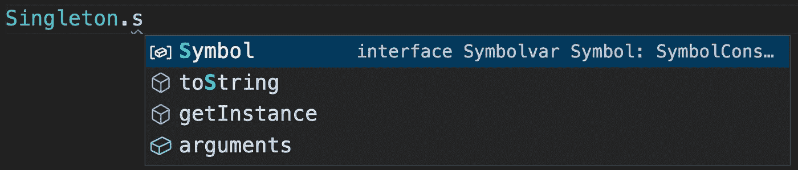

# 设计模式:TypeScript 中的单例模式

> 原文：<https://levelup.gitconnected.com/design-patterns-singleton-pattern-in-typescript-e98ec08a9c14>

## 在整个应用程序中共享一个全局实例


由[格雷格·拉科齐](https://unsplash.com/@grakozy?utm_source=medium&utm_medium=referral)在 [Unsplash](https://unsplash.com?utm_source=medium&utm_medium=referral) 上拍摄的照片

欢迎来到 TypeScript 系列的**设计模式，该系列介绍了一些使用 TypeScript 进行 web 开发时有用的设计模式。**

[](https://medium.com/frontend-canteen/9-design-patterns-every-engineer-should-know-f2423d36d468) [## 每个工程师都应该知道的 9 种设计模式

### 掌握这 9 种设计模式，写出更好的代码

medium.com](https://medium.com/frontend-canteen/9-design-patterns-every-engineer-should-know-f2423d36d468) 

设计模式对于 web 开发人员来说非常重要，通过掌握它们我们可以写出更好的代码。在本文中，我将使用 **TypeScript** 来介绍 **Singleton 模式。**

单例模式是一种常见的模式，我们经常只需要一些对象中的一个，比如全局缓存，浏览器中的窗口对象等。**单例模式用于确保一个类只有一个实例，并提供一个全局访问点**。


上图我模拟了借车的过程。Chris1993 有急事，问我借辆车，所以我把车借给了 Chris1993。同一天，Bytefish 也需要车，问我借车，因为我家里只有一辆车，所以没有车借。

对于汽车来说，它给生活带来了极大的便利，但也需要一笔可观的钱来保养汽车(停车费、汽油费、维修费等。)，所以我家里只有一辆车。在开发软件系统时，如果我们遇到创建对象时花费太多时间或消耗太多资源，但又经常使用的对象，可以考虑使用 singleton 模式。

让我们看看如何使用 TypeScript 来实现 singleton 模式。

```
class Singleton {
  private static singleton: Singleton; // **①**
  private constructor() {} // **②** public static getInstance(): Singleton { // **③**
    if (!Singleton.singleton) {
      Singleton.singleton = new Singleton();
    }
    return Singleton.singleton;
  }
}
```

定义`Singleton`类时，有三个关键步骤:

1.  定义私有静态属性以保存对象实例；
2.  定义私有构造函数；
3.  提供静态方法来获取对象实例。

在 VSCode 编辑器中，对于私有静态属性，编辑器的 IntelliSense 会自动筛选出这些属性:



对于私有构造函数，当我们通过`new Singleton()`创建实例时，TypeScript 编译器会提示如下错误信息:

```
Constructor of class 'Singleton' is private and only accessible within the class declaration.ts(2673)
```

对于 Singleton 类，让我们验证它的功能:

```
let instance1 = Singleton.getInstance();
let instance2 = Singleton.getInstance();console.log(instance1 === instance2); // true
```

在 JavaScript 中实现单例的最简单的方法是使用一个**对象文字**:

```
const httpClient = {
  get(url, config) {
    // send get request
  },
  post(url, config) {
    // send post request
  },
};
```

如果你需要包含私有属性或方法，你可以使用下面的方法来创建一个 singleton:

```
const httpClient = (function () {
  // private method
  function sendRequest(url, config) {
    // send request
  }
  return {
    get(url, config) {
      return sendRequest(url, config);
    },
    post(url, config) {
      return sendRequest(url, config);
    },
  };
})();
```

如果你正在使用 ES6，你可以很容易地使用 **ES 模块**来表示单例:

```
export default {
  get(url, config) {
    // send get request
  },
  post(url, config) {
    // send post request
  },
};
```

[Axios](https://axios-http.com/) 广泛应用于各种 web 项目，它提供的`axios`对象也是一个 singleton 对象。

```
import axios from "axios";axios.get('/users')
  .then(res => {
    console.log(res.data);
 });
```

上面的`axios`实例使用了默认的配置对象，当然，axios 也允许我们使用`axios.create`方法创建一个自定义配置的 Axios 新实例。

```
const instance = axios.create({
  baseURL: '[https://mediuem.com/'](https://some-domain.com/api/'),
  timeout: 1000,
  headers: {'X-Custom-Header': 'Bytefer'}
});
```

最后，让我们总结一下单体模式的使用场景:

*   需要太多时间或资源来创建，但经常被使用的对象。
*   由于单例模式在内存中只有一个实例，减少了内存开销，特别是当一个对象需要频繁创建和销毁，并且在创建或销毁过程中无法优化性能时，单例模式的优势非常明显。

如果你有任何问题，请随时给我留言。后面我会继续介绍其他模式，如果有兴趣可以关注我[中](https://medium.com/@bytefer)或者[推特](https://twitter.com/Tbytefer)。

如果你想学习 TypeScript，那么不要错过**掌握 TypeScript** 系列。

[](https://medium.com/frontend-canteen/with-these-articles-you-will-not-be-confused-when-learning-typescript-d96a5c99e229) [## 有了 30+篇文章，学习 TypeScript 就不会迷茫了

### 通过生动的动画，让你轻松了解 TypeScript 的难点和核心知识！不断地…

medium.com](https://medium.com/frontend-canteen/with-these-articles-you-will-not-be-confused-when-learning-typescript-d96a5c99e229)