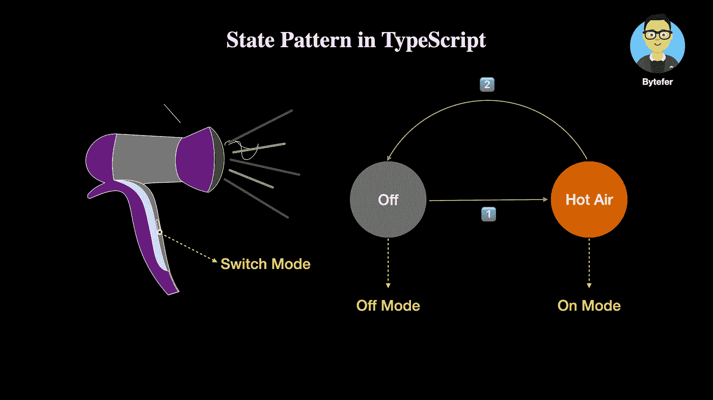
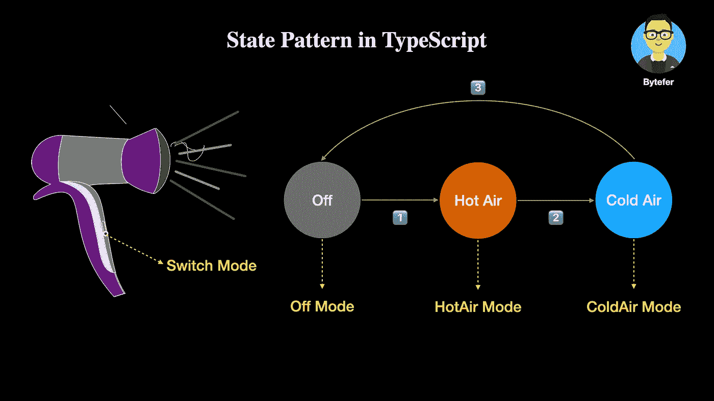
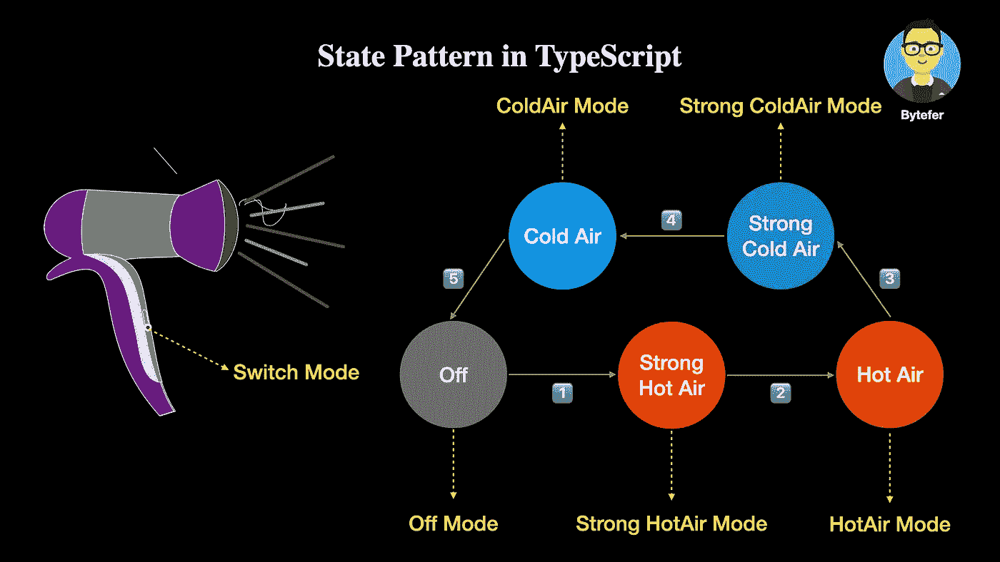
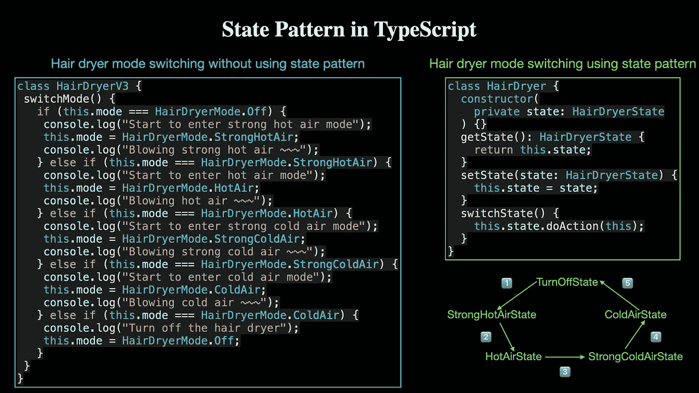

# 设计模式:类型脚本中的状态模式

> 原文：<https://levelup.gitconnected.com/design-patterns-state-pattern-in-typescript-32120b9a759f>

## 去掉太多 If-Else 分支，尝试 State 模式！


迈克尔·克什在 [Unsplash](https://unsplash.com?utm_source=medium&utm_medium=referral) 上拍摄的照片

欢迎来到 TypeScript 系列的**设计模式，该系列介绍了一些使用 TypeScript 进行 web 开发时有用的设计模式。**

[](https://medium.com/frontend-canteen/9-design-patterns-every-engineer-should-know-f2423d36d468) [## 每个工程师都应该知道的 9 种设计模式

### 掌握这 9 种设计模式，写出更好的代码

medium.com](https://medium.com/frontend-canteen/9-design-patterns-every-engineer-should-know-f2423d36d468) 

设计模式对于 web 开发人员来说非常重要，通过掌握它们我们可以写出更好的代码。在本文中，我将使用**类型脚本**来介绍**状态模式。**

状态模式和 [**策略模式**](https://javascript.plainenglish.io/design-patterns-strategy-pattern-in-typescript-54eda9b40f09) 在结构上非常相似，都属于行为模式，也可以用来优化`if…else`分支过多的问题。下面我就举一个吹风机的例子，带大家先学习一下状态模式，然后介绍一下它和 [**策略模式**](https://javascript.plainenglish.io/design-patterns-strategy-pattern-in-typescript-54eda9b40f09) 的区别。

吹风机是一种非常常用的小家电。普通吹风机只有两种模式:**关和吹热风**。你可以通过吹风机上的开关在不同模式之间切换。



基于上图中的描述信息，我们使用 TypeScript `class`的语法来定义一个`HairDryerV1`类:

```
enum HairDryerMode {
  Off,
  On,
}

class HairDryerV1 {
  mode: HairDryerMode = HairDryerMode.Off;

  constructor(mode: HairDryerMode = HairDryerMode.Off) {
    this.mode = mode;
  }

  switchMode() {
    if (this.mode === HairDryerMode.Off) {
      console.log("Turn on the hair dryer");
      this.mode = HairDryerMode.On;
      console.log("Blowing hot air ~~~");
    } else if (this.mode === HairDryerMode.On) {
      console.log("Turn off the hair dryer");
      this.mode = HairDryerMode.Off;
    }
  }
}
```

在上面的代码中，`HairDryerV1`类包含了一个用于指示吹风机当前模式的`mode`属性和一个用于切换吹风机工作模式的`switchMode`方法。现在我们有了第一代吹风机类别`HairDryerV1`，让我们测试它的功能:

```
const hairDryerV1 = new HairDryerV1();
hairDryerV1.switchMode(); // Blowing hot air
hairDryerV1.switchMode(); // Turn off
hairDryerV1.switchMode(); // Blowing hot air
```

成功运行上述代码后，相应的输出如下:

```
Turn on the hair dryer
Blowing hot air ~~~
Turn off the hair dryer
Turn on the hair dryer
Blowing hot air ~~~
```

冬天打开吹风机后只有热风模式，可以满足大部分用户的需求。但是夏天天气比较热，用户会希望吹风机也支持冷风模式。相应的要求如下图所示:



为了满足以上需求，我们来升级一下第一代吹风机(`HairDryerV1`)。

```
enum HairDryerMode {
  Off,
  HotAir,
  ColdAir,
}

class HairDryerV2 {
  mode: HairDryerMode = HairDryerMode.Off;

  constructor(mode: HairDryerMode = HairDryerMode.Off) {
    this.mode = mode;
  }

  switchMode() {
    if (this.mode === HairDryerMode.Off) {
      console.log("Start to enter hot air mode");
      this.mode = HairDryerMode.HotAir;
      console.log("Blowing hot air ~~~");
    } else if (this.mode === HairDryerMode.HotAir) {
      console.log("Start to enter cold air mode");
      this.mode = HairDryerMode.ColdAir;
      console.log("Blowing cold air ~~~");
    } else if (this.mode === HairDryerMode.ColdAir) {
      console.log("Turn off the hair dryer");
      this.mode = HairDryerMode.Off;
    }
  }
}
```

在上面的代码中，我们首先更新了`HairDryerMode`枚举类型，定义了关、热风、冷风三种不同的模式，并根据**关- >热风- >冷风**切换过程更新了`switchMode`方法。有了第二代吹风机类— `HairDryerV2`，我们来测试一下它的功能性。

```
const hairDryerV2 = new HairDryerV2();
hairDryerV2.switchMode(); // Blowing hot air
hairDryerV2.switchMode(); // Blowing cold air
hairDryerV2.switchMode(); // Turn off
```

成功运行上述代码后，相应的输出如下:

```
Start to enter hot air mode
Blowing hot air ~~~
Start to enter cold air mode
Blowing cold air ~~~
Turn off the hair dryer
```

虽然第二代吹风机已经支持冷风和热风模式，但是仍然不能满足某些场景的需求。例如，有些用户会希望在热风模式的风速和温度较高时开始吹头发(吹强烈的热风)，但在头发几乎干燥时，热风模式的风速和温度可以较低(吹热风)。

相应的要求如下图所示:



为了满足以上需求，我们需要继续升级第二代吹风机(`HairDryerV2`)。

```
enum HairDryerMode {
  Off,
  StrongHotAir,
  HotAir,
  StrongColdAir,
  ColdAir,
}

class HairDryerV3 {
  mode: HairDryerMode = HairDryerMode.Off;

  constructor(mode: HairDryerMode = HairDryerMode.Off) {
    this.mode = mode;
  }

  switchMode() {
    if (this.mode === HairDryerMode.Off) {
      console.log("Start to enter strong hot air mode");
      this.mode = HairDryerMode.StrongHotAir;
      console.log("Blowing strong hot air ~~~");
    } else if (this.mode === HairDryerMode.StrongHotAir) {
      console.log("Start to enter hot air mode");
      this.mode = HairDryerMode.HotAir;
      console.log("Blowing hot air ~~~");
    } else if (this.mode === HairDryerMode.HotAir) {
      console.log("Start to enter strong cold air mode");
      this.mode = HairDryerMode.StrongColdAir;
      console.log("Blowing strong cold air ~~~");
    } else if (this.mode === HairDryerMode.StrongColdAir) {
      console.log("Start to enter cold air mode");
      this.mode = HairDryerMode.ColdAir;
      console.log("Blowing cold air ~~~");
    } else if (this.mode === HairDryerMode.ColdAir) {
      console.log("Turn off the hair dryer");
      this.mode = HairDryerMode.Off;
    }
  }
}
```

在上面的代码中，我们更新了`HairDryerMode`枚举类型，增加了**吹强热风和吹强冷风**两种新模式，并按照**关- >吹强热风- >吹热风- >吹强冷风- >吹冷风**的切换流程更新了`switchMode`方法。同样，用第三代吹风机类— `HairDryerV3`，我们来测试一下它的功能。

```
const hairDryerV3 = new HairDryerV3();
hairDryerV3.switchMode(); // Blowing strong hot air
hairDryerV3.switchMode(); // Blowing hot air
hairDryerV3.switchMode(); // Blowing strong cold air
hairDryerV3.switchMode(); // Blowing cold air
hairDryerV3.switchMode(); // Turn off
```

成功运行上述代码后，相应的输出如下:

```
Start to enter strong hot air mode
Blowing strong hot air ~~~
Start to enter hot air mode
Blowing hot air ~~~
Start to enter strong cold air mode
Blowing strong cold air ~~~
Start to enter cold air mode
Blowing cold air ~~~
Turn off the hair dryer
```

经过不断升级，第三代吹风机(`HairDryerV3`)的功能已经很强大了。但此时`HairDryerV3`类中的`switchMode`方法包含了大量的`if…else`语句。这不仅不利于后期的维护，而且如果以后要添加其他模式，还需要添加相应的条件分支。

对于上述问题，我们可以用**状态模式**将吹风机的不同工作模式封装成不同的工作状态。接下来，我将描述如何使用**状态模式**来解决上述问题。状态模式由三个主要角色组成:

*   **上下文**:保存对当前状态的引用，支持更新当前状态；
*   **状态**:抽象状态类，用于定义上下文中状态的公共接口；
*   **具体状态**:特定状态，包含该状态下的处理逻辑，控制向其他状态的切换。

对于前面的吹风机示例，我将定义一个`HairDryer`类来保存和管理不同的状态，它对应于状态模式中的`Context`角色。然后用`interface`定义一个`HairDryerState`接口，然后基于这个接口实现五种不同的吹风机工作状态。

为了更好地理解下面的代码，我们先来看看相应的 UML 图:


**吹风机状态界面**

该接口包含一个`doAction`方法，用于封装吹风机在不同工作状态下的处理逻辑。

```
interface HairDryerState {
  doAction(context: HairDryer): void;
}
```

**关闭状态(混凝土状态)**

```
class TurnOffState implements HairDryerState {
  doAction(context: HairDryer): void {
    console.log("Start to enter strong hot air state");
    context.setState(new StrongHotAirState());
    console.log("Blowing strong hot air ~~~");
  }
}
```

**🔥🔥🔥strong hotairstate(concrete state)**

```
class StrongHotAirState implements HairDryerState {
  doAction(context: HairDryer): void {
    console.log("Start to enter hot air state");
    context.setState(new HotAirState());
    console.log("Blowing hot air ~~~");
  }
}
```

**🔥HotAirState(混凝土状态)**

```
class HotAirState implements HairDryerState {
  doAction(context: HairDryer): void {
    console.log("Start to enter strong cold air state");
    context.setState(new StrongColdAirState());
    console.log("Blowing strong cold air ~~~");
  }
}
```

**🧊🧊🧊强冷状态(混凝土状态)**

```
class StrongColdAirState implements HairDryerState {
  doAction(context: HairDryer): void {
    console.log("Start to enter cold air state");
    context.setState(new ColdAirState());
    console.log("Blowing cold air ~~~");
  }
}
```

🧊冷空气状态(混凝土状态)

```
class ColdAirState implements HairDryerState {
  doAction(context: HairDryer): void {
    console.log("Turn off the hair dryer");
    context.setState(new TurnOffState());
  }
}
```

**吹风机类(上下文)**

```
class HairDryer {
  constructor(private state: HairDryerState) {}

  getState(): HairDryerState {
    return this.state;
  }

  setState(state: HairDryerState) {
    this.state = state;
  }

  switchState() {
    this.state.doAction(this);
  }
}
```

在上面的代码中，我们定义了一个`HairDryer`类。这个类包含一个私有的`state`属性来表示吹风机的当前状态，并提供相应的`getState`和`setState`方法来管理这个状态。切换状态的能力在`switchState`方法中定义。使用新的`HairDryer`吹风机类和五个不同的状态类，让我们验证它的功能。

```
const hairDryer = new HairDryer(new TurnOffState());
hairDryer.switchState(); // Blowing strong hot air
hairDryer.switchState(); // Blowing hot air
hairDryer.switchState(); // Blowing strong cold air
hairDryer.switchState(); // Blowing cold air
hairDryer.switchState(); // Turn off
```

成功运行上述代码后，相应的输出如下:

```
Start to enter strong hot air state
Blowing strong hot air ~~~
Start to enter hot air state
Blowing hot air ~~~
Start to enter strong cold air state
Blowing strong cold air ~~~
Start to enter cold air state
Blowing cold air ~~~
Turn off the hair dryer
```

接下来我们来比较一下不使用状态模式实现吹风机的状态/模式切换和使用状态模式后的区别。



最后，让我们总结一下策略模式和状态模式的区别:

*   策略模式是在不同的策略中选择一种策略来完成同一件事。状态模式更侧重于不同状态之间的切换，每个状态完成不同的事情。
*   **封装在策略模式中的算法都完成同样的事情。**比如在登录场景中，用户名/密码、邮箱、手机号，或者第三方账号登录，虽然用户可以使用不同的登录策略，但最终目的都是完成登录操作，也就是说，这些策略之间是可替换的。**但是，对于状态模式来说，不同的状态对应不同的行为，不能随意替换。**
*   在策略模式中，每个策略对象不包含对`Context`对象的引用，但是`Context`对象包含对所有策略对象的引用。在状态模式中，每个状态通过持有对`Context`对象的引用来实现状态切换。

好了，状态模式到此结束。建议您回顾一下之前的业务场景，思考一下是否有适合使用状态模式的场景。如果你有任何问题，请随时给我留言。

后面我会继续介绍其他模式，如果有兴趣可以关注我的[中](https://medium.com/@bytefer)或者[推特](https://twitter.com/Tbytefer)。

想学习打字稿，千万不要错过**掌握打字稿**系列。

[](https://medium.com/frontend-canteen/with-these-articles-you-will-not-be-confused-when-learning-typescript-d96a5c99e229) [## 有了 40+篇文章，学习 TypeScript 就不会迷茫了

### 通过生动的动画，让你轻松了解 TypeScript 的难点和核心知识！不断地…

medium.com](https://medium.com/frontend-canteen/with-these-articles-you-will-not-be-confused-when-learning-typescript-d96a5c99e229) 

# 分级编码

感谢您成为我们社区的一员！在你离开之前:

*   👏为故事鼓掌，跟着作者走👉
*   📰查看[升级编码出版物](https://levelup.gitconnected.com/?utm_source=pub&utm_medium=post)中的更多内容
*   🔔关注我们:[Twitter](https://twitter.com/gitconnected)|[LinkedIn](https://www.linkedin.com/company/gitconnected)|[时事通讯](https://newsletter.levelup.dev)

🚀👉 [**加入升级人才集体，找到一份神奇的工作**](https://jobs.levelup.dev/talent/welcome?referral=true)