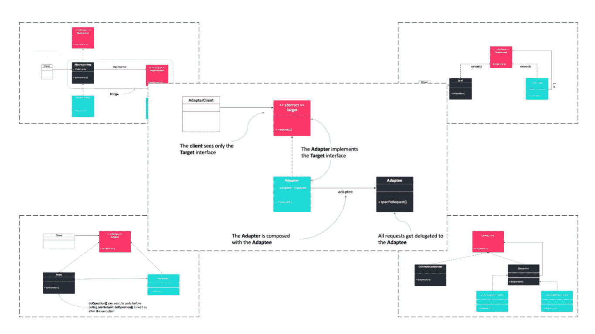
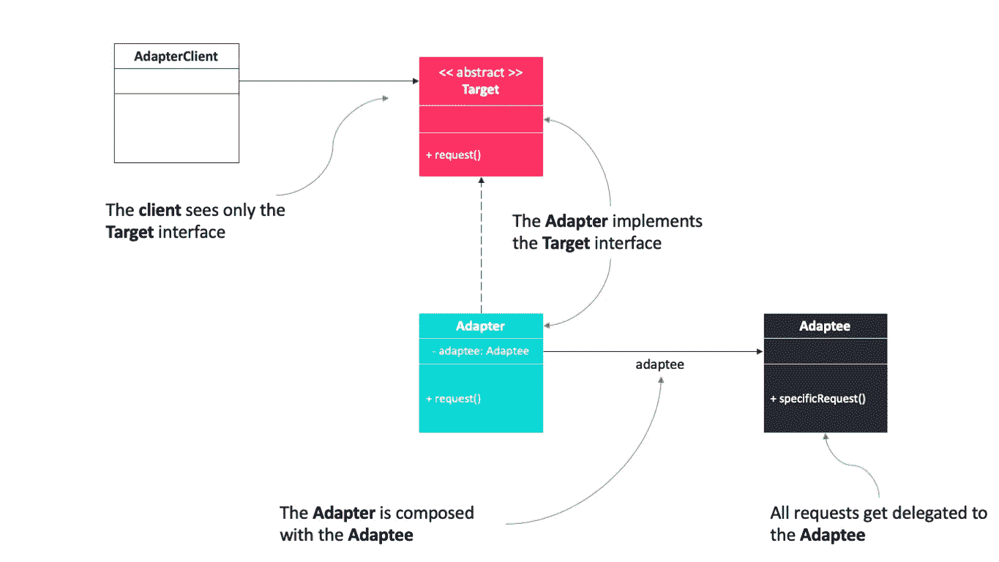
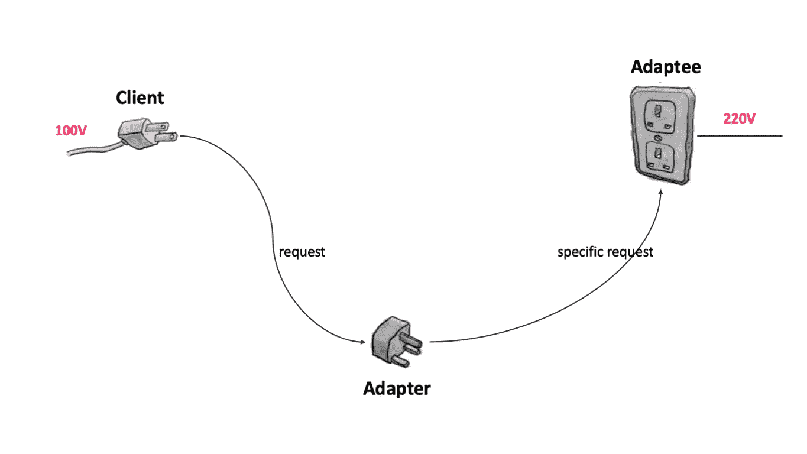
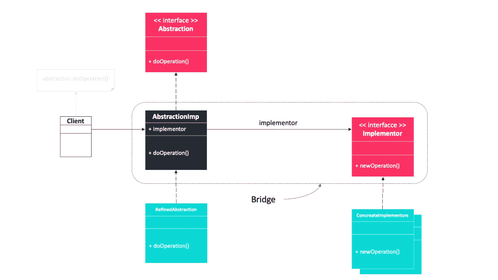
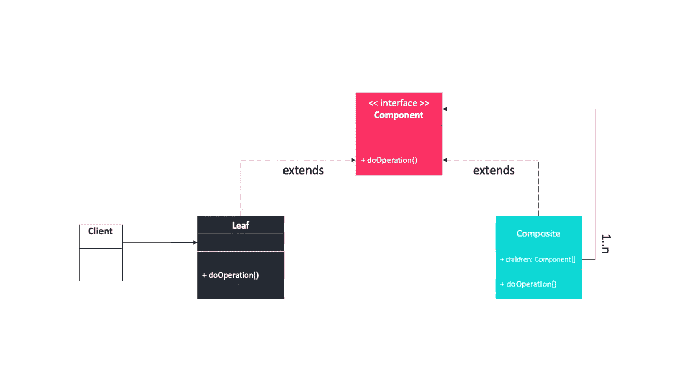
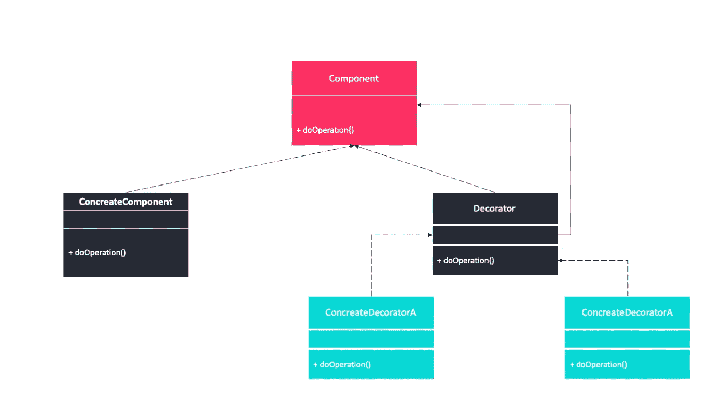
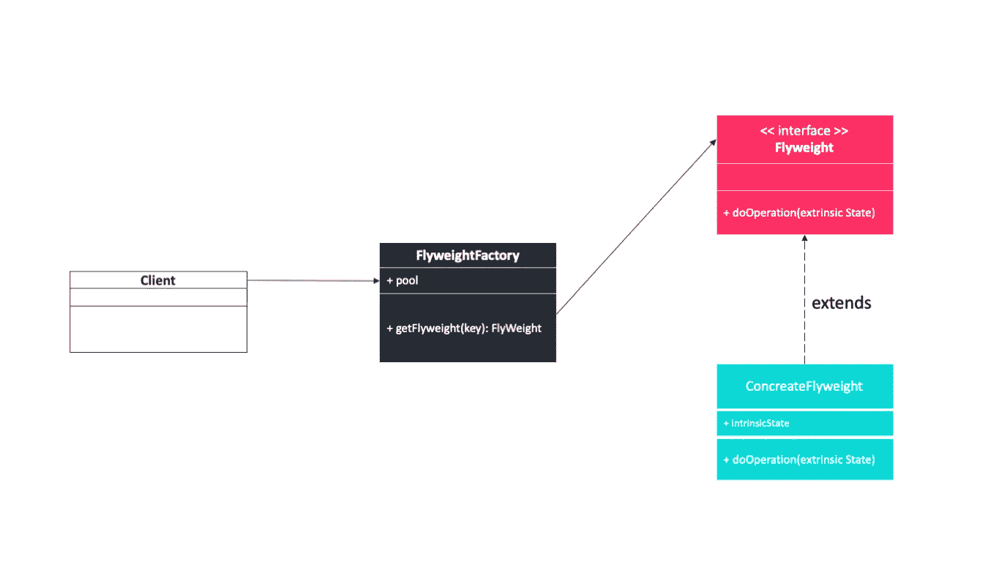
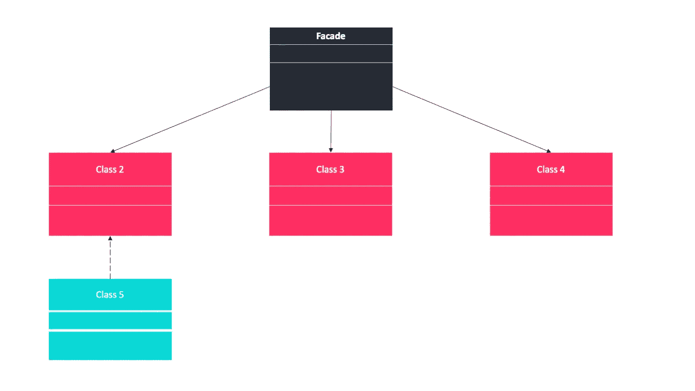
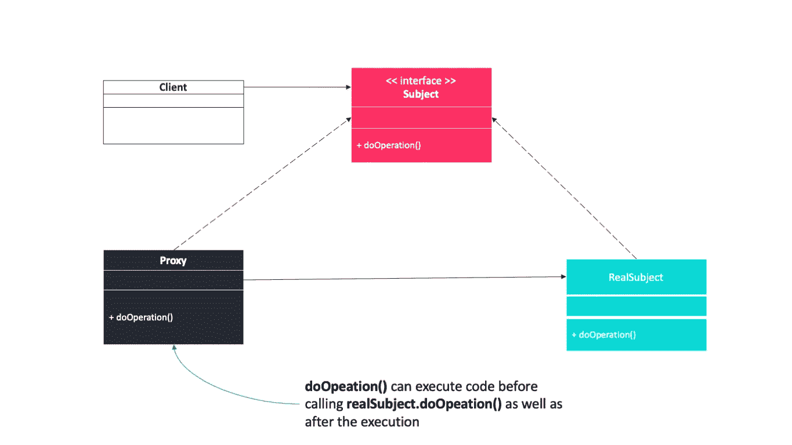

# 设计模式:设计类和对象的结构模式

> 原文：<https://levelup.gitconnected.com/design-patterns-structural-patterns-of-design-classes-and-objects-79d58a6519b>

## [虽然程序员](https://medium.com/tag/thought-programmer)

## 适配器、装饰器、代理、信息专家、复合、桥接、低耦合、轻量级、受保护的变体和外观



设计类和对象的结构模式

结构设计模式关注的是如何组合类和对象，以形成更大的结构。它们使您无需重写或定制代码就能创建系统，因为这些模式为系统提供了增强的可重用性和健壮的功能。

> 每个模式描述了一个在我们的环境中反复出现的问题，然后描述了该问题解决方案的核心，以这样一种方式，你可以使用这个解决方案一百万次，而不必以同样的方式做两次。— *克里斯托弗·亚历山大*

有以下 10 种结构设计模式。

*   适配器模式
*   桥接模式
*   复合模式
*   装饰图案
*   低耦合
*   轻量级模式
*   立面图案
*   代理模式
*   信息专家
*   受保护的变化

# ABCD(适配器、桥接、复合、装饰)

## 适配器模式

**意图**

适配器模式是一种结构设计模式，它允许具有不兼容接口的对象协同工作。

**解决方案**

它实现其客户端已知的接口，并提供对其客户端未知的类实例的访问。

*   **AdapterClient** :代码客户端。
*   **适配器**:将调用转发给被适配器的适配器类。
*   **适配者**:旧代码需要适配。
*   **目标**:要支持的新接口。



适配器模式

**现实世界的例子**

原电源是 220 伏，需要适配 100 伏才能工作。



现实世界的例子

下面的代码解决了这个问题。它定义了一个`HighVoltagePlug`(适配器)，一个`Plug`接口(目标)，一个`AdapterPlug`(适配器)。

目标:Plug.java

```
public interface Plug {
    public int recharge();
}
```

适应者:HighVoltagePlug.java

```
public class HighVoltagePlug{
    public int recharge() {
        //Power is 220 Voltage
        return 220; 
    }
}
```

**适配器**:AdapterPlug.java

```
public class AdapterPlug implements Plug {
    @Override
    public int recharge() {
        HighVoltagePlug bigplug = new HighVoltagePlug();
        int v = bigplug.recharge();
        v = v - 120;
        return v;
    }
}
```

适配器客户:AdapterClient.java

```
public class AdapterClient {
    public static void main(String[] args) {
        HighVoltagePlug oldPlug = new HighVoltagePlug();
        System.out.println(plug.recharge() + " too much voltage");

        Plug newPlug = new AdapterPlug();
        System.out.println("Adapter into " + plug.recharge() + " voltage");
    }
}
```

**使用案例**

当你想使用一个现有的类，而它的接口与你需要的接口不匹配时。

当你想创建一个可重用的类，与不相关的
或不可预见的类合作，这些类不一定有
兼容的接口。

其中必须发生多个源之间的接口转换。

## 桥接模式

**意图**

它将一个复杂的组件分成两个独立但相关的继承层次:功能性的 ***抽象*** 和内部的 ***实现*** 。

**解决方案**

下图显示了一种可能的桥接实现。

*   **抽象**:这是抽象组件。
*   **实现者**:这是抽象实现。
*   **RefinedAbstraction** :这是细化的组件。
*   **具体实现者**:这些是具体实现。



桥接模式

**现实世界的例子**

不同的人可以穿不同的衣服，比如男人、女人、男孩和女孩。


现实世界的例子

Person.java，T21

```
public abstract class Person {

    protected String name;
    protected Clothing cloth;

    public Person(String name) {
        super();
        this.name = name;
    }

    public String getName() {
        return name;
    }

    public void setName(String name) {
        this.name = name;
    }

    public Clothing getCloth() {
        return cloth;
    }

    public void setCloth(Clothing cloth) {
        this.cloth = cloth;
    }
}
```

**实施者**:Clothing.java

```
public abstract class Clothing {

    protected String name;

    public Clothing(String name) {
        super();
        this.name = name;
    }
    public String getName() {
        return name;
    }

    public void setName(String name) {
        this.name = name;
    }
}
```

具体实施者:Jacket.java

```
public class Jacket extends Clothing {

    public Jacket(String name) {
        super(name);
    }
}
```

提炼摘要:Woman.java

```
public class Woman extends Person {

    public Woman(String name) {
        super(name);
    }

    @Override
    public void dress() {
        System.out.println(name + " wear " + cloth.getName());
    }
}
```

委托人:BridgeClient.java

```
public class BridgeClient {
    public static void main(String[] args) {

        Person woman = new Woman("Woman");

        Clothing jacket = new Jacket("Jacket");

        // a woman wear jacket
        woman.setCloth(jacket); 
        woman.dress();
    }
}
```

**使用案例**

避免抽象和实现之间的永久绑定。

抽象和它们的实现都应该使用子类来扩展。

抽象实现的变化不应该对客户产生影响；也就是说，您不必重新编译他们的代码。

## 复合模式

**意图**

复合模式使您能够创建不同复杂程度的分层树结构，同时允许结构中的每个元素使用统一的接口进行操作。

**解决方案**

复合模式将对象组合成树形结构，以表示整个层次结构或层次结构的一部分。



复合模式

*   **组件**是叶子和复合物的抽象。它定义了组合中的对象必须实现的接口。
*   **叶子**是没有子对象的对象。它们实现由组件接口描述的服务。
*   除了实现由组件接口定义的方法之外，**复合**还存储子组件。组合通过委托给子组件来实现组件接口中定义的方法。此外，复合提供了添加、删除以及获取组件的额外方法。
*   **客户端**使用组件接口操纵层次结构中的对象。

**现实世界的例子**

在一个组织中，有总经理，在总经理之下有经理，在经理之下有开发人员。现在可以设置一个树形结构，要求每个节点执行类似`printStructures()`的常见操作。

**组件**:IEmployee.java

```
interface IEmployee {

    void printStructures();
    int getEmployeeCount();

}
```

**合成**:CompositeEmployee.java

```
class CompositeEmployee implements IEmployee {

    private int employeeCount=0;
    private String name;
    private String dept;

    //The container for child objects
    private List<IEmployee> controls;

    public CompositeEmployee(String name, String dept){

        this.name = name;
        this.dept = dept;
        controls = new ArrayList<IEmployee>();

    }

    public void addEmployee(IEmployee e){

        controls.add(e);

    }

    public void removeEmployee(IEmployee e){

        controls.remove(e);

    }

    @Override
    public void printStructures(){

        System.out.println("\t" + this.name + " works in  " + this.dept);

        for(IEmployee e: controls){
            e.printStructures();
        }

    }

    @Override
    public int getEmployeeCount(){
        employeeCount=controls.size();
        for(IEmployee e: controls){
            employeeCount+=e.getEmployeeCount();
        }
        return employeeCount;
    }

}
```

叶:Employee.java

```
class Employee implements IEmployee{

    private String name;
    private String dept;
    private int employeeCount=0;

    public Employee(String name, String dept){

        this.name = name;
        his.dept = dept;

    }

    @Override
    public void printStructures(){
        System.out.println("\t\t"+this.name + " works in  " + this.dept);
    }

    @Override
    public int getEmployeeCount(){
        return employeeCount;

    }

}
```

****用例****

**您希望表示对象的整个层次结构或层次结构的一部分；其中客户能够忽略对象的组成和单个对象之间的差异。**

**您可以将这种模式应用于任何复杂程度的结构。**

## **装饰图案**

****意图****

**装饰模式使您能够添加或删除对象功能，而不改变对象的外观或功能。**

****解决方案****

****

**装饰图案**

**它通过使用将操作委托给原始对象的原始类的子类的实例，以对其客户端透明的方式更改对象的功能。**

*   ****组件**是一个对象接口，可以动态地为其添加职责。**
*   ****ConcreteComponent** 定义了一个可以添加额外职责的对象。**
*   ****装饰器**维护一个组件对象的引用，并定义一个符合组件接口的接口。**
*   **混凝土装饰者通过添加状态或行为来扩展组件的功能。**

****现实世界的例子****

**你已经有房子了。现在你决定在它的上面再建一层楼。您可能希望在不影响现有架构的情况下更改新添加楼层的架构设计，例如不要更改底层(或现有楼层)的架构。**

****使用案例****

**当动态透明地向单个对象添加职责时，不会影响其他对象。**

**当您想要将责任添加到将来可能要更改的对象时。**

**其中通过静态子类化的扩展是不切实际的。**

# **F2P(轻量级，门面，代理)**

## **轻量级模式**

****意图****

**Flyweight 模式通过共享对象减少了系统中低级、详细对象的数量。**

****解决方案****

**下图显示了从池中返回的 flyweight 对象，为了运行，它需要将外部状态作为参数传递。**

*   ****客户**:客户代码。**
*   **FlyweightFactory :如果 flyweights 不存在，这将创建它们，如果它们存在，则从池中返回它们。**
*   ****Flyweight** :抽象的 Flyweight。**
*   ****ConcreateFlyweight**:flyweight 被设计为与它的对等体共享状态。**

****

**轻量级模式**

****现实世界的例子****

**这种用法的一个典型例子是在文字处理器中。这里，每个角色都是一个共享渲染所需数据的 flyweight 对象。因此，只有文档中字符的位置会占用额外的内存。**

****用例****

**当以下所有情况都成立时，您应该使用 Flyweight 模式。**

*   **该应用程序使用大量的对象。**
*   **由于物品的数量，存储成本很高。**
*   **应用程序不依赖于对象标识。**

## **立面图案**

****意图****

**外观模式为子系统中的一组接口提供了统一的接口。**

****解决方案****

**它定义了一个更高级别的接口，使得子系统更容易使用，因为您只有一个接口。**

****

**立面图案**

****现实世界的例子****

**Facade 为子系统定义了一个统一的、更高级别的接口，使其更易于使用。消费者从目录中订购时会遇到一个门面。消费者拨打一个号码，与客服代表通话。客户服务代表充当门面，为订单执行部门、计费部门和运输部门提供接口。**

****使用案例****

**当您想为复杂的子系统提供一个简单的接口时。**

**如果客户和抽象的实现类之间有许多依赖关系**

**当你想把你的子系统分层的时候。**

## **代理模式**

**代理模式的实现有几种类型，远程代理和虚拟代理是最常见的。**

****意图****

**代理模式提供了一个代理或占位符对象来控制对原始对象的访问。**

****解决方案****

****

**代理模式**

****现实世界的例子****

**一个真实世界的例子可以是支票或信用卡是我们银行账户的代理。它可以代替现金使用，并在需要时提供一种获取现金的方式。这正是代理模式所做的——“控制和管理对它们所保护的对象的访问”。**

****用例****

**你需要一个比简单指针更通用或更复杂的对象引用。**

# **抓取模式**

**掌握名称并描述分配职责的基本原则。**

## **信息专家**

**我们看专家模式(或信息专家模式)。这个非常简单，但却非常重要。**

****意图****

**给对象分配责任的基本原则是什么？**

****解决方案****

**将责任分配给拥有履行责任所需信息的班级。**

****现实世界的例子****

**以垄断游戏为例。假设一个对象想要引用一个给定名称的正方形。谁负责知道这个广场，鉴于它的名字？**

> **最有可能的候选是棋盘，因为它是由正方形组成的。**

**因为棋盘是由方块组成的，所以给定方块的名称，它是最适合产生特定方块的对象——棋盘是信息专家，它拥有履行这一职责所需的所有信息。**

****用例****

**将设计模型中的对象视为您管理的工作人员。如果你有一项任务要分配，你会把它交给谁？**

*   **你把它交给最了解这项任务的人。**
*   **偶尔，完成任务的知识会分散到几个对象上
    通过几个消息交互来完成工作，但是通常只有一个对象负责完成任务。**

## **受保护的变化**

****意图****

**如何设计对象、子系统和系统，使得这些元素的变化或不稳定性不会对其他元素产生不良影响？**

****解决方案****

**确定预测的变化或不稳定点，分配责任以围绕它们创建稳定的界面。**

**“不要和陌生人说话”原则，该原则规定对象的方法应该只发送它直接熟悉的对象的消息(即使用方法)。**

**[](/the-law-of-demeter-4bd40aa21cbe) [## 德米特里定律

### 它经常被遗忘或忽视😔

levelup.gitconnected.com](/the-law-of-demeter-4bd40aa21cbe) 

**现实世界的例子**

数据封装、接口、多态性、间接性和标准都是由受保护的变体驱动的。

**用例**

受保护的变化是激励编程和设计中的大多数机制和模式的根本原则，以提供灵活性并保护数据、行为、硬件、软件组件、操作系统等的变化。

# 结论

结构模式以多种方式影响应用程序，例如，适配器模式使两个不兼容的系统能够通信，而外观模式使您能够向用户呈现一个简化的界面，而无需删除系统中所有可用的选项。

很简单，对吧？**