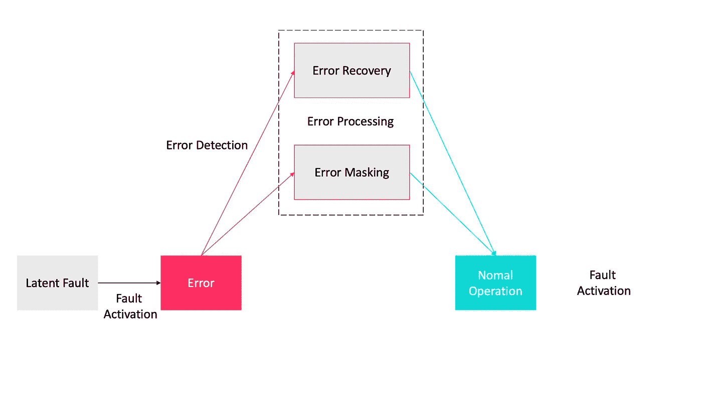

# 设计模式:在分布式系统中实现容错的 5 大技术

> 原文：<https://levelup.gitconnected.com/design-patterns-top-5-techniques-for-implementing-fault-tolerance-in-distributed-systems-81bef4408c3b>

## 思想建筑师

## 使系统能够在某些模块出现故障时继续正常运行

在过去的四十年中，许多监控和容错技术得到了发展、应用和改进，为系统架构设计中反复出现的问题提供了通用解决方案。在本文中，我将重点介绍在与其他模块通信时应该使用的技术，以使您的模块在分布式系统中具有容错和监控能力。

# 什么是分布式系统？

分布式的计算机系统

分布式系统是这样一种系统，其组件位于不同的联网计算机上，这些计算机通过从任何系统相互传递消息来进行通信并协调它们的动作。

# 容错

这是分布式系统中的一个重要术语。它是系统在部分故障的情况下继续运行的能力，但整体性能可能会受到影响。

由于分布式系统由各种组件组成，开发一个接近百分之百容错的系统实际上是非常具有挑战性的。

## 系统失败的原因

故障的发生主要有以下两个原因。

*   ***节点故障:*** 硬件或软件故障。
*   ***恶意错误:*** 非授权访问导致。

> 当一个系统不能实现它的承诺时，这个系统就失败了。

## 为什么我们在分布式系统中需要容错？

在分布式系统中使用容错，我们可以获得如下质量优势。

*   *:关注没有任何中断的连续服务。*
*   ****可用性*** :关注系统的读取准备情况。*
*   ****安全*** :防止任何未经授权的访问。*

> *在分布式系统中，一台你甚至不知道存在的计算机的故障会使你自己的计算机变得不可用。*

*失败是难以避免的，所以拥抱它们吧！！！*

# *如何实现—容错模式？*

*容错技术有三个方面，分为错误检测、错误恢复和错误屏蔽。*

**

*容错的阶段*

*   ****错误检测:*** `Acknowledgement`、【你还活着吗】、`Circuit Breaker`、故障停止处理器、“我还活着”。*
*   ****错误恢复:*** 备份，`Roll Forward`和`Roll Back`。*
*   ****错误屏蔽*** : `Active Replication`，半主动复制，半被动复制，被动复制复制。*

*有许多模式，但我们将只关注在实践中普遍应用的重要模式。*

## *确认*

*其思想是通过在指定的时间间隔内确认接收到输入来检测系统中的错误。*

***背景和问题***

*确认模式适用于被监控系统和监控系统之间的交互频率可能在已知时间内变化很大的系统。*

*   *最小化由检测技术引入的时间开销。*
*   *减少被监控系统和监控系统之间的通信。*

***解决方案***

*其思想是通过在指定的时间间隔内确认输入的接收来检测系统中的错误。*

***结构***

*在确认模式中，`Sender`与`Timer`共同构成**监控系统**，而`Receiver`与`Acknowledger`实体共同构成**被监控系统**。*

*   *`Sender`单独负责联系**被监控系统**。*
*   *每当`Sender`向`Receiver`发送输入时，负责在每次向**监控系统**提供输入时倒计时超时时间的`Timer`被激活。*
*   *在收到`Sender`的输入后，`Receiver`通知`Acknowledger`。然后`Acknowledger`负责向`Timer`发送接收到输入的确认。如果`Timer`的超时时间连续 N 次没有收到**监控系统**的确认，则`Timer`检测到**监控系统**出错并通知`Sender`。*

**

*确认模式的 4 个组成部分*

***后果***

*确认模式具有以下优点:*

*   *引入的设计复杂度非常低。*
*   *不会引入任何空间开销。*

*但是确认模式也有一些缺点:*

*   *不提供容忍系统故障的方法。相反，它提供了检测错误的方法。*
*   *它引入了相对较高的空间开销，这与它可以处理的并发错误数成正比*

## *断路器模式*

*如果你以任何方式熟悉保险丝在你家的配电板中的工作方式，你就会理解断路器模式的原理。*

**

*保险丝的工作方式*

***背景与问题***

*如何防止网络或组件故障蔓延到其他组件？*

***解决方案***

*“`Circuit Breaker`”模式提出的上述问题的解决方案是基于*

***结构***

*断路器有三种不同的状态，`closed`、`open`和`half-open`。*

**

*断路器的整个生命周期*

*   ***关闭状态:**关闭状态是默认的“一切正常”状态。请求可以自由通过。当某些故障发生时，它们会导致电路断开，闭合移动打开。*
*   ***打开状态:**打开状态在固定时间内拒绝所有请求，而不尝试发送它们。一旦断路器跳闸，它就进入断开状态。此时，对该服务的任何请求都将自动失败。*
*   ***半开状态:**断路器允许一定数量的请求通过，以测试资源的状态。半开状态决定电路是返回闭合还是打开。*

***用例***

*我们使用这种模式来防止应用程序试图调用远程服务或访问共享资源，如果这种操作很可能失败的话。*

*但是对于以下两个用例，不推荐使用这种模式。*

*   *用于处理对应用程序中本地私有资源的访问，如内存中的数据结构。在这种环境下，使用断路器会增加系统开销。*
*   *作为在应用程序的业务逻辑中处理异常的替代。*

***它在实践中是如何使用的？***

*断路器模式有三种不同的实现方法:客户端断路器、服务器端断路器和代理断路器。*

*Hystrix 库提供了断路器最著名的实现之一，它允许将 Java 代码包装在一个由断路器控制的过程中。*

***后果***

*断路器模式需要额外的请求和响应，以便在每次通信之前执行某种握手。*

## *向前滚动*

*一旦我们检测到一个错误，系统必须从错误中恢复，以符合容错标准。*

***背景和问题***

*当可检测到错误并且系统能够保存其当前状态并加载新的 state⁴.时，我们应用这种模式*

***解决方案***

*前滚模式通过使用检查点将组件恢复到错误或故障事件发生前的稳定状态，避免了工作丢失。*

***结构***

*前滚模式由以下元素组成。*

*   *`replicas`是原始系统的复制版本，每个副本都能够导出它们的状态，并根据请求导入新的状态。每个副本还必须映射到不同的故障单元。*
*   *`manager`，负责接收所有针对容错系统的输入，并将其转发给相应的`replica`。在没有错误的情况下，`manager`触发从处理最新输入的`replica`到保持先前无错误状态的另一个`replicas`的新状态的复制。*
*   *`manager`还依靠错误检测机制来检测`replicas`上可能出现的错误。当一个`replica`出现这样的错误时，`manager`负责丢弃那个`replica`。*
*   *`manager`必须映射到与任何`replicas`不同的故障单元。*

**

*前滚模式的结构*

***后果***

*这种模式的设计复杂度和时间开销相对较低，但是这种模式也有以下一些缺点。*

*   *空间开销相对较高，并且整个系统被复制。*
*   *没有错误时的时间开销很高，因为在当前副本能够接收和处理新输入之前，它必须将其新状态复制到另一个副本。*

## *击退*

*这种模式是使用系统副本从错误发生中恢复的另一种技术。它具有与前滚机制相似的功能；但是，如果出现故障，一个复制副本将回滚到上一个无错误状态。*

***背景和问题***

*当可以检测到错误并且系统能够保存其当前状态并加载新状态时，我们应用这种模式。*

*此模式通过最小化无错误系统执行的时间开销，并确保在错误发生后恢复的无错误状态尽可能接近失败副本的上一个无错误状态，解决了从错误中恢复的问题。*

***解决方案***

*解决上述问题的基础是使用系统的两个副本和一个存储器来保存检查点。*

***结构***

*回滚模式由以下元素组成。*

*   *`replicas`，它们是彼此相同的原始系统的副本，并被监控错误。*
*   *`storage`，用于存储包含处理输入的`replica`在某个时刻输出的状态的`checkpoints`。*
*   *`replicas`可以以如下方式替换`storage`:当检查点被创建时，每个`replica`将它们导出到另一个`replicas`，并从它们那里导入这些`replicas`创建的检查点。*

> *请记住，如果使用存储，那么它一定不能出错。*

**

*回滚模式的结构*

*   *`manager`负责接收容错系统的所有输入，并将其转发给相应的`replica`。*
*   *在没有错误的情况下，`manager`触发从处理最后输入的`replica`到`storage`的新状态的拷贝。*
*   *`manager`还依靠错误检测机制来检测`replicas`上可能出现的错误。当一个`replica`出现这样的错误时，`manager`负责丢弃那个`replica`。必须将`manager`映射到不同于`replicas`的故障单元。*

***后果***

*这种模式的优点和缺点与前滚模式一样。*

## ***主动复制模式***

*主动复制模式是从错误检测到错误屏蔽的故障停止 Processor⁵模式的增强。*

***背景和问题***

*确定性的应用程序或关键系统，它们可能会遇到与接收到的输入无关的错误。系统应该能够经历可能导致故障的错误。*

*如何屏蔽系统中的错误以避免系统故障。一些应用，特别是航空和卫生保健系统，需要屏蔽错误，以避免可能导致错误的系统故障。*

***解决方案***

*这个问题的解决方案受以下因素的影响:*

*   *系统接收到的输入必须被处理并提供指定的输出，而与系统是否发生错误无关。*
*   *系统的无错执行必须遭受最小的时间损失。*
*   *存在错误时由解决方案引入的时间损失必须保持非常低。*
*   *系统必须是确定性的。*

*我们将使用一组处理器，这些处理器接收相同的输入和交付订单，并独立地、同时地对它们的输入进行处理。来自每个处理器的输出将被比较，并且正确的输出将被选择并传送到系统。*

***结构***

*主动复制模式引入的实体如下。*

*   *`Sender`将输入发送给分配器，而不是直接发送给系统。*
*   *`Distributor`初始化所有处理器，并将相同的输入传递给各个处理器进行处理。*
*   *`Processor 1, Processor 2 and Processor 3` 从分发器接收输入，每个分发器对输入执行相同的操作，但是它们是独立执行的。*
*   *当所有三个处理器完成对输入的处理时，它们将输出传送到`Comparator`。`Comparator` 接收三路输出上`Processors`和`compares`的输出(如多数表决)。它选择一个输出并丢弃不提供输出或不正确输出的`processor`,即与它选择的正确输出不同的输出。*
*   *`Comparator`向系统提供正确的输出。系统代表从`comparator`获得正确输出的受保护应用或环境。*

**

*活动复制模式的结构*

***后果***

*主动复制模式具有以下优点。*

*   *这种模式在无错误系统执行中引入的时间开销很低。在存在错误的情况下，这种模式引入的时间开销也很低。*
*   *设计复杂度相对较低。*

*主动复制模式有以下缺点。*

*   *这种模式的空间开销非常高，需要 2N+1 个副本来屏蔽 N 个错误。*
*   *分配器和比较器也是系统中的单点故障。*

# *结论*

*总结本文，我们可以说创建容错系统的目标是防止单点故障引起的中断，确保关键任务应用程序或系统的高可用性。这有助于业务进展顺利。*

*很简单，对吧？*

# *参考*

*[1]塔嫩鲍姆，安德鲁 s；Steen，Maarten van (2002 年)。 [*分布式系统:原理与范例*](https://www.distributed-systems.net/index.php/books/ds3/) 。新泽西州上萨德尔河:皮尔逊·普伦蒂斯霍尔。[ISBN](https://en.wikipedia.org/wiki/ISBN_(identifier))[0–13–088893–1](https://en.wikipedia.org/wiki/Special:BookSources/0-13-088893-1)。*

*[2] I. A. Buckley 和 E.B. Fernandez，“容错的三种模式”，Procs。2009 年 10 月 26 日。*

*[https://github.com/Netflix/Hystrix](https://github.com/Netflix/Hystrix)*

*[4] Saurabh Hukerikar，Christian Engelmann，高性能计算弹性的基于模式的建模。橡树岭国家实验室。*

*[5]施耐德，弗雷德。(2001).故障停止处理器方法。*